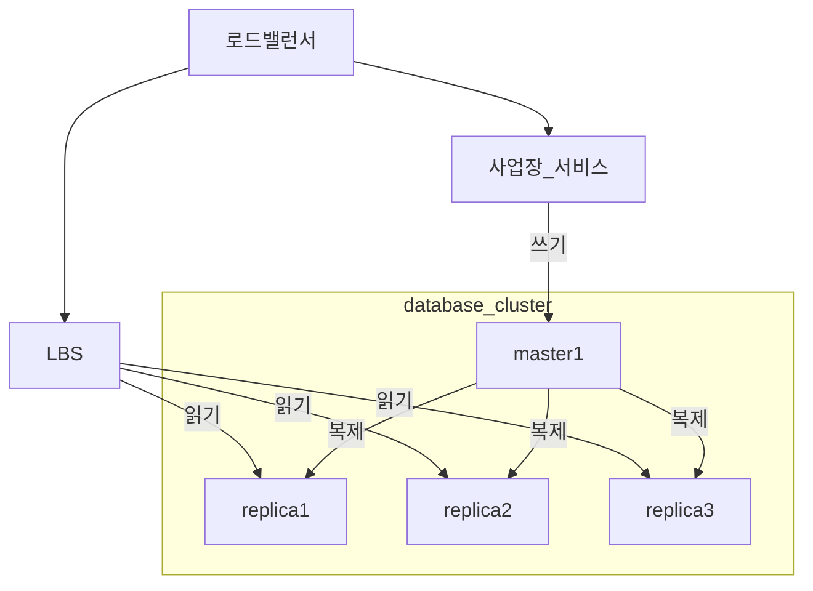
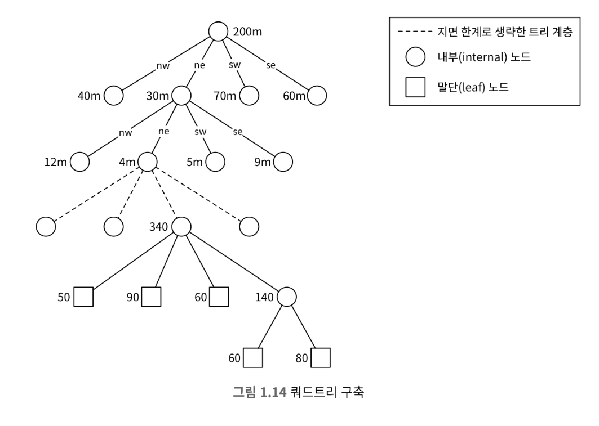
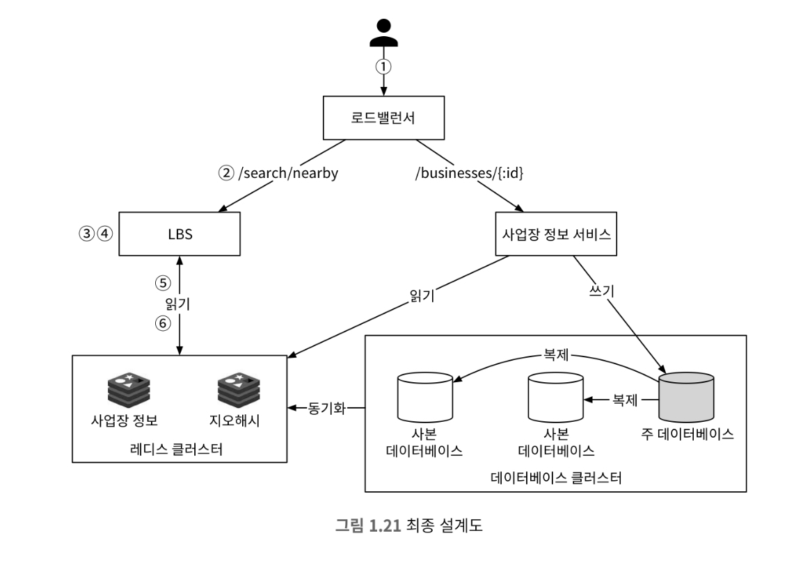

# 1장 근접성 서비스

## 1단계 : 문제 이해 및 설계 범위 확정

* 주어진 반경 내의 사업장만을 대상으로함
* 최대 허용 거리는 20km
    * 사용자가 선택할 수 있는 거리 : 0.5km, 1km, 2km, 5km, 20km
* 사업장 소유주가 사업장 정보를 시스템에 추가, 삭제, 갱신 가능. 반영까지 최대 하루
* 상시적인 페이지 갱신할 필요 없음

### 요구사항 정리

* 기능 요구사항
    * 사용자 위치에 대해 검색 반경 정보에 매치되는 사업장 목록 반환
    * 사업장 소유주가 사업장 정보를 수정할 수 있으며, 정보가 반영되기까지 최대 하루
    * 고객은 사업장의 상세 정보를 살필 수 있어야 함
* 비기능 요구사항
    * 낮은 응답 지연 : 사업장의 신속한 검색
    * 데이터 보호 : 사용자 위치는 민감 정보이기에 사용자 정보를 보호해야함
    * 고가용성 및 규모 확장성 : 인구가 밀집된 지역으로 이동시 트래픽 급증 감당해야함

### 개략적 규모 추정

* DAU : 1억명
* 등록된 사업장 수 : 2억

## 2단계 : 계략적 설계안 제시 및 동의 구하기

### 데이터 모델

* 해당 요구사항의 경우 쓰기에 비해 읽기가 많기 때문에 MySQL과 같은 RDBMS를 사용하는게 바람직합니다.

> mongoDB를 사용하면 읽기 성능이 더 좋을 것 같은데. 이에 대해서 어떻게 생각하나요?
> 심지어 확장에 있어서도 좋은게 mongoDB가 아닌가...
>
> https://velog.io/@park2348190/논문번역-SQL-vs-NoSQL-A-Performance-Comparison

* 지리적 위치 색인 테이블은 위치 정보 관련 연산의 효율성을 높이는 데 쓰입니다.

### 개략적 설계



* 로드밸런서는 유입 트래픽을 자동으로 여러 서비스에 분산시키는 컴포넌트입니다.
* 위치 기반 서비스(LBS)
    * 쓰기 요청이 없는, 읽기 요청만 빈번하게 발생하는 서비스
    * QPS가 높다. 특히 특정 시간대의 인구 밀집 지역일수록 그 경향이 심하다.
    * 무상태 서비스이므로 수평적 규모 확장이 쉽다.
* 사업장 서비스
    * 사업장 소유주가 사업장 정보를 수정할 수 있음. 기본적으로 쓰기 요청이며, QPS는 높지 않음
    * 고객의 사업장 정보를 조회합니다. 특정 시간대에 QPS가 높아집니다.

### 데이터베이스 클러스터

* 데이터베이스 클러스터는 주-부(primary-secondary) 데이터베이스 형태로 구성할 수 있음
    * 사업장 정보가 실시간으로 반영되지 않기에 주 데이터베이스와 사본 데이터베이스의 동기화 지연시간시간은 문제가 되지 않습니다.

> 데이터베이스 클러스터 환경에서 많은 replica가 존재하면 주 데이터베이스에 성능에 문제가 생길 수 있음.
> 이를 주 데이터베이스와 복제 데이터베이스 사이에 하나의 데이터베이스 추가를 통해 성능 향상 시킬 수 있음
>
> 
>
> https://dev.mysql.com/doc/refman/8.3/en/replication-solutions-performance.html

### 사업장 서비스와 LBS의 규모 확장성

* 사업장 서비스와 LBS 모두 무상태 서비스이기 때문에 특정 시간대에 집중적으로 몰리는 트래픽을 자동으로 서버를 추가함으로써 대응할 수 있습니다.
* 반대로 트래픽이 없을 때는 서버를 삭제할 수 있습니다.
* 클라우드를 통해 구성하고 있다면 여러 지역, 여러 가용성 구역에 서버를 두어 시스템 가용성을 높일 수 있습니다.

### 주변 사업장 검색 알고리즘

#### 방안 1 : 2차원 검색

* 주어진 반경으로 그린 원 안에 놓인 사업장을 검색하는 방법

```SQL
select business_id, latitude, longitude,
from business
where (latitude between {:my_lat} - radius and {:my_lat} + radius)
  and (longitude between {:my_long} - radius and {:my_long} + radius)
```

* 위 쿼리는 테이블 전부를 조회해야하기에 효율적이지 않습니다.
* 이를 인덱스를 사용하더라도 두 위도, 경도 각각의 집합의 교집합을 구해야하는 과정이 여전히 비효율적입니다.
* 이를 해시 기반 방안과 트리 기반 방안을 통해 2차원 데이터를 한 차원에 대응시켜 성능을 개선시킬 수 있습니다.
    * 해시 기반 방안 : 균등 격자, 지오해시, 카르테시안 계층 등
    * 트리 기반 방안 : 쿼드트리, 구글 s2, R 트리 등
    * 이러한 기법들은 지도를 작은 영역으로 분할하고 고속 검색이 가능하도록 인덱스를 만드는 것입니다.

#### 방안 2 : 균등 격자

* 균등 격자는 지도를 작은 격자, 구획으로 나누는 단순한 접근법입니다.
* 해당 접근법은 데이터의 뷸균형이 발생할 수 있다는 문제가 있습니다.

#### 방안 3 : 지오 해시

* 지오해시는 2차원의 위도 경도 데이터를 1차원의 문자열로 변환합니다.
* 지오해시 알고리즘은 비트를 하나씩 늘려가면서 재귀적으로 세계를 더 작은 격자로 분할해 나갑니다.
* 지오해시는 4~6 사이의 길이를 통해 적절하게 격자를 나눌 수 있는 장점이 있지만, 격자 가장자리 처리 방식에 관한 이슈가 있습니다.

#### 격자 가장자리 관련 이슈

* 지오해시는 해시값의 공통 접두어가 긴 격자들이 서로 더 가깝게 놓도록 보장합니다. 하지만 그에 대한 역은 성립하지 않습니다.
    * 긴 공통 접두어를 가짐 -> 서로 가까움 (O)
    * 서로 가까움 -> 긴 공통 접두어를 가짐(X)
* 역이 성립하지 않는 이유는 자오선을 기준으로 서로 가깝지만 반대에 위치하는 경우가 있을 수 있기 때문입니다.
* 따라서 접두어를 통해 조회를 하더라도 가까운 정보를 가져오지 못할 수 있습니다.
* 지오해시의 또 다른 문제는 공통 접두어 길이는 같지만 서로 다른 격자에 놓이는 경우 입니다.
    * 해당 경우 인근 격자들을 상수 시간 내에 조회할 수 있기에 함꼐 조회합니다.

#### 표시할 사업장이 충분하지 않은 경우

* 선택지 1 : 없으면 없는대로 반환
* 선택지 2 : 접두사의 비트를 하나 지워 격자의 크기를 늘리는 방법

#### 방안 4 : 쿼드트리

* 쿼드트리는 격자의 내용이 특정 기준을 만족할 때까지 2차원 공간을 재귀적으로 사분면 분할하는 데 사용되는 자료 구조입니다.
* 쿼드트리는 지도를 격자로 나누고, 해당 격자 안에 존재하는 정보가 설정한 수 n보다 작아질 때까지 분할하는 것입니다.
* 쿼드트리는 데이터베이스가 아닌 서버 메모리위에 올라온다는 것을 유의해야 합니다.



#### 쿼드트리 전부를 저장하는 데 얼마나 많은 메모리가 필요한가?

* 말단 노드에 수록되는 데이터

| 이름                             | 크기             |
|--------------------------------|----------------|
| 격자를 식별하는 데 사용될 좌상단과 우하단 꼭짓점 좌표 | 32바이트          |
| 격자 내부 사업장 ID 목록                | ID당 8바이트 * 100 |
| 합계                             | 832바이트         |

* 내부 노드에 수록되는 데이터

| 이름                             | 크기    |
|--------------------------------|-------|
| 격자를 식별하는 데 사용될 좌상단과 우하단 꼭짓점 좌표 | 32바이트 |
| 하위 노드 4개를 가리킬 포인터              | 32바이트 |
| 합계                             | 64바이트 |


* 격자 안에 최대 100개 사업장이 있을 수 있음
* 말단 노드의 수 = ~ (200m/100) = 2m(2백만)
* 내부 노드의 수 = 2m * (1/3) = 0.67m
* 총 메모리 요구량 = 2m * 832bytes + 0.67m*64 = ~ 1.17GB


#### 전체 쿼드트리 구축에 소요되는 시간은?

* 각 노드당 100개의 사업장이 존재하기에 전체 n개의 사업장에 대해 쿼드트리를 구성하면 (n/100)log(n/100) 시간 복잡도가 소요됩니다.
* n이 2억이라면 대략 몇 분 소요될 수 있습니다.

#### 쿼드트리 운영 시 고려사항

* 쿼드트리를 구축하는 데 몇 분이 소요되며 해당 시간동안 트래픽을 처리하지 못하기 때문에, 서버 배포방식에 대해서 고려해야 합니다.
* 사업장이 추가/삭제되는 경우에도 고려해야 합니다.
  * 쿼드트리를 점진적으로 갱신한다면 일시적이지만 낡은 데이터를 반환할 수 있습니다. 이 방식은 수많은 키가 한 번에 무효화되어 캐시 서버에 막대한 부하가 가해질 수 있습니다.
  * 쿼드트리를 실시간으로 갱신하면, 설계는 복잡해 집니다. 특히, 여러 스레드가 동시에 접근하는 경우에는 락을 활용해야하기에 복잡해집니다.


#### 방안 5 : 구글 S2

* 구글 S2 기하 라이브러리는 쿼드트리와 마찬가지로 메모리 기반입니다.
* S2는 지구를 힐베르트 곡선이라는 공간 채움 곡선을 사용하여 1차원 색인화하는 방안입니다.
* S2의 장점은 다음과 같습니다.
  * 지오펜스
  * 영역 지정 알고리즘 : 지오해시처럼 고정 정밀도를  사용하는 대신 최소 수준, 최고 수준 그리고 최대 셀 개수 등을 지정할 수 있습니다.


#### 지오해시 vs 쿼드트리

* 지오해시
  * 구현과 사용이 쉽다. 트리를 구축할 필요 없음
  * 지정 반경 이내 사업장 검색을 지원
  * 정밀도를 고정하면 격자 크기도 고정됩니다. 인구 밀도에 따라 격자 크기를 조정할 수 없음
  * 색인 갱신이 쉬움
* 쿼드트리
  * 구현하기가 살짝 더 까다로움.
  * k번째로 가까운 사업장까지의 목록을 구할 수 있음
  * 인구밀도에 따라 격자 크기를 동적으로 조정할 수 있음
  * 색인 갱신이 까다로움


## 3단계: 상세 설계

### 데이터베이스의 규모 확장성

* 사업장 테이블
  * 사업장 테이블 데이터는 한 서버에 담을 수 없을 수 있다. 따라서 샤딩을 적용하기 좋습니다.
* 지리 정보 색인 테이블
  * 지오해시 테이블로 구성한다면 다음 두 가지 방법이 있습니다.
    * 각가의 지오해시에 연결되는 모든 사업장 ID를 JSON 배열로 만들어 같은 열에 저장하는 방안
    * 같은 지오해시에 속한 사업장 ID 각각을 별도 열로 저장하는 방안
  * 성능 적으로나 데이터 소실 문제로 인해 방안 2가 좋습니다.
* 지리 정보 색인의 규모 확장
  * 지리 정보에 대한 데이터 크기는 크지 않지만 많은 조회에 따른 서버 부하가 발생할 수 있기에 여러 데이터베이스로 분리해 부하를 분산시켜야 합니다.
    * 구현에 대한 편의성으로 사본 데이터베이스 서버를 구성해서 사용하는게 좋습니다.

### 캐시

* 캐시가 정말 필요한가?라는 생각을 먼저해야 합니다.
* 처리 부하가 읽기 중심이며 데이터베이스 크기가 작아 모든 데이터는 한 대 데이터베이스 서버에 수용 가능함. 이는 메모리 캐시를 사용할 떄와 비슷함
* 읽기가 병목이라면 사본 데이터베이스를 증설해 읽기 대역폭을 늘릴 수 있습니다.


### 캐시 키

* 사용자의 위치는 사용자가 이동하거나, GPS의 정확도로 인해 캐시 키로 적절하지 않습니다.

### 캐시 데이터 유형

* 지호해시 값에 대한 격자 내의 사업장 ID 목록을 값으로 가지며, 사업장 ID를 키로 사업장 정보 객체를 값으로 가지는 경우 시스템의 성능을 전반적으로 향상시킬 수 있습니다.
* 격자 내 사업장 ID
  * 사업장 정보는 상대적으로 변경되지 않기 때문에, 사업장 ID 목록을 레디스에 미리 캐시할 수 있습니다.
  * 새로운 사업장이 추가되는 경우 기존 캐시 값들을 무효화하며 데이터베이스를 갱신합니다. 해당 연산의 빈도가 낮기에 락을 사용할 필요 없습니다.
  * 레디스에 저장될 데이터의 크기는 8바이트 * 200m * 3가지 정밀도 = 5GB, 이는 큰 크기가 아니기에 하나의 서버로 감당할 수 있지만, 고가용성과 지연시간을 낮게 보장하기 위해 여러 서버에 저장할 수 있습니다.

### 지역 및 가용성 구역

* 위치 기반 서비스를 여러 지역과 가용성 구역에 설치하면 다음과 같은 기대 효과가 있습니다.
  * 사용자와 시스템 사이의 물리적 거리를 최소한으로 줄일 수 있습니다.
  * 트랙픽을 인구에 따라 고르게 분산하는 유연성을 확보할 수 있습니다.
  * 특정 지역의 사생활 보호법에 맞는 운영이 가능합니다.

### 추가 질문 : 시간대, 혹은 사업장 유형별 검색

* 사용자 주변 사업장 정보는 상대적으로 적습니다. 이를 영업시간이나 사업장 유형에 따라 필터링을 진행하면 됩니다.

### 최종 설계도



## 4단계: 마무리

* 이번에서는 몇 가지 색인 방식을 살펴봤습니다.
  * 2차원 검색
  * 균등 분할 격자
  * 지오해시
  * 쿼드트리
  * 구글 S2