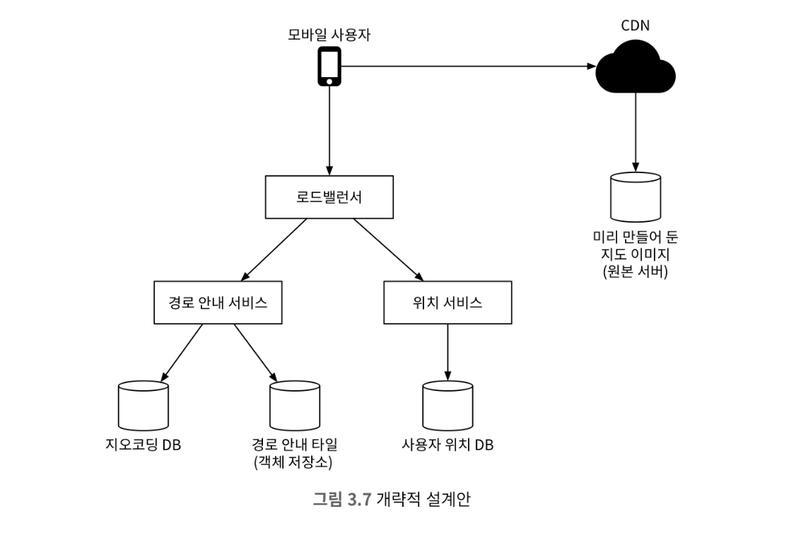
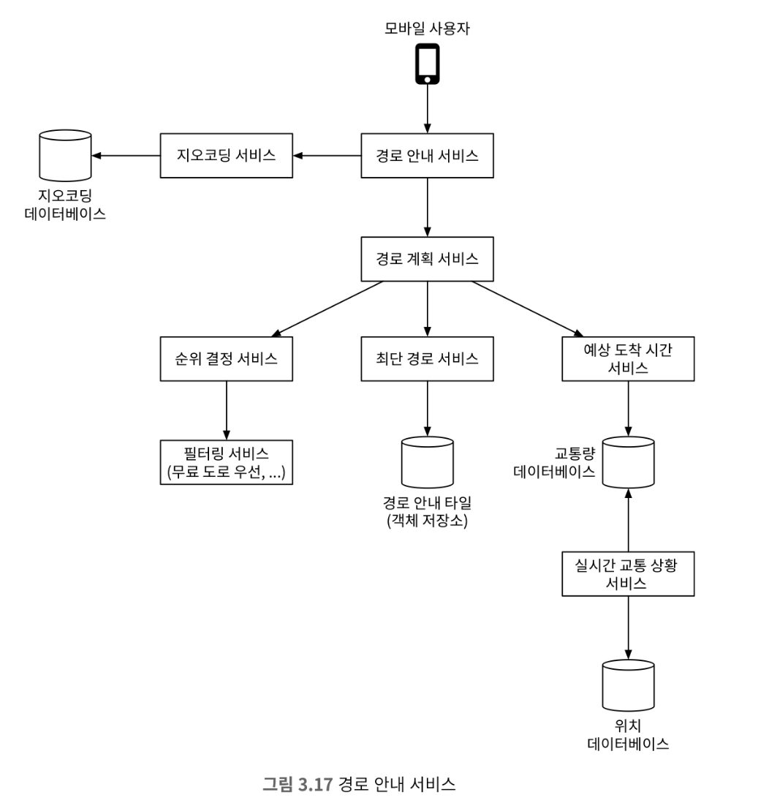
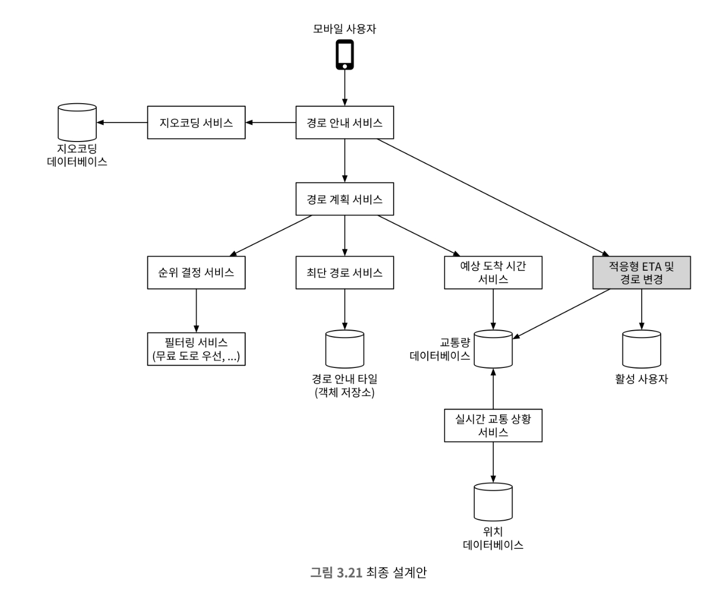

# 3장 구글 맵

## 1단계: 문제 이해 및 설계 범위 확정

### 기능 요구사항

* 사용자 위치 갱신
* 경로 안내 서비스
* 지도 표시

### 비기능 요구사항 및 제약사항

* 정확도
* 부드러운 경로 표시
* 데이터 및 배터리 사용량
* 가용성 및 규모 확장성

### 경로 안내 알고리즘을 위한 도로 데이터 처리

대부분의 경로 탐색 알고리즘은 다익스트라, A* 알고리즘의 변종이다.

대부분의 경로 탐색 알고리즘의 성능은 주어진 그래프 크기에 아주 민감하다. 그래서 그래프를 관리 기능 단위로 나누어 처리해야 한다.

전셰계 도로망을 관리할 때는 지오해싱과 비슷한 방법으로 도로망을 관리한다. 이때 각 격자 안에서 도로는 선, 교차로는 노드로 표현한다.

도로망을 경로 안내 타일로 분할해두면 경로 탐색 알고리즘이 동작하는 데 필요한 메모리 요구량을 낮출 수 있으며, 처리해야하는 경로의 양을
줄일 수 있다.

### 계층적 경로 안내 타일

모든 타일들 내부에 선과 노드들을 자세하게 관리한다면 먼 경로를 탐색할 때 성능의 문제가 있을 수 있다.
그래서 타일의 세분화 수준을 상, 중, 하로 나눠 각 수준에 맞는 선과 노드를 관리한다.

예를 들면 상은 고속도로, 중은 시내 도로, 하는 주택가 도로로 나눠 관리한다.

### 개략적 규모 추정

* 저장소 용량
    * 세계 지도 : 최적화를 거쳐 약 100PB
    * 메타 데이터: 아주 작기 때문에 고려하지 않음
    * 도로 정보 : 수 TB

* 서버 대역폭
    * DAU : 10억
    * 주당 평균 사용량 : 35분
    * 주당 총 사용량 : 350억분
    * 하루 총 사용량 : 50억 분
    * 매 초당 GPS 전송한다면
        * 하루 총 요청량 : 50억 * 60 = 3000억
        * QPS : 3000억 / 86400 = ~ 300만

## 2단계: 개략적 설계안 제시 및 동의 구하기

위 설계안은 다음과 같은 내용을 포함하고 있습니다.

1. 위치 서비스
2. 경로 안내 서비스
3. 지도 표시

### 위치 서비스

위치는 클라이언트가 t초마다 주기적으로 위치를 서버로 전송한다.
주기적으로 서버로 데이터를 보냄으로서 다음과 같은 장점이 있다.

1. 데이터 스트림을 통해 모니터링하는 용도로 사용할 수 있음
2. ETA를 계산할 때 사용할 수 있음

사용자 위치를 서버로 보낼때, 일정 기간동안의 위치를 배치로 한번에 보낸다면 요청의 양을 줄일 수 있다. 이때 여전히 많은 쓰기가 필요하기 때문에
규모 확장이 용이한 카산드라 같은 데이터베이스가 필요하다.

### 경로 안내 서비스

경로 안내 서비스의 경우 일정 지연은 감수할 수 있다. 하지만 정확도는 보장해야 한다.

### 지도 표시

지도 표시는 클라이언트가 보는 확대 수준에 따라 필요한 타일을 서버에서 가져오는 방식으로 구현할 수 있다.

클라이언트가 지도를 가져오는 경우는 다음과 같다.

* 사용자가 지도를 확대 또는 이동시키며 주변을 탐색한다.
* 경로 안내가 진행되는 동안 사용자의 위치가 현재 지도 타일을 벗어나 인접한 타일로 이동한다.

위 경우를 효율적으로 처리하기 위해서는 다음과 같은 선택지가 있다.

1. 클라이언트가 보는 지도의 확대 수준에 근거하여 필요한 지도 타일을 즉석에서 만듦
    * 단점
        * 모든 지도 타일을 동적으로 만들어야하기 때문에 서버 클러스터에 심각한 부하가 걸림
        * 캐시를 활용하기 힘듦

2. 수준별로 만들어둔 타일을 미리 클라이언트에 전달하는 방법, 만들어둔 타일은 CDN을 통해 제공
    * 장점
        * 규모 확장이 용이하고 캐시하기 쉬움
        * CDN의 PoP(point of presence)를 활용하여 지연을 줄일 수 있음

2번째 방법을 사용하는 경우 CDN 데이터 사용에 따른 비용이 발생할 수 있으므로 이를 고려해야 한다.

마지막으로 지도 타일을 조회할때, 지오 해싱을 url에 명시한다면 변경에 있어서 유연하게 대처할 수 없다.
따라서 위도/경도 및 확대 수준을 url로 변환해주는 서비스를 제공하며 이를 통해 클라이언트가 요청할 수 있도록한다면 유연하게 대처할 수 있다.

## 3단계: 상세 설계

### 경로 안내 타일

도로 데이터는 외부 데이터베이스에서 가져오며, 이를 경로 안내 타일로 변환한다.
이 과정에서 그래프 자료 구조 형태로 가공되지 않은 데이터이기에 오프라인 파이프라인을 주기적으로 실행시켜 도로 데이터를 최신화 한다.

경로 안내 타일을 만들 때는 해상도 수준에 따라 타일을 만들며 각 타일에는 해당 지역내의 도로와 교차로 정보가 있다.
또한 각 데이터는 메모리에 인접 리스트 형태로 보관한다. 하지만 가용 리소스의 한계로 s3와 같은 저장소에 저장한다.

경로 안내 알고리즘은 타일들을 조함한 결과로 만들어지는 도로망 데이터를 이용해 경로를 탐색한다.

### 사용자 위치 데이터

사용자 위치 데이터는 도로 데이터 및 경로 안내 타일을 갱신하는 데 이용하며, 실시간 교통 상황 데이터나 교통 상황 이력 데이터베이스를
구축하는 데도 활용할 수 있다.

또한 사용자 위치 데이터는 엄청난 양의 쓰기 요청이 발생하기 때문에 규모 확장이 가능한 데이터베이스를 사용해야 한다.

| user_id | timestamp | user_mode | driving_mode | location    |
|---------|-----------|-----------|--------------|-------------|
| 101     | 2341235   | active    | driving      | (20.0, 30.5 |

### 위치 서비스

사용자 위치의 경우 쓰기 연산 지원에 탁월한 NoSQL 데이터베이스를 사용해야 한다.

사용자 위치는 데이터 일관성보다는 가용성이 더 중요하다. 이를 만족하는 데이터베이스로는 카산드라가 있다.

데이터베이스 키로는 (user_id, timestamp)의 조합을 사용하며, 이에 대한 값으로 경도/위도 쌍을 저장한다.

user_id는 파티션 키, timestamp는 클러스터링 키로 사용한다. user_id를 파티션키로 이용하는 이유는 특정 사용자의 최근 위치를 신속히 읽어 내기 위해서이다.

### 사용자 위치 데이터는 어떻게 이용되는가

사용자 위치는 도로 상태를 알 수 있으며, 지도 데이터의 정확성을 개선하는 데 사용할 수 있다. 또한 실시간 교통 현황을 파악할 수 있다.
이를 카프카를 통해 처리할 수 있다.

카프카는 응답 지연이 낮고 많은 데이터를 동시에 처리할 수 있는 데이터 스트리밍 플랫폼으로, 실시간 데이터 피드를 지원하기 위해 고안되었다.

### 지도 표시

#### 최적화 : 백터 사용

지도 표시에 WebGL 기술을 채택하면 지도 정보를 이미지가 아닌 백터 정보를 보낼 수 있으며, 이는 이미지보다 더 작은 용량을 차지한다.
추가로 매끄러운 지도 확대 경험을 통해 사용자 경험을 향상시킬 수 있다.

### 경로 안내 서비스

#### 최단 경로 서비스

최단 경로 서비스는 출발지와 목적지 위도/경도를 통해 k개 최단 경로를 반환한다.

최단 경로 서비스는 객체 저장소에 저장된 경로 안내 타일에 대해 A* 경로 탐색 알고리즘의 한 형태를 실행한다.

* 입력으로 출발지와 목적지의 위도/경도를 받고 해당 위치 정보를 지오해시로 변환한다음 출발지와 목적지 경로 안내 타일을 얻는다.
* 출발지에서 시작해 그래프 자료 구조를 탐색해 나간다. 이때 필요한 타일이 있다면 저장소에서 가져온다.

#### 적응형 ETA와 경로 변경

현재 설계는 적응현 ETA와 경로 변경을 허용하지 않는다.
이는 경로 안내를 받고 있는 모든 사용자를 추적하면서 교통 상황이 달라질 때마다 각 사용자의 ETA를 변경함으로써 해결할 수 있다.

하지만 다음과 같은 질문들이 생길 수 있다.
* 현재 경로 안내를 받고 있는 사용자는 어떻게 추적하나?
* 수백만 경로 가운데 교통 상황 변화에 영향을 받는 경로와 사용자를 효율적으로 가려낼 방법은 무엇인가.

두번째 질문의 경우 지오해시를 통해 출발지와 목적지를 포함하는 타일이 만들어질때까지 확대 수준을 변경하며 모두 포함된 타일을 찾으면
해당 타일 내부에 있는 모든 사용자의 경로를 변경할 수 있다.

### 전송 프로토콜

경로 안내 중에 경로의 상황이 변경됨을 안정적으로 정송할 방법은 모바일 푸시 알림, 롱 폴링, 웹소켓, SSE 등이 있다.

### 최종 설계안

