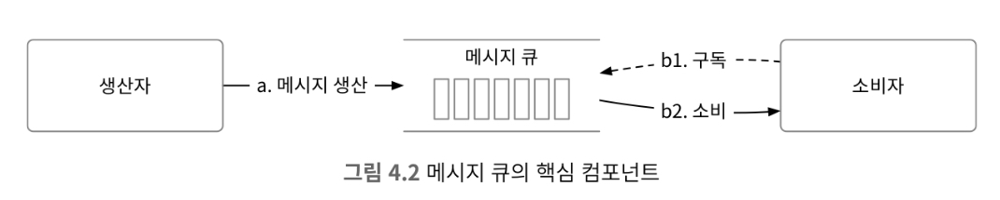
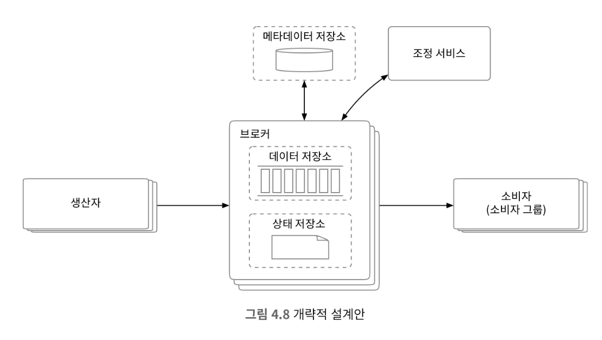
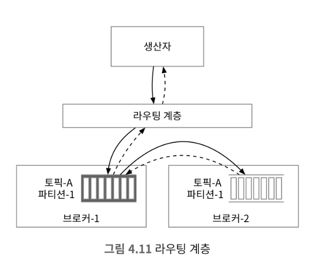
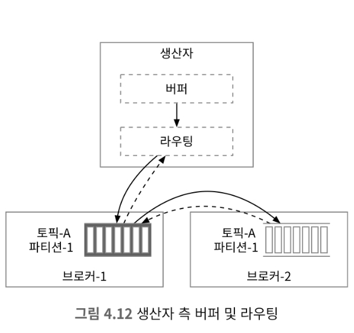
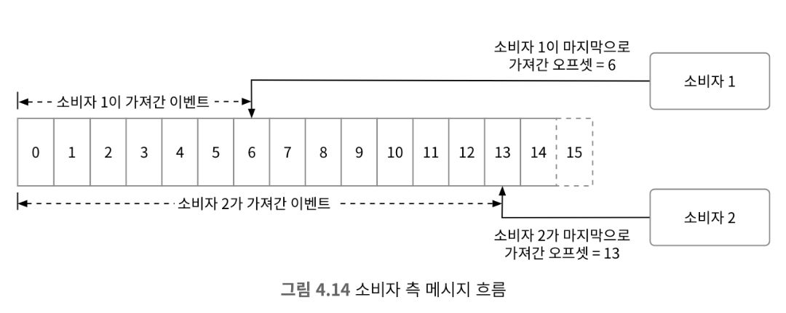
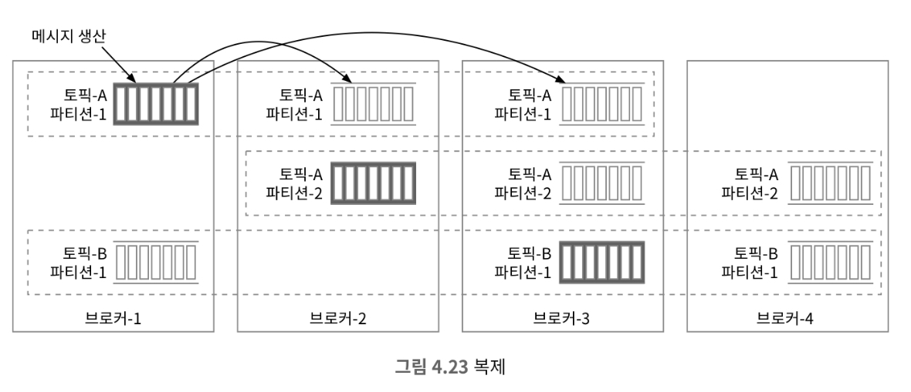

# 4장 분산 메시지큐

메시지큐는 분산 시스템에서 각 시스템 사이의 통신과 조율을 담당한다. 메시지큐는 다음과 같은 특징을 가진다.

* 결합도 완화(decoupling) : 메시지 큐를 사용하면 컴포넌트 사이의 강한 결합이 사라지므로 각각을 독립적으로 갱신할 수 있음
* 규모 확장성 개선 : 시스템 트래픽이 많아지면 소비자(consumer)를 추가함으로써 대응할 수 있음
* 가용성 개선 : 특정 컴포넌트에 장애가 발생하더라도 다른 컴포넌트는 정상적으로 동작할 수 있음
* 성능 개선 : 메시지 큐를 사용하면 비동기 통신이 쉽게 가능. 이는 서로서로 요청, 응답에 대해 대기하지 않기 때문임

분산 메시지 큐 시스템은 이벤트 스트리밍 플랫폼과 메시지 큐가 있다.
이중 이벤트 스트리밍 플랫폼은 카프카가 있으며, 메시지 큐에는 RocketMQ, ActiveMQ, RabbitMQ, ZeroMZ 등이 있다.

이번장에서는 데이터 장기 보관, 메시지 반복 소비 등의 부가 기능을 가진 분산 메시지 큐를 설계할 것이다.

## 1단계 : 문제 이해 및 설계 범위 확정

메시지 큐는 데이터를 메시지 큐에 보내는 생산자와 메시지 큐에서 데이터를 가져오는 소비자로 구성된다.

### 기능 요구 사항

* 생산자는 메시지 큐에 메시지를 보낼 수 있어야 한다.
* 소비자는 메시지 큐를 통해 메시지를 수신할 수 있어야 한다.
* 메시지는 반복적으로 수신할 수도 있어야 하고, 단 한 번만 수신하도록 설정 될 수도 있어야 한다.
* 오래된 이력 데이터는 삭제될 수 있다.
* 메시지 크기는 킬로바이트 수준이다.
* 메시지가 생산된 순서대로 소비자에게 전달할 수 있어야 한다.
* 메시지 전달 방식은 최소 한 번, 최대 한 번, 정확히 한 번 가운데 설정할 수 있어야 한다.
    * 최소 한 번 : 소비자가 최소 한 번 전달되도록 보장. 메시지 전달이 실패하면, 다시 전달하려함
    * 최대 한 번 : 소비자에게 최대 한 번만 전달되도록 보장. 메시지 전달이 실패하면, 다시 전달하려 시도하지 않음
    * 정확히 한 번 : 소비자에게 정확히 한 번만 전달되도록 보장. 이는 메시지 큐가 메시지의 전달 상태를 추적함

### 비기능 요구사항

* 높은 대역폭과 낮은 전송 지연 가운데 하나를 설정으로 선택 가능하게 하는 기능
* 규모 확장성. 이 시스템은 특정상 분산 시스템일 수밖에 없음. 메시지 양이 많이져도 처리 가능해야함
* 지속성 및 내구성. 데이터는 디스크에 지속적으로 보관되어야 하며 여러 노드에 복제되어야 함

### 전통적 메시지 큐와 다른 점

전통적인 메시지 큐는 메시지 보관 문제를 중요하게 생각하지 않으며 일정 시간동안 메모리에 저장하고 있음

만약 처리 용량을 넘어선다면 디스크에 저장하지만 이벤트 스트리밍 플랫폼보다는 적은 용량을 사용함

전통적인 메시지 큐는 전달 순서도 보장하지 않는다. 즉, 생산된 순서와 소비된 순서는 다를 수 있다.

## 2단계 : 개략적 설계안 제시 및 동의 구하기

* 생산자는 메시지를 메시지 큐에 발행
* 소비자는 큐를 구독하고 구독한 메시지를 소비
* 메시지 큐는 생산자와 소비자 사이의 결합을 느슨하게 하는 서비스로, 각 생산자와 소비자 독립적으로 확장 가능함

### 메시지 모델

메시지 모델로는 일대일, 발행-구독(pub/sub)이 있습니다.

* 일데일 모델
    * 생산자가 메시지를 보내면 메시지 큐는 메시지를 하나의 소비자에게 전달
    * 데이터 보관을 지원하지 않음
    * 지속성 계층을 통해 메시지가 반복적으로 소비될 수 있도록 함
* 발행-구독 모델
    * 토픽이라는 개념을 통해 메시지의 주제를 정리함
    * 토픽을 통해 메시지를 보내고 가져올 수 있음

### 토픽,파티션,브로커

토픽에 보관되는 데이터의 양이 많아진다면 파티션을 통해 데이터를 분산 저장할 수 있다.

파티션은 샤딩 기법이며 토픽의 부분집합이다. 파티션은 메시지 큐 클러스터 내의 서버에 고르게 분산 배치되며 브로커에 의해 유지된다.

파티션을 브로커에 분산하는 것이 높은 규모 확장성을 달성하는 비결이다.

각 토픽 파티션은 FIFO 큐 처럼 동작한다. 같은 파티션 안에서는 메시지 순서가 유지되며 파티션 내의 메시지 위치는 오프셋이라고 한다.

생상자가 보낸 메시지는 해당 토픽의 파티션 가운데 하나로 보내진다. 메시지에는 사용자 ID 같은 키를 붙일 수 있는데, 같은 키를 가진 모든 메시지는 같은 파티션으로 보내진다.
이는 파티션의 위치가 키 값의 해시 함수를 적용한 결과를 통해 결정되기 떄문이다.

토픽을 구독하는 소비자는 하나 이상의 파티션에서 데이터를 가져오게 된다. 토픽을 구독하는 소비자가 여럿인 경우, 각 구독자는 해당 토픽을 구성하는 파티션의 일부를 담당하게 된다.
이를 소비자 그룹이라고 한다.

### 소비자 그룹

소비자 그룹 내 소비자는 토픽에서 메시지를 소비하기 위해 서로 협럽한다.

하나의 소비자 그룹은 여러 토픽을 구독할 수 있고 오프셋을 별도로 관리한다. 또한 같은 그룹 내의 소비자는 메시지를 병렬로 소비할 수 있다.

하지만 데이터를 병렬로 읽게되면 대역폭 측명에서 좋지만 같은 파티션 안에 있는 메시지를 순서대로 소비할 수 없다.
이는 특정 파티션이 특정 한 소비자에만 할당된다면 해결할 수 있는 문제다. 이는 결국 일데일 모델에 수렴하게 된다.

### 개략적 설계안

* 클라이언트
    * 생산자 : 메시지를 특정 토픽으로 보낸다.
    * 소비자 그룹: 토픽을 구독하고 메시지를 소비한다.
* 핵심 서비스 및 저장소
    * 브로커 : 파티션들을 유지한다. 하나의 파티션은 특정 토픽에 대한 메시지의 부분 집합을 유지한다.
    * 저장소
        * 데이터 저장소 : 메시지는 파티션 내 데이터 저장소에 보관된다.
        * 상태 저장소 : 소비자 상태는 이 저장소에 유지된다.
        * 메타데이터 저장소: 토픽 설정, 토픽 속성 등은 이 저장소에 유지된다.
    * 조정 서비스
        * 서비스 탐색 : 어떤 브로커가 살아있는지 확인
        * 리더 선출 : 브로커 가운데 하나는 컨트롤러 역할을 담당해야 하며, 한 클러스터에는 반드시 활성 상태 컨트롤러가 하나 있어야 한다. 이 컨트롤러는 파티션 배치를 책임진다.
        * 아파치 주키퍼나 etcd가 보통 컨트롤러 선출을 담당하는 컴포넌트로 널리 이용된다.

## 3단계 : 상세 설계

데이터 장기 보관과 높은 대역폭을 위해 다음 세 가지 전략을 취할 것이다.

1. 회전 디스크의 높은 순차 탐색 성능과 현대적 운영체제가 제공하는 적극적 디스크 캐시 전략을 잘 이용하는 디스크 기반 자료 구조를 활용
2. 메시지가 생산자로부터 소비자에게 전달되는 순간까지 수정 없이 일관성을 보장하는 메시지 자료 구조를 활용 이는 많은 데이터
3. 배치 처리를 우선하는 시스템 설계. 소규모의 I/O가 많으면 높은 대역폭을 지원하기 어려움 그래서 일괄처리를 통해 대역폭을 높일 수 있음
    * 각 I/O 작업마다 오버헤드가 누적되기 때문에 높은 대역폭을 지원하기 어려움
        * 오버헤드로는 디스크 액세스, 네트워크 전송, 컨텍스트 스위칭, 메모리 액세스, 가비지 컬렉션 오버헤드 등등이 있다.

### 데이터 저장소

메시지 큐의 트래픽 패턴은 읽기와 쓰기가 빈번하며 갱신/삭제 연산은 발생하지 않는다. 또한 읽기와 쓰기는 대부분 순차적으로 진행된다.

이러한 특징을 가지기 떄문에 데이터 저장 방식에 주의를 기울여야한다.

데이터를 저장할 때, 데이터베이스(RDB, NoSQL)을 사용한다면 읽기와 쓰기가 동시에 발생하는 상황을 잘 처리하는 데이터베이스를 설계하기 어렵기 떄문에 메시지 큐에 적합하지 않다.

MySQL에서의 쓰기 우선 로그(WAL, Write-Ahead Log)처럼 데이터를 순차적으로 읽고 쓸수 있는 방법을 사용하면 대규모 읽기/쓰기 상황에서도 높은 성능을 보장할 수 있다.

### 메시지 자료 구조

메시지 구조는 높은 대역폭 달성의 열쇠다. 메시지 자료구조는 불필요한 복사를 막음으로써 높은 대역폭을 달설할 수 있어야한다.

| 필드 이름     | 데이터 자료형 |
|-----------|---------|
| key       | byte[]  |
| value     | byte[]  |
| topic     | string  |
| partition | integer |
| offset    | long    |
| timestamp | long    |
| size      | integer |
| crc       | integer |

메시지 키는 파티션을 정할 떄 사용된다. 만약 키가 주어지지 않는다면 메시지의 파티션은 무작위적으로 결정된다.

메시지 값은 메시지의 내용을 의미한다. 이는 일반 텍스트일수도 있으며, 압축된 이진 블록일 수도 있다.

crc는 순환 중복 검사의 약자로 주어진 데이터의 무결성을 보장한느 데 이용된다.

### 일괄 처리

일괄 처리, 즉 배치처리는 광범위하게 사용된다. 생산자, 소비자, 메시지 큐는 메시지를 가급적 일괄 처리한다.
일괄 처리는 시스템 성능에 아주 중요하다.

일괄 처리가 성능 개선에 중요한 이유는 다음과 같다.
* 운영체제로 하여금 여러 메시지를 한 번의 네트워크 요청으로 전송할 수 있어서 네트워크 왕복 비용을 제거할 수 있음
* 일괄 처리를 통해 순차 쓰기가 발생하며 이를통해 높은 접근 대역폭을 확보할 수 있음

하지만 높은 대역폭과 낮은 지연율은 동시에 달성하기 어려운 목표다.

### 생산자 측 작업 흐름

생산자가 메시지를 보낼 때 라우팅 계층 도입으로 메시지를 적절한 브로커로 보낼 수 있다.

1. 우선 생산자는 메시지를 라우팅 계층으로 보낸다.
2. 라우팅 계층은 메타데이터 저장소에서 사본 분산 계획을 읽어 자기 캐시에 보관한다. 메시지가 도착하면 파티션-1의 리터 사본에 보낸다.
3. 리더 사본이 우선 메시지를 받고 해당 리더를 따르는 다른 사본은 해당 리더로부터 데이터를 받는다.
4. '충분한'수의 사본이 동기화되면 리더는 데이터를 디스크에 기록한다. 이때부터 데이터가 소비 가능 상태가 된다.

리더와 사본은 장애 감내가 가능한 시스템을 만들기 위해서 필요하다.

위 설게안에서 라우팅 계층이 생산자와 분리가 되어 네트워크 오버헤드가 발생한다. 또한 일괄 처리에 대한 고민이 없는 설계다.

위 설계안은 라우팅 계층을 생산자 내부에 위치시키고 버퍼를 도입한다. 이는 다음과 같은 장점이 있다.

* 네트워크를 거칠 필요가 줄기 때문에 전송 지연도 줄어든다.
* 생산자는 메시지를 어느 파티션에 보낼지 결정하는 자신만의 로직을 가질 수 있음
* 전송할 메시지를 버퍼 메모리에 보관했다가 목적지로 일괄 전송하여 대역폭을 높일 수 있음

얼마나 많은 메시지를 일괄 처리하는 것이 좋을까? 

처리해야할 메시지의 양을 늘리면 대역폭은 늘어나지만 응답 속도는 느려진다. 이는 메시지를 처리하는 시간이 늘어나기 때문이다.

양을 줄이면 메시지는 빠르게 보낼 수 있지만 대역폭에서 손해가 발생한다.

### 소비자 측 작업 흐름

* 소비자는 특정 파티션의 오프셋을 주고 해당 위치에서부터 이벤트를 묶어 가져온다.
* 0.9 이전 버전의 컨슈머는 오프셋 정보를 주키퍼에 저장했지만 
성능 등의 문제로 0.9 이후 버전의 컨슈머에서는 카프카 내에 별도로 내부에서 사용하논 토픽(_consumer_offsets)을 만들고 
그 토픽에 오프셋 정보를 저장하고 있다.

### 푸시 vs 풀

* 데이터를 가져오는 방식에는 푸시와 풀 방식이 있다.

* 푸시 모델
  * 브로커가 소비자에게 데이터를 전송함으로써 낮은 지연을 달성할 수 있음
  * 소비자가 데이터를 처리하는 속도가 수신 속도보다 느리다면 소비자에 큰 부하가 발생할 수 있음
  * 소비자의 처리율에 대해서 알 수 없음
* 풀 모델
  * 소비자가 메시지 수신을 결정하기 때문에 소비자의 부하를 조절할 수 있음
  * 풀 모델은 일괄 처리에 적합함.
  * 브로커에 메시지가 없더라도 소비자는 계속해서 가져오는 시도를 함 이는 소비자 측 컴퓨팅 자원의 낭비가 발생할 수 있음
  * 대부분의 메시지 큐는 풀 모델을 지원

### 소비자 재조정

* 소비자 재조정은 소비자가 담당할 파티션을 조정하는 것을 의미한다. 이는 코디네이터를 통해서 이뤄진다.
* 코디네이터는 소비자 재조정을 위해 소비자들과 통신하는 브로커 노드다. 
* 코디네이터와 소비자가 통신할 때 소비자로부터 오는 하트비트 메시지를 통해 해당 소비자의 상태를 파악한다. 
* 소비자가 추가되어 리밸런싱이 진행될 때, 기존에 존재하는 소비자에게 코디네이터는 그룹합류 요청을 보내도록 지시한다.
* 소비자가 제거되어 리밸런싱이 진행될 떄, 제거되는 소비자를 제외한 나머지 소비자에게 그룹합류 요청을 보내도록 지시한다.
  * 소비자에 장애가 발생하여 하트비트를 수신하지 못하는 경우에도 똑같이 동작한다.

### 상태 저장소

* 메시지 큐 브로커의 상태 저장소에는 소비자에 대한 파티션 배치 관계와 소비자의 오프셋을 가지고 있다.
* 소비자 상태 정보 데이터가 이용되는 패턴은 다음과 같다.
  * 읽기와 쓰기가 빈번하게 발생하지만 양은 많지 않다.
  * 데이터 갱신은 빈번하게 일어나지만 삭제되는 일은 거의 없다.
  * 읽기와 쓰기 연산은 무작위적 패턴을 보인다.
  * 데이터의 일관성이 중요하다.
* 상태 데이터를 저장할 때 주키퍼를 사용할 수 있지만 몇몇 문제로 현재는 사용하지 않는다.
  * 기존 주키퍼 의존적인 시스템으로 토픽이 다 지워지지 않았음에도 주키퍼에 메타데이터가 제거되어 토픽 재생성이 가능함
  * 사본 노드들이 주키퍼로부터 최신 메타데이터를 수신하지 못해, 새로 바뀐 리더에 대한 정보를 받지 못해 Out of Sync Replica가 발생할 수 있음
  * 브로커간 메타데이터 불일치 문제가 발생할 수 있음
  * 클러스터에 있는 컨트롤러의 실시간 시점은 ZooKeeper의 시점과 다를 수 있습니다

### 메타데이터 저장소

* 메타데이터 저장소에는 토픽 설정이나 속성 정보를 보관한다.
  * 파티션 수, 메시지 보관 기간, 사본 배치 정보 등

### 주키퍼

* 주키퍼는 계층적 키-값 저장소 기능을 제공하는, 분산 시스템이다.
* 주키퍼는 분산 설정 서비스, 동기화 서비스, 이름 레지스트리 등으로 이용한다.

### 복제

* 분산 시스템에서 하드웨어 장애가 발생할 경우 데이터 손실을 방지하기 위해 복제를 사용한다.

### 사본 동기화

* 한 노드에서 메시지가 소실되는 것을 방지하고자 메시지는 토픽 내의 여러 파티션에 저장되며, 각 파티션은 복제본을 가진다.
* 동기화된 사본(ISR, In-Sync Replicas)은 리더와 동기화된 사본을 일컫는 말이다.
* 동기화됨의 기준을 리더의 오프셋과 동기화된 사본의 오프셋이 같은 것으로 정의한다.
* ISR은 성능과 영속성 사이의 타협점이다.
  * ack=all : 모든 사본이 동기화되는 경우 생산자에게 완료되었다는 응답을 보낸다.
  * ack=1 : 리더가 메시지를 저장한 다음 바로 생산자에게 완료됨을 알린다.
    * 이 방법은 해당 메시지를 수신한 리더 브로커가 다운되면 메시지가 소실될 수 있다.
  * ack=0 : 리더가 메시지 수신 여부를 생산자를 기다리지 않는다. 이는 낮은 지연율을 가지지만 메시지 손실이 발생할 수 있다.
* ISR 사본을 통해 메시지를 읽는 선택지가 있을 수 있다.

### 규모 확장성

* 생산자
  * 생산자는 소비자에 비해 개념적으로는 훨씬 간단하다.
* 소비자
  * 소비자 그룹은 서로 독립적으로 새 소비자 그룹은 쉽게 추가하고 삭제할 수 있다.
  * 소비자 측의 규모 확장성과 결함 내성을 보장하는 것은 바로 소비자 재조정 메커니즘이다.
* 브로커
  * 브로커의 규모 확장성을 살펴보기 전에 브로커의 결함 내성은 다음과 같다.

* 브로커의 결함 내성을 높이기 위해서는 다음과 같은 고려사항이 있을 수 있다.
  * 메시지가 성공적으로 합의됨의 기준을 정할 때, 응답 지연과 안정성 사이의 균형을 찾아야 한다.
  * 파티션의 모든 사본이 같은 브로커 노드에 있으면 해당 노드에 장애가 발생하면 해당 파티션은 완전 소실된다.
  * 파티션의 모든 사본에 문제가 생기면 해당 파티션의 데이터는 영원히 사라진다.

### 파티션

* 토픽의 규모를 늘리거나, 대역폭을 조정하거나, 가용성과 대역폭 사이의 균형을 맞추는 등의 
운영상 이유로 파티션의 수를 조정해야 하는 경우 소비자는 재조정을 시행한다.
* 파티션이 추가된 경우
  * 지속적으로 보관된 메시지는 여전히 기존 파티션에 존재하며 해당 데이터는 이동하지 않는다.
  * 새로운 파티션이 추가되면 그 이후 오는 메시지는 새로 생긴 파티션 전부에 지속적으로 보관되어야 한다.
* 파티션 삭제
  * 기존 파티션을 퇴역시킨다는 결정을 내리면 새로운 메시지는 다른 파티션에만 보관된다.
  * 퇴역된 파티션은 바로 제거하지 않고 일정 시간동안 유지된다. 해당 파티션의 데이터를 읽는 소비자가 있을 수 있기 때문이다.
  * 파티션 퇴역 후 실제로 제거가 이루어지는 시점까지 생산자는 메시지를 남은 두 파티션으로만 보내지만 소비자는 새 파티션 모두에서 메시지를 읽는다.

### 메시지 전달 방식

* 최대 한 번
  * 메시지가 소비자에게 최대 한 번만 전달되도록 보장한다. 이는 메시지가 소실되더라도 다시 전달되는 일은 없다.
  * 소비자는 메시지를 읽고 처리하기 전에 오프셋부터 갱신한다. 오프셋이 갱신된 직후에 소비자가 장애로 죽으면 메시지는 다시 소비될 수 없다.
  * 소량의 데이터 손실은 감수할 수 있는 애플리케이션에 적합하다.
* 최소 한 번
  * 최소 한 번 방식은 같은 메시지가 한 번 이상 전달될 수 있으나 메시지 소실은 발생하지 않는 전달 방식이다.
  * 생산자는 메시지를 동기적/비동기적으로 보낼 수 있으며, ack=1, ack=all 구성을 이용한다.
  * 메시지가 브로커에게 전달되었음을 반드시 확인해야 한다.
  * 최소 한 번은 카프카가 기본으로 채택한 방법이다.
* 정확히 한번
  * 정확히 한 번은 메시지가 정확히 한 번만 전달되도록 보장한다.

### 고급 기능

* 메시지 필터링
  * 소비자가 메시지에 대해서 특정 유형의 메시지만 관심이 있을 경우 필터링을 통해 해당 메시지만 가져올 수 있다.
    * 소비자가 필요 없는 메시지를 버리는 방식
    * 브로커에서 메시지를 필터링해 소비자에게 전달
  * 메시지 필터링을 사용하지 않고 여러 토픽으로 분할해 사용할 수 있지만 이는 생산자와 소비자간 결합도가 높아지며 추가적인 리소스가 필요하다는 점에서 비효율적이다.
* 메시지의 지연 전송 및 예약 전송
  * 생산자가 메시지 큐로 전송한 메시지를 일정 시간동안 소비자가 가져가지 않도록 지연시킬 수 있다. 이는 브로커 내부의 임시 저장소에 저장해뒀다가 일정 시간이 지나면 소비자에게 전달한다.

## 4단계: 마무리

* 프로토콜: 프로토콜은 노드 사이에 오고 가는 데이터에 관한 규칙, 문법, API를 규정
  * 메시지 생산과 소비, 박동 메시지 교환 등의 모든 활동을 설명
  * 대용량 데이터를 효과적으로 전송할 방법 설명
  * 데이터의 무결성을 검증할 방법을 기술
* 프로토콜로는 AMQP, 카프카 프로토콜이 있다.
  * 메시지 소비 재시도 : 제대로 받아 처리하지 못한 메시지는 일정 시간뒤에 다시 처리를 시도한다. 지수 백오프가 있다.
  * 이력 데이터 아카이브 : 시간 기반, 용량 기반 로그 보관 메커니즘이 있다고 가정할 때, 이력 데이터를 삭제하거나 아카이브할 수 있다.
* https://devocean.sk.com/blog/techBoardDetail.do?ID=165711&boardType=techBlog&ref=codenary
* https://devocean.sk.com/blog/techBoardDetail.do?ID=165737&boardType=techBlog&ref=codenary