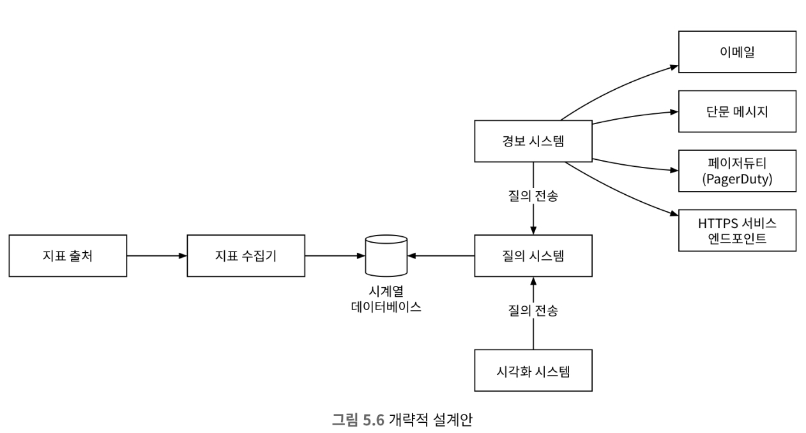
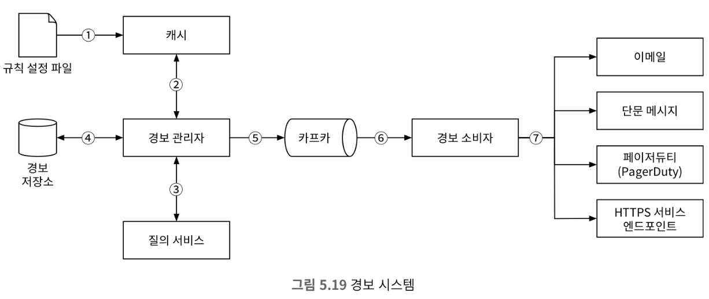

# 5장 지표 모니터링 및 경보 시스템

## 1단계: 문제 이해 및 설계 범위 확정

### 개략적 요구사항 및 가정

* 대규모 인프라 모니터링
    * DAU 1억명
    * 서버 풀 1000개, 풀당 서버 수 100개, 서버당 100개의 운영 지표 수집
        * 지표 1000만개
    * 데이터 보관 기간 1년
    * 그대로 보관은 일주일, 그 후는 1분 단위로 저장, 30일뒤에는 1시간 단위로 저장
* 모니터링 지표
    * CPU 사용률
    * 요청 수
    * 메모리 사용량
    * 메시지 큐 내의 메시지 수

### 비기능 요구사항

* 규모 확장성 : 시스템은 늘어나는 지표 수와 경보의 양에 맞게 확장 가능해야함
* 낮은 응답 지연
* 안정성 : 중요한 경보를 놓치지 않도록 해야 함
* 유연성 : 신 기술에 대한 대응이 가능해야 함

## 2단계: 개략적 설계안 제시 및 동의 구하기

### 기본적 사항

* 데이터 수집 : 여러 출처로부터 지표 데이터를 수집
* 데이터 전송 : 지표 데이터를 지표 모니터링 시스템으로 전송
* 데이터 저장소 : 전송되어 오는 데이터를 정리하고 저장
* 경보 : 밀려오는 데이터를 분석하고, 이상 징후를 감지, 경보 발생
* 시각화 : 데이터를 차트나 그래프로 제공

### 데이터 모델

* 지표 데이터는 통상 시계열 데이터로 기록. 이는 값 집합에 타임스탬프가 붙은 형태로 기록
* 모든 시계열 데이터는 다음과 같다.

| 이름                | 자료형                    |
|-------------------|------------------------|
| 지표 이름             | 문자열                    |
| 태그/레이블 집합         | <키:값> 쌍의 리스트(List)     |
| 지표 값 및 그 타임스탬프 배열 | <값, 타임스탬프 쌍의 배열(Array) |

### 데이터 접근 패턴

* 모니터링 시스템은 쓰기 부하가 크다. 반면 읽기 부하는 일시적인 피크가 발생할 수 있다. 즉, 쓰기 부하에 대해서 고려해야 한다.

### 데이터 저장소 시스템

* 데이터 저장소 시스템은 직접 설계하거나 범용 저장소 시스템을 선택하지 않는것이 좋다.
* 시계열 데이터에 최적화된 저장소 시스템은 시장에 많다.
    * 하둡, HBase, InfluxDB, 프로메테우스
* 좋은 시계열 데이터베이스는 막대한 양의 시계열 데이터를 레이블 기준으로 집계하고 분석하는 기능을 제공한다.

### 개략적 설계안

* 지표 출처 : 지표 데이터가 만들어지는 곳으로 애플리케이션 서버, 데이터베이스, 메시지 큐 등
* 지표 수집기 : 지표 데이터를 수집하고 시계열 데이터에 기록
* 시계열 데이터베이스 : 지표 데이터를 시계열 데이터 형태로 보관하는 저장소
* 질의 서비스 : 질의 서비스는 시계열 데이터베이스에 보관된 데이터를 질의하고 가져오는 과정을 돕는 서비스
* 경보 시스템 : 경로를 받아야 하는 다양한 대상으로 경보 알림 전송
* 시각화 시스템: 지표를 다양한 형태의 그래프/차트로 시각화 제공

## 3단계: 상세 설계

### 지표 수집

* 카운터나 CPU 사용량 같은 지표를 수집할 때는 때로 데이터가 소실되더라도 괜찮다.

### 풀 vs 푸시 모델

#### 풀 모델

* 지표 수집기가 지표 출처로부터 데이터를 직접 가져오는 방식을 풀 모델이라고 한다.
* 풀 모델은 서버가 수시로 추가/삭제되는 대규모 운영 환경에는 적용하기 어렵다. 하지만 서비스 탐색 기술을 활용하면 해결할 수 있다.
* 수천 대 서버가 만들어 내는 지표 데이터를 수집하려면 지표 수집기 서버 한대로는 부족하다. 이를 서버 풀을 만들어야 요청을 감당할 수 있다.
* 서버 풀이 존재할 경우 중복 데이터 발생을 막기 위해 중재 메커니즘이 존재해야 한다. 대표적으로 해시 링이 존재한다.

#### 푸시 모델

* 푸시 모델은 지표 출처가 지표 수집기로 데이터를 보내는 방식이다.
* 푸시 모델의 경우 모니터링 대상 서버에 통상 수집 에이전트를 설치하고 이 에이전트가 지표 데이터를 수집기로 보낸다.(Loki-Promtail)
* 데이터 집계는 수집기에 보내는 데이터의 양을 줄이는 효과적인 방법이다.
* 에이전트가 위치한 서버 클러스터가 자동 규모 확장이 가능하면 데이터 소실이 발생할 수 있다.
* 푸시 모델을 채택한 지표 수집기가 밀려드는 지표 데이터를 제떄 처리하지 못하는 일이 방지하기 위해 클러스터를 도입하고 로드밸런서를 사용하는 것이 좋다.

#### 풀 모델 vs 푸시 모델 장단점 비교

* 프로메테우스는 풀 모델을 사용한다.
* 푸시 모델은 아마존 클라우드와치, 그래파이트, 로키 등이 있다.

> Loki differs from Prometheus by focusing on logs instead of metrics, and collecting logs via push, instead of pull.

| -               | 풀 모델                                   | 푸시 모델                                       |
|-----------------|----------------------------------------|---------------------------------------------|
| 손쉬운 디버깅         | 엔드포인트를 노출시키기를 강제하기 때문에 디버깅이 쉽다.        |                                             |
| 상태 진단           | 애플리케이션이 풀 요청에 응답하지 않으면 장애가 발생한 것으로 진단  | 네트워크 문제인지 서버 장애인지 판단하기 어려움                  |
| 생존 기간이 짦은 프로세스  |                                        | 생명 주기가 짧은 프로세스의 경우 종료되기 전에 지표를 수집기로 보낼 수 있음 |
| 방화벽 등의 복잡한 네트워크 | 엔드포인트를 통한 접근으로 네트워크 인프라를 세심하게 설계해야 한다. | 간단하게 데이터를 수신할 수 있음                          |
|성능| 풀 모델은 일반적으로 TCP 사용| 푸시 모델은 UDP 사용. 이는 데이터 전송에 있어 오버헤드가 적음|
|데이터 신빙성|정의된 애플리케이션 목록에서 수신하는것이기에 믿을 수 있음|아무 지표나 보낼 수 있기에 인증을 도입함으로써 보안을 강화해야함|

### 지표 전송 파이프라인의 규모 확장

* 시계열 데이터베이스에 문제가 생기면 데이터 손실이 발생하기 때문에 메시지큐 도입을 통해 데이터 손실을 방지할 수 있다.

### 카프카를 통한 규모 확장

* 카프타에 내장된 파티션 메커니즘을 사용하면 시스템의 규모를 다양한 방법으로 확장 가능
  * 대역폭 요구사항에 따라 파티션의 수를 설정
  * 지표 이름에 따라 어떤 지표를 어느 파티션에 배치할지 결정하면 소비자는 지표 이름에 따라 데이터 집계 가능
  * 태그/레이블에 따라 지표 데이터를 더욱 세분화한 파티션으로 나눈다.
  * 중요 지표가 먼저 처리될 수 있도록 지표를 분류하고 우선순위를 지정

### 데이터 집계 지점

* 지표 집계는 다양한 지점에서 실행 가능하다.
  * 수집 에이전트가 집계 : 복잡한 로직을 지원하기 어렵다.
  * 데이터 수집 파이프라인에서 집계하는 방안 : 데이터 저장소에 기록하기 전에 집계할 수 있으려면 보통 플링크 같은 스트림 프로세싱 엔진이 필요하다. 
  이 방식은 늦게 도착한 데이터 처리가 어렵고, 데이터를 저장하지 않기 떄문에 유연하지 못하다.
  * 질의 시에 집계 : 데이터를 날것 그대로 보관한 다음 질의할 때 필요한 시간 구간에 맞게 집계

### 질의 서비스

* 질의 서비스는 질의 서버 클러스터 형태로 구현되며, 시각화 또는 경보 시스템에서 접수된 요청을 시계열 데이터베이스를 통해 처리하는 역할을 담당

#### 캐시 계층

* 질의 결과를 저장할 캐시 서버를 도입하면 질의 부하를 낮추고 성능을 높일 수 있다.

### 저장소 계층

#### 시계열 데이터베이스는 신중하게 선택할 것

#### 저장 용량 최적화

* 데이터 인코딩 및 압축
  * 데이터를 인코딩하고 압축하면 크기를 상당히 줄일 수 있다.
* 다운샘플링
  * 다운 샘플링은 데이터의 해상도를 낮춰 저장소 요구량을 줄이는 기법이다.
* 내동 저장소
  * 냉동 저장소는 비활성 상태 데이터를 보관하는 곳이다.

### 경보 시스템

1. 설정 파일을 가져와 캐시 서버에 보관. 경보 규칙은 디스크에 파일 상태로 보관한다.
2. 경보 관리자는 경보 설정 내역을 가져온다.
3. 설정된 규칙에 근거해 경보 관리자는 지정된 시간마다 질의 서비스를 호출
  * 경보 필터링, 병합, 중복 제거
  * 접근 제어
  * 재시도
4. 경보 저장소는 카산드라 같은 형태의 키-값 저장소이다. 모든 경보의 상태가 보관됨
5. 경보 이벤트를 카프카에 전달.
6. 경보 소비자는 카프카에서 경보 이벤트를 읽는다.
7. 경보 소비자는 카프카에서 읽은 경보 이벤트를 처리하여 이메일, 단문 메시지 등 다양한 채널로 알림 전송

### 경보 시스템 - 만들 것인가 구매할 것인가

### 시각화 서비스

## 4단계: 마무리

* 지표 데이터 수집 모델: 풀 모델 vs 푸시 모델
* 카프카를 활용한 큐모 확장 방안
* 최적 시계열 데이터베이스의 선정
* 다운샘플링을 통한 데이터 크기 절감
* 경보/시각화 시스템 : 구현할 것인가 구입할 것인가