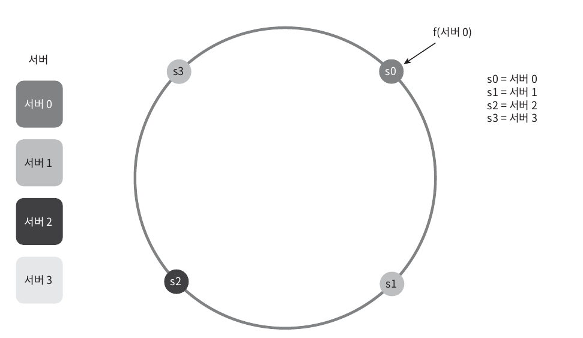

# 5장 안정 해시 설계

* 수평적 규모 확장성을 달성하기 위해서는 요청 또는 데이터를 서버에 균등하게 나누는 것이 중요합니다.

## 해시 키 재배치 문제

N개의 캐시 서버가 있을 때, 이 서버들에 부하를 균등하게 나누는 보편적인 방법은 아래의 수식을 이용하는 것입니다.

> serverIndex = hash(key) % N

이러한 해시를 이용해 균등하게 데이터를 분배하는 방식은 서버 풀(server pool)의 크기가 고정되어 있을 때, 그리고 데이터 분포가 균등할 때 유용합니다.

하지만 서버가 추가되거나 기존 서버가 삭제되면 해시 계산 결과 값을 조정하며 이러한 작업의 결과로 불균등한 데이터 분포가 발생할 수 있습니다.

## 안정 해시

"안정 해시(Consistent Hashing)"는 해시 테이블 크기가 조정될 때 k/n개의 키만 재배치하는 해시 기술입니다.
이때 k는 키의 개수, n은 스롯(slot)의 개수입니다.

### 해시 공간과 해시 링

안정 해시는 해시 공간을 원형으로 표현한 해시 링(hash ring)을 사용합니다.

### 해시 서버

앞선 해시 공간을 나타낼때 사용한 해시 함수를 사용하면 서버 IP나 이름을 해시 링 위에 어떤 위치에 대응시킬 수 있습니다.

### 해시 키

앞서 서버를 해시 링위에 위치시키고나서, 저장할 데이터의 키 key0, key1, key2, key3 또한 해시 링 위에 위치시킬 수 있습니다.

### 서버 조회

어떤 키가 저장되는 서버는, 해당 키의 위치로부터 시계 방향으로 링을 탐색해나가면서 만나는 첫 번째 서버입니다.

### 서버 추가

새로운 서버가 추가되면, 기존의 서버들은 새로운 서버가 추가되기 전의 위치에서부터 시계 방향으로 링을 탐색해나가면서 만나는 첫 번째 서버로부터 데이터를 이전합니다.

### 서버 제거

기존의 서버가 제거되면, 해당 서버가 가지고 있던 데이터는 제거된 서버의 다음 서버로 이전합니다.

### 기본 구현법의 두 가지 문제

* 안정 해시 알고리즘의 기본 절차는 다음과 같습니다.
  * 서버와 키를 균등 분포(uniform distribution) 해시 함수를 사용해 해시 링에 배치합니다.
  * 키의 위치에서 링을 시계 방향으로 탐색하다 만나는 최초의 서버가 키가 저장될 서버입니다.
* 안정 해시의 단점으로는 두 가지가 있습니다.
  * 서버가 추가되거나 삭제되는 상황을 감안하면 파티션(parition)의 크기를 군등하게 유지하는 게 불가능합니다.
  * 키의 균등 분포(uniform distribution)를 달성하기 어렵습니다.
* 안정 해시의 단점을 해결하기 위해 가상 노드(virtual node) 또는 복제(replica)를 사용합니다.

### 가상 노드

가상 노드(virtual node)는 실제 노드 또는 서버를 가리키는 노드로서, 하나의 서버는 링 위에 여러 개의 가상 노드를 가질 수 있습니다.

가상 노드의 개수를 늘리면 키의 분포는 점점더 균등해집니다. 표준 편차(standard deviation)가 줄어들기 때문입니다.

하지만 가상 노드의 개수를 더 늘리면 표준 편차의 값은 더 떨어지게 되고 가상 노드 데이터를 저장할 공간은 더 많이 필요하게 됩니다. 즉 트레이드 오프가 존재하는 것입니다.

## 정리

* 안정 해시를 사용함으로써 이점은 다음과 같습니다.
  * 서버가 추가되거나 삭제될 때 재배치되는 키의 수가 최소화됩니다.
  * 데이터가 보다 균등하게 분포하게 되므로 수평적 규모 확장성을 달성하기 쉽습니다.
  * 학스팟(hotspot) 키 문제를 줄입니다. 특정한 샤드(shard)에 대한 접근이 지나치게 빈번하면 서버 과부하 문제가 생길 수 있습니다.