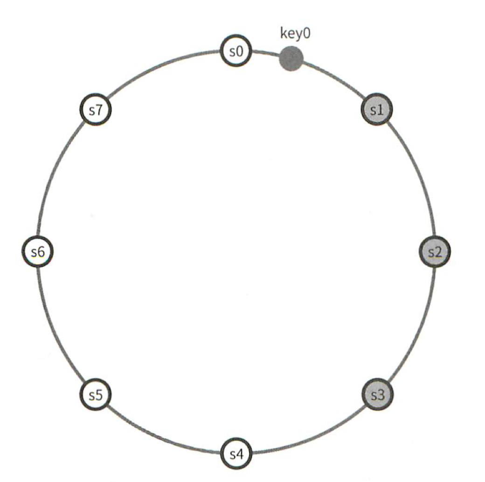
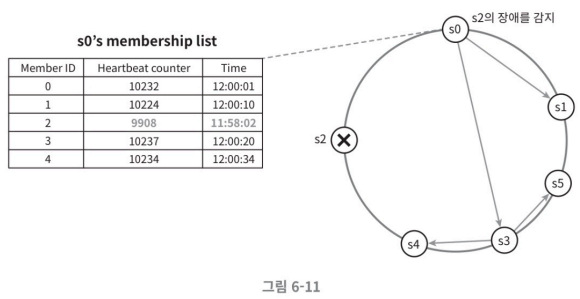

# 6장 키-값 저장소 설계

* 키-값 저장소(key-value store)는 키-값 데이터베이스라고도 불리는 비 관계형(non-relational) 데이터베이스입니다.
* 저장소에 저장되는 값은 고유 식별자(identifier)를 키로 가져야 합니다. 키와 값 사이의 연결 관계를 키-깂 씽이라고 지칭합니다.
* 키-값 쌍에서의 키는 유일해야 하며 해당 키에 매달린 값은 키를 통해서만 접근할 수 있습니다.
* 키는 일반 텍스트일 수도 있고 해시 값일 수도 있습니다. 하지만 성능상의 이유로, 키는 짧을스록 좋습니다.
* 값은 문자열일 수도 있고 리스트(List)일 수도 있고 객체(Object)일 수도 있습니다.
* 키-값 저장소로는 DynamoDB, memcached, Redis 등이 있습니다.

## 문제 이해 및 설계 범위 확정

* 이 장에서 다음 특성을 갖는 키-값 저장소를 설계해볼것 입니다.
  * 키-값 쌍의 크기는 10KB 이하입니다.
  * 큰 데이터를 저장할 수 있어야 합니다.
  * 높은 가용성을 제공해야 합니다. 따라서 시스템은 설사 장애가 있더라도 빨리 응답해야 합니다.
  * 높은 규모 확장성을 제공해야 합니다. 따라서 트래픽 양에 따라 자동적으로 서버 증설/삭제가 이루어져야 합니다.
  * 데이터 일관성 수준은 조정이 가능해야 합니다.
  * 응답 지연시간(latency)이 짧아야 합니다.

## 단일 서버 키-값 저장소

* 한 대 서버만 사용하는 키-값 저장소를 설계하는 것은 쉽습니다. 가장 직관적인 방법은 키-값 쌍 전부를 메모리에 해시 테이블로 저장하는 것입니다.
* 한 대 서버만을 이용한다면 빠른 속도를 보장하지만 모든 데이터를 메모리 안에 두는 것이 불가능할 수 있습니다. 이를 해결하는 방법은 다음과 같습니다.
  * 데이터 압축(compression)
  * 자주 쓰이는 데이터만 메모리에 두고 나머지는 디스크에 저장
* 앞선 해결방법을 적용하더라도 단일 서버로서 부족할 때가 찾아옵니다. 이를 분산 키-값 저장소(distributed key-value store)를 만들 필요가 있습니다.

## 분산 키-값 저장소

* 분산 키-값 저장소는 분산 해시 테이블이라고도 불립니다. 키-값 쌍을 여러 서버에 분산시키는 탓입니다.
* 분산 시스템을 설계할 때는 CAP 정리(Consistency, Availability, Partition Tolerance theorem)를 고려해야 합니다.

### CAP 정리

* CAP 정리는 데이터 일관성(Consistency), 가용성(availability), 파티션 감내(Partition Tolerance)라는 세 가지 요구사항을 동시에 만족하는 분산 시스템을 설계하는 것은 불가능하다는 정리입니다.
* CAP에서의 각 요구사항을 정리하는 다음과 같습니다.
  * 데이터 일관성 : 분산 시스템에 접속하는 모든 클라이언트는 어떤 노드에 접속했느냐에 관계없이 언제나 같은 데이터를 보게 되어야 합니다.
  * 가용성 : 분산 시스템에 접속하는 클라이언트는 일부 노드에 장애가 발생하더라도 항상 응답을 받을 수 있어야 합니다.
  * 파티션 감내 : 파티션은 두 노드 사이에 통신 장애가 발생하였음을 의미합니다. 파티션 감내는 네트워크에 파티션이 생기더라도 시스템은 계속 동작하여야 한다는 것을 뜻합니다.

### 시스템 컴포넌트

* 키-값 저장소 구현에 있어서 핵심 컴포넌트 및 기술들은 다음과 같습니다.
  * 데이터 파티션
  * 데이터 다중화(replication)
  * 일관성(consistency)
  * 일관성 불일치 해소(inconsistency resolution)
  * 장애 처리
  * 시스템 아키텍처 다이어그램
  * 쓰기 경로(write path)
  * 읽기 경로(read path)

#### 데이터 파티션

대규모 애플리케이션의 경우 전체 데이터를 한 대 서버에 저장하는 것은 불가능합니다.

가장 단순한 해결책은 데이터를 작은 파티션으로 분할한 다음 여러 대 서버에 저장하는 것입니다. 

데이터를 파티션 단위로 나눌 때 다음과 같은 문제를 중요하게 생각해야 합니다.
* 데이터를 여러 서버에 고르게 분산할 수 있는가
* 노드가 추가되거나 삭제될 때 데이터의 이동을 최소화할 수 있는가

이러한 문제들은 앞서 5장에서 다룬 안정 해시(Consistent Hashing)를 이용해 해결할 수 있습니다.
안정 해시를 사용하여 데이터를 파티션하면 좋은 점은 다음과 같습니다.
* 규모 확장 자동화(Auto-scaling) : 시스테 부하에 따라 서버가 자동으로 추가되거나 삭제되도록 만들 수 있습니다.
* 다양성(Heterogeneity) : 각 서버의 용량에 맞게 가상 노드(virtual node)의 수를 조정할 수 있습니다. 즉, 고성능 서버는 더 많은 가상 노드를 갖도록 설정할 수 있습니다.

#### 데이터 다중화

높은 가용성과 안정성을 확보하기 위해서는 데이터를 N개 서버에 비동기적으로 다중화(replication)할 필요가 있습니다. 이때 N은 튜닝 가능한 값입니다.

N개 서버를 선정하는 방법은 이러합니다. 어떤 키를 해시 링 위에 배치한 후, 그 지점으로부터 시계 방향으로 링을 순회하면서 만나는 첫 N개의 서버에 데이터 사본을 보관하는 것입니다.

가상 노드를 사용한다면 앞선 N개의 노드가 대응될 실제 물리 서버의 개수가 N보다 작아질 수 있습니다.
이러한 문제를 피하기 위해서는 노드를 선택할 때 같은 물리 서버를 중복 선택하지 않도록 해야 합니다.

같은 데이터 센터에 속한 노드는 정전, 네트워크 이슈, 자연재해 등의 문제를 동시에 겪을 가능성이 있습니다.
따라서 안정성을 담보하기 위해 데이터의 사본은 다른 센터의 서버에 보관하고, 센터들은 고속 네트워크로 연결합니다.

#### 데이터 일관성

여러 노드에 다중화된 데이터는 적절히 동기화가 되야 합니다.
정족수 합의(Quorum Consensus) 프로토콜을 사용하면 읽기/쓰기 연산 모두 일관성을 보장할 수 있습니다.

정족수에서 N,W,R을 이용하여 일관성을 조절할 수 있습니다.
* N : 데이터 사본의 수
* W : 쓰기 연산에 대한 정족수, 쓰기 연산이 성공한 것으로 간주되려면 적어도 W개의 서버로부터 쓰기 연산이 성공했다는 응답을 받아야 합니다.
* R : 읽기 연산에 대한 정족수, 읽기 연산이 성공한 것으로 간주되려면 적어도 R개의 서버로부터 응답을 받아야 합니다.

N,W,R 값에 따른 일관성 수준은 다음과 같습니다.
* R=1, W=N : 빠른 읽기 연산에 최적화된 시스템
* W=1, R=N : 빠른 쓰기 연산에 최적화된 시스템
* W + R > N : 강한 일관성이 보장됨
* W + R <= N : 강한 일관성이 보장되지 않음

#### 일관성 모델

일관성 모델(consistency model)은 키-값 저장소를 설계할 때 고려해야 할 또 하나의 중요한 요소입니다.
일관성 모델은 데이터 일관성의 수준을 결정하는데, 종류가 다양합니다.
* 강한 일관성(Strong Consistency) : 모든 읽기 연산은 가장 최근에 갱신된 결과를 반환한다. 다시 말해서 클라이언트는 절대로 낡은(out-of-date) 데이터를 보지 못합니다.
* 약한 일관성(Weak Consistency) : 읽기 연산은 가장 최근에 갱신된 결과를 반환하지 못할 수 있습니다.
* 최종 일관성(Eventual Consistency) : 약한 일관성의 한 형태로, 갱신 결과가 결국에는 모든 사본에 반영(즉, 동기화)되는 모델입니다.

강한 일관성을 달성하는 과정에서 모든 데이터베이스에 동기화하는 작업으로 새로운 요청의 처리가 중단되기에 고가용성 시스템에는 적합하지 않습니다.

#### 비 일관성 해소 기법 : 데이터 버저닝

데이터를 다중화하면 가용성은 높아지지만 사본 간 일관성이 깨질 가능성은 높아집니다. 이는 버저닝(versioning)과 백테 시계(vector clock)을 통해 해결할 수 있습니다.

버저닝은 데이터를 변경할 떄마다 해당 데이터의 새로운 버전을 만드는 것을 의미합니다. 따라서 각 버전의 데이터는 변경 불가능합니다.

벡터 시계는 [서버, 버전]의 순서쌍을 데이터에 매단 것입니다. 이는 어떤 버전이 선행 버전인지, 후행 버전인지, 아니면 다른 버전과 충돌이 있는지 판별하는데 쓰입니다.

하지만 벡터 시계를 사용해 충돌을 감지하고 해소하는 방법에는 두 가지 분명한 단점이 있습니다.
* 충돌 감지 및 해소 로직이 클라이언트에 들어가야 하므로, 클라이언트 구현이 복잡해집니다.
* [서버: 버전]의 순서쌍 개수가 굉장히 빨리 늘어납니다.
  * 순서쌍이 늘어나는 문제는 입계치를 설정하고, 임계치 이상으로 길이가 길어지면 오래된 순서쌍을 백터 시계에서 제거하도록 해야 합니다.

#### 장애 감지

분산 시스템에서는 한 대 서버가 특정 서버가 정지된 사실을 알리더라도 바로 정지된 서버를 장애처리하지 않습니다.
보통 두 대 이상의 서버가 특정 서버가 정지됨을 알릴 때 장애가 발생했다고 간주합니다.

장애감지를 위한 방법으로는 모든 노드 사이에 멀티캐스팅 채널을 구축하거나 가십 프로토콜 같은 분산형 장애 감지 솔루션을 사용할 수 있습니다.
이중 가십 프로토콜을 사용하는것이 효율적입니다.

가십 프로토콜의 동작 원리는 다음과 같습니다
* 각 노드는 멤버십 목록(Membership list)를 유지합니다. 멤버십 목록은 각 멤버 ID와 그 박동 카운터(heartbeat counter) 쌍의 목록입니다.
* 각 노드는 주기적으로 자신의 박동 카운터를 증가시킵니다.
* 각 노드는 무작위로 선정된 노드들에게 주기적으로 자기 박동 카운터 목록을 보냅니다.
* 박동 카운터 목록을 받은 노드는 멤버십 목록을 최신 값으로 갱신합니다.
* 어떤 멤버의 박동 카운터 값이 지정된 시간 동안 갱신되지 않으면 해당 멤버는 장애(offline) 상태인 것으로 간주합니다.

#### 일시적 장애 처리

가십 프로토콜로 장애를 감지한 시스템은 가용성을 보장하기 위해 필요한 조치를 해야 합니다.

업격한 정족수(strict quorum) 접근법을 쓴다면 읽기와 쓰기 연산을 금지해야 합니다.

느슨한 정족수(sloppy quorum) 접근법은 특정 노드에서 장애가 발생한다면 해당 노드를 무시하고 다른 노드가 잠시동안 그 노드의 역할을 대신해 요청을 처리합니다.
장애가 발생한 노드가 복구가 되면 해당 노드를 대신해 요청을 처리한 노드가 복귀된 노드로 데이터를 일관 반영하여 일관성을 보존합니다.

#### 영구 장애 처리

일시적인 장애가 아닌 영구적인 장애가 발생할 경우 반-엔트로피(anti-entropy) 프로토콜을 구현하여 사본들을 동기화해야 합니다.

반-엔트로피 프로토콜은 사본들을 비교하여 최신 버전으로 갱신하는 과정을 포함합니다.
사본 간의 일관성이 망가진 상태를 탐지하고 전송 데이터의 양을 줄이기 위해서는 머클(merkle) 트리를 사용합니다.
즉, 서버의 데이터를 머클트리 해쉬값을 계산하여 이 해쉬값들의 비교를 통해 일관성을 검증합니다.