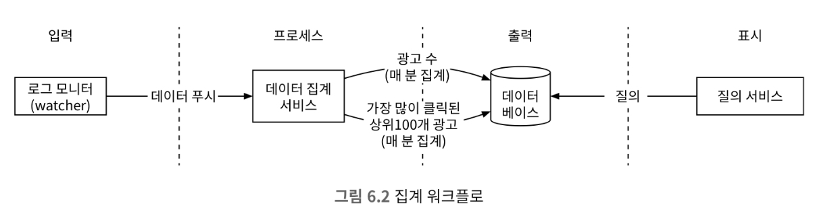
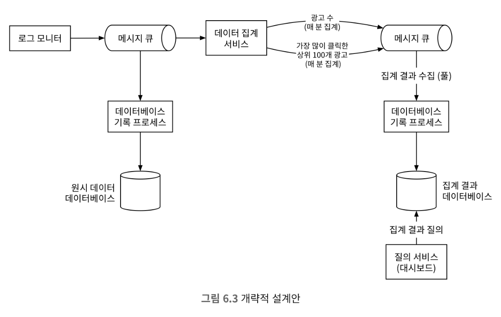

# 6장 광고 클릭 이벤트 집계

## 1단계 : 문제 이해 및 설계 범위 확정

### 기능 요구사항

* 지난 M분 동안의 ad_id 클릭 수 집계
* 매분 상위 100개 광고 아이디 반환
* 다양한 속성에 따른 집계 필터링 지원

### 비기능 요구사항

* 집계 결과 정확성은 데이터가 RTB 및 광고 과금에 사용되므로 중요
* 지연되거나 중복된 이벤트를 적절히 처리할 수 있어야 함
* 결고성(reliability) : 부분적인 장애는 감내할 수 있어야 함
* 지연 시간 요구사항 : 전체 처리 시간은 최대 수 분을 넘지 않아야 함

### 개략적 추정

* 일간 능동 사용자(DAU) 수는 10억 명
* 각 사용자는 하루에 평균 1개 광고를 클릭한다고 가정, 따라서 하루에 10억 건의 광고 클릭 이벤트가 발생
* 광고 클릭 QPS = (10^9 이벤트)/(하루 10^5초) = 10000
* 최대 광고 클릭 QPS는 평균 QPS의 다섯 배, 즉 50000QPS로 가정
* 광고 클릭 이벤트 하나당 0.1KB의 저장 용량이 필요하다고 가정, 따라서 일일 저장소 요구량은 0.1KB * 10억 = 100GB이며, 월간 저장 용량 요구량은 약 3TB

## 2단계 : 개략적 설계안 제시 및 동의 구하기

### 데이터 모델

* 광고 집계 데이터에는 원시 데이터와 집계 결과 데이터로 구성되어 있다.

#### 원시 데이터

로그 파일에 포함된 원시 데이터의 형태다

`[AdClickEvent] ad001, 2021-01-01 00:00:01, user 1, 208.142.42.34, USA`

위 데이터를 구조화된 형식으로 표현하면 다음과 같이 구성할 수 있다.

| ad_id | click_timestamp     | user_id | ip            | country |
|-------|---------------------|---------|---------------|---------|
| ad001 | 2021-01-01 00:00:01 | user 1  | 208.142.42.34 | USA     |
| ad002 | 2021-01-01 00:00:02 | user 2  | 208.142.42.34 | USA     |

#### 집계 결과 데이터

| ad_id | click_minute | filter_id | count |
|-------|--------------|-----------|-------|
| ad001 | 202101010000 | 0012      | 10    |
| ad002 | 202101010001 | 0012      | 20    |

| filter_id | region | ip   | user_id       |
|-----------|--------|------|---------------|
| 0012      | US     | 0012 | *             |
| 0013      | *      | 0023 | 208.142.42.34 |

광고 집계 테이블에는 광고 필터링을 위한 filter_id와 광고 클릭 수를 저장한다.

#### 비교

원시 데이터를 저장하는 방안과 집계 결과 데이터만 보관하는 방안의 장단점은 다음과 같다.

|-|원시 데이터만 보관하는 방안|집계 결과 데이터만 보관하는 방안|
|---|------------------------|--------------------------|
|장점| * 원본 데이터를 손실없이 보관  * 데이터 필터링 및 재계산 지원 | * 데이터 저장 용량 절약  * 집계 결과를 빠르게 조회 가능 |
|단점| * 막대한 데이터 용량   * 낮은 질의 성능 | * 데이터 손실, 원본 데이터가 아닌 계산/유도된 데이터를 저장하는 데서 오는 결과.|

결론적으로는 원시 데이터와 집계 결과 데이터 둘다 저장해야한다. 그이유는
* 문제가 발생할 때 원시 데이터를 기반으로 다시 계산할 수 있어야 하기 때문
* 원시 데이터는 질의 성능이 낮기 떄문에, 집계 결과에 대해서 질의하는 것이 바람직
* 원시 데이터는 백업 데이터로 활용
* 집계 결과 데이터는 활성 데이터 구실을 함

### 올바른 데이터베이스 선택

* 계략적 추정치를 통해 확인할 수 있는 점은 해당 시스템은 읽기가 아닌 쓰기 중심 시스템인 것 이다.
* 쓰기 연산이 많은 경우 카산드라나 InfluxDB를 사용하는 것이 바람직하다.

### 개략적 설계안

실시간 빅데이터를 처리할 때 데이터는 보통 무제한으로 시스템에 흘러 들어와 나간다.

#### 비동기 처리

* 카프카와 같은 메시지 큐를 통해 생산자와 소비자의 결합을 느슨하게 하여 시스템의 확장성을 높여야 한다.

### 집계 서비스

* 광고 클릭 이벤트 집계를 위해서는 맵리듀스 프레임워크를 사용하면 좋다.
* 맵리듀스 프레임워크에 좋은 모델은 유향 비순환 그래프다.

#### 맵 노드

* 맵 노드는 데이터 출처를 읽은 데이터를 필터링하고 변환하는 역할을 담당한다.
* 카프카에서도 처리할 수 있지만 입력 데이터를 정리하거나 정규화해야 하는경우 맵 노드를 사용하는 것이 좋다. 
또한 데이터 생성 제어권에 대해서 동일한 ad_id에 대해서 같은 노드에 처리될 수 있도록 맵 노드를 사용하는게 좋다.

#### 집계 노드

* 집계 노드는 ad_id 별 광고 클릭 이벤트 수를 매 분 메모리에서 집계하며 맵리듀스 패러다임에서 집계 노드는 리듀스 프로세스의 일부다.

* 리듀스 노드
  * 리듀스 노드는 모든 '집계' 노드가 산출한 결과를 최종 결과로 축약한다.
  * DAG는 맵리듀스 패러다임을 표현하기 위한 모델이다.
  * 모델의 중간 데이터는 메모리에 저장될 수 있으며, 노드간 통신은 TCP로 처리할 수도 있고 공유 메모리로 처리할 수도 있다.

## 3단계: 상세 설계

### 스트리밍 vs 일괄처리

* 일괄 및 스트리밍 처리 결로를 동시에 지원하는 시스템을 람다라고 부릅니다.

### 데이터 재계산

### 시간

* 집계를 하기 위해서는 다음과 같은 시간이 생성될 수 있다.
  * 이벤트 시각: 광고 클릭이 발생한 시각
  * 처리 시각 : 집계 서버가 클릭 이벤트를 처리한 시스템 시각
* 데이터의 정확도가 중요하다면 이벤트 발생 시각을 사용하는 것이 좋다
* 워터마크 기법을 통해서 집계 결과의 정확도를 높일 수 있지만, 한참 후에 도달하는 이벤트를 처리할 수 없는 문제가 있다.

### 집계 위도

* 윈도에는 텀블링 윈도, 고정 위도, 호핑 윈도, 슬라이딩 윈도, 세션 윈도가 있다.
* 텀블링 윈도는 시간을 같은 크기의 겹치지 않는 구간으로 분할한다. 이는 클릭 이벤트 집계에서 사용하기 용이하다.
* 슬라이딩 윈도는 데이터 스트림을 미끄러져 나아가면서 같은 시간 구간 안에 있는 이벤트를 집계한다. 이는 지난 M분간 가장 많이 클릭된 상위 N개 광고를 알아내기에 적합하다.

### 전달 보장

* 집계 결과는 과금 등에 활용될 수 있기에 정확성과 무결성이 아주 중요하다.
* 어떤 전달 방식을 택할 것인가
  * 약간의 중복을 허용한다면 '최소 한 번'
  * 데이터 중복 제거
    * 클라이언트 측에서 같은 이벤트를 여러 번 보내는 경우
    * 서버 장애 : 집계 도중 집계 서비스 노드에서 장애가 발생했고, 클라이언트가 이벤트를 다시 보내는 경우
    * 카프카에서 업스트림에서 다운스트림으로 데이터를 전달할 때, 오프셋 반영이 제대로 반영되지 않을 경우 오프셋을 외부 저장소에 관리하며 다운스트림의 응답이 모두 완료될때, 오프셋을 업데이트한다.
    이러한 과정을 통해 데이터 중복 처리를 방지할 수 있다. 추가로 다운스트림으로 전송에서 분산 트랜잭션 적용을 통해 데이터 중복을 방지할 수 있다.

### 시스템 규모 확장

#### 메시지 큐의 규모 확장

* 생산자 : 생산자 인스턴스 수에는 제한을 두지 않으므로 확장성은 쉽게 달성 가능
* 소비자 : 소비자 그룹 내의 재조정 메커니즘은 노드 추가/삭제를 통해 규모를 쉽게 조정할 수 있음

#### 브로커

* 해시 키
  * 같은 ad_id를 갖는 이벤트를 같은 카프카 파티션에 저장하기 위해 ad_id를 해시 키로 사용
* 파티션의 수
  * 파티션의 수가 변하면 같은 ad_id를 갖는 이벤트가 다른 파티션에 기록되는 일이 생길 수 있음
* 토픽의 물리적 샤딩
  * 지역에 따라 여러 토픽을 두거나 사업 유형에 따라 토픽을 둘 수 있음
    * 장점 : 데이터 처리 대역폭을 높일 수 있음
    * 단점 : 복잡성이 증가하고 유지 관리 비용이 늘어남

### 집계 서비스의 규모 확장

* 집계 서비스는 맵리듀스 연산으로 구현되기 때문에 노드의 추가/삭제를 통한 수평적 조정이 가능하다.
* 집계 서비스에서 대역폭을 높이기 위해서는 다음 두 가지 방법이 있다.
  * ad_id마다 별도의 처리 스레드를 두는 방안
  * 집계 서비스 노드를 아파치 하둡 YARN 같은 자원 공급자에 배포하는 방식. 즉, 다중 프로세싱을 활용하는 것

### 데이터베이스의 규모 확장

* 카산드라는 안정 해시와 유사한 방식으로 수평적인 규모 확장을 기본적으로 지원한다.
* 데이터는 각 노드에 균등하게 분산한다. 이때 사본도 적당한 수만큼 만들어 분산한다.

### 핫스팟 문제

* 다른 서비스나 샤드보다 더 많은 데이터를 수신하는 서비스나 샤드를 핫스팟이라고 부른다.
* 핫스팟의 경우 처리 한계보다 더 많은 요청이 들어올 경우 추가 자원을 투입하며 이를 해결한다. 이때, 전역-지역 집계, 분할 고유 집계 같은 방안을 통해서도 해결할 수 있다.

### 결함 내성

* 집계는 메모리에서 진행되기 떄문에 집계 노드에 장애가 발생하면 결과에도 손실이 발생할 수 있다.
* 카프카에도 장애가 발생하여 원점부터 다시 시작한다면 집계 시간이 오래걸릴 수 있다. 이를 업스트림 오프셋 같은 '시스템 상태'를 스냅숏으로 저장하고 마지막으로 저장된 상태부터 복구해 나가는것이 좋다.

### 데이터 모니터링 및 정확성

#### 지속적 모니터링

* 지연시간 : 데이터를 처리하는 각 단계마다 지연시간이 추가도리 수 있기에, 시스템의 중요 부분마다 시각 추적이 필요하다.
* 메시지 큐 크기 : 큐의 크기가 갑자기 늘어난다면 더 많은 집계 서비스 노드를 추가해야 할 수 있다. 카프카는 분산 커밋 로그 형태로 구현된 메시지 큐이기 때문에, 
카프카를 사용하는 경우 레코드 처리 지연 지표를 대신 추적하면 된다.
* 집계 노드의 시스템 자원

#### 조정

* 조정은 다양한 데이터를 비교하여 데이터 무결성을 보증하는 기법이다.

