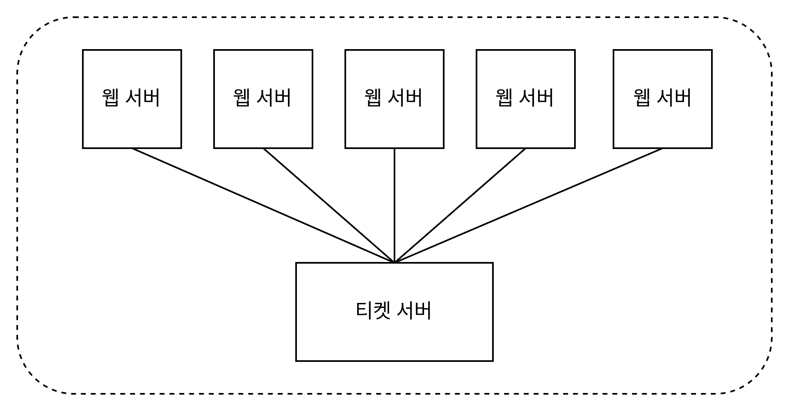

# 7장 분산 시스템을 위한 유일 ID 생성기 설계

## 1단계 문제 이해 및 설계 범위 확정

* ID는 유일해야 한다.
* ID는 숫자로만 구성되어야 한다.
* ID는 64비트로 표현될 수 있는 값이어야 한다.
* ID는 발급 날짜에 따라 정렬 가능해야 한다.
* 초단 10000개의 ID를 만들 수 있어야 한다.

## 2단계 개략적 설계안 제시 및 동의 구하기

분산 시스템에서 유일성이 보장되는 ID를 만드는 방법은 다음과 같습니다.
* 다중 마스터 복제(multi-master replication)
* UUID(Universally Unique Identifier)
* 티켓 서버(ticket server)
* 트위터 스노플레이크(twitter snowflake) 접근법

### 다중 마스터 복제

다중 마스터 복제 접근법은 데이터베이스의 auto_increment 기능을 활용하는 것입니다. 
하지만 기존의 ID값을 1씩 증가하는 방식이 아닌 데이터베이스 수 K개 만큼 ID값을 증가시킵니다.

장점으로는 다음과 같습니다.
* 규모 확장성 문제를 해결할 수 있습니다.
* 데이터베이스 수의 증가에 따른 초당 생성 가능한 ID 수를 늘릴 수 있습니다.

단점으로는 다음과 같습니다.
* 여러 데이터 센터에 결쳐 규모를 늘리기 어렵습니다.
* ID의 유일성은 보장하지만 값이 시간 흐름에 맞춰 커지도록 보장할 수 없습니다.
* 서버를 추가하거나 삭제할 떄도 잘 동작하도록 만들기 어렵습니다.

### UUID

UUID는 간단하게 유일성이 보장되는 ID를 만드는 방법입니다.

UUID는 컴퓨터 시스템에 저장되는 정보를 유일하게 식별하기 위한 128비트 수입니다. 또한 충돌 가능성이 지극히 낮습니다.

UUID를 사용함으로써 얻는 장,단점은 다음과 같습니다.
* 장점
  * 만들기 쉽습니다. 서버 사이의 조율이 필요 없기에 동기화 이슈도 없습니다.
  * 각 서버가 사용할 ID를 생성하는 구조이므로 규모 확장이 쉽습니다.
* 단점
  * ID가 128비트로 요구사항인 64비트보다 큽니다.
  * ID를 시간순으로 정렬할 수 없습니다.
  * ID에 숫자가 아닌 값이 포함될 수 있습니다.

### 티켓 서버

티켓 서버(ticket server)는 유일성이 보장되는 ID를 만들어 내는 데 사용할 수 있는 방법입니다.

플리커(Flickr)는 분산 기본 키(distributed primary key)를 만들어 내기 위해 티켓 서버를 이용했습니다.

티켓 서버의 핵심은 auto_increment 기능을 가진 데이터베이스 서버, 즉 티켓 서버를 중앙 집중형으로 하나만 사용하는 것입니다.

티켓 서버를 사용함으로써 얻는 장,단점은 다음과 같습니다.
* 장점
  * 유일성이 보장되는 오직 숫자로만 구성된 ID를 쉽게 만들 수 있습니다.
  * 구현하기 쉽고, 중소 규모 애플리케이션에 적합합니다.
* 단점
  * 티켓 서버가 SPOF(Single Point of Failure)가 될 수 있습니다. 이를 해결하기 위해 티켓 서버를 여러 대 둔다면 데이터 동기화 문제가 발생할 수 있습니다.

### 트위터 스노플레이크 접근법

트위터에서는 스노플레이크(snowflake)라고 부르는 ID 생성 기법을 사용합니다.

스노플레이크에서의 ID의 구조는 여러 절(section)으로 분리하여 관리합니다. 각 절은 다음과 같습니다.

* 사인(sign) 비트 : 1비트를 할당합니다.
* 타임스탬프(timestamp) : 41비트를 할당합니다. 기원 시각(epoch) 이후로 몇밀리초가 경과 했는지를 나타내는 값입니다.
* 데이터 센터 ID : 5비트를 할당합니다.
* 서버 ID : 5비트를 할당합니다.
* 일련번호 : 12비트를 할당합니다. 각 서버에서 ID를 생성할 때마다 이 일련 번호를 1만큼 증가시킵니다. 이 값은 1밀리초가 경과할 떄마다 0으로 초기화됩니다.

## 3단계 상세 설계

스노플레이크 ID를 생성하면서 데이터센터 ID와 서버 ID는 시스템이 시작할 때 결정되지만, 이를 잘못 변경하게 될경우 충돌이 발생할 수 있으므로 신중하게 작업을 해야 합니다.

### 타임스탬프

타임스탬프는 41비트를 가지며 시간에 흐름에 따라 증가하기에 시간 순으로 정렬할 수 있습니다.

41비트로 표현 가능한 시간의 최댓값에 따라 69년간의 시간을 표현할 수 있습니다.

### 일련번호

일련번호는 12비트이므로 1밀리초에 4096개의 ID를 생성할 수 있습니다.

## 4단계 마무리

설계를 진행함에 있어 추가적으로 논의해볼만한 사항은 다음과 같습니다.
* 시계 동기화(clock synchronization) : ID를 생성하는 과정에서 동일한 시계를 사용함으로 가정했는데, 이는 하나의 서버가 여러 코어에서 실행될 경우 유효하지 않을 수 있습니다.
이는 NTP(Network Time Protocol)를 사용하여 해결할 수 있습니다.
* 각 절(section)의 길이 최적화 : 동시성이 낮고 수명이 긴 애플리케이션이라면 일련번호 절의 길이를 줄이고 타임스탬프 절의 길이를 늘리는 것이 효과적일 수 있습니다.
* 고가용성(high availability) : ID 생성기는 필수 불가결 컴포넌트이므로 아주 높은 가용성을 제공해야 할 것입니다.