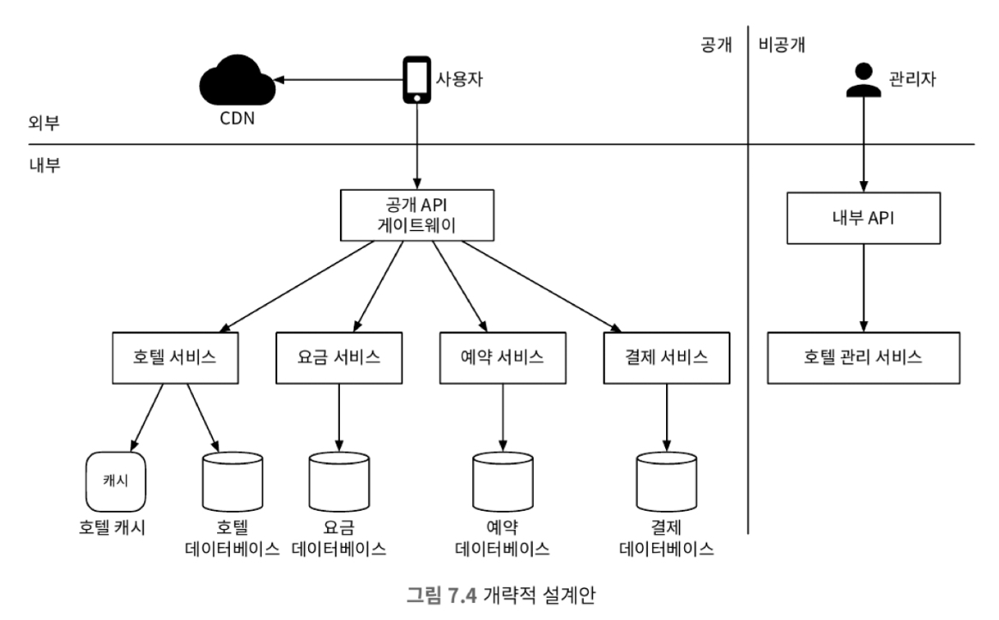

# 7장 호텔 예약 시스템

## 1단계: 문제 이해 및 설계 범위 확정

### 비기능 요구사항

* 높은 수준의 동시성 지원
* 적절한 지연 시간

### 개략적 규모 추정

* 총 5000개 호텔, 100만 개의 객식 존재
* 평균 70% 객실 사용, 평균 투숙 기간 3일
* 일일 예상 예약 : 백만 * 0.7 / 3 = 233,333
* 초당 예약 건수 = 233,333 / (24 * 3600) = ~ 3
* 객실 조회, 예약 상세 페이지 이동 시 사용자의 10%만 이동한다 가정하면 초당 300, 30, 3 건의 조회가 발생한다.

## 2단계: 계략적 설계안 제시 및 동의 구하기

### 데이터 모델

* 해당 서비는 다음과 같은 질의를 지원해야 한다.
  * 호텔 상세 정보 조회 
  * 지정된 날짜 범위에 사용 가능한 객실 유형 확인
  * 예약 정보 기록
  * 예약 내역 또는 과거 예약 이력 정보 조회

### 개략적 설계안

## 3단계: 상세 설계

### 동시성 문제

* 이중 예약 방지 관련해서 해결해야한다.
  * 같은 사용자가 예약 버튼을 여러 번 누를 수 있다.
  * 여러 사용자가 같은 객실을 동시에 예약할 수 있다.

* 이중 예약은 클라이언트 측 구현과 멱등 API를 통해 해결할 수 있다.
  * 클라이언트 측 구현 : 버튼과의 상호작용은 한 번으로 제한한다.
  * 멱등 API : 예약 주문 생성 시 멱등 키를 생성하고 예약할 때 해당 키를 같이 전송함으로써 멱등 API를 만들 수 있다.

* 동시성 문제로는 하나 남은 객실을 여러 사람이 예약하려 할 때가 있을 수 있다.
* 이를 해결하기 위한 방법은 3개가 있다.
  * 비관적 락
    * 먼저 접근한 사용자에게 락을 부여하여 다른 사용자는 대기하게 한다.
    * 장점
      * 데이터 갱신을 막을 수 있다.
      * 구현이 쉽고 안정적이다.
    * 단점
      * 데드락이 발생할 수 있다.
      * 확장성이 낮다. 특히 트랜잭션을 너무 오래 잡고 있게 된다.
  * 낙관적 락
    * 먼저 데이터를 저장하려 시도하는 사용자가 예약할 수 있도록 한다.
    * 장점
      * 비관적 락보다 빠르다.
      * 데이터베이스 자원에 락을 걸 필요가 없다.
    * 단점
      * 데이터 경쟁이 치열한 상황에서는 성능이 좋지 않다.
  * 데이터베이스 제약 조건
    * 제약 조건 설정을 통해 지정된 수의 객실보다 많은 예약을 할 수 없다.
    * 장점
      * 구현이 쉽다.
      * 경쟁이 심하지 않을 때 유용하다.
    * 단점
      * 경쟁이 심하면 실패하는 연산 수가 엄청 늘어날 수 있다.
      * 버전을 통제하기 어렵다.

### 시스템 규모 확장

* 다른 서비스와의 연동으로 QPS가 늘어날 수 있다 이러한 상황에서 데이터베이스 성능을 보장할 수 있을까?

#### 데이터베이스 샤딩

* 데이터베이스 샤딩은 데이터베이스의 부하를 분산시키는 방법이다.

#### 캐시

* 캐시를 통해서 호텔 잔여 객실 데이터를 담아 두면 데이터베이스에 접근하는 횟수를 줄일 수 있다.
* 캐시를 통해 잔여 객실 수를 관리한다면 데이터베이스의 값과의 일관성을 잘 보장해야한다.
  * 데이터베이스와 캐시 사이의 일관성을 CDC와 같은 변경 데이터 감지 메커니즘을 사용하면 해결할 수 있다.
  * 하지만 이렇게하더라도 두 저장소간 데이터 불일치가 발생할 수 있기 떄문에, 이를 해결하기 위해서는 데이터베이스에 최종적으로 잔여 객실을 확인하도록하면 해결된다.

### 서비스 간 데이터 일관성

* MSA 도입으로 여러 데이터베이스가 분산되어 있다면, 각 데이터베이스에서 트랜잭션 실행으로 데이터 일관성을 보장하기 어렵다.
* 데이터 일관성 보장을 위해서는 다음과 같은 방법이 있다.
  * 2단계 커밋
  * 사가 : 여러 트랜잭션을 하나의 트랜잭션으로 묶어서 실행하는 방법