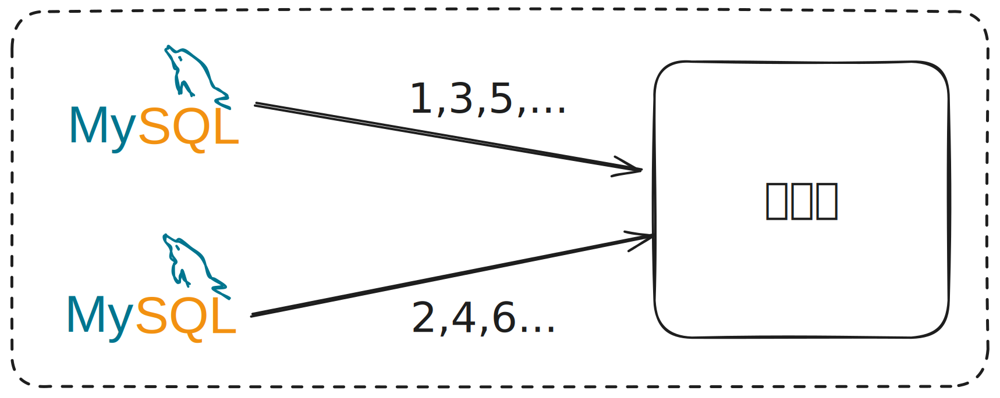

# 7장 분산 시스템을 위한 유일 ID 생성기 설계

## 1단계 문제 이해 및 설계 범위 확정

* ID는 유일해야 한다.
* ID는 숫자로만 구성되어야 한다.
* ID는 64비트로 표현될 수 있는 값이어야 한다.
* ID는 발급 날짜에 따라 정렬 가능해야 한다.
* 초단 10000개의 ID를 만들 수 있어야 한다.

## 2단계 개략적 설계안 제시 및 동의 구하기

분산 시스템에서 유일성이 보장되는 ID를 만드는 방법은 다음과 같습니다.
* 다중 마스터 복제(multi-master replication)
* UUID(Universally Unique Identifier)
* 티켓 서버(ticket server)
* 트위터 스노플레이크(twitter snowflake) 접근법

### 다중 마스터 복제

다중 마스터 복제 접근법은 데이터베이스의 auto_increment 기능을 활용하는 것입니다. 
하지만 기존의 ID값을 1씩 증가하는 방식이 아닌 데이터베이스 수 K개 만큼 ID값을 증가시킵니다.

장점으로는 다음과 같습니다.
* 규모 확장성 문제를 해결할 수 있습니다.
* 데이터베이스 수의 증가에 따른 초당 생성 가능한 ID 수를 늘릴 수 있습니다.

단점으로는 다음과 같습니다.
* 여러 데이터 센터에 결쳐 규모를 늘리기 어렵습니다.
* ID의 유일성은 보장하지만 값이 시간 흐름에 맞춰 커지도록 보장할 수 없습니다.
* 서버를 추가하거나 삭제할 떄도 잘 동작하도록 만들기 어렵습니다.

### UUID

UUID는 간단하게 유일성이 보장되는 ID를 만드는 방법입니다.