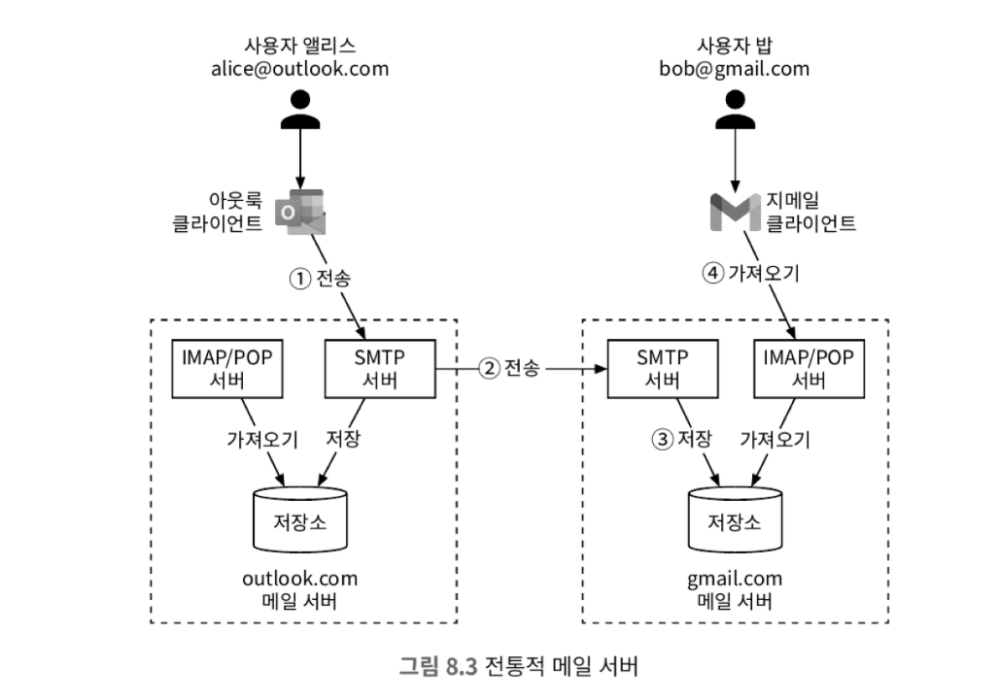
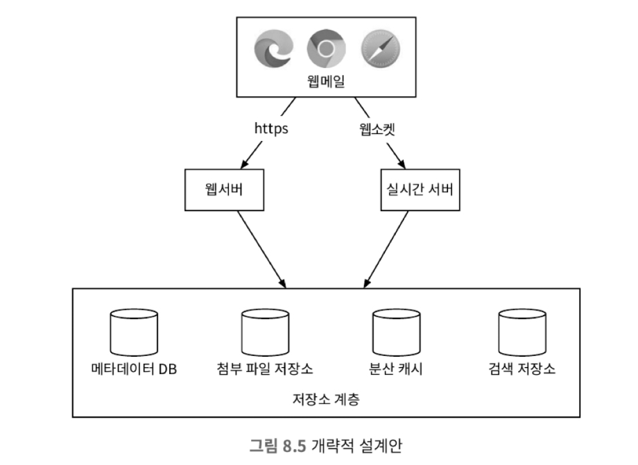
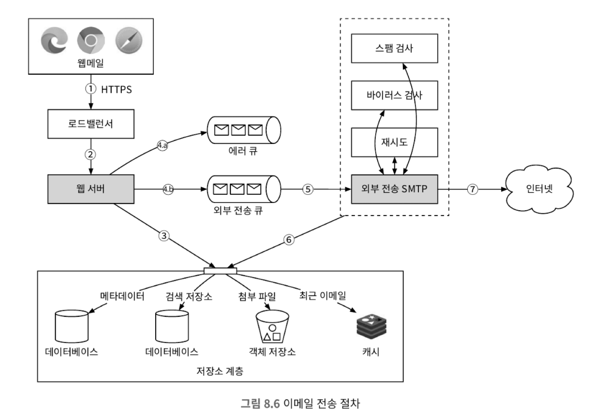
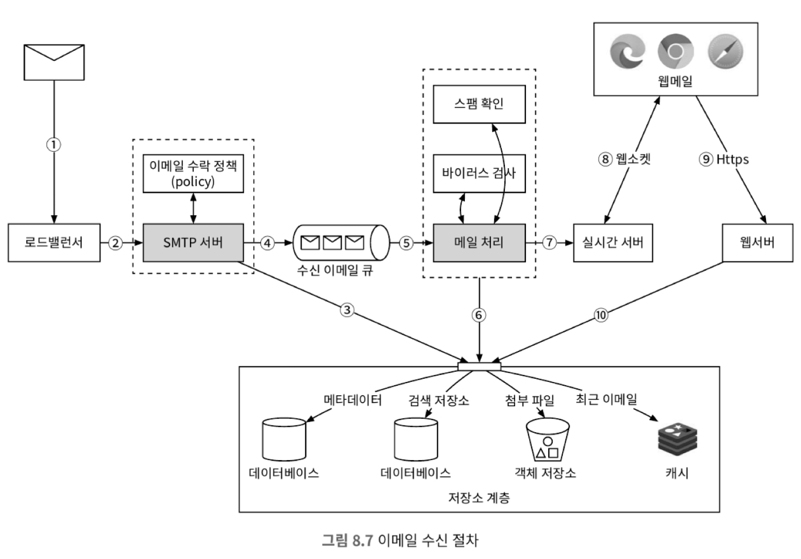
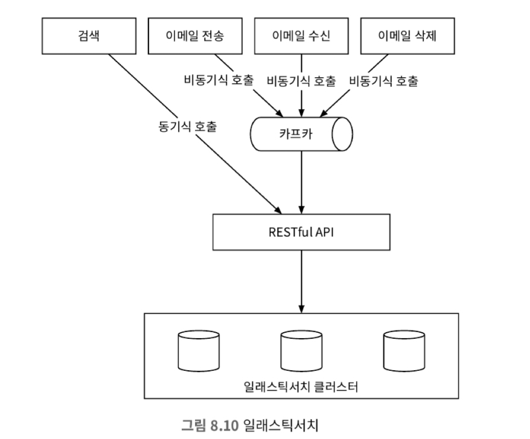
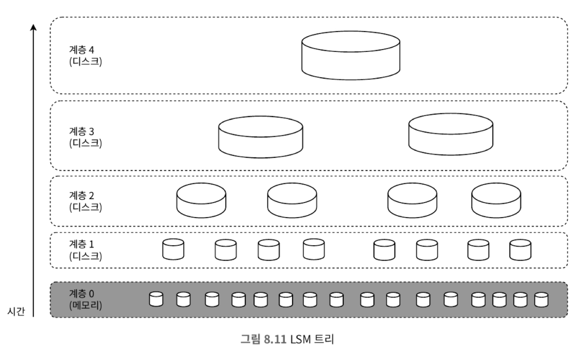

# 8장 분산 이메일 서비스

## 1단계: 문제 이해 및 설계 범위 확정

### 비기능 요구사항

* 안정성 : 이메일 데이터는 소실되면 안됨
* 가용성
* 확장성
* 유연성과 확장성

### 개략적인 규모 추정

* 10억명 사용자
* 한 사람이 하루에 보내는 평균 이메일 수 10건
  * QPS = 10억 * 10 / 10000 = 100,000
* 한 사람이 평균 40개의 메일 수신, 메일 당 50KB
* 메타데이터는 데이터베이스에 저장함
  * 저장 용량 : 10^9 * 40 * 365 * 50KB = 730PB
* 첨부 파일을 포함하는 이메일은 20%이며, 첨부 파일 평균 크기는 500KB
  * 저장 용량 : 10^9 * 40 * 0.2 * 365 * 500KB = 1460PB

## 2단계: 개략적 설계안 제시 및 동의 구하기

### 이메일 101

#### 이메일 프로토콜

* SMTP(Simple Mail Transfer Protocol) : 이메일 전송
* POP(Post Office Protocol) : 이메일 수신
  * 다운로드된 이메일은 서버에서 삭제됨
  * POP을 사용하면 이메일을 한번에 전부 다운로드 받아야 함
* IMAP(Internet Message Access Protocol) : 이메일 수신
  * 서버에 저장된 이메일을 읽을 수 있음
  * 이메일을 읽으면 서버에서 삭제되지 않음
* HTTPS

#### 첨부 파일

* 이메일 첨부 파일은 이메일 메시지와 함께 전송되며 Base64로 인코딩됨
* 일반적으로 첨부파일의 크기는 제한되어 있음

#### 전통적 메일 서버

* 전통적 메일 서버는 메일 전송 서버에서 DNS를 통해 수신 서버를 찾아 메일을 전송함. 수신 서버는 메일을 받아 사용자의 메일함에 저장함.
* 전통적 메일 서버는 이메일을 파일 시스템의 디렉터리에 저장한다.
  * 사용자가 많을 때 파일 시스템의 성능이 저하될 수 있음
  * 가용성 및 안정성 요구사항을 만족하기 힘듦

### 분산 메일 서버

#### 분산 메일 서버 아키텍처

* 웹 메일: 사용자는 웹브라우저를 사용해 메일을 받고 보낸다.
* 웹서버 : 웹서버는 사용자가 이용하는 요청/응답 서비스
* 실시간 서버 : 새로운 이메일 내역을 클라이언트에 실시간으로 전달함
* 메타데이터 데이터베이스 : 이메일 제목, 본문, 발신인, 수신인 목록 등의 메타데이터 저장
* 첨부파일 저장소 : S3와 같은 저장소에 첨부파일 저장, NoSQL은 적합하지 않음
* 분산 캐시: 최근 수신된 이메일은 자주 읽을 가능성이 높기 때문에 캐시에 저장함
* 검색 저장소 : 이메일 검색을 위한 저장소

### 이메일 전송 절차

1. 사용자가 메일 작성 후 전송, 요청은 로드밸런서로 전송됨
2. 로드밸런서는 처리율 제한 한도를 넘지 않는 선에서 요청을 웹 서버로 전달
3. 웹 서버는 다음과 같은 역할을 담당
   * 이메일 검증: 이메일 크기와 같이 사전에 미리 정의된 규칙을 사용하여 검사
   * 수신자 이메일 주소 도메인이 송신자 이메일 주소 도메인과 같은지 검사
4. 메시지 큐
   1. 검증을 통과한 메일은 메시지 큐에 저장됨. 파일 크기가 너무 큰 경우 첨부 파일 저장소에 저장 후 해당 파일에 대한 참조를 메시지 큐에 저장
   2. 기본적인 검증에 실패한 이메일은 에러 큐에 보관
5. 외부 전송 담당 SMTP 작업 프로세스는 외부 전송 큐에서 메시지를 꺼내 스팸 및 바이러스 감염 여부 확인
6. 검증을 통과한 메일은 보낸 편지함에 저장
7. 수신자 메일 서버로 전송

* 메일을 보내는 과정에서 다음과 같은 고민이 생길 수 있다.
  * 수신자 측 메일 서버에 장애 발생 : 지수적 백오프와 같은 방식을 통해 재전송 시도
  * 이메일을 보낼 큐의 소비자 수가 불충분 : 큐의 소비자 수 추가

### 이메일 수신 절차

1. 이메일이 SMTP 로드밸런서에 도착
2. SMTP 로드밸런서는 이메일을 SMTP 서버로 전달
3. 이메일의 첨부 파일이 큐에 들어가기 너무 큰 경우 첨부 파일 저장소에 보관
4. 이메일 수신 이메일 큐에 추가.
5. 메일 처리 작업 프로세스는 기존에 정해진 규칙에 따라 메일을 검사
6. 이메일을 메일 저장소, 캐시, 객체 저장소등에 보관
7. 수신자가 온라인 상태인 경우 이메일을 실시간 서버로 전달
8. 실시간 서버는 수신자 클라이언트가 새 이메일을 실시간으로 받을 수 있도록 하는 웹소캣 서버
9. 오프라인 상태의 경우 저장소 계층에 보관
10. 웹 서버는 새로운 이메일을 저장소 계층에 가져와 클라이언트에 반환

## 3단계: 상세 설계

### 메타데이터 데이터베이스

#### 이메일 메타데이터의 특징

* 이메일의 헤더는 일반적으로 작고, 빈번하게 이용됨
* 이메일 본문의 크기는 다양하지만, 사용 빈도는 낮음. 이메일은 일반적으로 한 번만 읽음
* 이메일 가져오기, 읽은 메일로 표시, 검색 등의 작업은 사용자 별로 격리되어야 함
* 데이터의 신선도는 데이터 사용 패턴의 영향을 미침
* 데이터의 높은 안정성이 보장되어야 함

#### 올바른 데이터베이스의 선정

* 관계형 데이터베이스
  * 효율적인 검색이 가능함
  * 이메일의 경우 데이터의 크기가 다양하고 큰 데이터에 접근할 때 비효율적
* 분산 객체 저장소(S3):
  * 원시 데이터를 저장할 수 있음
  * 이메일의 읽음 표시, 키워드 검색 등 기능을 구현하기 어려움
* NoSQL 데이터베이스:
  * 데이터의 크기가 다양하고 빈번하게 사용되는 데이터를 저장할 수 있음

위 항목들을 봤을 때, 조건을 만족하는 데이터베이스를 찾기 쉽지 않다.
만일 데이터베이스를 선택해야 한다면 다음과 같은 조건을 고려해야 한다.

* 어떤 단일 칼럼의 크기는 한 자릿수 MB 정도일 수 있다.
* 강력한 데이터 일관성이 보장되어야 한다.
* 디스크 I/O가 최소화되도록 설계되어야 한다.
* 가용성이 아주 높아야 하고 일부 장애를 감내할 수 있어야 한다.
* 증분 백업이 쉬어야 한다.

### 검색

* 이메일 검색은 제목이나 본문에 특정 키워드가 포함되어 있는지 확인하는 작업이다.
* 검색 기능을 제공하기 위해서는 이메일 전송, 수신, 삭제 될때마다 색인 작업을 수행해야 한다.

#### 방안 1: 앨라스틱 서치

* 사용자의 검색은 결과가 수신될떄까지 대기해야 하기에 동기식으로 처리해야 한다.
* 색인 과정에서는 카프카와 같은 메시지 큐 도입을 통해 비동기로 처리해야 한다.

#### 방안 2: 맞춤형 검색 솔루션

* 메일 데이터를 색인하는 과정에서 다량의 쓰기 연산이 발생할 수 밖에 없다.이를 트리를 활용하여 디스크에 저장되는
색인을 구조화하면 쓰기 연산을 최적화할 수 있다.
* LSM 트리를 사용하면 첫 계층에서는 메모리에 저장해둔다. 저장해두 데이터의 양이 일정 이상을 넘어가게 되면 
두 번째 계층으로 이동한다. 이를 반복하다가 마지막 계층에 저장된다.
* 계층을 분리한 이유는 자주 바뀌는 데이터와 그렇지 않은 데이터를 분리하기 위함이다.