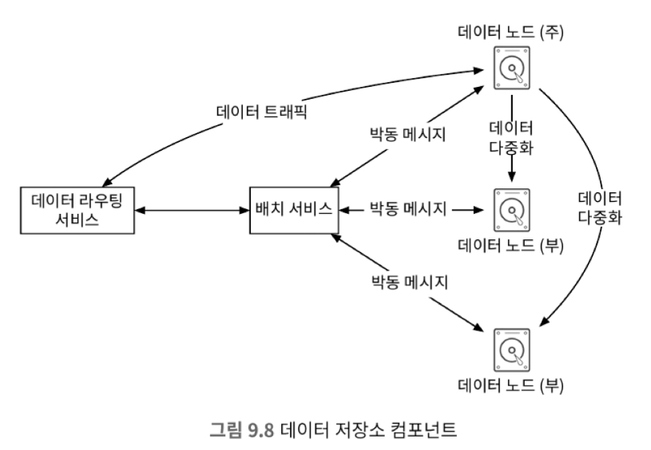
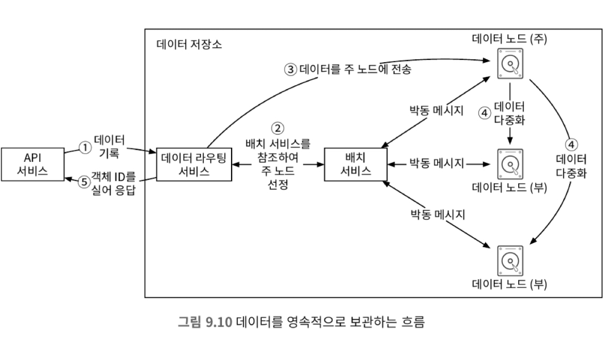
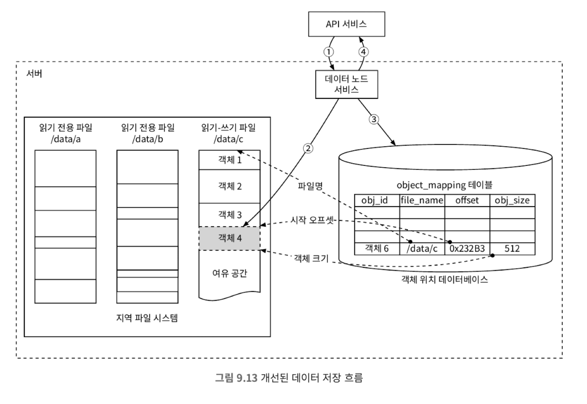
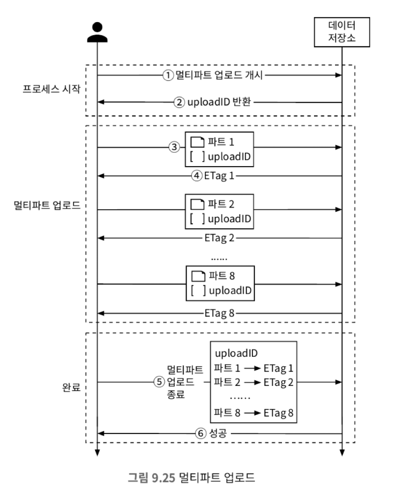

# 9장 S3와 유사한 객체 저장소

## 저장소 시스템 101

* 저장소 시스템은 세 가지 부류가 있다.
  * 블록 저장소
    * 블록 저장소는 원시 블록을 서버에 볼륨 형태로 제공한다.
    * 블록 저장소는 물리적으로 직접연결될 수 있고, 네트워크를 통해서 연결될 수 있다.
  * 파일 저장소
    * 파일 저장소는 블록 저장소 위에 구현된다.
    * 파일과 디렉터리를 손쉽게 다루는데 필요한, 더 높은 수준의 추상화를 제공한다.
    * SMB/CIFS나 NFS 같은 파일 수준 네트워크 프로토콜을 사용하면 여러 클라이언트가 파일 저장소에 접근할 수 있다.
  * 객체 저장소
    * 데이터 영속성을 높이고 대규모 애플리케이션을 지원하며 비용을 낮추기 위해 성능을 희생했다.
    * 데이터 아카이브나 백업에 주로 쓰인다.

## 1단계: 문제 이해 및 설계 범위 확정

* 비기능 요구사항
  * 100PB 데이터
  * 식스 나인(99.9999%)의 내구성
  * 포 나인(99.99%)의 가용성
  * 저장소 효율성: 높은 수준의 안정성과 성능은 보장하며 비용은 낮춰야함
* 규모 추정
  * 디스크 용량
    * 1MB 객체 : 20%
    * 1-64MB 객체: 60%
    * 64MB 이상 객체: 20%
  * IOPS
    * 초당 100-150회의 임의 데이터 탐색을 지원
  * 저장된 객체의 수는 다음과 같이 추정할 수 있음
    * 0.5MB, 32MB, 200MB로 구성되어 있을 때 6억 8천만개 객체가 저장될 수 있음

## 2단계: 개략적 설계안 제시 및 동의 구하기

* 객체 불변성
  * 객체 저장소에 저장된 객체들은 변경이 불가능하다.
* 키-값 저장소
  * 객체 저장소는 URI-객체 쌍을 저장하는 키-값 저장소로 구현된다.
* 객체 저장소는 쓰기보다 읽기가 많은 환경이다.
* 객체 저장소는 UNIX 파일시스템에서의 I-node와 같은 역할을 하는 메타데이터를 저장한다.

### 객체 다운로드

* 버킷은 디렉터리 같은 계층 구조를 지원하지 않는다.
* 이를 객체이름에 경로를 포함하여 가상 디렉터리를 구현할 수 있다.

## 3단계: 상세 설계

### 데이터 저장소의 개략적 설계

#### 데이터 라우팅 서비스

* 데이터 라우팅 서비스는 데이터 노드 클러스터에 접근하기 위한 서비스를 제공한다.
* 확장성을 위해 무상태 서비스로 운영된다.
* 데이터 라우팅 서비스는 다음과 같은 역할을 한다.
  * 배치 서비스를 호출하여 데이터를 저장할 최적의 데이터 노드를 판단.
  * 데이터 노드에서 데이터를 읽어 API 서비스에 반환
  * 데이터 노드에 데이터 기록

#### 배치 서비스

* 배치 서비스는 어느 데이터 노드에 데이터를 저장할지 결정하는 역할을 담당한다.
* 데이터 노드는 주 데이터 노드와 부 데이터 노드로 구성되며 노드 클러스터에 대한 정보들을 배치 서비스가 가지고 있다.
* 배치 서비스는 데이터의 사본이 서로 다른 물리적인 위치에 저장되도록 한다. 이는 높은 데이터 내구성을 달성하는 핵심 요소다.
* 배치 서비스는 모든 데이터 노드와 하트 비트를 통해 상태를 모니터링한다.
* 배치 서비스는 가용성과 내구성이 아주 중요하기 때문에 5~7개의 노드로 구성된 클러스터를 구축해야하며, 팩서스나 래프트같은 합의 프로토콜을 사용해 구축해야 한다.
* 느낌상 주키퍼와 비슷한 역할을 함

#### 데이터 노드

* 데이터 노드는 실제 객체 데이터가 보관되는 곳이다.
* 데이터 노드는 여러 데이터 노드에 복제하며 이를 다중화 그룹이라고 한다.
* 데이터 노드는 배치 서비스와 하트 비트를 통해 메시지를 주고 받는데 주고 받는 메시지는 다음과 같다.
  * 해당 데이터 노드에 부착된 디스크 드라이브의 수
  * 각 드라이브에 저장된 데이터의 양
* 데이터 노드가 새로 추가되면 배치 서비스는 해당 노드에 ID를 부여하고 가상 클러스터 지도에 추가한다. 마지막으로 다음과 같은 정보를 반환한다.
  * 해당 데이터 노드에 부여된 고유 식별자
  * 가상 클러스터 지도
  * 데이터 사본을 보관할 위치

### 데이터 저장 흐름

* 데이터를 저장하는 과정에서 데이터 라우팅 서비스는 저장할 객체에 대해서 UUID를 부여하고 배치 서비스에 해당 객체를
저장할 데이터 노드를 질의한다. 질의 결과로 나오는 데이터 노드에 직접 저장하며 복제가 완료될 경우 응답이 반환된다.
* 배치 서비스에서 데이터 노드 질의 요청에 대해 다중화 그룹을 검색할 때 안정 해시를 이용해서 검색을 진행한다.
* 다중화 그룹에 속한 모든 데이터 노드에 객체를 저장할 때 모든 복제가 완료될 때 반환할지, 주 데이터 노드에만 저장될 떄 반환할지 결정할 수 있다. 이때 후자의 경우
결과적 일관성의 형태를 가진다.

### 데이터는 어떻게 저장되는가

* 객체 저장소는 효율성의 문제로 개별 파일로 저장, 아이노드를 이용한 저장 방식을 사용하지 않는다. 그 대신 WAL(write-ahead log)를 통해
데이터를 저장한다.
* 우선 쓰기-읽기 파일을 만들며 객체를 지속적으로 추가하며 데이터를 저장한다. 이때 파일의 크기가 일정 크기 이상으로 커지면 읽기 전용으로 만들며 새로운 쓰기-읽기 파일을 만든다.
* 추가로 쓰기-읽기 파일에 데이터를 순차적으로 추가해야하기에 동시성, 대역폭 보장을 위해 CPU 스레드별로 파일을 만들어 데이터를 저장한다.

### 객체 소재 확인

* 객체 저장소에 저장된 객체를 UUID를 통해 어떻게 찾을 수 있을까?
* 객체에 대한 정보는 다음과 같다.
  * 객체가 보관된 데이터 파일
  * 데이터 파일 내 객체 오프셋
  * 객체 크기
* 객체는 데이터 저장방식의 특징으로 추가되기면 하며 삭제되지 않는다. 따라서 관계형 데이터베이스를 통해 객체에 대한 정보를 저장하고 관리한다.
* 추가로 데이터 노드간 객체 정보를 공유할 필요가 없기에 각 데이터 노드에 데이터베이스를 별도로 구축한다.

### 개선된 데이터 저장 흐름

### 데이터 내구성

#### 하드웨어 장애와 

* 데이터들은 여러 가용성 구역을 거쳐 저장되도록하여 데이터 내구성을 높인다.

#### 소거 코드

* 소거 코드는 데이터를 작은 단위로 나눠 여러 서버에 저장하며, 일부 데이터 소실이 발생했을 때 복구하기 위한 패리티를 저장하여 데이터 내구성을 높인다.
* 소거 코드를 사용하면 여러 서버로부터 데이터를 가져와 합쳐야 하기 떄문에 응답 지연시간이 늘어나는 단점이 있다.

#### 정확성 검증

* 저장된 객체는 데이터 저장소뿐만 아닌 메모리에서도 망가질 수 있기에 검증이 필요하다.
* 검증은 데이터를 체크섬을 계산하고 함께 저장한 다음에 데이터를 가져올 때마다 체크섬을 다시 계산하여 데이터의 정확성을 검증한다.

### 큰 파일의 업로드 성능 최적화

* 큰 파일을 업로드할 때는 큰 객체를 작은 객체로 나눠 업로드하는 멀티파트 업로드 방식을 사용해야 한다.

### 쓰레기 수집

* 쓰레기 수집은 더 이상 사용되지 않는 데이터에 할당된 저장 공간을 자동으로 회수하는 절차다.
* 다음과 같은 경우 쓰레기 데이터가 생길 수 있다.
  * 객체의 지연된 삭제
  * 갈 곳 없는 데이터
  * 훼손된 데이터
* 데이터 저장소는 주기적으로 쓰레기 데이터를 수집하여(compaction) 저장 공간을 회수한다.