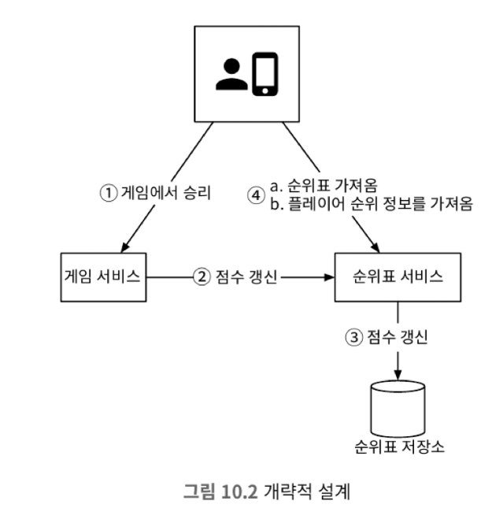

# 10장 실시간 게임 순위표

## 1단계: 문제 이해 및 설계 범위 확정

* 기능 요구사항
  * 순위표에 상위 10명의 플레이어를 표시한다.
  * 특정 사용자의 순이를 표시한다.
  * 어떤 사용자보다 4순위 위와 아래에 있는 사용자를 표시한다.
* 비기능 요구사항
  * 점수 업데이트는 실시간으로 순위표에 반영한다.
  * 일반적인 확장성, 가용성 및 안전성 요구사항
* 개략적 규모 추정
  * QPS: 500만/10^5 = ~50
    * 게임의 경우 사용량이 균등하지 않고 저녁시간에 피크 시간대이기에 예상치의 5배인 250Q/s로 생각해야한다.
  * 사용자 점수 획득 QPS: 사용자 평균 10판의 게임을 진행한다하면, 50*10*5 = 2500로 예상할 수 있다.

## 2단계: 개략적 설계안 제시 및 동의 구하기

### 개략적 설계안

1. 사용자가 게임에서 승리하면 클라이언트는 게임 서비스에 요청을 보낸다.
2. 게임 서비스는 해당 승리가 정당하고 유효한 것인지 확인한 다음 순위표 서비스에 점수 갱신 요청을 보낸다.
3. 순위표 서비스는 순위표 저장소에 기록된 해당 사용자의 점수를 갱신한다.
4. 해당 사용자의 클라이언트는 순위표 서비스에 직접 요청하여 다음과 같은 데이터를 가져온다.
   a. 상위 10명 순위표
   b. 해당 사용자의 순위

#### 클라이언트가 순위표 서비스와 직접 통신해야 하나?

* 위 설계의 대안 중 하나로 클라이언트가 점수를 정하는 방식이 있다.
* 해당 방식은 사용자가 프록시를 통해 점수를 임의로 바꿀 수 있기 때문에 안전하지 않다. 따라서 서버가 점수를 설정해야한다.

#### 게임 서비스와 순위표 서버 사이에 메시지 큐가 필요한가?

* 게임 점수가 다른 곳에서도 사용된다면 카프카와 같은 메시지 큐를 도입하는 것이 좋겠지만, 현 설계에서는 게임 점수를 다른 서비스에서 사용한다는 요구사항이 없기 때문에 포함시킬 필요가 없다.

### 데이터 모델

#### 관계형 데이터베이스

* 규모 확장성이 중요하지 않고 사용자가 많지 않다면 RDB를 도입할 수 있다.
* 테이블 설계에서 사용자 id와 점수를 가지는 테이블을 만들고, 해당 테이블을 순위표로 관리하면 된다. 즉, 데이터를 조회할 때 점수를 기준으로 정렬하면 된다.
* 데이터를 삽입/수정할 때는 upsert를 사용하면 된다.
* RDB를 사용할 떄 데이터가 많아지게 되면, 성능이 안좋아질 수 있다.
  * 데이터를 정렬하는 과정이 길어져 수십초가 걸리게 된다면, 실시간성이 떨어지게 된다.

#### 레디스

* 레디스의 sorted set을 통해서 순위표 시스템을 구현할 수 있다.
* 레디스의 sorted set은 해시 테이블과 스킵 리스트를 사용한다.
  * 스킵 리스트는 빠른 검색을 가능하게하는 자료 구조다
  * 스킵 리스트 내부에는 섹인을 도입하여 검색시 log 시간안에 처리할 수 있게 해준다.
> http://redisgate.kr/redis/configuration/internal_skiplist.php

#### 저장소 요구사항

* 순위표 하나에 24자 문자열에(24byte) 순위 정보(2바이트)로 총 26바이트를 사용한다. 이때 2500만명이 모두 사용한다면, 약 650MB의 저장용량이 필요하다. 또한 sorted set에서의 오버헤드를 감안하더라도 1대의
레디스 서버로 충분할 수 있다. 하지만 레디스는 메모리기반 데이터베이스이기 때문에 영속성에 있어서 문제가 있을 수 있다. 이를 replica를 이용해서 방지하거나, RDB를 같이 도입하여 데이터를 더 안전하게 영속화할 수 있다.

## 3단계: 상세 설계

### 레디스 규모 확장

* 만약 5백만 DAU에서 5억 DAU를 처리해아 한다면 65GB의 메모리 공간이 필요하게 되며 이를 한대의 레디스 서버로 처리하기는 버거울 수 있다.

#### 데이터 사딩 방안

* 고정 파티션
  * 순위 범위를 서버의 갯수 단위로 나누고, 각 서버가 가지는 순위 범위를 관리한다.
  * 이 방법은 순위표 전반이 고르게 분포되어야지만 제대로 작동할 수 있다.
  * 이 방법을 사용하려면 사용자의 데이터가 어느 서버에 위치한지 알아야하며, 순위가 변경된 경우 데이터를 삭제하고 다른 서버에 추가해야한다.
* 해시 파티션(레디스의 해시 슬롯)
  * 해당 방식을 사용하면 데이터를 고르게 분배할 수 있으며, 사용자가 어느 서버에 위치한지 알필요가 없다.
  * 해당 방식을 사용하려면 분산-수집(scatter-gather) 접근법을 사용해야 한다. 즉, 상위 10명을 가져오기 위해서는 모든 서버에 상위 10명 사용자를 질의하고 다시 정렬해야한다.

### 대안: NoSQL

* 위 설계에서 NoSQL을 사용하여 설계할 수 있다.
* 이번 장에서의 시스템에서 다음과 같은 특징을 가진 데이터베이스를 사용하면 좋을 것 이다.
  * 쓰기 연산에 최적화되어 있다.
  * 같은 파티션 내의 항목을 점수에 따라 효율적으로 정렬 가능하다.
