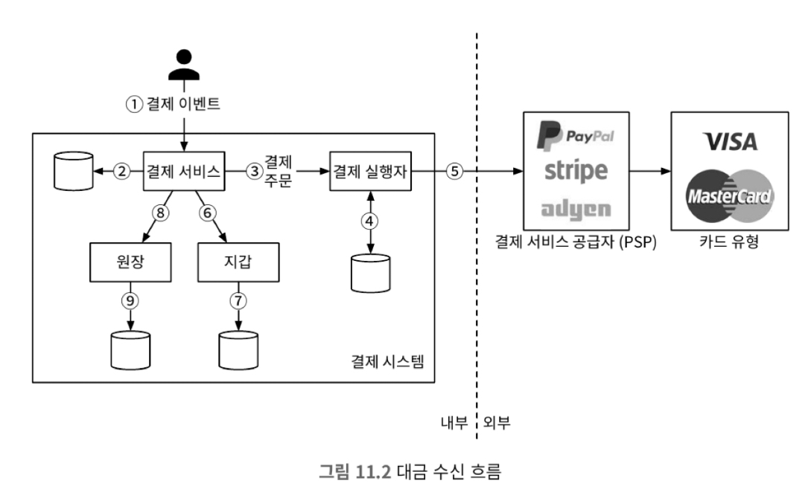
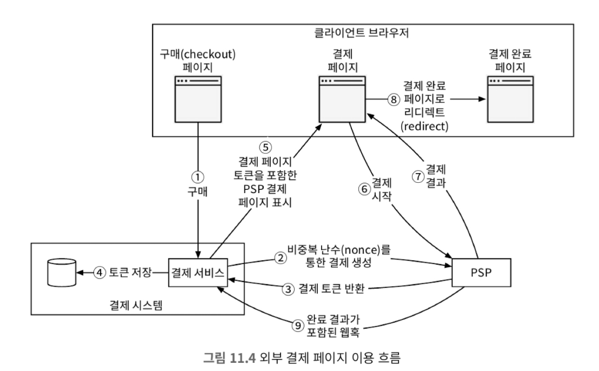
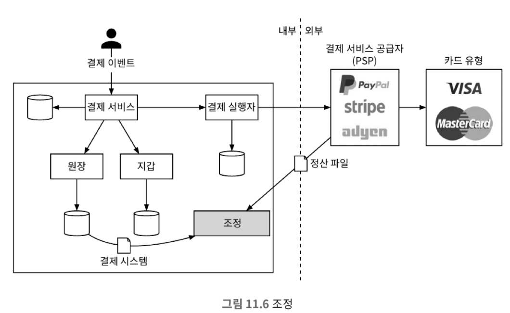

# 11장 결제 시스템

## 1단계: 문제 이해 및 설계 범위 확정

* 기능 요구사항
  * 대금 수신: 결제 시스템이 판매자를 대신하여 고객으로부터 대금을 수령한다.
  * 대금 정산: 결제 시스템이 전 세계의 판매자에게 제품 판매 대금을 송금한다.
* 비기능 요구사항
  * 신뢰성 및 내결함성: 결제 실패는 신중하게 처리해야 한다.
  * 내부 서비스와 외부 서비스 간의 조정 프로세스: 시스템 간의 결제 정보가 일치하는지 비동기적으로 확인한다.
* 개략적인 규모 추정
  * 초당 10건의 트랜잭션이 발생함

## 2단계: 개략적 설계안 제시 및 동의 구하기

### 대금 수신 흐름

#### 결제 서비스

* 결제 서비스는 사용자로부터 결제 이벤트를 수락하고 결제 프로세스를 조율한다.

* 결제 실행자
  * 결제 실행자는 결제 서비스 공급자를 통해 결제 주문 하나를 생성한다.
  * 하나의 결제 이벤트에는 여러 결제 주문이 포함될 수 있다.
* 결제 서비스 공급자
  * 결제 서비스 공급자, 즉 PSP는 계정간 돈을 옮기는 작업을 진행한다.
* 카드 유형
* 원장
  * 원장은 결제 트랜잭션에 대한 금융 기록이다.
* 지갑
  * 지갑에는 판매자의 계정 잔액을 기록한다.

### 결제 서비스 데이터 모델

* 결제 서비스에는 결제 이벤트와 결제 주문 두 개 테이블이 필요하다.
* 일반적으로 안정성이 중요하기 때문에 RDB를 많이 사용한다.

### 복식부기 원장 시스템

* 원장 시스템에는 복식부기라는 아주 중요한 설계 원칙이 있다.
* 복식부기는 모든 거래에 대해 두 개의 대변 항목과 차변 항목을 기록하는 것이다.

### 대금 정산 흐름

* 대금 정산 흐름의 구성 요소는 대금 수신 흐름과 아주 유사하다.

## 3단계: 상세 설계

### PSP 연

1. 사용자가 클라이언트를 통해 결제를 시도한다.
2. 결제 주문 정보를 수신한 결제 서비스는 결제 등록 요청을 PSP로 전송한다.
3. PSP는 결제 서비스에 토큰을 반환한다. 토큰은 등록된 결제 요청을 유일하게 식별하는, PSP가 발급한 UUID다.
4. 결제 서비스는 PSP가 제공하는 외부 결제 페이지를 호출하기 전에 토큰을 데이터베이스에 저장한다.
5. 토큰을 저장하면 클라이언트는 PSP가 제공하는 외부 결제 페이지를 표시한다.
6. 사용자는 신용 카드 번호, 소유자 이름, 카드 유효기간 등의 결제 세부 정보를 PSP의 웹 페이지에 입력후 결제 시도한다.
7. PSP가 결제 상태를 반환한다.

### 조정

* 결제 서비스 단계에서 실패하게 되면 정확성을 보장하기 위해 어떻게 해야할까?

* 매일 밤 PSP나 은행은 고객에게 정산 파일을 보낸다. 이 파일 내부에는 하루 동안 해당 계좌에서 발생한 모든 거래 내역이 기재되어 있다. 이를통해 정합성을 검증할 수 있다.

### 결제 지연 처리

* 결제의 검토로 인해 결제가 지연될 수 있다.
* 결제가 지연되는 경우 PSP는 결제 상태를 대기(pending) 상태로 설정하고 클라이언트에게 해당 사실을 알린다.
  * 결제가 완료되면 기존에 등록된 훅을 통해 결제 서비스에 결제 이벤트를 전달한다.

### 내부 서비스 간 커뮤니케이션

* 내부 서비스 통신에는 동기식과 비동기식 두 가지 패턴이 있다.

#### 동기식 통신

* 소규모 시스템에서는 잘 작동하지만 규모가 커지면 단점이 있다.
* 단점
  * 성능 저하: 요청 처리에 관계된 서비스 가운데 하나에 발생한 성능 문제가 전체 시스템의 성능에 영향을 끼친다.
  * 장애 격리 곤란: PSP 등의 서비스에 장애가 발생하면 클라이언트는 더 이상 응답을 받지 못한다.
  * 높은 결합도: 요청 발신자는 수신자를 알아야만 한다.
  * 낮은 확장성: 큐를 버퍼로 사용하지 않고서는 갑작스러운 트래픽 증가에 대응할 수 있도록 시스템을 확장하기 어렵다.

#### 비동기 통신

* 비동기 통신은 크게 두 가지 범주로 나눌 수 있다.
  * 단일 수신자
    * 각 요청이 하나의 수신자에게 전달된다.(카프카 사용할 때)
  * 다중 수신자
    * 각 요청이 여러 수신자에게 전달된다.(팬아웃 팬인 패턴)
    * 결제 서비스에서 다양한 서비스로 메시지를 전달할 때 사용한다.

### 결제 실패 처리

#### 결제 상태 추적

* 결제 주기의 모든 단계에서 결제 상태를 정확하게 유지하는 것은 매우 중요하다.

#### 재시도 큐 및 실패 메시지 큐

* 실패를 우아하게 처리하기 위해서는 재시도 큐와 실패 메시지 큐를 두는 것이 바람직하다.
* 재시도 큐 : 일시적인 문제를 재시도하기 위한 큐
* 실패 메시지 큐: 반복적으로 처리에 실패한 메시지는 결국에는 실패 메시지 큐로 보낸다.

### 정확히 한 번 전달

* 결제 시스템에 발생 가능한 가장 심각한 문제는 중복 결제가 발생하는 것이다.

#### 재시도

* 재시도 매커니즘을 도입할 때는 얼마나 간격을 두고 재시도할지 정하는 것이 중요하다.
* 재시도 전략은 다음과 같다.
  * 즉시 재시도: 클라이언트는 즉시 요청을 다시 보낸다.
  * 고정 간격: 일정 시간을 기다린다.
  * 증분 간격: 재시도 전에 기다리는 시간을 특정한 양 만큼 점진적으로 늘려간다.
  * 지수적 백오프: 재시도 간격을 지수적으로 늘린다.
  * 취소: 결제 서비스가 결제를 취소한다.
* 일반적으로 지수적 백오프를 많이 사용한다.
* 이중 결제 시나리오는 다음과 같다.
  1. 결제 시스템이 외부 결제 페이지를 통해 PSP와 연동하는 환경에서 클라이언트가 결제 버튼을 두 번 중복 클릭한다.
  2. PSP가 결제를 성공적으로 하였으나 네트워크 오류로 인해 응답이 결제 시스템에 도달하지 못했다.

#### 멱등성

* 멱등성은 동일한 요청을 여러 번 수행하더라도 결과가 동일하게 나오는 것을 말한다.
* 멱등키를 일반적으로 고유한 키로 생성하며 일정 시간이 지나면 만료되도록 설계한다.
* 앞선 문제의 시나리오를 멱등키를 통해 해결해보자
  1. 결제 요청 시 멱등키를 함께 전송한다. 그 후 서버에서는 동일한 요청이 들어오면 하나의 요청만 처리하고, 나머지 요청은 이전 요청의 결과를 반환한다.
  2. PSP에서 전달받은 키는 멱등키이기 때문에 사용자가 여러 요청을 보내더라도 한 번만 처리된다.

### 일관성

* 분산 환경에서는 서비스 간 통신 실패로 데이터 불일치가 발생할 수 있다.
* 내부 서비스 간에 데이터 일관성을 유지하기 위해 요청이 정확히 한 번 처리되야 한다.
* 데이터를 다중화하여 복제 지연이 발생하는 경우 불일치가 발생할 수 있다. 이를 두 가지 방법을 통해 해결할 수 있다.
  1. 주 데이터베이스에서만 읽기, 쓰기 연산을 처리한다. 하지만 규모 확장성이 떨어질 수 있다.
  2. 모든 사본이 항상 동기화되도록 한다. 팩서스, Raft 알고리즘을 사용하거나 CockroachDB와 같은 합의 기반 분산 데이터베이스를 사용한다.