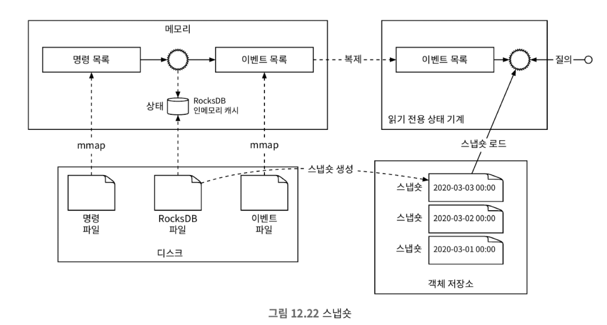

# 12장 전자 지갑

## 1단계: 문제 이해 및 설계 범위 확정

* 기능 요구사항
  * 전자 지갑 간 이체
  * 1,000,000TPS
  * 99.99% 안전성
  * 트랜잭션
  * 재현성

## 2단계: 개략적 설계안 제시 및 동의 구하기

### 인메모리 샤딩

* 지갑 애플리케이션은 모든 사용자의 잔액을 유지한다. 이때 <userId, 잔액>으로 구성된 키-값 저장소를 사용할 수 있다.
* 레디스를 사용할 수 있겠지만 단일 인스턴스로 1,000,00TPS를 감당하기 어렵다. 따라서 샤딩을 통해 고르게 분배해야한다.
* 레디스를 샤딩을 통해 여러 인스턴스로 분산시킬 경우 사용자의 이체 요청에 대해 두 인스턴스의 값을 변경해야한다. 이러한 상황에서 일관성을 유지해야하는 문제가 있다.

### 분산 트랜잭션

#### 분산 트랜잭션: 2단계 커밋

* 2단계 커밋은 분산 트랜잭션을 위한 기본적인 방법이다.
* 2단계 커밋은 다음과 같은 순서로 진행된다.
  * coordinator는 subordinator에 prepare 요청을 보낸다.
  * subordinator 는 준비가 완료되면 coordinator에게 yes또는 no를 보낸다.
  * coordinator는 모든 subordinator로부터 yes를 받으면 commit을 요청한다.
  * subordinator는 commit을 수행한다.
* 2PC는 SPOF 문제가 생길 수 있다. 또한 트랜잭션을 오래 점유하기에 성능이 좋지 못하다.

#### 분산 트랜잭션: TC/C

* TC/C(시도-확정/취소, Try-Confirm/Cancel)는 두 단계로 구성된 보상 트랜잭션이다.
  1. coordinator는 subordinator에게 시도 요청을 보낸다.
  2. coordinator는 모든 데이터베이스로부터 회신을 얻는다.
     a. 모든 데이터베이스가 성공적으로 시도를 완료하면 coordinator는 확정을 요청한다.
     b. 하나라도 실패하면 coordinator는 취소를 요청한다.
* TC/C도 마찬가지로 지갑 서비스가 다시 시작되면 복구하기 어렵다는 문제가 있다.
* 이럴때는 각 단계의 상태를 데이터베이스에 저장하면 된다.
* 상태 정보는 다음과 같다.
  * 분산 트랜잭션 ID와 내용
  * 각 데이터베이스에 대한 시도 단계의 상태, not sent yet, has been sent, response received 중 하나다
  * 두 번쨰 단계의 이름, Confirm, Cancel 둘 중 하나다.
  * 순서가 어긋남을 나타내는 플래스

#### 불균형 상태

* 분산 트랜잭션은 실행 도중에는 항상 데이터 불일치가 발생한다.
* 데이터베이스와 같이 하위 시스템에서 불일치를 수정하는 경우에는 알 필요가 없지만, 그렇지 않다면 직접 수정해줘야 한다.

#### 잘못된 순서로 실행된 경우

* TC/C에 있어 첫 번쨰 단계의 요청이 두 번째 단계(취소 상태)일 떄 도착할 수 있다. 이럴때는 다음과 같이 처리한다.
  * 취소 명령이 먼저 도착하면 데이터베이스에 아직 상응하는 시도 명령을 못보앗음을 나타내는 플래그를 참으로 설정하여 저장
  * 시도 명령이 도착하면 항상 먼저 도착한 취소 명령이 있는지 확인. 있으면 바로 실패 반환

### 분산 트랜잭션: 사가

* 선형적 명령 수행
  * 사가는 MSA에서 사용하는 분산 트랜잭션 솔루션이다.
    1. 모든 연산은 순서대로 정렬된다. 각 연산은 데이터베이스에 독립 트랜잭션으로 실행된다.
    2. 연산은 첫 번째부터 마지막까지 순서대로 실행된다. 한 연산이 완료되면 다음 연산이 개시된다.
    3. 연산이 실패하면 전체 프로세스는 실패한 연산부터 맨 처음 연산까지 역순으로 보상 트랜잭션을 통해 롤백된다.
  * 연산 실행 순서는 다음과 같은 방법으로 조율한다.
    * 분산 조율 : MSA에서 사가 분산 트랜잭션에 관련된 모든 서비스가 다른 서비스의 이벤트를 구독하여 작업을 수행, 탈중앙화된 조율 방식
    * 중앙 집중형 조율 : 하나의 조정자가 모든 서비스가 올바른 순서로 작업을 실행하도록 조율

### 이벤트 소싱

* 이벤트 소싱에는 네 가지 중요한 용어가 있다.
  1. 명령(command)
  2. 이벤트(event)
  3. 상태(state)
  4. 상태 기계(state machine)
* 명령
  * 명령은 외부에서 전달된 의도가 명확한 요청이다.
  * 이벤트 소싱에서 순서는 아주 중요하다. 일반적으로 FIFO 큐에 저장된다.
* 이벤트
  * 명령은 의도가 명확하지만 사실을 아니기 떄문에 유효하지 않을 수 있다. 이는 실행할 수 없다.
  * 작업 이행 전 명령의 유효성을 검사해야한다. 검사를 통과한 명령은 반드시 이행되어야 한다. 이 이행의 결과를 이벤트라 한다.
  * 이벤트 생성 프로세스에는 두 가지 중요한 특성이 있다.
    1. 하나의 명령으로 여러 이벤트가 발생할 수 있음
    2. 이벤트 생성 과정에서 무작위성이 개입될 수 있어, 같은 명령에 항상 동일한 이벤트들이 만들어진다는 보장이 없다.
* 상태
  * 상태는 이벤트가 적용될 때 변경되는 내용이다.
* 상태 기계
  * 상태 기계는 이벤트 소싱 프로세스를 구동한다.
  * 크게 두 가지 기능이 있다.
    1. 명령의 유효성을 검사하고 이벤트를 생성한다.
    2. 이벤트를 적용하여 상태를 갱신한다.
  * 상태 기계는 결정론적으로 동작해야 한다. 즉, 이벤트 상태에 반영하는 것은 항상 같은 결과를 보장해야 한다.

### 재현성

* 이벤트 소싱이 가지는 중요한 장점은 재현성이다.
* 이벤트는 불변성을 가지기 때문에 이벤트를 다시 실행함으로써 원하는 시점의 시스템 상태를 얻을 수 있다.

## 3단계: 상세 설계

### 고성능 이벤트 소싱

#### 파일 기반의 명령 및 이벤트 목록

* 외부 저장소가 아닌 로컬 디스크에 명령과 이벤트를 저장하는 방식을 통해 성능을 최적화할 수 있다.
* mmap 기술은 로컬 디스크에 쓰는 동시에 최근 데이터를 메모리에 자동으로 캐시할 수 있다.

#### 파일 기반 상태

* 상태 정보 또한 외부 저장소가 아닌 로컬 디스크에 저장하는 방식으로 성능 최적화할 수 있다. 이는 SQLite, RocksDB를 통해 구현할 수 있다.

#### 스냅숏

* 스냅숏은 과거 특정 시점의 상태로, 변경이 불가능하다.
* 스냅숏을 저장하고 나면 상태 기계는 더 이상 최초 이벤트에서 시작할 필요가 없다.
* 스냅숏은 거대한 이진 파일이며, 일반적으로는 HDFS(하둡 분산 파일 시스템)에 저장한다.

모든 것이 파일 기반일 떄 시스템은 컴퓨터 하드웨어 I/O 처리량을 한계까지 최대로 활용할 수 있다.

### 신뢰할 수 있는 고성능 이벤트 소싱

#### 신뢰성 분석

* 명령의 검증 결과인 이벤트의 신뢰성을 보장함으로써 시스템의 안정성을 확보할 수 있다.

#### 합의

* 높은 안정성을 위해 이벤트 목록을 여러 노드에 복제해야 한다.
* 복제 과정은 다음을 보장해야 한다.
  * 데이터 손실 없음
  * 로그 파일 내 데이터의 상대적 순서는 모든 노드에 동일
* 위 목표를 달성하기 위해 합의 기반 복제 방안을 선택할 수 있다. 
* 래프트 알고리즘을 사용하면 노드의 절반 이상이 온라인 상태면 모두 보관된 추가 전용 리스트는 같은 데이터를 가진다.
* 래프트 알고리즘에서 노드는 세 가지 역할을 가진다.
  1. 리더
  2. 후보
  3. 팔로어
* 래프트 알고리즘에서는 최대 하나의 노드만 클러스터의 리더가 되고 나머지 노드는 팔로어가 된다.

### 분산 이벤트 소싱

#### 풀 vs 푸시

* 풀 모델에서는 외부 사용자가 읽기 전용 상태 기계에서 주기적으로 실행 상태를 읽는다.
* 해당 모델은 실시간이 아니며, 읽는 주기를 너무 짧게 설정하면 지갑 서비스에 과부하가 걸릴 수 있다.
* 리버스 프록시를 사용하면 풀 모델을 푸시 모델로 변환할 수 있으며, 클라이언트는 서버로 주기적으로 요청을 보낼필요가 없다.

#### 분산 트랜잭션

* 모든 이벤트 소싱 노드 그룹이 동기적 실행 모델을 채택하면 TC/C, 분산 트랜잭션 솔루션을 사용할 수 있다.

