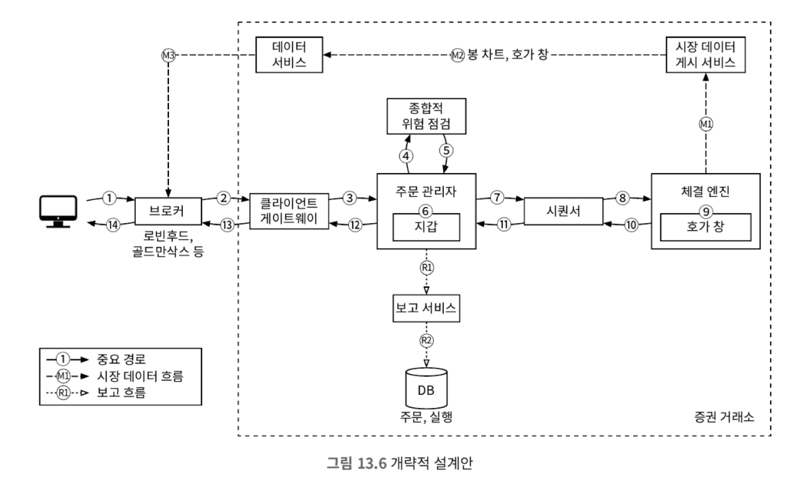
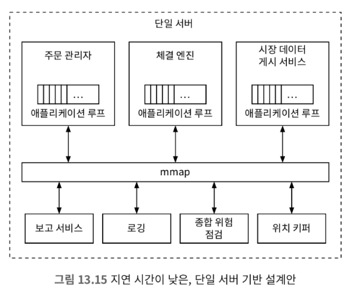
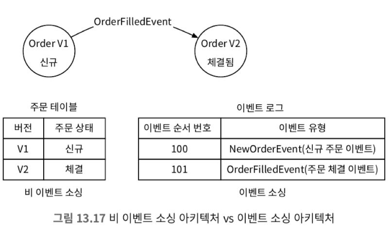

# 13장 증권 거래소

## 1단계: 문제 이해 및 설계 범위 확정

* 비기능 요구사항
  * 가용성 : 최소 99.99%, 거래소의 가용성은 매우 중요하다.
  * 결함 내성: 프로덕션 장애의 파급을 줄이기 위해 결함 내성과 빠른 복구 매커니즘이 필요함
  * 지연 시간: 왕복 지연 시간은 밀리초 수준이어야 하며, 특히 p99(99백분위) 지연 시간이 중요함
  * 보안: 거래소는 계정 관리 시스템을 갖춰야 한다.
* 개략적 규모 추정
  * 100가지 주식
  * 하루 10억 건의 주문
  * 뉴욕증권거래소는 월요일부터 금요일까지, 오전 9시 30분부터 오후 4시까지 영업한다.
  * QPS: 10억/(6.5시간 * 3600) = ~43000
  * 최대 QPS: 5 * QPS = 215000

## 2단계: 개략적 설계안 제시 및 동의 구하기

### 증권 거래 101

#### 브로커

* 대부분의 사용자는 브로커 시스템을 통해 거래소와 거래한다.
* 브로커 시스템은 개인 사용자가 증권을 거래하고 시장 데이터를 확인할 수 있도록 편리한 사용자 인터페이스를 제공한다.

#### 기관 고객

* 기관 고객은 전문 증권 거래 소프트웨어를 사용하여 대량으로 거래한다.
* 아주 낮은 응답 시간으로 거래하길 원한다.

#### 지정가 주문

* 지정가 주문은 가격이 고정된 매수 또는 매도 주문이다.
* 시장가 주문과 달리 체결이 즉시 발생하지 않을 수 있다.

#### 시장가 주문

* 시장가 주문은 가격을 지정하지 않는 주문으로, 시장가로 즉시 체결된다.

#### 시장 데이터 수준

#### 봉차트

* 봉 차트는 특정 기간 동안의 주가다.
* 1분, 5분, 1시간, 1일, 1주일, 1개원 단위로 지원한다.

#### FIX

* FIX는 금융 정보 교환 프로토콜이다.
* 증권 거래 정보 교환을 위한 기업 중립적 통신 프로토콜이다.

### 개략적 설계안

* 거래 처리 흐름은 다음과 같다.
  1. 고객이 브로커의 웹 또는 모바일 앱을 통해 주문한다.(1)
  2. 브로커가 주문을 거래소에 전송한다.(2)
  3. 주문이 클라이언트 게이트웨이를 통해 거래소로 들어간다.(3)
  4. 주문 관리자가 위험 관리자가 설정한 규칙에 따라 위험성 점검을 진행(4-5)
  6. 위험성 점검 과정을 통과한 주문에 대해, 주문 관리자는 지갑에 주문처리 자금이 충분한지 확인(6)
  7. 주문이 체결 엔진으로 전송됨. 체결 가능 주문이 발견되면 체결 엔진은 매수 측과 매도 측에 각각 하나씩 두 개의 집행 기록을 생성한다. 이를 시퀀서를 통해 정렬을 진행한다.(7-9)
  10. 주문 집행 사실을 클라이언트로 전송한다.(10-14)
* 시장 데이터 흐름은 다음과 같다.
  1. 체결 엔진은 주문이 체결되면 집행 기록 스트림을 만든다. 이 스트림은 시장 데이터 게시 서비스로 전송된다.
  2. 시장 데이터 게시 서비스는 집행 기록 및 주문 스트림에서 얻은 데이터를 시장 데이터로 사용해 봉 차트와 호가 창을 구성한다. 그런 다음 시장 데이터를 데이터 서비스로 보낸다.
  3. 시장 데이터는 실시간 분석 전용 스토리지에 저장된다. 브로커는 데이터 서비스를 통해 실시간 시장 데이터를 읽는다.
* 보고 흐름은 다음과 같다.
  * 보고 서비스는 주문 실행 기록에서 보고에 필요한 모든 필드의 값을 모은 다음 그 값을 종합해 만든 레코드를 데이터베이스에 기록한다.

### 거래 흐름

#### 체결 엔진

* 체결 엔진은 교차 엔진이라고도 하낟.
* 체결 엔진의 역할은 다음과 같다.
  * 각 주식 심벌에 대한 주문서 내지 호가 창을 유지 관리한다.
  * 매수 주문과 매도 주문을 연결한다. 이는 빠르게 처리된다.
  * 집행 기록 스트림을 시장 데이터로 배포한다.
* 가용성 높은 체결 엔진 구현체가 만드는 체결 순서는 결정론적이어야 한다.

#### 시퀀서

* 시퀀서는 체결 엔진을 결정론적으로 만드는 핵심 구성 요소다.
* 시퀀서는 체결 엔진에 주문을 전달하기 전에 순서 ID를 붙여 보낸다.
* 시퀀서는 입력 시퀀서와 출력 시퀀서 두 가지가 있다.
* 입력되는 주문과 출력하는 실행 명령에 순서 ID를 찍는 이유는 다음과 같다.
  * 시의성 및 공정성
  * 빠른 복구 및 재생
  * 정확한 1회 실행 보증

#### 주문 관리자

* 주문 관리자는 한쪽에서는 주문을 받고 다른 쪽에서는 집행 기록을 받는다.
* 주문 관리자는 클라이언트 게이트웨이를 통해 주문을 수신하고 다음을 실행한다.
  * 종합적 위험 점검 담당 컴포넌트에 주문을 보내 위험성을 검토한다.
  * 사용자의 지갑에 거래를 처리하기에 충분한 자금이 있는지 확인한다.
  * 주문을 시퀀서에 전달한다.
* 주문 관리자는 시퀀서를 통해 체결 엔진으로부터 집행 기록을 받는다.
* 주문 관리자는 체결된 주문에 대한 집행 기록을 클라이언트 게이트웨이를 통해 브로커에 반환한다.
* 주문 관리자는 빠르고 효율적이며 정확해야 한다.

#### 클라이언트 게이트웨이

* 클라이언트 게이트웨이는 다음과 같은 역할을 수행한다.
  * 인증
  * 유효성 검사
  * 처리율 제한
  * 정규화
  * FIXT 지원
* 클라이언트 게이트웨이는 빠르고 가벼워야 하기 때문에 복잡한 로직의 경우 이후 단계로 넘긴다.

#### 시장 데이터 흐름

* 시장 데이터 게시 서비스는 체결 엔진에서 집행 기록을 수신하고 집행 기록 스트림에서 호가 창과 봉 차트를 만든다.

#### 보고 흐름

* 보고 서비스는 거래 이력, 세금 보고, 규정 준수 여부 보고, 결산 등의 기능을 제공한다.
* 보고 서비스는 정확성과 규정 준수가 핵심이다.

## 3단계: 상세 설계

### 성능

* p99 지연 시간은 아래 공식과 같이 구성 요소별로 분할할 수 있다.
  * 중요 경로상의 컴포넌트 실행시간 합 = 지연 시간
* 지연 시간을 줄이는 방법은 두 가지가 있다.
  * 중요 경로에서 실행할 작업 수를 줄인다.
  * 각 작업의 소요 시간을 줄인다.
    * 네트워크 및 디스크 사용량 경감
    * 각 작업의 실행 시간 경감
* 중요 매매 경로는 다음과 같은 컴포넌트가 포함된다.
  * 게이트웨이 -> 주문 관리자 -> 시퀀서 -> 체결 엔진
* 네트워크 및 디스크 엑세스 시간을 모두 고려하면 수십 밀리초가 걸린다. 이를 모든 요소를 같은 서버 내에 배치하여 줄일 수 있다.
  * 네트워크의 경우 mmap을 통해 컴포넌트간 통신을 할 수 있다.

* 애플리케이션 루프는 while 순환문을 통해 실행할 작업을 계속 폴링하는 역할을 가진다.
  * 이런 애플리케이션 루프에는 가장 중요한 작업을 처리하며, 하나의 cpu에 할당하여 실행한다.
  * 이를 통해 다음과 같은 장점을 얻을 수 있다.
    1. 컨텍스트 스위치가 없다.
    2. 상태를 업데이트하는 스레드가 하나라 락이 필요없다.
* mmap은 파일을 프로세스의 메모리에 매핑하는 UNIX 시스템 콜이다.
  * /dev/shm에 파일이 있다면 성능 이점이 커지며, 해당 파일은 메모리에 매핑된다.

#### 이벤트 소싱

* 이벤트 소싱 아키텍처는 현재 상태를 저장하는 대신 상태를 변경하는 모든 이벤트의 변경 불가능한 로그를 유지한다.

* 이벤트 소싱을 사용하면 이벤트에 대한 순서를 보장할 수 있기 때문에 시퀀서의 역할을 할 수 있다.

### 고가용성

* 고가용성을 위해 다음과 같은 사항을 확인해야 한다.
  * 거래소 아키텍처의 단일 장애 지점을 식별한다.
  * 장애 감지 및 백업 인스턴스로의 장애 조치 결정이 빨라야 한다.
* 이러한 가용성을 위해서 이벤트 소싱을 사용하면 결정론적 특징으로 인해 장애 복구가 빠르다.

### 결함내성

* 결함내성을 위해 여러 지역의 데이터센터에 복제하여 사용한다.
* 래프트 알고리즘과 같이 리더 순출 알고리즘을 통해 결함내성을 확보할 수 있다.

### 체결 알고리즘

* 체결 알고리즘은 간단하게 FIFO 형식으로 처리할 수 있다.

### 결정론

* 결정론에는 기능적 결정론과 지연 시간 결정론이 있다.
* 기능적 결정론은 이벤트 소싱 아키텍처과 같이 이벤트를 동일한 순서로 재생하면 항상 같은 결과를 얻을 수 있도록 보장하는 것이다.
* 지연 시간 결정론은 각 거래의 처리 시간이 거의 같다는 것이다.

### 시장 데이터 게시 서비스 최적화

* 원형 버퍼는 앞과 끝이 연결된 고정 크기 큐다. 이는 객체를 생성하거나 삭제하는 연산이 없다. 또한 락을 사용하지 않는다.

### 시장 데이터의 공정한 배포

* 사용자마다 지연시간이 다르다면 공정한 거래가 이루어지지 않을 수 있다.
* UDP를 사용하는 멀티캐스트를 통해 모든 사용자에게 동일한 시간에 도착하도록 할 수 있다.

### 멀티캐스트

1. 유니캐스트: 하나의 출처에서 하나의 목적지로만 보내는 전송 프로토콜이다.
2. 브로드캐스트: 하나의 출처에서 전체 하위 네트워크로 보내는 방식이다.
3. 멀티캐스트: 하나의 출처에서 다양한 하위 네트워크상의 호스트들로 보내는 방식이다.
* 대부분 멀티캐스트를 사용한다.
* 멀티캐스트는 이론적으로 동시에 데이터를 수신한다.

### 코로케이션

* 많은 거래소는 브로커의 서버를 거래소와 같은 데이터 센터에 둘 수 있도록하는 코로케이션 서비스를 제공한다.

### 네트워크 보안

* 거래소에는 DDoS 공격에 대응할 수 있는 능력을 가지는 것이 중요하다.
  1. 공개 서비스와 데이터를 비공개 서비스에서 분리하여 DDoS 공격이 가장 중요한 클라이언트에 영향을 미치지 않도록 한다.
  2. 자주 업데이트되지 않는 데이터는 캐싱한다.
  3. 디도스 공격에 대비해 URL을 강화한다.
  4. 효과적인 허용/차단 리스트 메커니즘을 사용한다.
  5. 처리율 제한을 활용한다.
