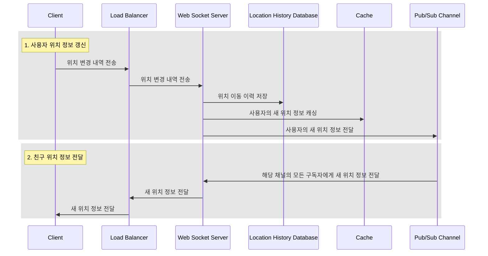

# 2장 주변 친구

## 1단계: 문제 이해 및 설계 범위 확정

### 기능 요구사항

* 사용자는 모바일 앱에서 주변 친구 목록과 함께 친구와의 거리, 갱신 시각이 함께 표시되어야 합니다.
* 친구 목록은 일정 주기마다 갱신 되야 합니다.

### 비기능 요구사항

* 낮은 지연 시간 : 주변 친구 위치 반영이 오래 걸리면 안됨
* 안정성 : 시스템은 전반적으로 안정적이여야 하며, 일부 유실은 감안할 수 있음
* 결과적 일관성 : 강력한 일관성이 필요하지 않음

### 개략적 규모 추정

* 주변 친구는 5마일 이내
* 친구 위치 정보 갱신은 30초 주기로 갱신
* 친구 검색 기능을 하루에 1억명 사용
* 동시 접속은 하루 접속자중 10%로 가정(1천만)
* 한 사람당 400명의 친구가 존재

> QPS
>
> * 1억 DAU
> * 동시 접속 사용자: 10% 1억 = 1천만
> * 위치 정보 갱신 QPS = 1천만/30 = ~334000

## 2단계: 개략적 설계안 제시 및 동의 구하

* 2단계는 다음과 같은 내용을 살펴봅니다.
    * 개략적 설계
    * API 설계
    * 데이터 모델

### 개략적 설계안

이 문제에서 사용자는 근방의 모든 활성 상태 친구의 새 위치 정보를 수신하고자하며, 이는 P2P를 통해 해결가능합니다.

하지만 네트워크 연결 상태와 기기의 전력 사용량의 문제로 실용적인 아이디어가 아닙니다.

공용 백엔드를 사용하면 좀 더 실용적입니다.

공용 백엔드는 다음과 같은 역할을 합니다.

* 모든 활성 상태 사용자의 위치 변화 내역을 수신한다.
* 사용자 위치 변경 내역을 수신할 때마다 해당 사용자의 모든 활성 상태 친구를 찾아서 그 친구들의 단말로 변경 내역을 전달한다.
* 두 사용자 사이의 거리가 특정 임게치보다 먼 경우에는 변경 내역을 전송하지 않는다.

공용 백엔드는 엄청난 양의 요청을 처리해야하며 위 역할은 큰 규모에 적용하기 쉽지 않습니다.

### 설계안

위 설계안은 웹소켓 서버와 pub/sub 채널을 통해 구현하고 있습니다.

* 웹 소켓 서버
    * 웹 브라우저와 웹 서버 간에 전이중 통신을 제공하는 컴퓨터 통신 프로토콜
    * 큰 특징으로는 단일 TCP 연결을 유지합니다.

* pub/sub 채널
    * 메시지 전달 패턴 중 하나로, 메시지 생선자와 메시지 소비자 간의 메시지 전달 방식입니다.
    * 토픽은 메시지가 발행되는 대상으로, 메시지 소비자와 연관됩니다.
    * 장점은 다음과 같습니다.
        * 느슨한 결합
        * 확장성
        * 비동기 통신

#### 주기적인 위치 갱신

### API 설계

* 서버 API
  * 주기적인 위치 정보 갱신
  * 웹소켓 초기화
* 클라이언트 API
  * 클라이언트가 갱신된 친구 위치를 수신하는 데 사용할 API
  * 새 친구 구돍 API
  * 구독 해지 API

### 데이터 모델

* 위치 정보 캐시 
  * 위치 정보는 현재 위치만을 사용하기 때문에 디스크 기반 데이터베이스보다는 읽기/쓰기 성능이 좋은 메모리기반 데이터베이스를 사용합니다.
  * Redis는 앞선 목적에 부합하는 데이터베이스입니다.

| 키      | 값            |
|--------|--------------|
| 사용자 ID | {위도, 경도, 시각} |

* 위치 이동 이력 데이터베이스
  * 읽기 보다는 쓰기 부하기 크기 때문에 수평적 규모 확장이 가능한 데이터베이스를 사용합니다.
  * 예로는 카산드라가 있습니다.

|user_id|latitude|longitude|timestamp|
|-------|--------|---------|---------|

## 3단계: 상세 설계

### 웹 소캣 서버

* 웹소켓 클러스터도 사용률에 따라 규모를 자동으로 늘리는 것은 어렵지 않습니다.
* 웹소켓 서버는 유상태 서버라 기존 서버를 제거할 때, 기존 연결을 종료하고 서버를 제거해야 합니다.
즉, 서버를 제거하기 전 로드밸런서에 `연결 종료 중`으로 변경하고 모든 연결이 종료되면 서버를 제거합니다.

### 레디스 Pub/Sub 서버

* 레디스 펍/섭 채널을 생성하는 데 필요한 리소스가 크지 않습니다.
* 채널 하나를 유지하기 위해서는 구독자 관계를 추적하기 위한 해시 테이블과 연결 리스트가 필요하며 이는 아주 소량의 메모리만을 사용합니다.
* 메모리 사용량의 초점을 맞추기보다는 간단한 아키텍처를 구성하는게 더 중요하기 때문에 
사용자가 채널을 구독할 때, 관련된 모든 친구들의 채널을 구독하도록 설계합니다.
* 레디스에서 채널을 저장하기 위한 메모리 사용량보다 각 채널에 데이터를 전송하는 횟수가 더 많기 때문에 CPU 사용량이 더 중요합니다. 
이를 분산 레디스 펍/섭 클러스터를 통해 해결합니다.

### 분산 레디스 펍/섭 서버 클러스터

* 모든 채널은 독립적이기 때문에 사용자 ID 기준으로 샤딩하면 됩니다.
* etcd, 주키퍼(ZooKeeper)와 같은 서비스 탐색 컴포넌트를 통해 메시지를 발행할 서버를 탐색하고 해당 서버를 통해서 메시지를 전송하면, 
특정 서버가 다운되더라도 쉽게 다른 서버로 메시지를 전송할 수 있습니다.

### 레디스 펍/섭 서버 클러스터의 규모 확장 고려사항

* 레디스 펍/섭 서버 클러스터의 몇 가지 속성은 다음과 같습니다.
  1. 펍/섭 채널에 전송되는 메시지는 메모리나 디스크에 지속적으로 보관되지 않는다. 즉, 채널을 통해 처리되는 데이터는 무상태이다.
  2. 펍/섭 서버는 채널에 대한 상태 정보를 보관한다. 이는 노드가 추가되거나 제거될 때, 채널을 재구성해야 하기 때문이다. 즉, 채널은 상태 정보를 가지고 있다.
* 위 이유중 두번째 이유로 레디스 펍/섭 서버 클러스터는 유상태 서버 클러스터로 취급해야 합니다.
* 유상태 서버 클러스터는 많은 트래픽을 무리 없이 감당하고 불필요한 크기 변화를 피할 수 있도록 오버 프로비저닝을 합니다.
* 레디스 펍/섭 외에 얼랭(Erlang)을 통해서 구현할 수도 있습니다.

## 4단계: 마무리