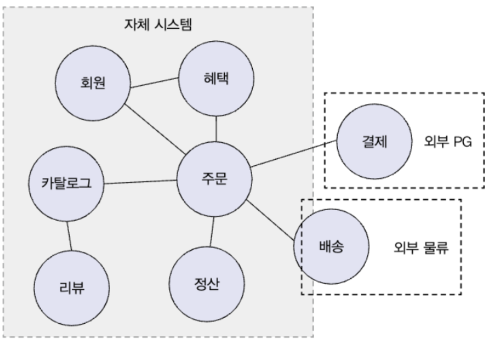
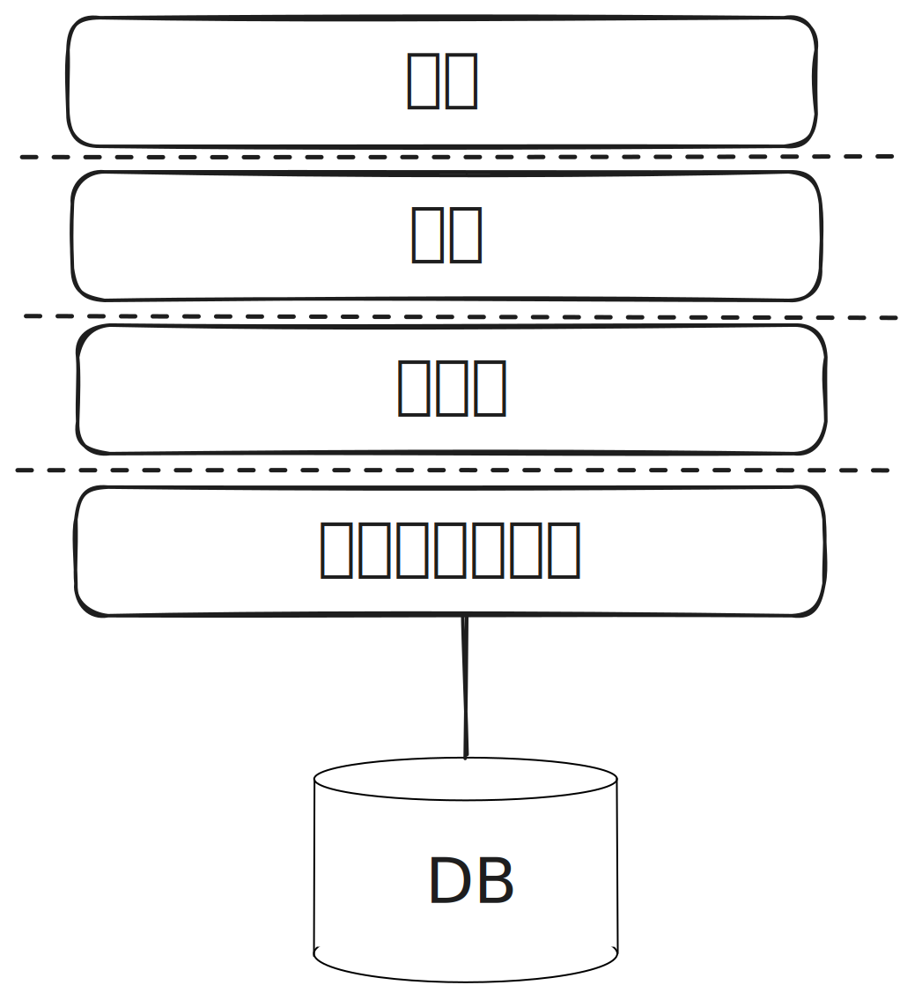
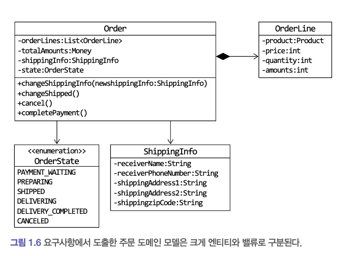

# 1장 도메인 모델 시작하기

## 1.1 도메인이란?

* 도메인은 개발자가 구현해야할 소프트웨어에 대해, 그 소프트웨어로 해결하고자 하는 문제 영역입니다.
* 한 도메인은 여러개의 하위 도메인으로 구성될 수 있습니다
* 특정 도메인을 위한 소프트웨어라해서 도메인이 제공해야 할 모든 기능을 직접 구현하는 것은 아닙니다.
* 도메인마다 고정된 하위 도메인이 존재하는 것은 아니며, 하위 도메인을 어떻게 구성할지 여부는 상황에 따라 달라집니다.

> 
>
> 고객이 물건을 구매면 주문, 결제, 배송, 혜택 하위 도메인의 기능이 엮이게 된다.
>
> 또한 자체적인 배송 시스템이 아닌 외부 배송 업체의 시스템을 사용하여 배송 추적을 제공한다.

## 1.2 도메인 전문가와 개발자 간 지식 공유

* 도메인 전문가는 해당 도메인에 대한 지식과 경험을 바탕으로 본인들이 원하는 기능 개발을 요구합니다.
  그리고 개발자는 이 요구사항을 분석하고 설계하여 코드를 작성하며 테스트하고 배포합니다.
* 개발자가 요구사항을 분석하는 과정은 모든 설계의 첫번째 단계이기에 잘못 분석하면 이후 쓸모없거나 유용함이 떨어지는 시스템을 만들 수 있습니다.
* 개발자가 요구사항을 잘 분석하기 위해서는 전문가와 소통을하면 됩니다. 추가적으로 전문가만큼은 아니지만 개발자또한 도메인 지식을 가져야 합니다.

## 1.3 도메인 모델

* 도메인 모델은 특정 도메인을 개념적으로 포현한 것입니다.
* 도메인 모델을 통해 여러 관계자들이 동일한 모습으로 도메인을 이해하고 도메인 지식을 공유하는 데 도움이 됩니다.
* 도메인을 이해하는 과정에서 도메인이 제공하는 기능과 도메인의 주요 데이터 구성을 파악해야 하는데, 기능과 데이터를 함께 보여주는 객체 모델은 도메인을 모델링하기 적합합니다.

> **하위 도메인과 모델**
>
> 모델의 각 구성요소는 특정 도메인으로 한정할 때 비로소 의미가 완전해지기에 각 하위 도메인마다 별도로 모델을 만들어야 합니다.

## 1.4 도메인 모델 패턴

일반적인 애플리케이션의 아키텍처는 네 개의 영억으로 구성됩니다.



| 영역              | 설명                                                                         |
|-----------------|----------------------------------------------------------------------------|
| 사용자 인터페이스 또는 표현 | 사용자의 요청을 처리하고 사용자에게 정보를 보여준다. 여기서 사용자는 소프트웨어를 사용하는 사람뿐만 아니라 외부 시스템일 수도 있다. |
| 응용              | 사용자가 요청한 기능을 실행한다. 업무 로직을 직접 구현하지 않으며 도메인 계층을 조합해서 기능을 실행한다.               |
| 도메인             | 시스템이 제공할 도메인 규칙을 구현한다.                                                     |
| 인프라스트럭처         | 데이터베이스나 메시징 시스템과 같은 외부 시스템과의 연동을 처리한다.                                     |

* 도메인 모델은 아키텍처 상의 도메인 계층을 객체 지향 기법으로 구현하는 패턴을 말합니다.
* 도메인 계층은 도메인의 핵심 규칙을 구현합니다.
* 핵심 규칙을 구현한 코드는 도메인 모델에만 위치하기에 규칙이 바뀌거나 규칙을 확장해야 할 때 다른 코드에 영향을 덜 주고 변경 내역을 모델에 반영할 수 있습니다.

주문 도메인의 경우 '출고 전에 배송지를 변경할 수 있다'라는 규칙과 '주문 취소는 배송 전에만 할 수 있다'라는 규칙을 구현한 코드가 도메인 계층에 위치하게 됩니다.

이런 도메인 규칙을 객체 지향 기법으로 구현하는 패턴이 도메인 모델 패턴입니다.

```Java
public class Order{
  private OrderState state;
  private ShippingInfo shippingInfo;
  
  public void changeShippingInfo(ShippingInfo newShippingInfo){
    if(!state.isShippingChangealbe()){
      throw new IllegalStateException();
    }
    this.shippingInfo = newShippingInfo;
  }
  
  public enum OrderState{
    PAYMENT_WAITING {
      public boolean isShippingChangealbe(){
        return true;
      }
    },
    PREPARING {
      public boolean isShippingChangealbe(){
        return true;
      }
    },
    SHIPPED, DELIVERING, DELIVERY_COMPLETED;
    
    public boolean isShippingChangealbe(){
      return false;
    }
}
```

큰 틀에서 OrderState는 Order에 속한 데이터이기에 배송지 가능 여부를 판단하는 코드를 Order로 이동할 수도 있습니다.
배송지 변경이 가능한지 판단할 때, 배송 상태뿐만 아닌 다른 정보가 필요하다면 Order 내부에 메소드를 만들어서 처리해야 합니다.

중요한 점은 배송지 변경 가능 여부를 판단하는 로직은 도메인 모델인 Order나 OrderState에서 구현한다는 점입니다.


## 1.5 도메인 모델 도출

* 기획서, 유스케이스, 사용자 스토리와 같은 요구사항과 관련자와의 대화를 통해 도메인을 이해하고 이를 바탕으로 도메인 모델 초안을 만들어야만 개발을 할 수 있습니다.
* 도메인 모델링할 때 기본이 되는 작업은 모델을 구성하는 핵심 구성요소, 규칙, 기능을 찾는 것입니다.

## 1.6 엔티티와 밸류

* 도출한 모델은 크게 엔티티(Entity)와 밸류(Value)로 구분할 수 있습니다.



* 엔티티와 밸류를 제대로 구분해야 도메인을 올바르게 설계하고 구현할 수 있기에 이 둘의 차이를 명확하게 이해하는 것은 도메인을 구현하는 데 있어 중요합니다.

### 1.6.1 엔티티

* 엔티티의 가장 큰 특징은 식별자를 가진다는 것입니다.
* 식별자는 엔티티 객체마다 고유하며 각 엔티티는 서로 다른 식별자를 가집니다.
* 엔티티의 상태가 바뀌더라도 식별자는 바뀌지 않으며, 엔티티가 삭제될 때까지 식별자는 유지됩니다.

### 1.6.2 엔티티의 식별자 생성

* 엔티티의 식별자를 생성하는 시점은 도메인의 특징과 사용하는 기술에 따라 달라집니다.
* 엔티티의 식별자는 다음 중 한가지 방식을 사용합니다.
  * 특정 규칙에 따라 생성
  * UUID나 Nano ID와 같은 고유 식별자 생성기 사용
  * 값을 직접 입력
  * 일련번호 사용(시퀀스나 DB의 자동 증가 칼럼 사용)

### 1.6.3 밸류 타입

* 밸류 타입은 개념적으로 완전한 하나를 표현할 때 사용합니다.
* 밸류 타입을 의미를 명확하게 표현하기 위해 사용하는 경우도 있습니다. 예를 들면 돈을 표현하기 위해 Money 타입을 만드는 것이 있습니다.
* 밸류 객체의 데이터를 변경할 대는 기존 데이터를 변경하기 보다는 변경한 데이터를 갖는 새로운 밸류 객체를 생성하는 방식을 선호합니다. 즉, 불변 객체로 관리하는 것입니다.
* 밸류 타입을 불변으로 구현하는 가장 중요한 이유는 안전한 코드를 작성할 수 있다는 점에 있습니다.

### 1.6.4 엔티티 식별자와 밸류 타입

* 엔티티 식별자는 단순한 문자열이 아닌 도메인에서 특별한 의미를 지니는 경우가 많아 식별자를 위한 밸류 타입을 사용해서 의미가 잘 드러나도록 할 수 있습니다.

### 1.6.5 도메인 모델에 set 메소드 넣지 않기

* 도메인 모델에서 get/set은 주의해서 추가해야 합니다. 특히 set 메소드는 도메인의 핵심 개념이나 의도를 코드에서 사라지게 만듭니다. 
또한 도메인 객체를 생성할 때 온전하지 않은 상태가 될 수 있습니다.

## 1.7 도메인 용어와 유비쿼터스 언어

* 코드를 작성할 때 도메인에서 사용하는 용어는 매우 중요합니다.
* 도메인에서 사용하는 용어를 코드에 반영하지 않으면 그 코드는 개발자에게 코드의 의미를 해석해야 하는 부담을 줍니다.
* 전문가, 관계자, 개발자가 도메인과 관련된 공통의 언어를 만들고 이를 대화, 문서, 도메인 모델, 코드, 테스트 등 모든 곳에서 같은 용어를 사용할 수 있습니다.
이렇게하면 소통 과정에서 발생하는 용어의 모호함을 줄일 수 있고, 개발자는 도메인과 코드 사이에서 불필요한 해석 과정을 줄일 수 있습니다.
* 시간이 지날수록 도메인에 대한 이해가 높아지는데 새롭게 이해한 내용을 잘 표현할 수 있는 용어를 찾아내고 이를 다시 공통의 언어로 만들어 다 같이 사용합니다.
