# 2장 아키텍처 개요


## 2.1 네 개의 영역

* 아키텍처를 설계할 때, 일반적으로 '표현', '응용', '도메인', '인프라스트럭처'를 사용합니다.
* 표현 영역은 사용자의 요청을 받아 응용 영역에 전달하고 응용 영역의 처리 결과를 다시 사용자에게 보여주는 역할을 합니다.

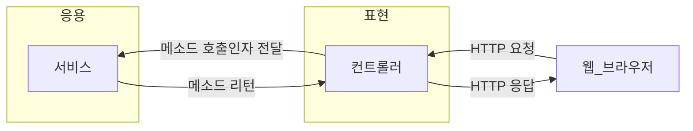

* 응용 영역은 기능을 구현하기 위해 도메인 영역의 도메인 모델을 사용합니다.
* 응용 서비스는 로직을 직접 수행하기보다는 도메인 모델에 로직 수행을 위임합니다.
* 도메인 영역은 도메인 모델을 구현합니다.
* 도메인 모델은 도메인의 핵심 로직을 구현합니다.

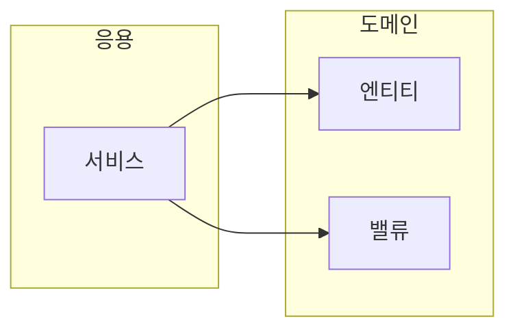

```Java
public class CancelOrderService{
    @Transactional
    public void cancelOrder(String orderId){
        Order order = findOrderById(orderId);
        if (Objects.isNull(order)) throw new OrderNotFoundException(orderId);
        order.cancel();
        ...
    }
}
```


* 인프라스트럭처 영역은 구현 기술에 대한 것을 다룹니다.
* 인프라스트럭처 영역은 RDBMS 연동을 처리하고, 메시징 큐에 메시지를 전송하거나 수신하는 기능을 구현합니다.
* 인프라스트럭처 영역은 논리적인 개념을 표현하기보다는 실제 구현을 다룹니다.
* 표현, 응용, 도메인 영역은 구현 기술을 사용한 코드를 직접 만들지 않습니다. 대신 인프라스트럭처 영역에서 제공하는 기능을 사용해서 필요한 기능을 개발합니다.

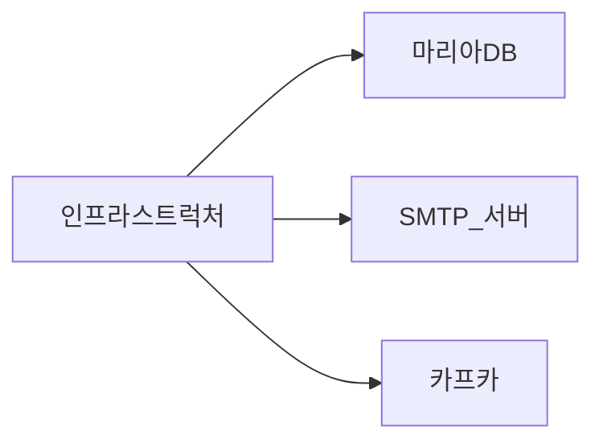


## 2.2 계층 구조 아키텍처

* 일반적인 아키텍처는 다음과 같이 구성합니다.

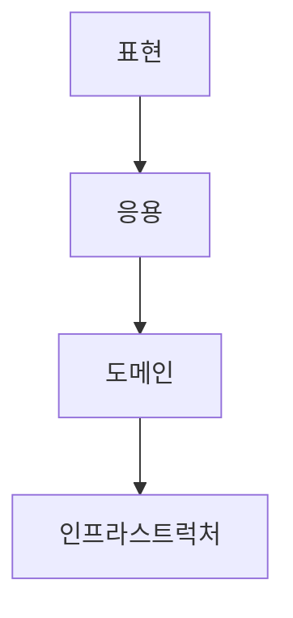

* 계층 구조는 그 특성상 상위 계층에서 하위 계층으로의 의존만 존재하고 하위 계층은 상위 계층에 의존하지 않습니다.
* 게층 구조를 업격하게 적용한다면 상위 계층은 바로 아래의 계층에만 의존을 가져야 하지만 구현의 편리함을 위해 계층 구조를 유연하게 적용하기도 합니다.

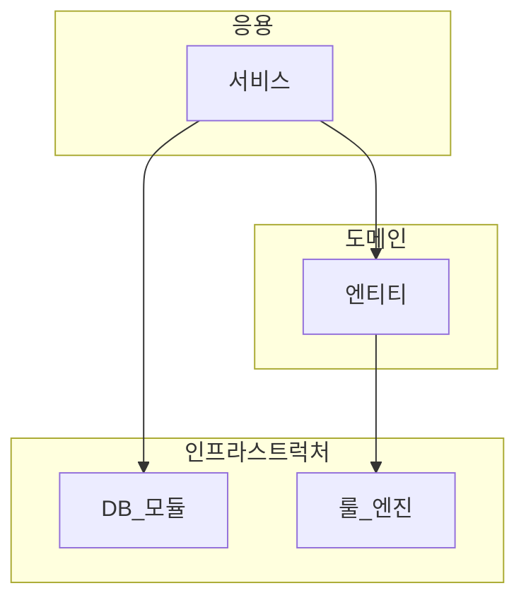

* 응용 영역과 도메인 영역이 인프라스트럭처의 기능을 사용하는게 직관적일 수 있습니다. 하지만 특정 구현 기술에 종속된다는 단점이 존재합니다.

```Java
public class CalculateDiscountService{
    private DroolsRuleEngine ruleEngine;
    
    
    public Money calculateDiscount(List<OrderLine> orderLines, String customerId){
        Customer customer = findCustomer(customerId);
        
        MutableMoney money = new MutableMoney(0);
        
        List<?> facts = Arrays.asList(customer, money);
        facts.addAll(orderLines);
        ruleEngine.evaluate("discountCalculation",facts);
        return money.toInmmutableMoney();
    }
}
```

* CalculateDiscountService는 두 가지 문제점을 가지고 있습니다.
  * RuleEngine의 의존성으로 인해 테스트하기 어려워 졌습니다.
  * RuleEngine 구현에 관한 정보에 의존하여 변경에 어려워 졌습니다.
* 인프라스트럭처에 의존하면 '테스트 어려움'과 '기능 확장의 어려움'이라는 두 가지 문제가 발생할 수 있습니다. 이는 DIP를 이용하면 해결할 수 있습니다.


## 2.3 DIP

* 고수준 모듈의 기능을 구현하기 위해서는 여러 하위기능이 필요합니다.
* 하위 기능을 구현하는 과정에서 고수준의 모듈이 저수준 모듈을 의존하게 되면 앞선 문제가 발생하는 것이다.
* 이를 저수준 모듈이 고주준 모듈로 의존성을 역전시켜(DIP) 문제를 해결할 수 있습니다.

```Java
public interface RuleDiscounter{
    Money applyRules(Customer customer, List<OrderLines> orderLines);
}
```

```Java
public class CalculateDiscountService{
    private RuleDiscounter ruleDiscounter;
    
    public Money calculateDiscount(List<OrderLine> orderLines, String customerId){
        Customer customer = findCustomer(customerId);
        
        return RuleDiscounter.applyRules(customer, orderLines);
    }
}
```

* 인터페이스를 통한 추상화를 통해 CalculateDiscountService에는 저수준 모듈의 의존성이 제거되었습니다. 이를 DIP라고 부릅니다.
* DIP를 적용하면 인프라스트럭처 영역에 의존할 때 발생헀던 두 문제를 해소할 수 있습니다.
* DIP를 적용할 때, 인터페이스와 구현체를 같은 모듈에 위치한다면 인프라스트럭처를 그대로 의존하게 되어 DIP를 만족했다고 볼 수 없습니다. 즉, 추상화한 인터페이스는 고수준 모듈에 위치해야 합니다.

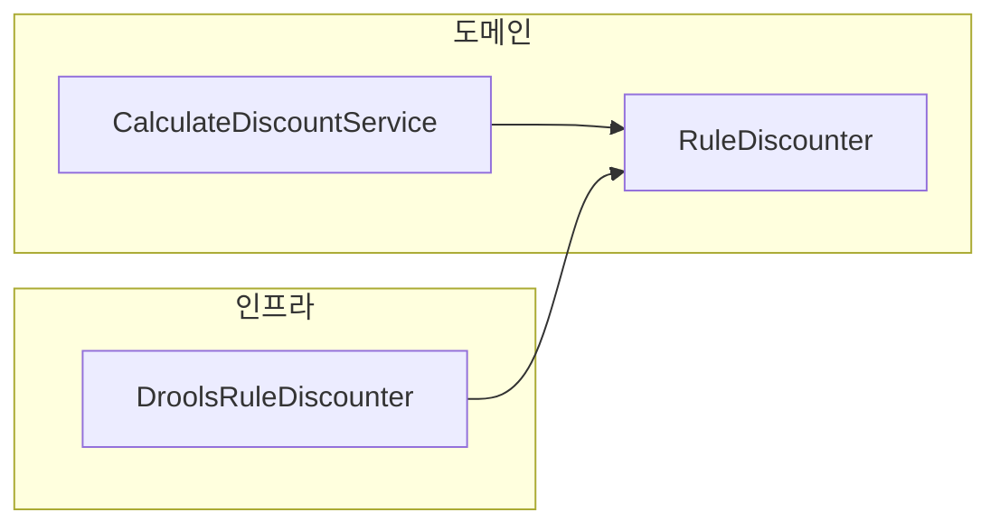


## 2.4 도메인 영역의 주요 구성요소

* 도메인 영역을 구성하는 요소는 다음과 같습니다.

|요소| 설명                                                                                               |
|--|--------------------------------------------------------------------------------------------------|
|엔티티 Entity| 고유의 식별자를 갖는 객체로 자신의 라이프 사이클을 갖습니다. 도메인의 고유한 개념을 표현하고, 도메인 모델의 데이터를 포함하며 데이터와 관련된 기능을 함께 제공합니다.   |
|밸류 Value| 고유의 식별자를 갖지 않는 객체로 주로 개념적으로 하나의 값을 표현할 때 사용됩니다. 엔티티의 속성으로 사용할 뿐만 아니라 다른 밸류 타입의 속성으로도 사용할 수 있습니다. |
|애그리거트 Aggregate| 애그리거크는 연관된 엔티티와 밸류 객체를 개념적으로 하나로 묶은 것입니다.                                                        |
|리포지토리 Repository| 도메인 모델의 영속성을 처리합니다.                                                                              |
|도메인 서비스 Domain Service| 특정 엔티티에 속하지 않는 도메인 로직을 제공합니다.                                                                    |

### 2.4.1 엔티티와 밸류

* DB 테이블의 엔티티와 도메인 모델과 엔티티와의 가장 큰 차이점은 도메인 모델의 엔티티는 데이터와 함께 도메인 기능을 함께 제공한다는 점입니다.
  * 도메인 모델의 엔티티는 단순히 데이터를 담고 있는 데이터 구조라기보다는 데이터와 함께 기능을 제공하는 객체입니다.
  * 도메인 관점에서 기능을 구현하고 기능 구현을 캡슐화해서 데이터가 임의로 변경되는 것을 막습니다.
* 다른 차이점으로는 도메인 모델의 엔티티는 두 개 이상의 데이터가 개념적으로 하나인 경우 밸류 타입을 이용해서 표현할 수 있습니다.

### 2.4.2 애그리거트

* 도메인이 커질수록 개발할 도메인 모델도 커지면서 많은 엔티티와 밸류가 출현합니다.
* 엔티티와 밸류 개수가 많아질수록 모델은 점점 더 복잡해집니다.
* 도메인 모델이 복잡해지면 개발자가 전체 구조가 아닌 한 개 엔티티와 밸류에만 집중하는 상황이 발생합니다.
* 도메인 모델에서 전체 구조를 이해하는 데 도움이 되는 것이 애그리거트입니다.
* 애그리거트를 사용하면 개별 객체 간의 관계가 아닌 애그리거트 간의 관계로 도메인 모델을 이해하고 구현하게 되며, 이를 통해 큰 틀에서 도메인 모델을 관리할 수 있습니다.
* 애그리거트는 군집에 속한 객체를 관리하는 루트 엔티티를 가집니다.
* 루트 엔티티는 애그리거트에 속해 있는 엔티티와 밸류 객체를 이용해서 애그리거트가 구현해야 할 기능을 제공합니다.

### 2.4.3 리포지토리

* 도메인 객체를 지속적으로 사용하려면 RDBMS, NoSQL, 로컬 파일과 같은 물리적인 저장소에 도메인 객체를 보관해야 합니다. 이를 위한 도메인 모델이 리포지터리입니다.
* 엔티티나 밸류가 요구사항에서 도출되는 도메인 모델이라면 리포지토리는 구현을 위한 도메인 모델입니다.
* 리포지토리는 애그리거트 단위로 도메인 객체를 저장하고 조회하는 기능을 정의합니다.

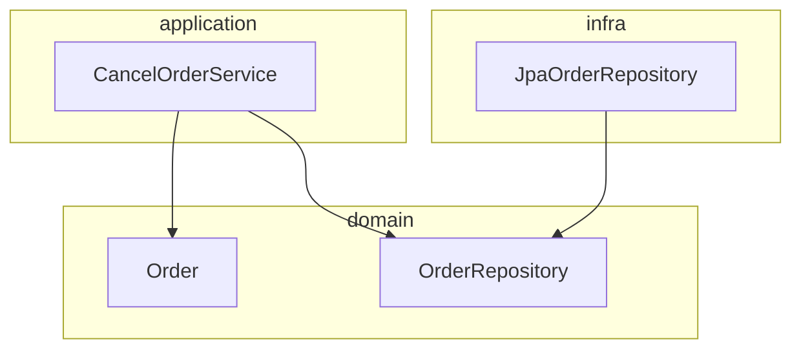

* 응용 서비스는 의존 주입과 같은 방식을 사용해서 실제 리포지토리 구현 객체에 접근합니다.
* 응용 서비스는 리포지토리와 다음과 같은 연관이 있습니다.
  * 응용 서비스는 필요한 도메인 객체를 구하거나 저장할 때 리포지토리를 사용합니다.
  * 응용 서비스는 트랜잭션을 관리하는데, 트랜잭션 처리는 리포지토리 구현 기술의 영향을 받습니다.

## 2.5 요청 처리 흐름

* 사용자 입장에서 봤을 때, 웹 애플리케이션이나 데스크톱 애플리케이션과 같은 소프트웨어는 기능을 제공합니다.
* 사용자가 애플리케이션 기능 실행을 요청하면 그 요청을 처음 받는 영역은 표현 영역입니다.
* 표현 영역은 사용자가 전송한 데이터 형식이 올바른지 검사하고 문제가 없다면 데이터를 이용해서 응용 서비스에 기능 실행을 위임합니다.
* 응용 서비스는 도메인 모델을 이용해 기능을 구현합니다.

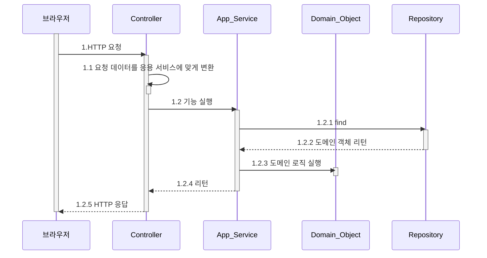

## 2.6 인프라스트럭처 개요

* 인프라스트럭처는 표현 영역, 응용 영역, 도메인 영역을 지원합니다.
* 도메인 객체의 영속성 처리, 트랜잭션, SMTP 클라이언트 등 다른 영역에서 필요로 하는 프레임워크, 구현 기술등을 지원합니다.
* DIP에서 언급한 듯이 도메인 영역과 응용 영역에서 인프라스트럭처의 기능을 직접 사용하는 것보다는 두 영역에 정의한 인터페이스를 인프라스트럭처 영역에서 구현하는 것이 더 유연하며 테스트하기 쉽습니다.
* 구현의 편의성을 위해서 JPA와 같은 기술을 도메인 영역에서 사용할 수 있습니다.

## 2.7 모듈 구성

* 아키텍처의 각 영역은 별도의 패키지에 위치합니다.

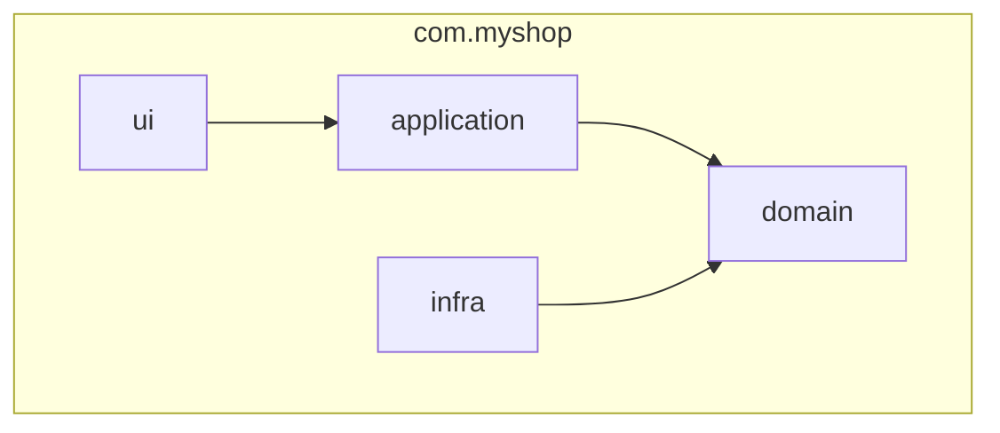

* 도메인이 크다면 다음과 같이 구성할 수 있습니다.

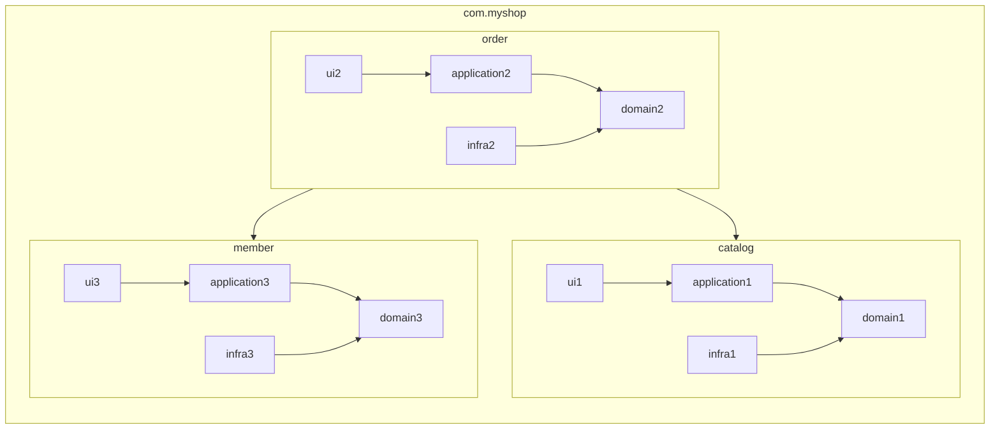

* 도메인 모듈은 도메인에 속한 애그리거트를 기준으로 다시 패키지를 구성할 수 있습니다.

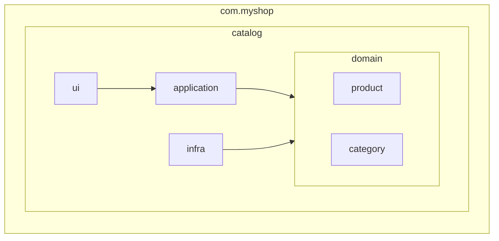