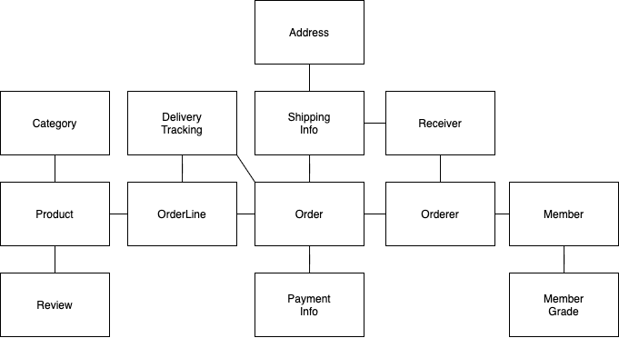

# 3장 애그리거트

## 3.1 애그리거트

* 도메인 객체 모델이 복잡해지면 개별 구성요소 위주로 모델을 이해하게 되며, 전반적인 구조나 큰 수준에서 도메인 간의 관계를 파악하기 어려워집니다.
* 도메인 요소 간의 관계를 파악하기 어렵다는 것은 코드를 변경하고 확장하는 것이 어려워진다는 것을 의미합니다.
* 애그리거트를 통해 복잡한 도메인을 이해하고 관리하기 쉬운 단위로 만들 수 있습니다.
* 애그리거트는 관련된 객체를 하나의 군으로 묶어 줍니다.

### 애그리거트로 묶기 전



### 애그리거트로 묶은 후


* 애그리거트는 모델을 이해하는 데 도움을 줄 뿐만 아니라 일관성을 관리하는 기준도 됩니다.
* 애그리거트는 관련된 모델을 하나로 모았기에 한 애그리거트에 속한 객체는 유사하거나 동일한 라이프 사이클을 가집니다.

## 3.2 애그리거트 루트

> * 총 금액인 totalAmounts를 갖고 있는 Order 엔티티
> * 개별 구매 상품의 개수인 quantity와 금액인 price를 가지는 OrderLine 밸류

Order 엔티티는 OrderLine의 변경에 대해 함께 변경됩니다. 그렇지 않으면 데이터 일관성이 깨질 수 있습니다.

> * 주문 총 금액은 개별 상품의 주문 개수 X 가격의 합이다.

* 애그리거트는 여러 객체로 구성되기 때문에 해당 애그리거트에 속한 모든 객체는 정상 상태를 가져야 합니다.
* 애그리거트 루트 엔티티는 애그리거트의 대표 엔티티입니다.
* 애그리거트에 속한 객체는 애그리거트 루트 엔티티에 직접 또는 간접적으로 속하게 됩니다.

### 3.2.1 도메인 규칙과 일관성

* 애그리거트 루트의 핵심은 애그리거트의 일관성이 깨지지 않도록 하는 것입니다.
* 불필요한 중복을 피하고 애그리거트 루트를 통해서만 도메인 로직을 구현하게 만들려면 도메인 모델에 대해 다음의 두 가지를 습관적으로 적용해야 합니다.
  * 단순히 필드를 변경하는 set 메소드를 public으로 만들지 않는다.
  * 밸류 타입은 불변으로 구현한다.

### 3.2.2 애그리거트 루트의 기능 구현

* 애그리거트 루트는 애그리거트 내부의 다른 객체를 조합해서 기능을 완성합니다.

### 3.2.3 트랜잭션 범위

* 트랜잭션 범위는 작을수록 좋습니다.
* 트랜잭션 범위에 포함된 테이블의 수가 많을수록 동시에 처리할 수 있는 트랜잭션 개수가 줄어들 수 있습니다.
* 한 트랜잭션에서는 하나의 애그리거트만 수정되어야 합니다.
* 애그리거트는 최대한 서로 독립적이어야 합니다.
* 애그리거트간 결합도가 높아지면 수정을 어렵게 만듭니다.
* 도메인 이벤트를 통해서 한 트랜잭션에서 한 애그리거트를 수정하며, 다른 애그리거트의 상태를 변경하는 코드를 작성할 수 있습니다.
* 한 트랜잭션에서 두 개 이상의 애그리거트를 변경하는 경우는 다음과 같습니다.
  * 팀 표준 : 팀이나 조직의 표준에 따라 사용자 유스케이스와 관련된 응용 서비스의 기능을 한 트랜잭션으로 실행해야 하는 경우가 있습니다.
  * 기술 제약 : 기술적으로 이벤트 방식을 도입할 수 없는 경우 한 트랜잭션에서 다수의 애그리거트를 수정해서 일관성을 처리해야 합니다.
  * UI 구현의 편리 : 운영자의 편리함을 위해 여러 상태를 한 번에 변경하고 싶을 때


## 3.3 애그리거트와 리포지터리

* 애그리거트는 개념상 완전한 한 개의 도메인 모델을 표현하므로 객체의 영속성을 처리하는 리포지토리는 애그리거트 단위로 존재합니다.
* 애그리거트는 개념적으로 하나이므로 리포지토리는 애그리거트 전체를 저장소에 영속화해야 합니다.

## 3.4 ID를 이용한 애그리거트 참조

* 한 객체가 다른 객체를 참조하는 것처럼 애그리거트도 다른 애그리거트를 참조합니다.
* 루트에 대한 쉬운 참조를 위해 getter를 사용하는 경우 다음과 같은 문제를 야기할 수 있습니다.
  * 편한 탐색 오용
  * 성능에 대한 고민
  * 확장 어려움
* 애그리거트 내부에서 다른 애그리거트 객체에 접근할 수 있으면 구현의 편리함 때문에 다른 애그리거트를 수정하는 실수를 할 수 있습니다.
* 애그리거트를 직접 참조함으로써 성능에 대해 고민해야 합니다. 예로는 JPA에서의 lazy, eager 두 가지 방식의 전략차이가 있습니다.
* 여러 DB를 통해 도메인을 구성하고 있다면 JPA를 통한 조회는 한계가 있을수밖에 없습니다.
* ID 참조를 통해 한 애그리거트 내부에만 연결되게 할 수 있습니다.

## 3.4.1 ID를 이용한 참조화 조회 성능

* ID 참조를 사용하는 경우 여러 데이터를 가져오면 성능 상의 문제가 발생할 수 있습니다. 이를 한 개의 쿼리를 통해서 해결하는것이 효율적입니다.
* 다른 방법으로는 캐싱을 사용하거나 조회 전용 저장소를 만들어 해결할 수 있습니다.

## 3.5 애그리거트 간 집합 연관

* 컬랙션을 이용한 엔티티와 값 객체의 관계를 표현할 때, 값 객체의 수가 많아지면 조회시 성능에 문제가 생길 수 있습니다.
* 값 객체의 수가 많다면 1-N 관계에 대해 다를 차지하는 값 객체가 도메인의 ID를 가지며, 이를 통해 조회하도록 수정하면 해결할 수 있습니다.

## 3.6 애그리거트를 팩토리로 사용하기

```Java
public class RegisterProductService{
    public ProductId registerNewProduct(NewProductRequest request){
        Store store = storeRepository.findById(request.getStoreId());
        checkNull(store);
        if(account.isBlocked()){
            throw new StoreBlockedException();
        }
        ...
        
        ProductId id = productRepository.nextId();
        Product product = new Product(id, store.getId(), ...);
        productRepository.save(product);
        return id;
    }
}
```

위 코드에서 Product를 생성 가능한지 판단하는 로직과 생성하는 코드가 분리되어 있습니다. 이는 Store와 Product가 논리적으로 하나의 도메인 기능인데,
이 도메인 기능을 응용 서비스에서 구현하고 있는 문제가 있습니다.

이 기능을 Store 애그리거트에서 구현할 수 있습니다.

```Java
public class Store{
    public Product createProduct(ProductId newProductId, ...){
        if(isBlocked()) throw new StoreBlockedException();
        return new Product(newProductId, getId(), ...);
    }
}

public class RegisterProductService{
    public ProductId registerNewProduct(NewProductRequest request){
        Store store = storeRepository.findById(request.getStoreId());
        checkNull(store);
        Product product = store.createProduct(productRepository.nextId(), ...); 
        productRepository.save(product);
        return id;
    }
}
```

* 애그리거트 팩토리를 통해서 도메인의 응집도를 높일 수 있습니다.

