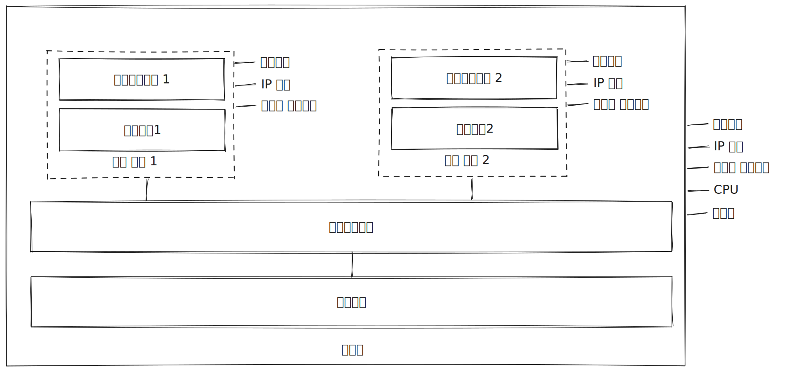

# 2장 도커의 기본적인 사용법

|명령|설명|
|-|-|
|docker container run|컨테이너로 애플리케이션 실행|
|docker container ls|현재 실행중인 모든 컨테이너에 대한 정보를 볼 수 있습니다.|
|docker container top|대상 컨테이너에서 실행 중인 프로세스의 목록을 볼 수 있습니다.|
|docker container logs|대상 컨테이너에서 수집된 모든 로그를 출력합니다.|
|docker container inspect|대상 컨테이너의 상세한 정보를 보여줍니다.|
|docker container stats|실행중인 컨테이너의 상태를 확인할 수 있습니다.|
|docker container rm|컨테이너 ID를 지정해 대상 컨테이너를 삭제할 수 있습니다.|

|플래그|설명|
|-|-|
|--interactive|컨테이너에 접속할 수 있습니다.|
|--tty|터미널 세션을 통해 컨테이너를 조작하겠다는 의미입니다.|
|--detach|컨테이너를 백그라운드에서 실행하며 컨테이너 ID를 출력합니다.|
|--publish|컨테이너의 포트를 호스트 컴퓨터에 공개합니다.|
|--force|rm 명령과 같이 사용하면 실행 중인 컨테이너라도 바로 삭제 가능합니다.|

## 2.1 컨테이너로 Hello World 실행하기

* docker container run 명령은 컨테이너로 애플리케이션을 실행하라는 도커 명령어입니다.
* 이미지에는 애플리케이션을 실행하는 데 필요한 모든 내용과 함께 애플리케이션을 실행하는 방법이 정의돼 있습니다.
* 도커에서는 다음과 같은 워크플로를 가집니다.
  * 빌드 : 애플리케이션을 컨테이너에서 실행할 수 있도록 패키징합니다.
  * 공유 : 다른 사람이 패키지를 사용할 수 있도록 공유합니다.
  * 실행 : 패키지를 내려받은 사람이 컨테이너를 통해 애플리케이션을 실행합니다.
* 빌드, 공유, 실행은 매우 강력한 개념입니다.

## 2.2 컨테이너란 무엇인가?

* 각 컨테이너는 도커가 관리하는 독립적인 가상 리소스를 가집니다.(호스트명, IP 주소, 디스크 드라이브)
* 컨테이너 내부에서는 컨테이너 밖의 환경을 볼 수 없습니다.
* 도커가 관리하는 컨테이너들은 서로 독립적인 환경을 가지지만 실행되는 컴퓨터의 CPU와 메모리, 운영체제를 공유합니다.
* 이 구도는 격리(isolation)와 밀집(density)이라는 모순돼 보이는 조건을 동시에 만족할 수 있습니다.
  * 밀집(density) : 컴퓨터에 CPU와 메모리가 허용하는 한 되도록 많은 수의 애플리케이션을 실행하는 것을 의미합니다.
* 서로 다른 애플리케이션을 동시에 실행해 있어 제약이 있기에 밀집을 달성할 수 없었습니다. 이를 해결해 밀집과 격리를 동시에 달성하려던 첫번째 시도는 가상머신입니다.

* 각각의 가상머신은 자신만의 운영체제를 별도로 갖습니다. 
* 운영체제는 애플리케이션이 사용해야 할 CPU와 메모리 자원을 상당량 차지합니다.
* 운영체제의 라이선스 비용과 운영체제 업데이트 설치 부담이 추가로 생깁니다.
* 가상 머신은 격리를 당설할 수 있지만 밀집은 제공하지 못합니다.
* 컨테이너는 이러한 문제를 해결할 수 있습니다.
* 각각의 컨테이너는 호스트 컴퓨터의 운영체제를 공유하므로 필요한 리소스가 크게 경감됩니다.
* 컨테이너는 외부와 독립된 환경을 제공하므로 밀집과 격리가 동시에 달성되는 것입니다.
* 이는 도커의 또다른 특징인 효율성입니다.

## 2.3 컨테이너를 원격 컴퓨터처럼 사용하기

* 도커를 사용하면 도구와 스크립트를 하나의 이미지로 패키징해 추가적인 설정 작업 없이 컨테이너로 스크립트를 바로 실행하게 할 수 있습니다.
* --interactive 플래그를 사용하면 컨테이너에 접속할 수 있습니다.
* --tty 플래그는 터미널 세션을 통해 컨테이너를 조작하겠다는 의미입니다.
* 도커 자체는 호스트 컴퓨터의 아키텍처나 운영체제와 상관없이 동일하게 동작하지만, 컨테이너에 들어 있는 애플리케이션은 운영체제나 아키텍처를 가질 수 있습니다. 즉, 컨테이너의 내용물이 무엇이든 컨테이너를 다루는 방법은 환경과 상관없이 동일합니다.

## 2.4 컨테이너를 사용해 웹 사이트 호스팅하기

* 컨테이너 내부의 애플리케이션이 실행 중이어야 컨테이너의 상태도 실행 중이 됩니다.
* 애플리케이션 프로세스가 종료되면 컨테이너의 상태도 Existed가 됩니다.
* 종료된 컨테이너는 CPU 자원이나 메모리를 사용하지 않습니다.
* 컨테이너가 종료돼도 컨테이너는 사라지지 않습니다.
* 컨테이너의 파일 시스템이 그대로 남아 있으므로 호스트 컴퓨터의 디스크 공간을 계속 점유합니다.
* --detach : 컨테이너를 백그라운드에서 실행하며 컨테이너 ID를 출력합니다.
* --publish : 컨테이너의 포트를 호스트 컴퓨터에 공개합니다.

* 컨테이너는 기본적으로 외부 환경에 노출되지 않습니다.
* 각 컨테이너는 고유의 IP 주소를 갖지만, 이 IP 주소는 도커가 관리하는 내부 가상 네트워크의 주소지 호스트 컴퓨터가 연결된 물리 네트워크에 연결된 것이 아닙니다.
* 컨테이너 포트를 공개하는 것은 도커가 호스트 컴퓨터의 포트를 주시하다가 해당 포트로 들어오는 트래픽을 컨테이너로 전달해 주는 것입니다.

## 2.5 도커가 컨테이너를 실행하는 원리

* 빌드-공유-실행 워크플로가 도커의 핵심입니다. 이 워크플로를 적용하면 소프트웨어 배포가 매우 쉬워집니다.

* 도커 엔진은 도커의 관리 기능을 맡는 컴포넌트입니다. 로컬 이미지 캐시를 담당합니다. 호스트 운영체제와 함께 컨테이너와 가상 네트워크 등 도커 리소스를 만드는 일도 담당합니다. 도커 엔진은 항상 동작하는 백그라운드 프로세스입니다.
* 도커 엔진은 도커 API를 통해 기능을 수행합니다. 도커 API는 표준 HTTP 기반 REST API 입니다.
* 도커 명령행 인터페이스는 도커 API의 클라이언트입니다.