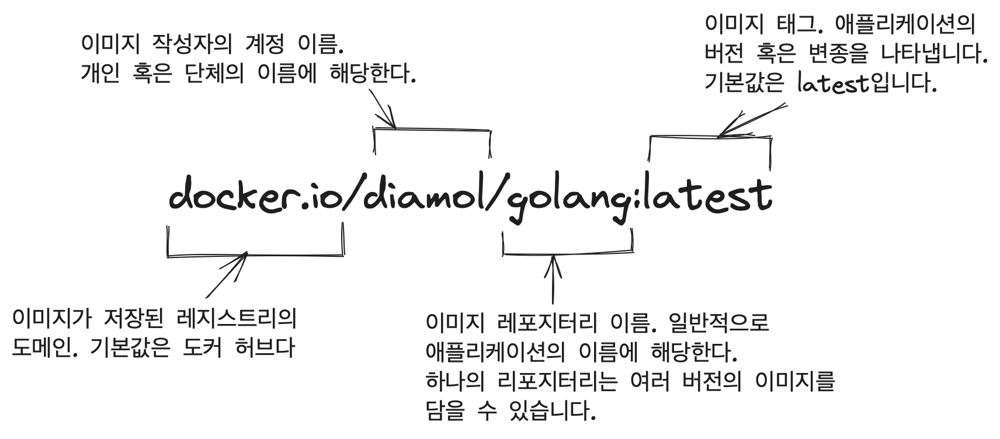

# 5장 도커 허브 등 레지스트리에 이미지 공유하기

* 공유는 로컬 컴퓨터에서 빌드한 이미지를 다른 사람이 사용하게끔하는 것을 말합니다.

## 5.1 레지스트리, 리포지터리, 이미지 태그 다루기

* 도커 플랫폼은 소프트웨어 배포 기능을 내장하고 있습니다.
* 내려받은 이미지는 도커 레지스트리라고 불리는 서버에 저장됩니다. 그중 도커 허브는 도커 레지스트리 중에서 가장 유명한 레지스트리입니다.
* 도커 허브는 도커 엔진에 기본으로 설정된 레지스트리이기도 합니다.
* 도커 이미지에는 이름이 부여되는데, 이 이름에 해당 이미지를 내려받기 위해 필요한 모든 정보가 들어 있습니다.
* 이미지의 전체 이름은 네 개의 요소로 구성됩니다.

## 5.2 도커 허브에 직접 빌드한 이미지 푸시하기

* 레지스트리에 이미지를 푸시하려면 두 가지 절차가 필요합니다.
    1. 도커 명령행을 통해 레지스트리에 로그인을 합니다.
    2. 이미지에 푸시 권한을 가진 계정명을 포함하는 이미지 참조를 붙여야 합니다.
* 도커 레지스트리도 로컬 컴퓨터에서 동작하는 도커 엔진과 같은 방식으로 이미지 레이어를 다룹니다. 즉, 이미지를 푸시할 때 실제로 업로드 대상이 되는 것은 이미지 레이어입니다.
* 도커 레지스트리 역시 이미지 레이어를 다루기에 Dockerfile의 최적화가 중요합니다.
* 레지스트리에서도 캐시상에 레이어 해시와 일치하는 레이어가 없을 경우에만 실제로 업로드가 이뤄집니다.

## 5.3 나만의 도커 레지스트리 운영하기

* 로컬 네트워크에 전용 레지스트리가 있으면 편리한 점이 많습니다.
    * 인터넷 회선 사용량과 전송 시간의 이점이 있습니다.
    * 데이터를 다른 사람의 손에 맡기지 않아도 됩니다.
    * 공개 레지스트리가 다운됐을 때 신속하게 전환할 수 있습니다.
* 도커 기본 설정에서는 비보안 프로토콜이 적용된 레지스트리를 사용할 수 없게 돼 있습니다.
* 비보안 레지스트리를 사용하려면 로컬 컴퓨터의 레지스트리를 비보안 레지스트리 허용 목록에 추가해야 합니다.
* 비보안 레지스트리를 사용할 때는 주의가 필요합니다.
    * 도커 엔진과 레지스트리의 통신 내용을 제삼자가 엿볼 수 있으며 이미지 푸시 과정에서 레이어가 유출될 수 있습니다.
    * 최악의 경우 레지스트리에서 이미지를 받아 올 때 위조된 가짜 이미지를 받아 올 가능성이 있습니다.

## 5.4 이미지 태그를 효율적으로 사용하기

* 도커 이미지 태그에는 어떤 문자열이라도 포함시킬 수 있습니다.
* 태그를 통해 버전을 구별하고 이미지를 사용할 다른 사람들이 자신이 원하는 이미지가 무엇인지 찾을 수 있습니다.

## 5.5 공식 이미지에서 골든 이미지로 전환하기

* 해커 관점에서 보면 도커 허브는 멀웨어를 배포하기에 제격인 조건입니다.
* 도커 허브는 검증된 퍼블리셔와 공식 이미지 제도를 통해 이러한 피해를 방지합니다.
* 공식 이미지로 배포되는 소프트웨어는 주로 오픈 소스 소프트웨어로, 해당 프로젝트 개발 팀과 토커가 함께 이미지를 관리합니다.
* 공식 이미지 역시 취약점 탐색을 거치고 주기적으로 업데이터되며, 잘 최적화된 Dockerfile 스크립트로 구성됩니다.
* 대부분의 경우 공식 이미지를 기반 이미지 삼아 이미지를 빌드하기 시작하지만, 직접 빌드한 이미지를 사용하다 보면 좀 더 많은 것을 통제하고자 하는 시기가 옵니다 이 시점에 자신이 선호하는 기반 이미지로 전환합니다. 이 이미지를 골든 이미지라고 합니다.
* 골든 이미지는 공식 이미지를 기반 이미지로 삼아 인증서나 환경 설정값 등 자신이 필요한 설정을 추가한 것입니다.

~~~
docker image push registry.local:5000/gallery/ui:v1
curl http://registry.local:5000/v2/gallery/ui/tags/list
curl --head \
  http://registry.local:5000/v2/gallery/ui/manifests/latest \
  -H 'Accept: application/vnd.docker.distribution.manifest.v2+json'
Docker-Content-Digest: sha256:SHA-256 hash value
curl -X DELETE \
  http://registry.local:5000/v2/gallery/ui/manifests/sha256:hash value
curl http://registry.local:5000/v2/gallery/ui/tags/list
~~~