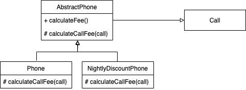

# 10장 상속과 코드 재사용

* 객체지향 프로그래밍의 장점 중 하나는 코드 재사용입니다.
* 전통적인 패러다임에서의 코드 재사용은 복사&붙여넣기로 이루어집니다. 하지만 객체지향에서는 코드 재사용을 위해 새로운 코드를 추가합니다.
* 객체지향에서는 상속 그리고 합성(Composition)을 통해 코드 재사용을 합니다.

## 상속과 중복 코드

* 중복코드는 생산성을 떨어뜨리게 만듭니다. 따라서 중복 코드를 제거해야 하는 이유이지만 결정적으로 변경을 방해합니다.

### DRY 원칙

* 중복 코드는 변경을 방해합니다.
* 중복 코드가 가지는 가장 큰 문제는 코드를 수정하는 데 필요한 노력을 몇 배로 증가시킨다는 것입니다.
* 중복 여부를 판단하는 기준은 변경입니다. 요구사항이 변경됐을 때 두 코드를 함께 수정해야 한다면 중복 코드입니다.
* DRY는 Don't Repeat Yourself의 약자입니다. 동일한 지식을 중복하지 말라는 의미입니다. 이는 한 번, 단 한번(Once and Only Once)와 단일 지점 제어(Single Point Control)이라는 두 가지 의미를 내포합니다.

### 중복과 변경

```Phone```과 ```NightlyDiscountPhone```과 같이 새로운 요구사항에 대해 새로운 클래스를 생성해서 기능을 추가하다보면 중복 코드가 발생할 수 박에 없고
이를 변경하려 할때 어떤 일이 발생할지 모릅니다.

#### 중복 코드 수정하기

##### Step1

새로운 요구사항으로 세금 계산이 추가됐습니다. 하지만 이러한 요구사항으로 ```Phone```과 ```NightlyDiscountPhone```에 중복 코드가 발생했습니다.

중복 코드는 항상 함께 수정돼야 하기 때문에 수정할 떄 하나라도 빠트린다면 버그로 이어질 것입니다. 또한 중복 코드는 새로운 중복 코드를 부릅니다.
따라서 중복코드를 추가하는 대신 제거해야 합니다.
```Java
public class Phone{
    private double taxRate;
    
    public Money calculateFee(){
        ...
        return result.plus(result.times(taxRate);
    }
}
public class NightlyDiscountPhone{
    private double taxRate;
    
    public Money calculateFee(){
        ...
        return result.minus(result.times(taxRate);
    }
}
```

##### Step2, 타입 코드 사용하기

```Phone```과 ```NightlyDiscountPhone```의 중복 코드를 제거하기 위해 클래스를 하나로 합치는 방법이 있습니다. 
하지만 이는처럼 타입 코드를 사용하는 클래스는 낮은 응집도와 높은 결합도라는 문제에 시달리게 됩니다.
```Java
public class Phone{

    enum PhoneType{REGULAR, NIGHTLY}

    private double taxRate;
    private PhoneType type;
    
    public Money calculateFee(){
        for(Call call : calls){
            if(type==PhoneType.REGULAR){
                ...
            } else{
                ...
            }
        }
    }
}
```

##### Step3, 상속 이용하기

상속은 이미 존재하는 클래스와 유사한 클래스가 필요하다면 코드를 복사하지 말고 상속을 이용해 코드를 재사용하는 것입니다.
```Java
public class NightlyDiscountPhone extends Phone{
    @Override
    public Money calculateFee(){
        ...
    }
}
```

상속을 이용해 중복 코드를 해결한다면 코드를 이해하기 힘들게 만듭니다. 즉, 상속을 염두에 두고 설계되지 않은 클래스를 상속을 이용해 재사용하기란 쉽지 않은것입니다.

결합도를 하나의 모듈이 다른 모듈에 대해 얼마나 많은 지식을 갖고 있는지를 나타내는 정도로 정의했습니다. 
앞선 예제에서 상속을 이용해 코드를 재사용하기 위해서는 부모 클래스의 개발자가 세웠던 가정이나 추론 과정을 정확하게 이해해야 한다는 것입니다.
상속은 결합도는 높입니다. 그리고 상속이 초래하는 부모 클래스와 자식 클래스 사이의 강한 결합이 코드를 수정하기 어렵게 만듭니다.

> 상속을 위한 경고 1
> 
> 자식 클래스의 메서드 안에서 super 참조를 이용해 부모 클래스의 메서드를 직접 호출할 경우 두 클래스는 강하게 결합됩니다. 
> super 호출을 제거할 수 있는 방법을 찾아 결합도를 제거하라

## 취약한 기반 클래스 문제

* 부모 클래스의 변경에 의해 자식 클래스가 영향을 받는 현상을 취약한 기반 클래스 문제(Fragile Base Class Problem)라고 합니다. 
이는 상속을 사용한다면 피할 수 없는 객체지향 프로그래밍의 근본적인 취약성입니다.
* 취약기반 클래스 문제는 상속이라는 문맥 안에서 결합도가 초래하는 문제점을 가리키는 용어입니다.
* 상속은 자식 클래스를 점진적으로 추가해서 기능을 확장하는 데 용이하지만 높은 결합도로 인해 부모 클래스를 점진적으로 개선하는 것은 어렵게 만듭니다.
* 취약한 기반 클래스 문제는 캡슐화를 약화시키고 결합도를 높입니다.즉, 상속을 사용하면 부모 클래스의 퍼블릭 인터페이스가 아닌 구현을 변경하더라도 자식 클래스가 영향을 받기 쉬워집니다.
* 객체지향의 기반은 캡슐화를 통한 변경의 통제입니다.

### 불필요한 인터페이스 상속 문제


자바 초기 버전에서 ```Vector``` 클래스는 ```Stack``` 클래스를 상속했습니다.

```Vector```클래스의 조회, 추가, 삭제 메소드를 제공하는데 ```Stack``` 클래스가 ```Vector```를 상속받아 임의의 위치에 요소를 추가하거나 삭제할 수 있습니다. 
이는 ```Stack``` 자료구조의 규칙을 위반하게 됩니다.

> 상속을 위한 경고 2
> 
> 상속받은 부모 클래스의 메소드가 자식 클래스의 내부 구조에 대한 규칙을 깨트릴 수 있습니다.


### 메소드 오버라이딩의 오작용 문제

* 자식 클래스가 부모 클래스의 메소드를 오버라이드할 때 부모 클래스의 메소드를 super로 호출한다면 부모 클래스의 메소드 구현에 따라 자식 클래스의 메소드 동작이 예상하지 못하는 상황이 발생할 수 있습니다.

```Java
public class InstrumentedHashSet<E> extends HashSet<E> {
    private int addCount = 0;

    @Override
    public boolean add(E e) {
        addCount++;
        return super.add(e);
    }

    @Override
    public boolean addAll(Collection<? extends E> c) {
        addCount += c.size();
        return super.addAll(c);
    }
}
```

InstrumentedHashSet 클래스는 HashSet 클래스를 상속받아 addCount라는 변수를 추가했습니다. 하지만 HashSet 클래스의 addAll 메소드는 add 메소드를 사용합니다.
이러한 부모 클래스의 동작으로 InstrumentedHashSet 클래스의 addAll 메소드는 addCount 변수를 잘못된 값으로 갱신하게 됩니다.

```Java
public class InstrumentedHashSet<E> extends HashSet<E> {
    private int addCount = 0;

    @Override
    public boolean add(E e) {
        addCount++;
        return super.add(e);
    }

    @Override
    public boolean addAll(Collection<? extends E> c) {
        boolean modified = false;
        for (E e : c)
            if (add(e))
                modified = true;
        return modified;
    }
}
```

앞선 문제를 addAll 메소드 내부를 add 메소드를 반복 호출로 변경하여 해결할 수 있습니다. 하지만 이는 부모 클래스의 구현에 의존하게 됩니다. 즉, 캡슐화를 약화시키는 것입니다.


> 상속을 위한 경고 3
> 
> 자식 클래스가 부모 클래스의 메소드를 오버라이딩할 경우 부모 클래스가 자신의 메소드를 사용하는 방법에 자식 클래스가 결합될 수 있습니다.

조슈야 블로치는 상속을 사용할 때는 상속을 위해 클래스를 설계하고 문서화해야 하며, 그렇지 않은 경우 상속을 금지해야 한다고 말합니다.
하지만 문서화함은 캡슐화를 위반하는 것이기에 문서화하는게 좋은가?에 대해서는 설계가 트레이드오프 활동이라는 점을 생각해야 합니다.

상속은 코드 재사용을 위해 캡슐화를 희생합니다. 즉, 캡슐화를 지키고 싶다면 상속을 사용해서는 안됩니다.


## Phone 다시 살펴 보기

##### Step4, 추상화에 의존하자

```NightlyDiscountPhone```의 가장 큰 문제점은 ```Phone```에 강하게 결합돼 있다는 점입니다.
이러한 문제는 자식 클래스가 부모 클래스의 구현이 아닌 추상화에 의존하도록 만들면 해결할 수 있습니다.

코드 중복을 제거하기 위해 상속을 도입할 때 따르는 두 가지 원칙은 다음과 같습니다.
* 두 메소드가 유사하게 보인다면 차이점을 메소드로  추철하라. 메소드 추출을 통해 두 메소드를 동일한 형태로 보이도록 만들 수 있다.
* 부모 클래스의 코드를 하위로 내리지 말고 자식 클래스의 코드를 상위로 올려라. 부모 클래스의 구체적인 메소드를 자식 클래스로 내리는 것보다 자식 클래스의 추상적인
메소드를 부모 클래스로 올리는 것이 재사용성과 응집도 측면에서 더 뛰어난 결과를 얻을 수 있다.

##### Step5

먼저 할 일은 두 클래스의 메소드에서 다른 부분을 별도의 메소드로 추출하는 것입니다. 이를 추상 클래스로 만들어 ```Phone```과 ```NightlyDiscountPhone```에서 상속받도록 합니다.

```Java
public abstract class AbstractPhone {
    private List<Call> calls = new ArrayList<>();

    public Money calculateFee() {
        Money result = Money.ZERO;

        for(Call call : calls) {
            result = result.plus(calculateCallFee(call));
        }

        return result;
    }

    abstract protected Money calculateCallFee(Call call);
}
public class Phone extends AbstractPhone {

    @Override
    protected Money calculateCallFee(Call call) {
        return amount.times(call.getDuration().getSeconds() / seconds.getSeconds());
    }
}
public class NightlyDiscountPhone extends AbstractPhone {

    @Override
    protected Money calculateCallFee(Call call) {
        if (call.getFrom().getHour() >= LATE_NIGHT_HOUR) {
            return nightlyAmount.times(call.getDuration().getSeconds() / seconds.getSeconds());
        } else {
            return regularAmount.times(call.getDuration().getSeconds() / seconds.getSeconds());
        }
    }
}
```

앞서 추상 클래스를 통해 중복 코드를 제거하고, 추상화에 의존하도록 만들었습니다.



### 추상화가 핵심이다.

앞서 ```Phone```과 ```NightlyDiscountPhone```의 공통 코드를 이동시킨 후 각 클래스는 서로 다른 변경의 이유를 가지게 되었습니다.
즉, 서로에 대한 정보를 많이 알지 못하기에 낮은 결합도를 유지할 수 있습니다.

또한 부모 클래스 역시 자신의 내부에 구현된 추상 메소드를 호출하기에 추상화에 의존한다고 말할 수 있습니다.

새로운 요금제를 추가하더라도 ```AbstractPhone``` 클래스를 수정할 필요 없이 해당 클래스를 상속하는 새로운 클래스를 만들면 됩니다.
이는 확장에는 열려 있고 수정에는 닫혀 있는 개방-폐쇄 원칙을 준수합니다.

### 의도를 드러내는 이름 선택하기

```AbstractPhone``` 클래스의 이름은 ```Phone```과 ```NightlyDiscountPhone```의 공통점을 드러내지 못합니다.
이를 ```AbstractPhone```을 ```Phone```으로 변경하면 더 명확해집니다. 또한 기존의 ```Phone``` 클래스는 ```RegularPhone```으로 변경하면 더 명확해집니다.

### 세금 추가하기

* 클래스라는 도구는 메소드뿐만 아니라 인스턴스 변수도 함께 포함합니다. 따라서 클래스 사이의 상속은 자식 클래스가 부모 클래스가 구현한 행동뿐만 아니라 인스턴스 변수에 대해서도 결합되게 만듭니다.
* 인스턴스 변수를 추가하는 경우 부모 클래스의 생성자에 인스턴스 변수를 초기화하는 코드를 추가해야 합니다. 이는 자식 클래스가 부모 클래스의 내부 구현에 의존하게 만듭니다.
* 인스턴스 변수 초기화 로직 변경에 따른 파급효과는 코드 중복 문제보다 괜찮습니다.
* 핵심 로직은 한 곳에 모아 놓고 조심스럽게 캡슐화해야 합니다. 그리고 공통적인 핵심 로직은 최대한 추상화해야 합니다.

## 차이에 의한 프로그래밍

* 상속이 강력한 이유는 익숙한 개념을 이용해서 새로운 개념을 쉽고 빠르게 추가할 수 있기 때문입니다.
* 기존 코드와 다른 부분만을 추가함으로써 애플리케이션의 기능을 확장하는 방법을 차이에 의한 프로그래밍이라고 부릅니다.
* 상속을 이용하면 이미 존재하는 클래스의 코드를 쉽게 재사용할 수 있기에 애플리케이션의 점진적인 정의가 가능해집니다.
* 차이에 의한 프로그래밍의 목표는 중복 코드를 제거하고 코드를 재사용하는 것입니다.
* 중복 코드 제거와 코드 재사용은 동일한 행동을 가리키는 서로 다른 단어입니다. 중복을 제거하기 위해서는 코드를 재사용 가능한 단위로 분해하고 재구성해야 합니다. 
코드를 재사용하기 위해서는 중복 코드를 제거해서 하나의 모듈로 모아야 합니다.
* 재사용 가능한 코드란 심각한 버그가 존재하지 않는 코드입니다.
* 하지만 상속이 아닌 합성을 통해 상속의 단점을 피하면서도 코드를 재사용할 수 있게 됩니다.