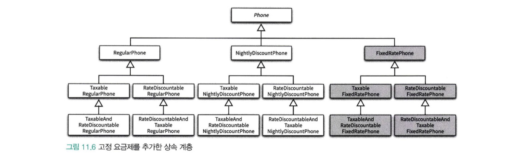
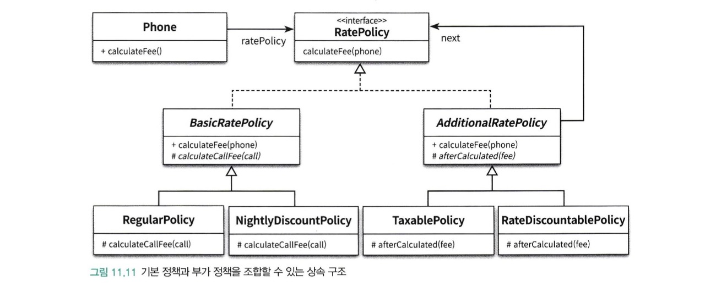

# 11장 합성과 유연한 설계

* 합성은 전체를 표현하는 객체가 부분을 표현하는 객체를 포함해서 부분 객체의 코드를 재사용하는 방식입니다.
* 상속은 컴파일 타임에 합성은 런타임에 의존성이 해결됩니다.
* 상속은 is-a 관계, 합성 관계는 has-a 관계라고 부릅니다.
* 합성은 상속과 다른게 구현에 의존하지 않습니다. 합성은 퍼블릭 인터페이스를 의존합니다.
* 상속과 합성은 재사용의 대상이 다릅니다.
  * 상속은 부모 클래스 안에 구현된 코드 자체를 재사용합니다.
  * 합성은 포함되는 객체의 퍼블릭 인터페이스를 재사용합니다.
  * 합성은 상속보다 낮은 결합도를 유지할 수 있습니다.

## 상속을 합성으로 변경하기

* 상속을 남용하면 다음과 같은 문제점이 존재합니다.
  * 불필요한 인터페이스 상속 문제(Stack, Vector)
  * 메소드 오버라이딩의 오작동 문제(HashSet, InstrumentedHashSet)
  * 부모 클래스와 자식 클래스의 동시 수정 문제(Playlist, PersonalPlaylist)

### 불필요한 인터페이스 상속 문제 : Properties와 Stack

기존 Stack 클래스가 Vector를 상속 받아 문제가 발생했습니다. 이를 Vector를 Stack 클래스의 인스턴스 변수로 선언함으로써 합성ㅇ으로 변경할 수 있습니다.

```Java
public class Stack<E> {
    private Vector<E> elements = new Vector<>();

    public E push(E item) {
        elements.addElement(item);
        return item;
    }

    public E pop() {
        if (elements.isEmpty()) {
            throw new EmptyStackException();
        }
        return elements.remove(elements.size() - 1);
    }
}
```

### 메서드 오버라이딩의 오작용 문제 : InstrumentedHashSet

#### 상속

```Java
package org.eternity.instrumented;

import java.util.Collection;
import java.util.HashSet;

public class InstrumentedHashSet<E> extends HashSet<E> {
    private int addCount = 0;

    public InstrumentedHashSet() {
    }

    public InstrumentedHashSet(int initCap, float loadFactor) {
        super(initCap, loadFactor);
    }

    @Override
    public boolean add(E e) {
        addCount++;
        return super.add(e);
    }

    @Override
    public boolean addAll(Collection<? extends E> c) {
        boolean modified = false;
        for (E e : c)
            if (add(e))
                modified = true;
        return modified;
    }

    public int getAddCount() {
        return addCount;
    }
}
```

#### 합성

상속을 합성으로 변경하는 과정에서 Stack과는 다른점이 존재합니다. InstrumentedHashSet은 기존의 HashSet에서 제공하던 메소드들을 제공해야하기에 Set을 
구현하며 필드로 함께둬 구현하였습니다. 이를통해 결합도를 낮추면서 퍼블릭 인터페이스를 유지할 수 있습니다.

```Java
public class InstrumentedHashSet<E> implements Set<E> {
    private int addCount = 0;
    private Set<E> set;

    public InstrumentedHashSet(Set<E> set) {
        this.set = set;
    }

    @Override
    public boolean add(E e) {
        addCount++;
        return set.add(e);
    }

    @Override
    public boolean addAll(Collection<? extends E> c) {
        addCount += c.size();
        return set.addAll(c);
    }

    public int getAddCount() {
        return addCount;
    }
    
    ...    
}
```

### 부모 클래스와 자식 클래스의 동시 수정 문제 : PersonalPlaylist

Playlist의 경우 합성으로 변경하더라도 가수별 노래 목록을 유지하기 위해 Playlist와 PersonalPlaylist를 함께 수정해야하므로 문제가 해결되지 않습니다.

하지만 변경의 여파가 PersonalPlaylist로만 좁힐 수 있기에 합성을 사용하는것이 좋습니다.

```Java
public class PersonalPlaylist {
    private Playlist playlist = new Playlist();

    public void append(Song song) {
        playlist.append(song);
    }

    public void remove(Song song) {
        playlist.getTracks().remove(song);
        playlist.getSingers().remove(song.getSinger());
    }
}
```


## 상속으로 인한 조합의 폭팔적인 증가

* 상속으로 인해 결합도가 높아지면 코드를 수정하는 데 필요한 작업의 양이 과도하게 늘어나는 경향이 있습니다.
* 작은 기능들을 조합해 더 큰 기능을 수행하는 객체를 만들어야 하는 경우 다음과 같은 문제가 발생할 수 있습니다.
  * 하나의 기능을 추가하거나 수정하기 위해 불필요하게 많은 수의 클래스를 추가하거나 수정해야 합니다.
  * 단일 상속만 지원하는 언어에서는 상속으로 인해 오히려 중복 코드의 양이 늘어날 수 있습니다.
* 상속 대신 합성을 사용한다면 클래스의 증가와 코드 중복 문제를 간단하게 해결할 수 있습니다.

### 상속으로 인한 클래스 폭탄



* 상속을 남용할 경우 하나의 기능을 추가하기 위해 필요 이상으로 많은 수의 클래스를 추가해야 할 수 있습니다. 이를 클래스 폭팔(class explosion) 또는 조합의 폭팔(combinational explosion)이라고 합니다.
* 클래스 폭팔 문제는 자식 클래스가 부모 클래스의 구현에 강하게 결합되도록 강요하는 상속의 근본적인 한계 때문에 발생하는 문제입니다.
* 이러한 문제는 상속을 포기함으로서 해결할 수 있습니다.

## 합성 관계로 변경하기

* 앞선 클래스 폭팔 문제는 상속이 컴파일타임에 의존성이 고정됨으로써 생기는 문제입니다. 이를 런타임에 의존성을 설정할 수 있는 합성을 사용한다면 해결할 수 있습니다.
* 합성을 사용하면 구현 시점에 정책들의 관계를 고정시킬 필요가 없으며 실행 시점에 정책들의 관계를 유연하게 변경할 수 있게 됩니다.
* 하지만 컴파일 타임 의존성과 런타임 의존성의 거리가 멀수록 복잡도가 상승해 코드를 이해하기 어려워집니다. 즉, 설계는 트레이드오프의 산물입니다.

### 기본 정책 합성하기

앞선 각 정책을 별도의 클래스로 분리를 해야 합니다. 정책을 분리하는 과정에서 ```RatePolicy``` 인터페이스를 설계하고 이를 구현하는 추상 클래스인 ```BasicRatePolicy```를 추가합니다.

```BasicRatePolicy```는 일반 요금제, 심야 할인 요금제에서 개별 요금 계산하는 방식을 제외한 전체 처리 로직이 중복되어 이러한 중복 코드를 담은 클래스 입니다.

```Java
public interface RatePolicy {
    Money calculateFee(Phone phone);
}
public abstract class BasicRatePolicy implements RatePolicy {
    @Override
    public Money calculateFee(Phone phone) {
        Money result = Money.ZERO;

        for(Call call : phone.getCalls()) {
            result.plus(calculateCallFee(call));
        }

        return result;
    }

    protected abstract Money calculateCallFee(Call call);
}
```

```BasicRatePolicy```의 기본 구현은 상속 버전의 ```Phone``` 클래스와 거의 동일하기에 ```BasicRatePolicy```의 자식 클래스는 추상 메소드인 ```calculateCallFee```를 오버라이딩해서 
Call의 요금을 계산하는 자신만의 방식을 구현할 수 있습니다. 

```Java
public class RegularPolicy extends BasicRatePolicy {
    private Money amount;
    private Duration seconds;

    public RegularPolicy(Money amount, Duration seconds) {
        this.amount = amount;
        this.seconds = seconds;
    }

    @Override
    protected Money calculateCallFee(Call call) {
        return amount.times(call.getDuration().getSeconds() / seconds.getSeconds());
    }
}
```
```Java
public class NightlyDiscountPolicy extends BasicRatePolicy {
    private static final int LATE_NIGHT_HOUR = 22;

    private Money nightlyAmount;
    private Money regularAmount;
    private Duration seconds;

    public NightlyDiscountPolicy(Money nightlyAmount, Money regularAmount, Duration seconds) {
        this.nightlyAmount = nightlyAmount;
        this.regularAmount = regularAmount;
        this.seconds = seconds;
    }

    @Override
    protected Money calculateCallFee(Call call) {
        if (call.getFrom().getHour() >= LATE_NIGHT_HOUR) {
            return nightlyAmount.times(call.getDuration().getSeconds() / seconds.getSeconds());
        }

        return regularAmount.times(call.getDuration().getSeconds() / seconds.getSeconds());
    }
}
```

마지막으로 기본 정책을 이용해 요금을 계산할 수 있도록 ```Phone```을 수정하면 다음과 같습니다.

```Java
public class Phone {
    private RatePolicy ratePolicy;
    private List<Call> calls = new ArrayList<>();

    public Phone(RatePolicy ratePolicy) {
        this.ratePolicy = ratePolicy;
    }

    public List<Call> getCalls() {
        return Collections.unmodifiableList(calls);
    }

    public Money calculateFee() {
        return ratePolicy.calculateFee(this);
    }
}
```

```Phone``` 클래스를 유심히 보면 ```RatePolicy```에 대한 참조자가 포함돼 있습니다. 이것이 합성입니다.

이렇듯 기존 상속을 이용한 방식에서 함성으로 변경함으로써 요금 정책을 런타임에 유동적으로 바꿀 수 있게 됐습니다.

### 부가 정책 적용하기

세금 계산과 같은 추가적인 기능을 기존의 ```RatePolicy```을 통해 구현할 수 있습니다.

```Java
public abstract class AdditionalRatePolicy implements RatePolicy {
    private RatePolicy next;

    public AdditionalRatePolicy(RatePolicy next) {
        this.next = next;
    }

    @Override
    public Money calculateFee(Phone phone) {
        Money fee = next.calculateFee(phone);
        return afterCalculated(fee) ;
    }

    abstract protected Money afterCalculated(Money fee);
}
```
```Java
public class TaxablePolicy extends AdditionalRatePolicy {
    private double taxRatio;

    public TaxablePolicy(double taxRatio, RatePolicy next) {
        super(next);
        this.taxRatio = taxRatio;
    }

    @Override
    protected Money afterCalculated(Money fee) {
        return fee.plus(fee.times(taxRatio));
    }
}
```
```Java
public class RateDiscountablePolicy extends AdditionalRatePolicy {
    private Money discountAmount;

    public RateDiscountablePolicy(Money discountAmount, RatePolicy next) {
        super(next);
        this.discountAmount = discountAmount;
    }

    @Override
    protected Money afterCalculated(Money fee) {
        return fee.minus(discountAmount);
    }
}
```

앞서 ```RatePolicy```를 구현한 클래스의 관계도를 나타내면 다음과 같습니다.




### 기본 정책과 부가 정책 합성하기

앞선 합성을 이용해 클래스들을 구성했습니다. 이를 이용하여 기본 정책과 부가 정책을 합성하면 다음과 같습니다.

```Java
Phone phone = new Phone(
                        new TaxablePolicy(0.05,
                          new RegularPolicy(...));

Phone phone = new Phone(
                        new TaxablePolicy(0.05,
                          new RateDiscountablePolicy(Money.wons(1000),
                            new RegularPolicy(...));
```

앞선 상속을 이용해 기능을 추가하는 것보다 합성을 이용해 추가하는 방식이 더 예층 가능하고 일관성이 있다는 것을 알 수 있습니다.

### 객체 함성이 클래스 상속보다 더 좋은 방법이다.

* 객체지향에서 코드를 재사용하기 위해 가장 널리 사용되는 방법은 상속입니다. 하지만 상속은 코드 재사용을 위한 우아한 해결책이 아닙니다.
* 상속은 부모 클래스의 세부적인 구현에 자식 클래스를 강하게 결합시키기 때문에 코드의 진화를 방해합니다.
* 코드를 재사용하면서도 건전하게 결합도를 유지할 수 있는 방법은 합성을 이용하는 것입니다.
* 상속이 구현을 재사용하는 데 비해 합성은 객체의 인터페이스를 재사용합니다.

## 믹스인

* 믹스인(mixin)은 객체를 생성할 때 코드 일부를 클래스 안에 섞어 넣어 재사용하는 기법을 가리키는 용어입니다.
* 합성이 실행 시점에 객체를 조합하는 재사용 방법이라면 믹스인은 컴파일 시점에 필요한 코드 조각을 조합하는 재사용 방법입니다.
* 상속이 클래스와 클래스 사이의 관계를 고정시키는 데 비해 믹스인은 유연하게 관계를 재구성할 수 있습니다.
* 믹스인은 합성처럼 유연하면서도 상속처럼 쉽게 코드를 재사용할 수 있습니다.
* 믹스인을 추상 서브클래스(abstract subclass)라고도 부르기도 합니다.
