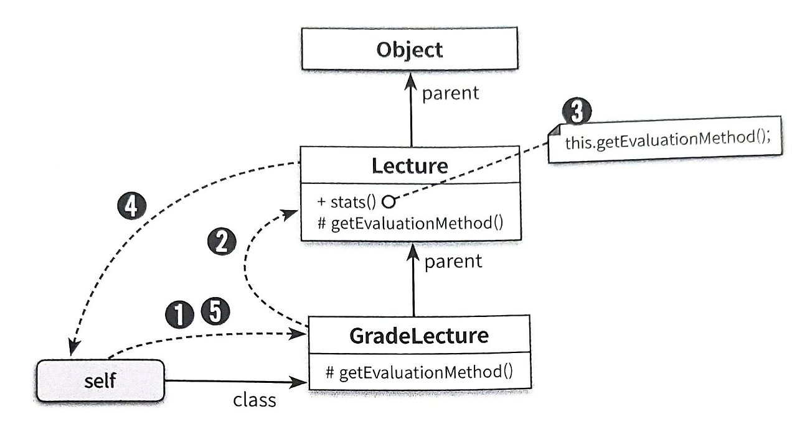

# 12장 다형성

* 상속은 코드를 재사용하는게 아닌 타입 계층을 구조화하기 위해 사용해야 합니다.
* 타입 계층은 객체지향 프로그래밍의 중요한 특성 중 하나인 다형성의 기반을 제공합니다.

## 다형성

* 다형성은 하나의 추상 인터페이스에 대해 코드를 작성하고 이 추상 인터페이스에 대해 서로 다른 구현을 연결할 수 있는 능력으로 정의합니다.
즉, 여러 타입을 대상으로 동작할 수 있는 코드를 작성할 수 있는 방법입니다.
* 다형성의 종류는 다음과 같습니다.
  * 유니버셜(Universal)
    * 매개변수(Parametric) : 제네릭과 관련이 높습니다. 클래스의 인스턴스 변수나 메소드의 매개변수 타입을 임의의 타입으로 선언한 후 사용하는 시점에 구체적인 타입으로 지정하는 방식을 가리킵니다.
    * 포함(Inclusion) : 메시지가 동일하더라도 수신한 객체의 타입에 따라 실제로 수행되는 행동이 달라지는 능력을 의미합니다. 포힘 다형성을 서브타입 다형성이라고 부릅니다.
  * 임시(Ad Hoc)
    * 오버로딩(Overloading) : 하나의 클래스 안에 동일한 이름의 메소드가 존재하는 경우를 가리킵니다.
    * 강제(Coercion) : 언어가 지원하는 자동적인 타입 변환이나 사용자가 직접 구현한 타입 변환을 이용해 동일한 연산자를 다양한 타입에 사용할 수 있는 방식을 가리킵니다.
* 상속의 진정한 목적은 코드 재사용이 아닌 다형성을 위한 서브타입 계층을 구축하는 것입니다.

## 상속의 양면성

* 객체지향 패러다임의 근간을 이루는 아이디어는 데이터와 행동을 객체라고 불리는 하나의 실행 단위안으로 통합하는 것입니다.
* 상속은 부모 클래스에서 정의한 모든 데이터를 자식 클래스의 인스턴스에 자동으로 포함시키기에, 이는 데이터 관점의 상속입니다.
* 데이터뿐만 아닌  부모 클래스에 정의된 일부 메소드 역시 자동으로 자식 클래스에 포함시키기에, 이는 행동 관점의 상속입니다.
* 상속의 목적은 코드 재사용이 아닙니다. 상속은 다형성을 가능하게 하는 타입 계층을 구축하기 위한 것입니다.

### 데이터 관점의 상속

* 데이터 관점에서 상속은 자식 클래스의 인스턴스 안에 부모 클래스의 인스턴스를 포함하는 것으로 볼 수 있습니다.

### 행동 관점의 상속

* 행동 관점의 상속은 부모 클래스가 정의한 일부 메소드를 자식 클래스의 메소드로 포함시키는 것을 의미합니다.

## 업캐스팅과 동적 바인딩

### 같은 메시지, 다른 메소드

* 코드 안에서 선언된 참조 타입과 무관하게 실제로 메시지를 수신하는 객체의 타입에 따라 실행 되는 메소드가 달라질 수 있습니다.
이를 업캐스팅과 동적 바인딩이라는 메커니즘이 동작하기 때문입니다.
  * 부모 클래스 타입으로 선언된 변수에 자식 클래스의 인스턴스를 할당하는 것이 가능합니다. 이를 업캐스팅이라고 합니다.
  * 선언된 변수의 타입이 아닌 메시지를 수신하는 객체의 타입에 따라 실행되는 메소드가 결정됩니다. 이는 객체지향 시스템이 메시지를 처리할 적절한 메소드를 
컴파일 시점이 아닌 실행 시점에 결정하기 때문에 가능한것입니다. 이를 동적 바인딩이라고 합니다.

### 업캐스팅

* 상속을 이용하면 부모 클래스의 퍼블릭 인터페이스가 자식 클래스의 퍼블릭 인터페이스에 합쳐지기 때문에 부모 클래스의 인스턴스에게 전송할 수 있는
메시지를 자식 클래스의 인스턴스에게 전송할 수 있습니다.
* 부모 클래스의 인스턴스를 자식 클래스 타입으로 변환하기 위해서는 명시적인 타입 캐스팅이 필요합니다. 이를 다운캐스팅(downcasting)이라고 합니다.

### 동적 바인딩

* 객체지향 언어에서 메소드를 실행하는 방법은 메시지를 전송하는 것입니다.
* 전통적인 언어들에서 사용하는 함수를 호출하는 방법은 컴파일 시점에 결정됩니다. 이를 정적 바인딩, 초기 바인딩, 컴파일타임 바인딩이라고 부릅니다.
* 객체지향 언어에서 사용하는 메시지를 전송하는 방법은 수신할 객체를 런타임 시점에 결정됩니다. 이를 동적 바인딩, 지연 바인딩이라고 부릅니다.

## 동적 메소드 탑색과 다형성

* 객체지향 시스템은 다음 규칙에 따라 실행할 메소드를 선택합니다.
  * 메시지를 수신한 객체는 먼저 자신을 생성한 클래스에 적합한 메소드가 존재하는지 검사합니다. 존재하면 메소드를 실행하고 탐색을 종료합니다.
  * 메소드를 찾지 못했다면 부모 클래스에서 메소드 탐색을 계속합니다. 이 과정은 적합한 메소드를 찾을 때까지 상속 계층을 따라 올라가며 계속됩니다.
  * 상속 계층의 가장 최상위 클래스에 이르렀지만 메소드를 발견하지 못한 경우 예외를 발생시키며 탐색을 중단합니다.
* 메시지 탐색에 있어 self 참조는 중요한 변수입니다.
* 객체가 메시지를 수신하면 컴파일러는 self 참조라는 임시 변수를 자동으로 생성한 후 메시지를 수신한 객체를 가리키도록 설정합니다.
* 동적 메소드 탐색은 self가 가리키는 객체의 클래스에서 시작해서 상속 계층의 역방향으로 이뤄지며 메소드 탐색이 종료되는 순간 self 참조는 자동으로 소멸됩니다.
* 동적 메소드 탐색은 두 가지 원리로 구성됩니다.
  * 자동적인 메시지 위임 : 자식 클래스는 자신이 이해할 수 없는 메시지를 전송받은 경우 상속 계층을 따라 부모 클래스에게 처리를 위임합니다.
  * 동적 문맥 : 메시지를 수신했을 때, 실제로 어떤 메소드를 실행할지를 결정하는 것은 컴파일 시점이 아닌 실행 시점에 이뤄지며, 메소드를 탐색하는 경로는 self 참조를 이용해 결정합니다.

### 자동적인 메시지 위임

* 동적 메소드 탑색은 상속 계층을 통해 자식 클래스가 이해할 수 없는 메시지를 부모 클래스에게 전달할 수 있습니다.
* 상속을 사용함으로써 메시지 위임과 관련된 코드를 명시적으로 작성할 필요가 없습니다. 이러한 관점에서 상속 계층을 정의하는 것은 메서드 탐색 경로를 정의하는 것과 동일합니다.
* 메소드 오버라이딩은 메소드를 감추지만 메소드 오버라이딩은 공존할 수 있습니다.

### 동적인 문맥

* 메시지를 수신한 객체가 무엇이냐에 따라 메소드 탐색을 위한 문맥이 동적으로 바뀝니다. 이 동적인 문맥을 결정하는 것은 메시지를 수신한 객체를 가리키는 self 참조입니다.

```Java
public class Lecture {
    public String stats() {
        return String.format("Title: %s, Evaluation Method: %s", title, getEvaluationMethod());
    }
    public String getEvaluationMethod() {
        return "Pass or Fail";
    }
}
```

```Java

public class GradeLecture extends Lecture {
  @Override
  public String getEvaluationMethod() {
      return "Grade";
  }
}
```

기존 ```GradeLecture``` 인스턴스의 stats() 메소드를 호출하는경우 ```getEvaluationMethod()``` 에는 stats() 메소드가 없기에 self 참조 탐색을 통해
부모 클래스의 메소드를 호출합니다. 그 후 stats() 메소드 내부에서 getEvaluationMethod() 메소드를 호출하면 ```GradeLecture``` 클래스부터 다시 탐색을 시작하여 메소드를 호출합니다.



이렇듯 상속을 사용하는 상황에서 최악의 경우 실제로 실행될 메소드를 이해하기 위해 상속 계층 전체를 훑어가며 코드를 이해해야 하는 상황이 발생할 수 있습니다.


### 이해할 수 없는 메시지

#### 정적 타입 언어와 이해할 수 없는 메시지

* 정적 타입 언어에서는 코드를 컴파일할 때 상속 계층 안의 클래스들이 메시지를 이해할 수 있는지 여부를 판단합니다.
따라서 메시지를 처리할 수 없는 경우 컴파일 에러가 발생합니다.

#### 동적 타입 언어와 이해할 수 없는 메시지

* 동적 타입 언어는 정적 타입 언어와 마찬가지로 메시지를 처리할 수 있는지 여부를 검사합니다. 하지만 이러한 검사는 런타임에 처리되어 컴파일 시점에는 메시지를 처리할 수 없는지 여부를 판단할 수 없습니다.

### self 대 super

* self 참조의 가장 큰 특징은 동적이라는 점입니다. self 참조는 메시지를 수신한 객체의 클래스에 따라 메소드 탐색을 위한 문맥을 실행 시점에 결정합니다.
* super 참조는 부모 클래스의 인스턴스 변수나 메소드에 접근하기 위해 사용할 수 있는 참조입니다.
* super 참조의 의도는 '부모 클래스부터 메소드 탐색을 시작하세요'라는 것입니다.
* self 참조와 super 참조의 차이점은 메소드 탐색을 시작할 클래스를 결정함에 있습니다.
