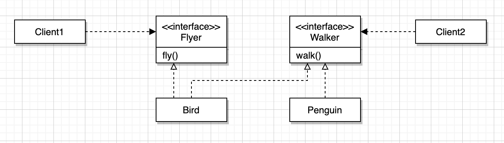

# 13장 서브클래싱과 서브타이핑

* 상속의 용도는 다음과 같습니다.
  * 타입 계층구현 : 타입 계층 안에서 부모 클래스는 일반적인 개념(일반화)을 구현하고 자식 클래스는 특수한 개념(특수화)을 구현합니다.
  * 코드 재사용 : 상속을 사용하면 점진적으로 애플리케이션의 기능을 확장할 수 있지만, 재사용을 위해 상속을 사용하면 부모 클래스와 자식 클래스가 강하게 결합되기에 변경하기 어려운 코드를 얻을 확률이 높아집니다.
* 상속을 사용함에 있어 코드 재사용이 아닌 타입 계층구현을 목적으로 사용해야 합니다.

## 타입

### 개념 관점의 타입

* 개념 관점에서 타입은 우리가 인지하는 세상의 사물의 종류를 의미합니다. 즉, 우리가 인식하는 객체들에 적용하는 개념이나 아이디어를 타입이라고 부릅니다.
* 어떤 대상이 타입으로 분류될 때 그 대상을 타입의 인스턴스라고 부릅니다.
* 타입의 구성요소는 다음과 같이 분류할 수 있습니다.
  * 심볼(symbol) : 타입에 이름을 붙인 것입니다.
  * 내연(intension) : 타입의 정의로서 타입에 속하는 객체들이 가지는 공통적인 속성이나 행동을 가리킵니다. (공통의 특징)
  * 외연(extension) : 타입에 속하는 객체들의 집합입니다. (집합의 크기)

### 프로그래밍 언어 관점의 타입

* 프로그래밍 언어 관점에서 타입은 연속적인 비트에 의미와 제약을 부여하기 위해 사용됩니다. 하지만 비트 자체에는 타입이라는 개념이 존재하지 않습니다.
* 프로그래밍 언어 관점에서 타입은 비트 묶음에 의미를 부여하기 위해 정의된 제약과 규칙을 가리킵니다.
* 프로그래밍 언어에서 타입은 두 가지 목적을 위해 사용됩니다.
  * 타입에 수행될 수 있는 유효한 오퍼레이션의 집합을 정의합니다.
    * 객체의 타입에 따라 적용 가능한 연산자의 종류를 제한함으로써 휴먼에러를 줄일 수 있습니다.
  * 타입에 수행되는 오퍼레이션에 대해 미리 약속된 문맥을 제공합니다.
* 타입은 적용 가능한 오퍼레이션의 종류와 의미를 정의함으로써 코드의 의미를 명확하게 전달하고 개발자의 실수를 방지하기 위해 사용됩니다.

### 객체지향 패러다임 관점의 타입

* 타입은 두 가진 관점에서 정의할 수 있습니다.
  * 개념 관점에서 타입이란 공통의 특징을 공유하는 대상들의 분류입니다.
  * 프로그래밍 언어 관점에서 타입이란 동일한 오퍼레이션을 적용할 수 있는 인스턴스들의 집합입니다.
* 객체의 타입은 객체가 수신할 수 있는 메시지의 종류를 정의한 것입니다.
  * 프로그래밍 언어 관점에서 타입은 호출 가능한 오퍼레이션의 집합을 정의합니다.
  * 객체지향 프로그래밍에서 오퍼레이션은 객체가 수신할 수 있는 메시지를 의미합니다.
* 객체지향 프로그래밍에서 타입을 정의하는 것은 객체의 퍼블릭 인터페이스를 정의하는 것과 동일합니다.즉, 동일한 퍼블릭 인터페이스를 가지는 객체들은 동일한 타입으로 분류할 수 있습니다.
* 객체지향 프로그래밍에서 행동을 통해 타입을 분류할 수 있습니다. 즉, 객체가 외부에 제공하는 행동에 초점을 맞춰야 합니다.

## 타입 계층

### 타입 사이의 포함관계

* 수학에서의 집합은 다른 집합을 포함할 수 있듯이, 타입도 다른 타입을 포함하는 것이 가능합니다.
* 다른 타입을 포함하는 타입은 포함되는 타입보다 좀 더 일반화된 의미를 표현할 수 있습니다. 반면 토함되는 타입은 좀 더 특수하고 구체적입니다.
* 포함하는 타입은 외연 관점에서는 더 크고 내연 관점에서는 더 일반적입니다. 반면 포함되는 타입은 외연 관점에서 더 작고 내연 관점에서 더 특수합니다.
* 타입 계층을 구성하는 두 타입 간의 관계에서 더 일반적인 타입을 슈퍼타입(supertype), 더 특수한 타입을 서브타입(subtype)이라고 부릅니다.
* 내연과 외연의 관점에서 일반화와 특수화를 정의하면 다음과 같습니다.
  * 객체의 정의를 의미하는 내연 관점에서 일반화란 어떤 타입의 정의를 좀 더 보편적이고 추상적으로 만드는 과정을 의미합니다.
  * 특수화란 어떤 타입의 정의를 좀 더 구체적이고 문맥 종속적으로 만드는 과정을 의미합니다.
* 집합을 의미하는 외연 관점에서 일반적인 타입의 인스턴스 집합은 특수한 타입의 인스턴스 집합을 포함하는 슈퍼셋(superset) 입니다.
* 특수한 타입의 인스턴스 집합은 일반적인 타입의 인스턴스 집합에 포함된 서브셋(subset) 입니다.

> 일반화는 다른 타입을 완전히 포함하거나 **내포하는** 타입을 식별하는 행위 또는 그 행위의 결과를 가리킵니다.
> 
> 특수화는 다른 타입 안에 전체적으로 포함되거나 완전히 **내포되는** 타입을 식별하는 행위 또는 그 행위의 결과를 가리킵니다.

* 슈퍼타입은 다음과 같은 특징을 가지는 타입을 가리킵니다.
  * 집합이 다른 집합의 모든 멤버를 포함합니다.
  * 타입 정의가 다른 타입보다 좀 더 일반적입니다.
* 서브타입은 다음과 같은 특징을 가지는 타입을 가리킵니다.
  * 집합에 포함되는 인스턴스들이 더 큰 집합에 포함됩니다.
  * 타입 정의가 다른 타입보다 좀 더 구체적입니다.

### 객체지향 프로그래밍과 타입 계층

* 퍼블릭 인터페이스의 관점에서 슈퍼타입과 서브타입을 다음과 같이 정의할 수 있습니다.
  * 슈퍼타입은 서브타입이 정의한 퍼블릭 인터페이스를 일반화시켜 상대적으로 범용적으로 넓은 의미로 정의한 것입니다.
  * 서브타입은 슈퍼타입이 정의한 퍼블릭 인터페이스를 특수화시켜 상대적으로 구체적이고 좁은 의미로 정의한 것입니다.
* 서브타입의 인스턴스는 슈퍼타입의 인스턴스로 간주될 수 있습니다. 이는 상속과 다형성의 관계를 이해하기 위한 출발점입니다.

## 서브클래싱과 서브타이핑

* 상속을 통해 타입 계층을 구현함은 부모 클래스가 슈퍼타입, 자식 클래스가 서브타입의 역할을 수행하도록 클래스 사이의 관계를 정의한 것을 의미합니다.

### 언제 상속을 사용해야 하는가?

* 상속을 사용해야하는 경우는 다음 두 가지를 만족할 때 입니다.
  * 상속 관계가 is-a 관계를 모델링하는가?
    * "[자식 클래스] 가 [부모 클래스]다" 라고 말할 수 있다면 상속을 사용할 수 있는 후보입니다.
  * 클라이언트 입장에서 부모 클래스의 타입으로 자식 클래스를 사용해도 무방한가? **(중요)**
    * 클라이언트 입장에서 부모 클래스와 자식 클래스의 차이점을 몰라야 한다.(리스코프 치환 원칙)

### is-a 관계

* 어떤 타입 S가 다른 타입 T의 일종이라면 "타입 S는 타입 T다(S is a T)"라고 말할 수 있어야 합니다.

다음과 같은 예를들어 is-a 관계가 직관을 배신할 수 있음을 알 수 있습니다.

* 펭귄은 새다
* 새는 날 수 있다

```Java
public class Bird {
  public void fly() {
  }
}

public class Penguin extends Bird {
}
```

이 상황에서 팽귄은 새가 맞지만 날 수 없는 새이기에 코드의 반은 맞고 반은 틀림을 알 수 있습니다.

이러한 예를 통해서 어휘적인 정의가 아닌 기대되는 행동(퍼블릭 인터페이스?)에 따라 타입 계층을 구성해야 합니다.


어휘적으로 펭귄은 새지만 새의 정의가 날 수 있다는 행동이 포함되면 펭귄은 새의 서브타입이 될 수 없습니다.

따라서 is-a라고 표현가능할수 있더라도 상속을 바로 사용하지 않고 상속을 사용할 후보로 생각해야 합니다.

### 행동 호환성

* 타입이 행동과 관련있음을 생각해야 합니다.
* 타입의 이름 사이에 개념적으로 어떤 연관성이 있다고 하더라도 행동에 연관성이 없다면 is-a 관계를 사용하면 안됩니다.
* 행동이 호환될 경우에만 타입 계층으로 묶어야 합니다.
* 행동의 호환 여부를 판단하는 기준은 클라이언트의 관점입니다. 클라이언트가 두 타입이 동일하게 행동할 것이라고 기대한다면 두 타입을 타입 계층으로 묶을 수 있습니다.

클라이언트가 날 수 있는 새만을 원한다고 가정해보자

```Java
public void flyBird(Bird bird) {
  bird.fly();
}
```

이 경우에 펭귄은 날 수 없는 새이기에 펭귄은 새의 서브타입이 아닙니다. 따라서 새와 펭귄 둘 사이의 상속 관계로 연결한 설계는 수정돼야 합니다.

이를 해결하는 방법으로는 세 가지 방법이 있습니다.

#### 오버라이딩

펭귄 클래스가 새 클래스를 오버라이딩해서 내부 구현을 비워두는 방식입니다.

```Java
public class Penguin extends Bird{
    @Override
    public void fly() {
    }
}
```

이러한 방법은 클라이언트 입장에서 새와 펭귄 사이의 행동이 호환되지 않기에 적절하지 않습니다.

#### 오버라이딩 후 예외 발생

펭귄 클래스가 새 클래스를 오버라이딩해서 예외를 발생시키는 방식입니다.

```Java
public class Penguin extends Bird{
    @Override
    public void fly() {
        throw new UnsupportedOperationException();
    }
}
```

이 경우에도 클라이언트 입장에서 예외가 던져질 것이라고 예상하지 못하기에 적절하지 않습니다.

#### 인스턴스 검사 후 호출

클라이언트가 새의 인스턴스인지 펭귄의 인스턴스인지 검사한 후에 호출하는 방식입니다.

```Java
public void flyBird(Bird bird) {
  if(!(bird instanceof Penguin)) {
    bird.fly();
  }
}
```

이 방법역시 구체적인 클래스에 대한 결합도를 높이기에 변경하기 어려운 코드를 얻을 확률이 높아집니다. 즉, 개발-폐쇄 원칙을 위반합니다.


### 클라이언트 기대에 따라 계층 분리하기

* 클라이언트의 기대에 맞게 상속 계층을 분리한다면 앞선 문제들을 해결할 수 있습니다.

flyBird 메소드는 파라미터로 전달되는 모든 새가 날 수 있다고 가정하기에 flyBird 메소드와 협력하는 모든 객체는 fly 메소드에 대해 올바르게 응답해야 합니다.
따라서 Penguin 인스턴스는 flyBird 메소드와 협력할 수 없으며, 이에 대해 날 수 있는 새와 날 수 없는 새를 명확하게 구분해야합니다.

```Java
public class Bird{
}

public class FlyingBird extends Bird {
  public void fly() {
  }
}

public class Penguin extends Bird {
}
```

이렇게 계층 구조를 분리함으로써 flyBird 메소드를 다음과 같이 변경할 수 있습니다.

```Java
public void flyBird(FlyingBird bird) {
  bird.fly();
}
```

이러한 방법을 통해 클라이언트의 기대에 따라 상속 계층을 분리함으로써 상속 계층을 명확하게 구분할 수 있습니다. 또한 행동 호환성을 만족시킬 수 있습니다.

이를 해결하는 또 다른 방법으로는 인터페이스를 분리하는 것입니다.



하지만 이러한 방법에서 만약 Penguin이 Bird의 코드를 재사용해야 한다면 이러한 방법은 적절하지 않습니다. 재사용을 위한 상속은 위함하기도 합니다.

더 좋은 방법은 합성을 사용하는 것입니다. 물론 Bird 클래스의 퍼블릭 인터페이스를 통해 재사용이 가능하다는 전재를 만족해야 합니다.

클라이언트에 따라 인터페이스를 분리하면 변경에 대한 더 세밀하게 제어할 수 있게 됩니다.
클라이언트에 따라 인터페이스를 분리하면 각 클라이언트의 요구가 바뀌더라도 영향의 파급 효과를 효과적으로 제어할 수 있게 됩니다.

이처럼 인터페이스를 클라이언트의 기대에 따라 분리함으로써 변경에 의해 영향을 제어하는 설계 원칙을 인터페이스 분리 원칙(ISP)이라고 부릅니다.

마지막으로 요구사항 속에서 클라이언트가 기대하는 행동에 집중해야 합니다. 

### 서브클래싱과 서브타이핑

* 상속의 목적을 다시 정리하면 다음과 같습니다.
  * 코드 재사용성(서브 클래싱)
  * 타임 계층을 구성(서브 타이핑)
* 서브 클래싱과 서브 타이핑을 정리하면 다음과 같습니다.
  * 서브클래싱(subclassing) : 다른 클래스의 코드를 재사용할 목적으로 상속을 사용하는 경우, 자식 클래스와 부모 클래스의 행동이 호환되지 않기에 자식 클래스의 인스턴스가 부모 클래스의 인스턴스를 대체할 수 없습니다.
구현 상속, 클래스 상속이라고 부르기도 합니다.
  * 서브타이핑(subtyping) : 타입 계층을 구성하기 위해 상속을 사용하는 경우, 서브타이핑에서는 자식 클래스와 부모 클래스의 행동이 호환되기에 자식 클래스의 인스턴스가 부모 클래스의 인스턴스를 대체할 수 있습니다.
인터페이스 상속이라고 부르기도 합니다.
* 슈퍼타입과 서브타입 사이의 관계에서 가장 중요한 것은 퍼블릭 인터페이스입니다. 즉, 서브타입의 퍼블릭 인터페이스는 슈퍼 타입에서 정의한 퍼블릭 인터페이스와 동일하거나 더 많은 오퍼레이션을 포함해야 한다는 것입니다.
* 서브타이핑 관계가 유지되기 위해서는 서브타입이 슈퍼타입이 하는 모든 행동을 동일하게 할 수 있어야 합니다. 즉, 행동 호환성을 만족시켜야 합니다.
* 자식 클래스와 부모 클래스 사이의 행동 호환성은 부모 클래스에 대한 자식 클래스의 대체 가능성을 포함합니다.
* 행동 호환성과 대체 가능성은 올바른 상속 관계를 구축하기 위해 따라야 할 지침이라고 할 수 있습니다.

## 리스코프 치환 원칙

> 리스코프 치환 원칙은 "서브타입은 그것의 기반 타입에 대해 대체 가능해야 한다"로 클라이언트가 "차이점을 인식하지 못한 채 기반 클래스의 인터페이스를 통해 서브클래스를 사용할 수 있어야 한다"를 의미합니다.

* 리스코프 치환 원칙에 따르면 자식 클래스가 부모 클래스와 행동 호환성을 유지함으로써 부모 클래스를 대체할 수 있도록 구현된 상속 관계만을 서브타이핑이라고 불러야 합니다.

Stack과 Vector는 리스코프 치환 원칙을 위반하는 예입니다. 클라이언트가 부모 클래스인 Vector에 대해 기대하는 행동을 Stack에 대해서는 기대할 수 없기 때문입니다.

### 클라이언트와 대체 가능성

* 리스코프 치환 원칙은 자식 클래스가 부모 클래스를 대체하기 위해서는 부모 클래스에 대한 클라이언트의 가정을 준수해야 한다는 것을 강조합니다.

### is-a 관계 다시 살펴보기

* 상속이 적합한지 판단하는 기준은 다음과 같습니다.
  * is-a 관계를 모델링한 것인가?
  * 클라이언트 입장에서 부모 클래스 대신 자식 클래스를 사용할 수 있는가?
* 두 가진 기준에 대해서 별개로 취급하는게 아닌 두 가진 기준을 동시에 고려해야 합니다.
* is-a 관계는 객체지향에서 중요한 것은 객체의 속성이 아닌 객체의 행동이라는 점을 강조합니다.

### 리스코프 치환 원칙은 유연한 설계의 기반입니다.

* 클라이언트의 입장에서 퍼블릭 인터페이스의 행동 방식이 변경되지 않는다면 클라이언트의 코드를 변경하지 않고도 새로운 자식 클래스와 협력할 수 있게 됩니다.
* 리스코프 치환 원칙은 개빙-폐쇄 원칙을 만족하는 설계를 위한 전제 조건입니다.

### 타입 계층과 리스코프 치환 원칙

* 상속이 아닌 다른 방법을 이용하더라도 클라이언트의 관점에서 서로 다른 구성 요소를 동일하게 다뤄야 한다면 서브타이핑 관계의 제약을 고려해서 리스코프 치환 원칙을 준수해야 합니다.

## 계약에 의한 설계와 서브타이

* 클라이언트와 서버 사이의 협력을 의무와 이익으로 구성된 계약의 관점에서 표현하는 것을 계약에 의한 설계라고 부릅니다.
* 계약에 의한 설계는 클라이언트가 정상적으로 메소드를 실행하기 위해 만족시켜야 하는 사전조건과 메소드가 실행된 후에 서버가 클라이언트에게 보장해야 하는 사후조건,
메소드 실행 전과 실행 후에 인스턴스가 만족시켜야 하는 클래스 불변식의 세 가지 요소로 구성됩니다.
* 리스코프 치환 원칙과 계약에 의한 설계 사이의 관계는 "서브타입이 리스코프 치환 원칙을 만족시키기 위해서는 클라이언트와 슈퍼타입 간에 체결된 '계약'을 준수해야 합니다."라고 정리할 수 있습니다.