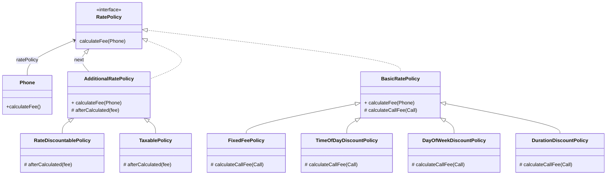

# 14장 일관성 있는 협력

* 객체는 협력을 위해 존재하며, 협력은 객체가 존재하는 이유와 문맥을 제공합니다.
* 잘 설계된 애플리케이션은 이해하기 쉽고, 수정이 용이하며, 재사용 가능한 협력의 모임입니다.
* 객체지향 설계의 목표는 적절한 책임을 수행하는 객체들의 협력을 기반으로 결합도가 낮고 재사용 가능한 코드 구조를 창조하는 것입니다.
* 객체지향 패러다임의 장점은 설계를 재사용할 수 있다는 것입니다. 재사용을 위해서는 객체들의 협력 방식을 일관성 있게 만들어야 합니다.
* 일관성은 설계에 드는 비용을 감소시킵니다. 또한 일관성은 코드를 이해하기 쉽게 만들어줍니다.

## 핸드폰 과금 시스템 변경하기

### 기본 정책 확장



### 비일관성

#### 고정 요금
```Java
public class FixedFeePolicy extends BasicRatePolicy {
    private Money amount;
    private Duration seconds;

    public FixedFeePolicy(Money amount, Duration seconds) {
        this.amount = amount;
        this.seconds = seconds;
    }

    @Override
    protected Money calculateCallFee(Call call) {
        return amount.times(call.getDuration().getSeconds() / seconds.getSeconds());
    }
}
```

#### 시간대별 할인

* 시간대별 할인 정책은 시작 시간과 종료 시간, 기본 요금과 기본 요금이 적용되는 시간을 가지고 있습니다.
* 이를 각각의 리스트로 관리하고, 이를 기반으로 요금을 계산합니다.

```Java
public class TimeOfDayDiscountPolicy extends BasicRatePolicy {
    private List<LocalTime> starts = new ArrayList<LocalTime>();
    private List<LocalTime> ends = new ArrayList<LocalTime>();
    private List<Duration> durations = new ArrayList<Duration>();
    private List<Money>  amounts = new ArrayList<Money>();

    @Override
    protected Money calculateCallFee(Call call) {
        Money result = Money.ZERO;
        for(DateTimeInterval interval : call.splitByDay()) {
            for(int loop=0; loop < starts.size(); loop++) {
                result.plus(amounts.get(loop).times(Duration.between(from(interval, starts.get(loop)),
                        to(interval, ends.get(loop))).getSeconds() / durations.get(loop).getSeconds()));
            }
        }
        return result;
    }

    private LocalTime from(DateTimeInterval interval, LocalTime from) {
        return interval.getFrom().toLocalTime().isBefore(from) ? from : interval.getFrom().toLocalTime();
    }

    private LocalTime to(DateTimeInterval interval, LocalTime to) {
        return interval.getTo().toLocalTime().isAfter(to) ? to : interval.getTo().toLocalTime();
    }
}
```

#### 요일별 할인

* 요일별 할인 규칙은 할인을 적용할 요일과 단위시간, 단위 금액을 가지고 있습니다.
* 요일별 할인 정책은 이러한 규칙을 리스트로 가지며 이를 기반으로 요금을 계산합니다. 즉, 요일, 단위 시간, 단위 금액을 따로따로 관리하지 않습니다. 

```Java
public class DayOfWeekDiscountRule {
    private List<DayOfWeek> dayOfWeeks = new ArrayList<>();
    private Duration duration = Duration.ZERO;
    private Money amount = Money.ZERO;

    public DayOfWeekDiscountRule(List<DayOfWeek> dayOfWeeks,
                                 Duration duration, Money  amount) {
        this.dayOfWeeks = dayOfWeeks;
        this.duration = duration;
        this.amount = amount;
    }

    public Money calculate(DateTimeInterval interval) {
        if (dayOfWeeks.contains(interval.getFrom().getDayOfWeek())) {
            return amount.times(interval.duration().getSeconds() / duration.getSeconds());
        }

        return Money.ZERO;
    }
}

public class DayOfWeekDiscountPolicy extends BasicRatePolicy {
    private List<DayOfWeekDiscountRule> rules = new ArrayList<>();

    public DayOfWeekDiscountPolicy(List<DayOfWeekDiscountRule> rules) {
        this.rules = rules;
    }

    @Override
    protected Money calculateCallFee(Call call) {
        Money result = Money.ZERO;
        for(DateTimeInterval interval : call.getInterval().splitByDay()) {
            for(DayOfWeekDiscountRule rule: rules) { result.plus(rule.calculate(interval));
            }
        }
        return result;
    }
}
```

#### 구간별 방식

* 앞서 구현한 정책들은 개념적으로는 연관되어 있지만 구현 방식에 있어서는 완전히 제각각입니다.
* 비일관성은 새로운 구현을 추가하거나, 기존의 구현을 이해해야 하는 상황에서 문제가 발생합니다.
* 새로운 구현을 추가해야하는 경우 기존의 다 다른 방식의 구현방법으로 인해 새로운 구현을 추가할수록 코드 사이의 일관성은 점점 어긋나게 됩니다.
* 유사한 기능을 서로 다른 방식으로 구현해서는 안 됩니다.
* 객체지향에서 기능을 구현하는 유일한 방법은 객체 사이의 협력을 만드는 것뿐이므로 유지보수 가능한 시스템을 구축하는 첫걸음은 협력을 일관성 있게 만드는 것입니다.


## 설계에 일관성 부여하기

* 일관성 있는 설계를 만드는 데 가장 훌륭한 조언은 다양한 설계 경험을 익히라는 것입니다. 그리고 널리 알려진 디자인 패턴을 학습하고 변경이라는 문맥 안에서 디자인 패턴을 적용해 봐야 합니다.
* 협력을 일관성 있게 만들기 위해서는 다음과 같은 지침을 따르면 좋습니다.
  * 변하는 개념을 변하지 않는 개념으로부터 분리하라.
  * 변하는 개념을 캡슐화하라.
* 조건에 따라 분기되는 어떤 로직들이 있다면 이 로직들이 바로 개별적인 변경이라고 볼 수 있습니다.
* 절차지향 프로그래밍에서 변경을 처리하는 전통적인 방법은 조건문의 분기를 추가하거나 개별 분기 로직을 수정하는 것입니다.
* 객체지향에서 변경을 다루는 전통적인 방법은 조건 로직을 객체 사이의 이동으로 바꾸는 것입니다.
* 클래스를 분리하기 위한 기준은 변경의 이유와 주기입니다. 즉, 단일 책임 원칙을 따르도록 클래스를 분리해야 합니다.
* 큰 메소드를 가진 클래스를 작은 클래스들로 분리하면 작은 클래스들이 역할이라는 추상화로 묶이며 역할 사이에서 이뤄지는 협력을 통해 일관성을 유지할 수 있게 해줍니다.
* 일관성 있는 협력을 위한 지침은 다음과 같습니다.
  * 변하는 개념을 변하지 않는 개념으로부터 분리하라.
  * 변하는 개념을 캡슐화하라.
* 추상화에 대한 의존은 결합도를 낮추고 결과적으로 대체 가능한 역할로 구성된 협력을 설계할 수 있게 해줍니다. 즉, 선택하는 추상화의 품질이 캡슐화의 품질을 결정합니다.
* 타입을 캡슐화하고 낮은 의존성을 유지하기 위한 방법은 다음과 같습니다.
  * 6장 : 인터페이스 설계 원칙
  * 8,9장 : 의존성 관리 기법
  * 10장 : 코드 재사용을 목적으로하는 상속을 사용할 때 주의할점
  * 11장 : 상속 대신 합성
  * 13장 : 리스코프 치환 원칙을 준수하는 타입 계층 구현

### 캡슐화 다시 살펴보기

* 캡슐화는 단순 데이터를 감추는 것이 아닌 소프트웨어 안에서 변할 수 있는 모든 '개념'을 감추는 것입니다. 즉, 변하는 모든것을 감추는 것입니다.
* 캡슐화의 대표적인 예로 객체의 퍼블릭 인터페이스와 구현을 분리하는 것입니다.
  * 객체를 구현한 개발자는 필요할 때 객체의 내부 구현을 수정하기를 원합니다. 하지만 클라이언트 개발자는 인터페이스가 변경되지 않길 원하기에 객체의 내부 구현을 감추는 것입니다.
* 캡슐화의 종류를 다음과 같이 분류할 수 있습니다.
  * 데이터 캡슐화 : 클래스 내부에 관리하는 데이터를 캡슐화합니다.
  * 메소드 캡슐화 : 클래스 내부 행동을 캡슐화합니다.
  * 객체 캡슐화 : 객체와 객체 사이의 관계를 캡슐화합니다.(합성)
  * 서브타입 캡슐화 : 서브타입의 종류를 캡슐화합니다.
* 서브타입 캡슐화와 객체 캡슐화를 적용하는 방법은 다음과 같습니다.
  * 변하는 부분을 분리해서 타입 계층을 만듭니다.
    * 변하지 않는 부분으로부터 변하는 부분을 분리합니다.
    * 변하는 부분들의 공통적인 행동을 추상 클래스나 인터페이스로 추상화한 후 변하는 부분들이 추상 클래스나 인터페이스를 상속받게 만듭니다.
  * 변하지 않는 부분의 일부로 타입 계층을 합성합니다.
    * 구현한 타입 계층을 변하지 않는 부분에 합성합니다.
    의존성 주입과 같이 결합도를 느슨하게 유지할 수 있는 방법을 이용해 오직 추상화에만 의존하게 만들어야합니다.

### 패턴을 찾아라

* 일관성 있는 협력의 핵심은 변경을 분리하고 캡슐화하는 것입니다.
* 변경을 캡슐화하는 방법이 협력에 참여하는 객체들의 역할과 책임을 결정하고 결정된 협력이 코드의 구조를 결정합니다.
* 변경에 탄력적으로 대응할 수 있는 다양한 캡슐화 방법과 설계 방법을 익히는 것은 중요합니다.
* 현재 구조가 변경을 캡슐화하기 적합하지 않다면 코드를 수정하지 않고도 원하는 변경을 수용할 수 있도록 협력과 코드를 리팩터링해야 합니다.
* 변경을 수용할 수 있는 적절한 역할과 책임을 찾다보면 협력의 일관성이 서서히 윤곽을 드러낼 것입니다.