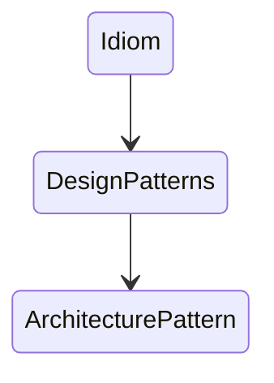

# 15장 디자인 패턴과 프레임워크

* 디자인 패턴은 소프트웨어 설계에서 반복적으로 발생하는 문제에 대해 반복적으로 적용할 수 있는 해결방법입니다.
* 디자인 패턴의 목적은 설계를 재사용하는 것입니다.
* 디자인 패턴을 익히고 나면 변경의 방향과 주기를 이해하는 것만으로도 필요한 역할과 책임, 역할들의 협력 방식을 순간적으로 떠올릴 수 있게 됩니다.
* 프레임워크는 설계와 코드를 함께 재사용하기 위한 것입니다.
* 프레임워크는 애플리케이션의 아키텍처를 구현 코드의 형태로 제공합니다.
* 프레임워크는 일관성 있는 협력을 제공하는 확장 가능한 코드입니다.

## 디자인 패턴과 설계 재사용

### 소프트웨어 패턴

* 패턴이란 무엇인가를 논의할 때면 반복적으로 언급되는 몇 가지 핵심적인 특징은 다음과 같습니다.
  * 패턴은 반복적으로 발생하는 문제와 해볍의 쌍으로 정의됩니다.
  * 패턴을 사용함으로써 이미 알려진 문제와 이에 대한 해법을 문서로 정리할 수 있으며, 이 지식을 다른 사람들과 의사소통할 수 있습니다.
  * 패턴은 추상적인 원칙과 실제 코드 작성 사이의 간극을 메워주며 실질적인 코드 작성을 돕습니다.
  * 패턴의 요점은 패턴이 실무에서 탄생했다는 점입니다.
* 패턴은 한 컨텍스트에서 유용한 동시에 다른 컨텍스트에서도 유용한 '아이디어'입니다.
* 패턴이 지닌 가장 큰 가치는 경험을 통해 축적된 실무 지식을 효과적으로 요약하고 전달할 수 있다는 점입니다.
* 패턴의 이름은 커뮤니티가 공유할 수 있는 중요한 어휘집을 제공합니다.
* 연관된 패턴들의 집합들을 의미하는 패턴언어는 연관된 패턴 카테고리뿐만 아니라 패턴의 생성 규칙과 함께 패턴 언어에 속한 다른 패턴과의 관계 및 협력 규칙을 포함합니다.

### 패턴 분류

* 패턴을 분류하는 가장 일반적인 방법은 패턴의 범위나 적용 단계에 따라 아키텍처 패턴, 분석 패턴, 디자인  패턴, 이디엄의 4가지로 분류할 수 있습니다.
* 아키텍처 패턴
  * 디자인 패턴의 상위에는 소프트웨어의 전체적인 구조를 결정하기 위해 사용할 수 있는 아키텍처 패턴이 위치합니다.
  * 아키텍처 패턴은 미리 정의된 서브시스템들을 제공하고, 각 서브시스템들의 책임을 정의하며, 서브시스템들 사이의 관계를 조직화하는 규칙과 가이드라인을 포함합니다.
  * 아키텍처 패턴은 프로그래밍 언어나 프로그래밍 패러다임에 독립적입니다.
* 이디엄
  * 디자인 패턴 하위에는 이디엄이 위치합니다.
  * 이디엄은 특정 프로그래밍 언어에만 국한된 하위 레벨 패턴으로, 주어진 언어의 기능을 사용해 컴포넌트, 혹은 컴포넌트 간의 특정 측면을 구현하는 방법을 서술합니다.
  * 이디엄은 언어 종속적이기에 특정 언어의 이디엄이 다른 언어에서는 무용지물이 될 수 있습니다.
* 분석 패턴
  * 분석 패턴은 도메인 내의 개념적인 문제를 해결하는 데 초점을 맞춥니다.
  * 분석 패턴은 업무 모델링 시에 발견되는 공동적인 구조를 표현하는 개념들의 집합입니다.
  * 분석 패턴은 단 하나의 도메인에 대해서만 적절할 수 있고 여러 도메인에 결쳐 적용할 수도 있습니다.

### 패턴과 책임-주도 설계

* 객체지향 설계에서 가장 중요한 일은 올바른 책임을 올바른 객체에게 할당하고 객체 간의 유연한 협력 관계를 구축하는 일입니다.
* 책임과 협력의 윤곽은 캡슐화, 크기, 의존성, 유연성, 성능, 확장 가능성, 재사용성 등의 다양한 요소들의 트레이드오프를 통해 결정됩니다.
* 패턴은 공통으로 사용할 수 있는 역할, 책임, 협력의 템플릿입니다.
* 특정한 상황에 적용 가능한 패턴을 잘 안다면 객체들의 역할과 책임, 협력 관계를 빠르고 손쉽게 구성할 수 있습니다.
* 패턴의 구성 요소는 클래스가 아닌 '역할'입니다.
* 디자인 패턴의 구성요소가 클래스와 메소드가 아닌 역할과 책임이라는 사실을 알아야합니다.

### 캡슐화와 디자인 패턴

* 디자인 패턴들은 특정한 변경을 캡슐화하기 위한 독자적인 방법을 정의하고 있습니다.
* 대부분의 디자인 패턴의 목적은 특정한 변경을 캡슐화함으로써 유연하고 일관성 있는 협력을 설계할 수 있는 경험을 공유하는 것입니다.

#### 전략 패턴

#### 템플릿 메소드 패턴

#### 데코레이터 패턴

### 패턴은 출발점이다

* 패턴은 출발점이지 목적지가 아닙니다. 즉, 패턴은 설계의 목표가 되어서는 안됩니다.
* 패턴을 맹목적으로 사용하면 안됩니다. 이렇듯 맹목적으로 사용함을 '패턴 만능주의'라고 부릅니다.
* 패턴을 적용할 때는 함께 작업하는 사람들이 패턴에 익숙한지 여부를 확인하고, 그렇지 않다면 설계에 대한 지식과 더불어 패턴에 대한 지식도 함께 공유하는 것이 필요합니다.
* 패턴을 가장 효과적으로 적용하는 방법은 패턴을 지향하거나 패턴을 목표로 리팩터링하는 것입니다.

## 프레임워크와 코드 재사용

### 코드 재사용 대 설계 재사용

* 재사용 관점에서 설계 재사용보다 더 좋은 방법은 코드 재사용입니다.
* 재사용에 관한 가장 이상적인 형태는 설계 재사용과 코드 재사용을 적절한 수준으로 조합하는 것입니다.
* 프레임워크란 '추상 클래스나 인터페이스를 정의하고 인스턴스 사이의 상호작용을 통해 시스템 전체 혹은 일부를 구현해 놓은 재사용 가능한 설계', 
또는 '애플리케이션 개발자가 현재의 요구사항에 맞게 커스터마이징할 수 있는 애플리케이션의 골격'을 의미합니다.
  * 첫번째 정의는 프레임워크의 구조적인 측면에 초점을 맞추고 있습니다.
  * 두번째 정의는 코드와 설계의 재사용이라는 프레임워크의 사용 목적에 초점을 맞춥니다.
* 프레임워크는 코드를 재사용함으로써 설계 아이디어를 재사용합니다.

### 상위 정책과 하위 정책으로 패키지 분리

* 추상 클래스와 인터페이스가 일관성 있는 협력을 만드는 핵심입니다.
* 협력을 일관성있고 유연하게 만들기 위해서는 추상화를 이용해 변경을 캡슐화해야 합니다.
* 협력을 구현하는 코드 안의 의존성은 가급적이면 추상 클래스나 인터페이스와 같은 추상화를 향하도록 작성해야 합니다.
* 전통적인 소프트웨어 개발 방법의 경우 상위 레벨 모듈이 하위 레벨 모듈에, 그리고 상위 정책이 구체적인 세부적인 사항에 의존하도록 소프트웨어를 구성합니다. 
  * 세부사항은 자주 변경되기에 변경에 대한 파급효과로 인해 상위 정책이 불안정해질 것입니다.
  * 상위 정책이 세부 사항에 비해 재사용될 가능성이 높습니다.
* 의존성 역전 원칙의 관점에서 세부 사항은 '변경'을 의미합니다.
* 재사용을 위해서는 변하는 것(세부 사항)과 변하지 않는 것(상위 정책)을 서로 분리해야 합니다.
* 프레임워크는 여러 애플리케이션에 걸쳐 재사용 가능해야 하기에 변하는 것과 변하지 않는 것들을 서로 다른 주기로 배포할 수 있도록 별도의 '배포 단위'로 분리해야합니다.
* 의존성 역전 원에 따라 추상화에만 의존하도록 의존성의 방향을 조정하고 추상화를 경계로 분리했다면 세부 사항을 구현한 모듈은 항상 상위 정책을 구현한 모듈에 의존해야 합니다.

### 제어 역전 원리

* 상위 정책을 재사용한다는 것은 결국 도메인에 존재하는 핵심 개념들 사이의 협력 관계를 재사용한다는 것을 의미합니다.
* 객체지향 설계의 재사용성은 개별 클래스가 아닌 객체들 사이의 공통적인 협력 흐름으로부터 나옵니다.
* 의존성 역전 원리는 전통적인 설계 방법과 객체지향을 구분하는 가장 핵심적인 원리입니다.
* 의존성 역전 원리는 프레임워크의 가장 기본적인 설계 메커니즘입니다.
* 의존성 역전은 의존성의 방향뿐만 아니라 제어 흐름의 주체 역시 역전시킵니다.
* 의존성을 역전시킨 객체지향 구조에서는 프레임워크가 애플리케이션에 속하는 서브클래스의 메소드를 호출합니다. 즉, 프레임워크를 사용할 경우 개별 애플리케이션에서 프레임워크로 제어 흐름의 주체가 이동합니다.
즉, 의존성을 역전시키면 제어 흐름의 주체 역시 역전됩니다.(IoC)
* 제어 역전이 프레임워크의 핵심 개념인 동시에 코드의 재사용을 가능하게 하는 힘입니다.