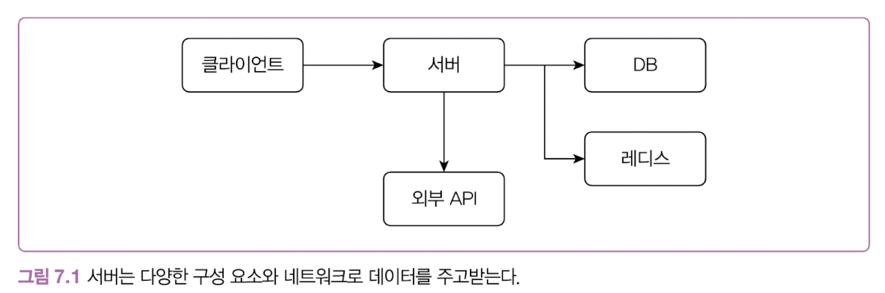
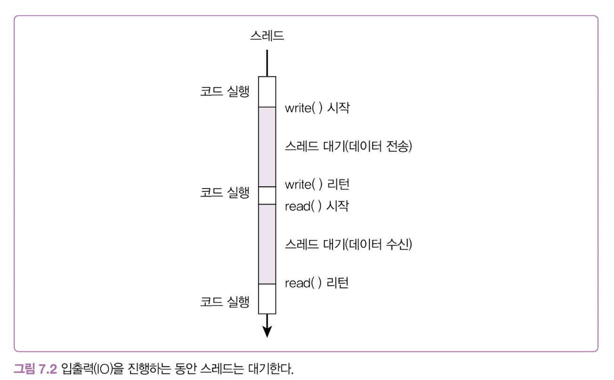

# 7장 IO 병목, 어떻게 해결하지

## 네트워크 IO와 자원 효율

서버에서의 데이터 처리 흐름은 일반적으로 다음과 같습니다.



그리고 데이터를 주고 받는 과정에서는 TCP나 HTTP와 같은 네트워크를 통해 데이터를 주고 받습니다.



이렇게 데이터를 주고 받는 시간동안 스레드는 아무것도하지 않고 입출력이 끝날 떄까지 대기합니다.

> 네트워크 요청 처리 과정
> 1. 서버로 데이터 요청
> 2. read() 시스템 콜 호출을 통해 블록킹
> 3. 백그라운트에서 운영체제에 의해 주기적으로 패킷들을 처리함(인터럽트가 사용됨)
> 4. 프로토콜 헤더의 종료 플래그가 있다면 데이터 수신 완료
> 5. read() 값 반환

이렇게 스레드가 블럭킹이 된다면 스레드 수를 늘려 요청 수를 늘릴 수 있습니다. 하지만 스레드또한 용량을 점유하기 때문에 늘릴 수 있는 스레드에는 한계가 있습니다. 또한 스레드를 늘리면 늘릴수록 컨텍스트 스위칭 비용이 많이 발생하게 됩니다.


정리해보면 다음과 같은 이유로 트래픽 증가하면 자원 효율이 떨어지게 됩니다.

1. IO 대기와 컨텍스트 스위칭에 따른 CPU 낭비
2. 요청마다 스레드를 할당함으로써 메모리 사용량이 높음

위 문제를 다음과 같은 방법을 통해 해결할 수 있습니다.

* 가상 스레드나 고루틴 같은 경량 스레드 사용
* 논블럭킹 또는 비동기 IO 사용

## 가상 스레드로 자원 효율 높이기

요청단 스레드 모델의 경우 앞서 이야기한대로 많은 스레드를 생성할 수 없는 문제가 있었습니다. 이를 자바에서는 가상 스레드를 통해 해결할 수 있습니다.

가상 스레드는 기존 스레드의 메모리 사용량(1MB)에 비해 훨씬 적은 2KB만을 사용합니다. 즉 일반 스레드 1개 생성할 때 사용되는 메모리 크기에서 500배 차이가 발생합니다.

하지만, 요청량이 많지 않은 상황에서 가상 스레드를 사용하면 단점이 생기게 됩니다.

1. GC 오버헤드
    * 가상 스레드는 동적으로 크기가 결정되기 때문에 힙 메모리에서 관리됨
    * 힙 메모리에서 관리되기 떄문에 기존 스레드와 다르게 스레드 내의 스택이 힙에서 관리됨
    * 추가로 기존 플랫폼 스레드의 경우 스택이 연속된 메모리에서 관리되어 캐시 친화적이였다면, 가상 스레드의 경우 스택이 힙 메모리에서 관리되어 메모리 지역성이 떨어지게 됩니다. 즉, 캐시 미스 가능성이 커지게 됩니다.
```
플랫폼 스레드 메모리 레이아웃:
┌─────────────────┐
│     Heap        │ ← 객체들이 저장되는 곳
├─────────────────┤
│   Method Area   │ ← 클래스 메타데이터
├─────────────────┤
│  Thread Stack 1 │ ← OS가 할당한 네이티브 스택 (보통 1-2MB)
├─────────────────┤
│  Thread Stack 2 │ ← 각 플랫폼 스레드마다 별도 스택 영역
├─────────────────┤
│       ...       │
└─────────────────┘
가상 스레드 메모리 레이아웃:
┌─────────────────┐
│     Heap        │ ← 모든 객체 + 가상 스레드 스택들!
│  ┌─────────────┐│
│  │VirtualThread││ ← 가상 스레드 객체
│  │   Stack     ││ ← 스택도 힙의 객체로 저장
│  └─────────────┘│
│  ┌─────────────┐│
│  │VirtualThread││ ← 다른 가상 스레드
│  │   Stack     ││
│  └─────────────┘│
├─────────────────┤
│ Carrier Stack 1 │ ← 소수의 캐리어 스레드 스택만 존재
├─────────────────┤
│ Carrier Stack 2 │
└─────────────────┘
```
2. ThreadLocal 메모리 사용량
    * 근본적 설계 철학의 차이: ThreadLocal은 "스레드가 비싸다"는 전제하에 설계됨, 가상 스레드는 "스레드가 저렴하다"는 철학, 두 철학이 충돌하는 지점
    * 가상 스레드가 회수될 때, ThreadLocal이 회수됩니다. 이에 따라 메모리 사용량이 기하급수적으로 늘어날 수 있습니다.
```
시나리오: 동시 요청 100만 개

플랫폼 스레드 (100개 스레드 풀):
- ThreadLocal 총 사용량: 100개 × 16KB = 1.6MB

가상 스레드 (100만 개):
- ThreadLocal 총 사용량: 1,000,000개 × 16KB = 16GB!
```
3. CPU 집약적 처리
    * cpu 집약적 처리에서 가상 스레드를 활용하면 특정 가상스레드가 플랫폼 스레드를 점유하게 되고, 이로인해 다른 가상 스레드들을 실행할 기회를 얻지 못하는 상황이 발생합니다.
    * 추가로, 플랫폼 스레드는 일반적으로 서버의 코어 수만큼 생성됩니다.


결국 가상 스레드로서 해결할 수 있는 경우는 대용량 요청과 함께 I/O 집약적인 경우입니다. 그 외의 요청들은 오히려 가상 스레드가 느릴 수 있습니다.
    
## 논블록킹 I/O로 성능 더 높이기

가상 스레드도 오버헤드가 있기 때문에, 어느 시점에는 nodejs나 Netty에서와 같이 논블럭킹 I/O를 통해 성능 문제를 해결해야 합니다.

### epoll, io_uring

대표적인 멀티플랙싱을 구현할 때 epoll을 사용합니다. epoll의 간단한 동작 방식은 다음과 같습니다.


1. 데이터 요청
2. "파일 디스크립터가 읽기/쓰기 준비됨"을 통지
3. 애플리케이션 수준에서 read/write 시스템 콜 호출

```
epoll_wait() → "fd 5번이 읽기 준비됨" → read(fd=5) → 데이터 획득
    ↑              ↑                    ↑
  준비 대기        준비 통지            실제 I/O
```

즉, 요청에서 응답을 받기 과정 중 읽기에서만 I/O 블럭킹이 발생합니다. 예를들면, epoll에서 이벤트를 처리할 떄, 대기하고 있는 이벤트가 100개라면 read 시스템 콜이 100번 발생하고 이에 따른 I/O 블록킹이 발생하게 됩니다.

이를 어떻게하면 해결할 수 있을까요?

### io_uring

io_uring은 최신 리눅스에서 제공하는 새로운 비동기 I/O 구조입니다.

기존 비동기 I/O에는 다음과 같은 문제가 있었습니다.

* 파일 I/O에만 제한적으로 동작 (네트워크 I/O 지원 부족)
* 시스템 콜 오버헤드 (각 I/O 요청마다 커널 진입)
* 복잡한 완료 통지 메커니즘 (시그널, 폴링)
* 제한적인 배치 처리 능력

io_uring은 다음과 같은 방법을 통해 해결했습니다.


#### 통합된 비동기 인터페이스

기존 리눅스의 AIO에서는 Direct I/O(O_DIRECT, O_SYNC, O_DSYNC)에 대해서만 지원됐습니다. 즉, Buffered I/O에 대해서는 블록킹이 발생하게 됐습니다(epoll의 read). 이에 따라 io_uring에서는 모든 IO에 대한 지원을 위해 범용 연산 코드를 정의했습니다.

* IORING_OP_READ/WRITE: 파일 I/O
* IORING_OP_RECV/SEND: 네트워크 I/O
* IORING_OP_ACCEPT: 소켓 연결 수락
* IORING_OP_POLL_ADD: 이벤트 폴링
* IORING_OP_FSYNC: 파일 동기화
* IORING_OP_SPLICE: 파이프 연산

#### 매모리 매핑 기반 배치 통신

기존에는 각 소켓 요청마다 개별적인 시스템 콜이 필요했습니다. 예를 들어 100개의 요청을 처리하려면 100번의 시스템 콜이 발생하며, 매번 사용자 공간과 커널 공간 간의 컨텍스트 스위칭이 일어나 상당한 오버헤드가 발생했습니다.

io_uring은 사용자-커널 간 공유 메모리 영역을 생성하여 이 문제를 근본적으로 해결했습니다. 이 공유 메모리를 통해 시스템 콜 없이도 직접 데이터를 주고받을 수 있게 되었습니다.

요청 처리를 위한 Submit Queue라는 링 버퍼를 생성합니다. 이 단일 링 버퍼를 통해 여러 요청을 배치(batch)로 묶어서 한 번에 처리할 수 있게 되어, 기존 AIO와 달리 대규모 배치 처리가 가능해졌습니다.

요청 완료를 관리하기 위한 Completion Queue 링 버퍼도 별도로 제공됩니다. 사용자 공간에서는 이 링 버퍼를 폴링(polling) 방식으로 모니터링하여 완료된 요청의 결과를 효율적으로 조회할 수 있습니다.