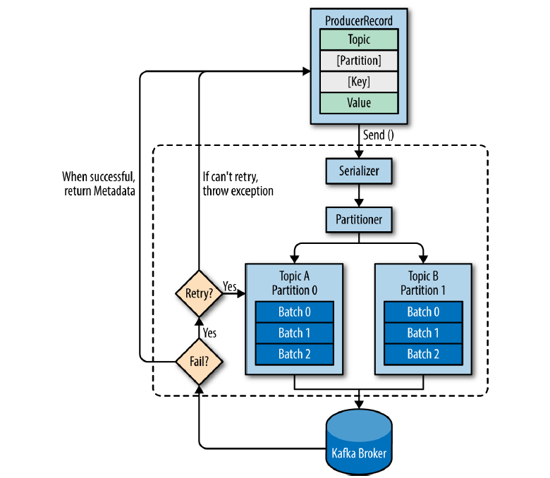

# 3장 카프카 프로듀서 : 카프카에 메시지 쓰기

## 3.1 프로듀서 개요

* 프로듀서 API가 데이터를 전송할 때 내부적으로 처리하는 과정은 다음과 같다.



* 카프카에 메시지를 작성할 때 ProducerRecord 객체를 생성하며 이 객체는 토픽 이름, 파티션 번호, 키, 값, 타임스탬프를 포함한다.
* ProducerRecord를 네트워크 상으로 전송하기 위해 바이트 배열로 직렬화한다.
* 직렬화환 데이터를 같이 전송될 레코드들이 모인 레코드 배치에 추가한다.
* 저장된 배치는 별도의 스레드를 통해 적절한 카프카 브로커로 전송된다.
* 브로커가 메시지를 받으면 응답을 돌려준다.
  * 성공하면 토픽, 파티션, 레코드의 오프셋을 담은 RecordMetadata 객체를 반환한다.
  * 실패하면 에러를 반환한다.

## 3.2 카프카 프로듀서 생성하기

* 카프카에서 메시지를 쓰기 위해 원하는 속성을 추가한 후 프로듀서 객체를 생성한다.
* 카프카에서는 메시지 전송 방법을 3개 제공한다.
  * 파이어 앤 포켓
    * 메시지를 전송후 성공, 실패 상관없이 다음 메시지를 전송한다.
  * 동기적 전송
    * 카프카는 비동기적으로 동작하지만 Future의 get() 메소드를 통해서 동기적으로 전송할 수 있다.
  * 비동기적 전송
    * 카프카는 비동기적으로 동작하며 Future 객체를 반환한다.

### bootstrap.servers

* 카프카 클러스터와 연결하기 위해 프러듀서가 사용할 브로커의 <host>:<port> 목록이다.
* 모두 지정하지 않고 일부만 지정하더라도 클러스터의 모든 브로커를 알 수 있다. 이때 처음 지정하는 브로커의 정보를 한 개만 지정한다면 이 브로커가 중지될 경우 
얻어올 수 없기 때문에 2개 이상을 지정해줘야 한다.

```Kotlin

import org.apache.kafka.clients.admin.AdminClient
import org.apache.kafka.common.Node
import java.util.*

class KafkaBrokerDetector {


}

fun main(){
    val props = Properties()
    props["bootstrap.servers"] = "localhost:9092" // Replace with your Kafka cluster bootstrap servers

    try {
        AdminClient.create(props).use { adminClient ->
            val clusterResult = adminClient.describeCluster()
            val nodes: Collection<Node> = clusterResult.nodes().get()

            for (node in nodes) {
                System.out.println("Broker ID: " + node.id())
                System.out.println("Host: " + node.host())
                System.out.println("Port: " + node.port())
                println("---------------------------")
            }
        }
    } catch (e: Exception) {
        e.printStackTrace()
    }
}
```
```
Broker ID: 1
Host: localhost
Port: 9092
---------------------------
Broker ID: 2
Host: localhost
Port: 9093
---------------------------
Broker ID: 3
Host: localhost
Port: 9094
---------------------------
```

### key.serializer

* 카프카에 쓸 레코드의 키 값을 직렬화하기 위해 사용하는 크래스다.
* 카프카는 키와 밸류 값을 바이트 배열로 전송하기 때문에 직렬화가 필요하다.

### value.serializer

* 카프카에 쓸 레코드의 밸류 값을 직렬화하기 위해 사용하는 클래스다.


## 3.3 카프카로 메시지 전달하기

```Kotlin
val record = ProducerRecord<String, String>("CustomrCountry", "Precision Products", "France")
try{
    producer.send(record)
catch(e: Exception){
    e.printStackTrace()
}
```

* 레코드를 전송하기 위해 ProducerRecord 객체를 생성한다. 이때 토픽 이름, 키, 밸류를 통해 생성한다.
* ProducerRecord를 전송하기 위해 send() 메소드를 호출한다. 메시지는 버퍼에 저장되었다가 별도 스레드에 이해 브로커로 보내진다.
* 카프카로 전송하기 전 에러가 발생할 수 있다. 대표적으로 직렬화 실패 예외인 SerializationException이 발생할 수 있다.

### 3.3.1 동기적으로 메시지 전송하기

* 동기적으로 메시지를 전송할 경우 에러에 대한 처리를 직접할 수 있다. 하지만 이 방법은 성능에 영향을 줄 수 있다.

```Kotlin
val record = ProducerRecord<String, String>("CustomrCountry", "Precision Products", "France")
try{
    producer.send(record).get()
catch(e: Exception){
    e.printStackTrace()
}
```

* KafkaProducer에는 재시도 가능한 에러와 재시도가 불가능한 예외가 있다.
  * 재시도 가능 예외 : 네트워크 에러, 브로커가 다운된 경우
  * 재시도가 불가능한 예외 : 레코드가 너무 큰 경우

### 3.3.2 비동기적으로 메시지 전송하기

* 비동기적으로 메시지를 처리할 경우 콜백 지정을 통해 처리할 수 있다.

```Kotlin
fun main(args: Array<String>){
    val kafkaProperties = Properties().apply {
        put("bootstrap.servers", "localhost:9092")
        put("key.serializer", "org.apache.kafka.common.serialization.StringSerializer")
        put("value.serializer", "org.apache.kafka.common.serialization.StringSerializer")
    }

    val producer = KafkaProducer<String,String>(kafkaProperties)
    val record = ProducerRecord("CustomerCountry", "Precision Products", "France");
    producer.send(record, DemoProducerCallback())
}

class DemoProducerCallback : Callback{
    override fun onCompletion(p0: RecordMetadata?, p1: Exception?) {
        p1?.let {
            p1.printStackTrace()
        }?: println(p0.toString())
    }
}
```

### 3.4.8 max.in.flight.requests.per.connection

* 카프카 프로듀서는 네트워크에서 메시지를 전송할 때 여러 메시지를 동시에 전송할 수 있다.
* 멱등성 설정이 완료된 경우 메시지를 브로커로 보내는 과정에서 에러가 발생하더라도 메시지의 순서를 보장해준다.
[카프카 동작 방식](https://www.nasa1515.com/apache-kafka-pruducer-processing-method-ack-idempotence/)

### 3.4.11 enable.idempotence

* 멱등성 설정을하면 프로듀서는 레코드를 보낼 때마다 순차적인(시퀀스) 번호를 붙여 보낸다.
  * 만일 순서에 맞지 않는 메시지를 수신하게되면 OutOfOrderSequenceException이 발생한다.


## 3.5 시리얼라이저

### 3.5.1 커스텀 시리얼라이저

* 카프카로 전송해야 하는 객체가 단순 문자열이나 정수가 아닌 경우 두 가지 방법을 사용할 수 있다.
  1. 레코드를 생성하기 위해 에이브로, 스리프트, 프로토버프와 같은 범용 직렬화 라이브러리를 사용한다.
  2. 커스컴 직렬화 로직을 작성한다.

```Kotlin
class Customer(
    val customerId: Int,
    val customerName: String?
)

class CustomerSerializer : Serializer<Customer> {
    override fun serialize(topic: String?, data: Customer?): ByteArray {
        try{
            var serializedName : ByteArray = ByteArray(0)
            var stringSize : Int = 0
            data?.let { 
                data.customerName?.let { 
                    serializedName = data.customerName.toByteArray(Charset.defaultCharset())
                    stringSize = serializedName.size
                }?: run { 
                    serializedName= ByteArray(0)
                    stringSize=0
                }
            }?: return ByteArray(0)
            
            var buffer = ByteBuffer.allocate(4+4+stringSize)
            buffer.putInt(data.customerId)
            buffer.putInt(stringSize)
            buffer.put(serializedName)
            
            return buffer.array()
        } catch (e: Exception){
            throw SerializationException(
                "error when serializing customer to byte array" + e
            )
        }
    }
}
```

* 위 경우처럼 커스텀 직렬화를 만들경우 호환성 문제, 유지보수 문제로 인해 권장하지 않는다.

### 3.5.2 아파치 에이브로를 사용해서 직렬화하기

* 아파치 에이브로는 언어 중릭접인 데이터 직렬화 형식이다.
* 에이브로 데이터는 언어에 독립적인 스키마의 형태로 기술된다.
* 에이브로의 장점으로는 메시지 스키마의 변경이 발생할 때, 기존 스키마와 호환성을 유지한다면 메시지를 수신하는 애플리케이션에서는 변경 없이 메시지를 처리할 수 있다.

### 3.5.3 카프카에서 에이브로 레코드 사용하기

* 파일 안에 스키마를 저장함으로써 오버헤드가 발생하는 에이브로 달리 카프카는 레코드에 전체 스키마를 저장할 경우 전체 레코드 사이즈는 2배 이상 될 수 있다.
* 에이브로를 사용할 경우 스키마 전체가 필요하며 이를 위해 스키마 레지스트리 패턴을 사용할 수 있다.
* 스키마 레지스트리를 사용할 경우 메시지에 스키마 id를 함께 전송하며, 애플리케이션의 (디)시리얼라이저 내부에서 스키마 id를 통해 스키마 레지스트리에서 스키마를 가져온다.

## 3.6 파티션

* 카프카의 메시지는 키-밸류 쌍으로 생각할 수 있다.
* 키는 메시지를 파티션으로 분배하는데 사용된다.
* 키가 만약 null로 지정되면 현재 사용 가능한 토픽의 파티션 중 하나에 랜덤하게 저장된다. 이때 라운드 로빈 알고리즘이 사용된다.
* 카프카 2.4부터는 접착성 처리를 통해 더 적은 요청으로 같은 수의 메시지를 전송하게 된다.
* 메시지에 키가 명시되어 있는 경우 키를 해싱한 값을 기준으로 파티션을 결정하여 결정된 파티션에 메시지를 저장한다.
* 메시지가 분배될 때 파티션 수의 영향이 있기 때문에, 파티션 수를 늘리거나 줄인다면 특정 키에 대해 메시지가 저장되는 파티션이 변경될 수 있다.

## 3.7 헤더

* 레코드는 키값, 밸류값 외에도 헤더를 포함할 수 있다.
* 레코드 헤더는 카프카 레코드의 키/밸류값을 건드리지 않고 추가 메타데이터를 심을 때 사용한다.
  * 예를 들면 메시지가 발행된 애플리케이션의 정보를 심을 수 있다.

## 3.8 인터셉터

* 인터셉터는 프로듀서가 레코드를 전송하기 전과 후에 레코드를 가로채어 처리할 수 있는 기능이다.
* 인터셉터는 일반적으로 모니터링, 정보 추적, 표준 헤더 삽입 등이 있다. 특히 레코드에 메시지가 생성된 위치 정보를 심거나 민감한 정보를 삭제 처리하는 등의 용도로 활용한다.

## 3.9 쿼터, 스로틀링

* 카프카 브로커에는 한도(쿼터)를 설정하면 쓰기/읽기 속도를 제한할 수 있다.
  * 쓰기 쿼터, 읽기 쿼터, 요청 쿼터로 총 3개의 타입이 있다.
* 쓰기, 읽기 쿼터는 클라이언트가 브로커로 메시지를 전송하거나 브로커로부터 메시지를 읽을 때 속도를 초당 바이트 수 단위로 제한한다.
* 요청 쿼터의 경우 브로커가 요청을 처리하는 시간 비율 단위로 제한한다.
* 쿼터는 기본값을 설정하거나, 특정 client.id 값에 대해 설정하거나, 특정한 사용자에 대해 설정하거나 둘 다 설정하는 방식으로 할 수 있다.
* 카프카의 설정 파일에 정의된 쿼터값은 고정되어 있기 때문에 런타임에 변경할 수 없다. 설정 파일을 변경한 후 모든 브로커를 재시작해야 한다.
  * 일반적으로 카프카에서 제공하는 스크립트를 통해 특정 클라이언트에 대한 쿼터를 동적으로 설정한다.
* 클라이언트가 할당량을 다 채웠을 경우, 브로커는 클라이언트의 요청에 대한 스로틀링을 시작하여 할당량을 초과하지 않도록 한다.