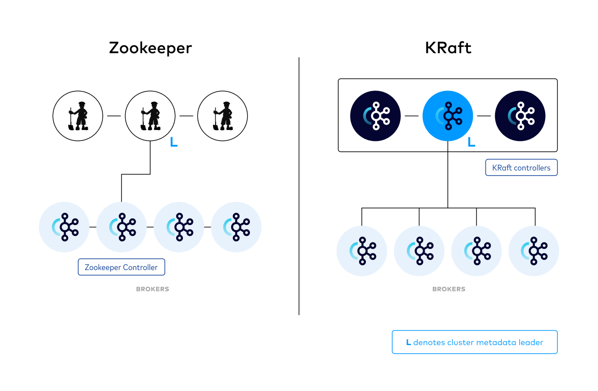

# 6장 카프카 내부 메커니즘

## 6.1 클러스터 멤버십

* 카프카는 클러스터의 멤버인 브로커들의 목록을 유지하기 위해 주키퍼를 이용했었다.(현재는 KRaft를 통해 클러스터를 구성할 수 있다.)
* 브로커 프로세스는 시작될 때마다 주키퍼에 Ephemeral 노드의 형태로 ID를 등록한다. 또한 노드가 추가되거나 제거될 때마다 클러스터 멤버들은 알림을 받는다.
* 브로커와 주키퍼간 연결이 끊기게 되면 주키퍼는 해당 브로커의 Ephemeral 노드를 제거한다.
* 브로커가 정지하면 브로커를 나타내는 ZNode 역시 삭제되지만, 브로커의 ID는 다른 자료구조에 남아 있게 된다.
  * 클러스터에서 특정 노드가 정지했을 때, 해당 노드의 브로커 ID를 가지는 다른 노드를 새로 만들면 클러스터에서 정지한 노드 자리를 대신해 새로 등록된 노드를 배정한다.

## 6.2 컨트롤러

* 컨트롤러는 카프카 브로커의 기능에 추가로 파티션 리터를 선출하는 역할을 가진다.
* 컨트롤러는 클러스터에 제일 먼저 등록된 브로커가 된다.
* 컨트롤러가 주키퍼와의 하트비트 연결이 끊기게 되면 와치를 통해 나머지 브로커들로 하여금 새로운 컨트롤러를 선출하게 한다.
* 컨트롤러를 선출할 때 주키퍼는 에포크(세대 정보)를 이용하며, 브로커들이 컨트롤러로 메시지를 받을 때 이 에포크를 비교해 메시지 수신 여부를 결정한다.
* 브로커가 컨트롤러가 되면, 클러스터 메타데이터 관리와 리더 선출하기 전 주키퍼로부터 비동기로 최신 레플리카 상태 맵을 읽어온다.
* 브로커가 컨트롤러에서 나가게되면 해당 브로커가 담당하는 파티션들을 다른 브로커로 이전한다. 이전한 뒤 관련된 브로커들로 새로운 리더와 팔로어 정보를 전송한다.


## 6.3 KRaft: 카프카의 새로운 래프트 기반 컨트롤러

* KRaft는 주키퍼를 대체하기 위해 카프카 2.8.0 버전부터 도입된 새로운 컨트롤러이다.
* 카프카에서 주키퍼를 대신해 KRaft가 고안된 이유는 다음과 같다.
  * 컨트롤러와 주키퍼간 메타데이터를 쓰는 작업은 동기적으로 이뤄지지만 브로커 메시지를 보내거나 주키퍼로부터 업데이트를 받는 과정은 비동기로 이뤄지기 때문에
브로커, 컨트롤러, 주키퍼 간에 메타데이터 불일치가 발생할 수 있다.
  * 주키퍼가 모든 메타데이터를 관리하기 때문에 브로커의 수가 증가할 수록 주키퍼의 부하가 증가한다. 또한 이부분이 병목으로 작용했다.
  * 메타데이터 소유권에 대해 내부 아키텍처는 그리 좋지 못하다.
  * 주키퍼 또한 분산 시스템이기 때문에 카프카 클러스터를 위한 러닝 커브가 가파르다.
* 새로운 컨트롤러 설계의 핵심 아이디어는 카프카 그 자체에 사용자가 상태를 이벤트 스트림으로 나타낼 수 있도록 하는 로그 기반 아키텍처를 도입한다는 점이다.
    * 새로운 아키텍처에서, 컨트롤러 노드들은 메타데이터 이벤트 로그를 관리하는 래프트 쿼럼이 된다.
    * 로그에는 클러스터 메타데이터의 변경 내역을 저장한다.
* 메타데이터 로그의 리더 역할을 맡고 있는 컨트롤러는 액티브 컨트롤러라고 부른다.
* 메타데이터는 모든 컨트롤러가 동기화하고 있기 때문에 액티브 컨트롤러에 장애가 발생하여 새로운 리더 컨트롤러를 선출하는 과정에서 리로드 시간이 매우 짧다.
* 브로커의 정보 변경에 대해 컨트롤러는 나머지 브로커들에게 전파하지 않는다. 브로커가 내부적으로 가지는 메타데이터 오프셋(메타데이터가 로그 기반이여서 가능한듯)을 통해
새로운 데이터를 직접 가져온다.
  * 메타데이터에 대해서 일정 시간 이상 갱신하지 않은 브로커는 펜스된 상태(fenced state)로 바뀐다.
  * 펜스된 상태의 브로커는 클라이언트의 요청을 처리하지 못하도록 한다.




### 설정 방법

```Docker
services:
  kafka-1:
    image: confluentinc/cp-kafka
    container_name: kafka-1
    ports:
      - "9092:9092"
    environment:
      KAFKA_NODE_ID: 1
      KAFKA_CONTROLLER_LISTENER_NAMES: 'CONTROLLER'
      KAFKA_LISTENER_SECURITY_PROTOCOL_MAP: 'CONTROLLER:PLAINTEXT,INTERNAL:PLAINTEXT,EXTERNAL:PLAINTEXT'
      KAFKA_LISTENERS: 'INTERNAL://kafka-1:29092,CONTROLLER://kafka-1:29093,EXTERNAL://0.0.0.0:9092'
      KAFKA_ADVERTISED_LISTENERS: 'INTERNAL://kafka-1:29092,EXTERNAL://localhost:9092' #
      KAFKA_INTER_BROKER_LISTENER_NAME: 'INTERNAL'
      KAFKA_CONTROLLER_QUORUM_VOTERS: '1@kafka-1:29093,2@kafka-2:29093,3@kafka-3:29093' # 컨트롤러 쿼럼, {node.id}@{host name}:{port}
      KAFKA_PROCESS_ROLES: 'broker,controller' # 인스턴스 역할
      KAFKA_GROUP_INITIAL_REBALANCE_DELAY_MS: 0
      KAFKA_OFFSETS_TOPIC_REPLICATION_FACTOR: 3
      KAFKA_TRANSACTION_STATE_LOG_REPLICATION_FACTOR: 3
      CLUSTER_ID: 'ciWo7IWazngRchmPES6q5A=='
      KAFKA_LOG_DIRS: '/tmp/kraft-combined-logs' # 카프카 메타데이터 저장 경로
  kafka-2:
    image: confluentinc/cp-kafka
    container_name: kafka-2
    ports:
      - "9093:9092"
    environment:
      KAFKA_NODE_ID: 2
      KAFKA_CONTROLLER_LISTENER_NAMES: 'CONTROLLER'
      KAFKA_LISTENER_SECURITY_PROTOCOL_MAP: 'CONTROLLER:PLAINTEXT,INTERNAL:PLAINTEXT,EXTERNAL:PLAINTEXT'
      KAFKA_LISTENERS: 'INTERNAL://kafka-2:29092,CONTROLLER://kafka-2:29093,EXTERNAL://0.0.0.0:9092'
      KAFKA_ADVERTISED_LISTENERS: 'INTERNAL://kafka-2:29092,EXTERNAL://localhost:9092'
      KAFKA_INTER_BROKER_LISTENER_NAME: 'INTERNAL'
      KAFKA_CONTROLLER_QUORUM_VOTERS: '1@kafka-1:29093,2@kafka-2:29093,3@kafka-3:29093'
      KAFKA_PROCESS_ROLES: 'broker,controller'
      KAFKA_GROUP_INITIAL_REBALANCE_DELAY_MS: 0
      KAFKA_OFFSETS_TOPIC_REPLICATION_FACTOR: 3
      KAFKA_TRANSACTION_STATE_LOG_REPLICATION_FACTOR: 3
      CLUSTER_ID: 'ciWo7IWazngRchmPES6q5A=='
      KAFKA_LOG_DIRS: '/tmp/kraft-combined-logs'
  kafka-3:
    image: confluentinc/cp-kafka
    container_name: kafka-3
    ports:
      - "9094:9094"
    environment:
      KAFKA_NODE_ID: 3
      KAFKA_CONTROLLER_LISTENER_NAMES: 'CONTROLLER'
      KAFKA_LISTENER_SECURITY_PROTOCOL_MAP: 'CONTROLLER:PLAINTEXT,INTERNAL:PLAINTEXT,EXTERNAL:PLAINTEXT'
      KAFKA_LISTENERS: 'INTERNAL://kafka-3:29092,CONTROLLER://kafka-3:29093,EXTERNAL://0.0.0.0:9094'
      KAFKA_ADVERTISED_LISTENERS: 'INTERNAL://kafka-3:29092,EXTERNAL://localhost:9094'
      KAFKA_INTER_BROKER_LISTENER_NAME: 'INTERNAL'
      KAFKA_CONTROLLER_QUORUM_VOTERS: '1@kafka-1:29093,2@kafka-2:29093,3@kafka-3:29093'
      KAFKA_PROCESS_ROLES: 'broker,controller'
      KAFKA_GROUP_INITIAL_REBALANCE_DELAY_MS: 0
      KAFKA_OFFSETS_TOPIC_REPLICATION_FACTOR: 3
      KAFKA_TRANSACTION_STATE_LOG_REPLICATION_FACTOR: 3
      CLUSTER_ID: 'ciWo7IWazngRchmPES6q5A=='
      KAFKA_LOG_DIRS: '/tmp/kraft-combined-logs'
```


## 6.3 복제

* 카프카는 '분산되고, 분할되고, 복제된 커밋 로그 서비스'로 표현되며, 이는 카프카의 핵심 아이디어이다.
* 데이터를 저장하는 서비스에서는 장애가 언제든지 발생할 수 있기 때문에 신뢰성과 지속성을 보장하기 위해 복제는 아주 중요하다.
* 카프카에서는 복제를 할 때, 리더 레플리카와 팔로워 레플리카로 구성된다.
  * 리더 레플리카를 통해 모든 쓰기 요청을 처리한다.
  * 팔로워 레플리카를 통해 리더 래플리카로부터 데이터를 복제하여 최신 상태를 유지한다.
* 리더 레플리카는 팔로워 레플리카가 최신 상태를 확인하는 과정을 가진다.
  * 팔로워 레플리카가 최신 상태를 유지하지 못하거나, 일정 시간 이상으로 읽기 요청을 보내지 않는다면 OSR(Out-Of-Sync Replica)상태가 된다.
  * replica.lag.max.messages는 리더 레플리카와 복제 레플리카간 메시지 수 차이의 최대 허용치를 말합니다.
  * replica.lag.time.max.ms는 복제 레플리카가 최대 동기화 지연 시간입니다.

### 만약 메시지 유입량이 갑자기 늘어난다면?

* replica.lag.max.messages로 ISR 판단한다면(replica.lag.max.messages=5)
  * 메시지가 설정 값(3msg/s) 이하로 들어오다 설정 값 이상으로 유입된다면(10msg/s) 모든 복제 레플리카들이 OSR 상태로 변경된다.
  * 운영중 불필요한 에러 발생 및 그로인한 불필요한 retry가 발생할 수 있음
* replica.lag.time.max.ms로 판단해야함.
  * 메시지 유입량이 늘더라도 불필요한 에러가 발생하지 않을 수 있음

## 6.4 요청 처리

* 카프카는 TCP로 전달되는 이진 프로토콜을 가지고 있다.
* 카프카로 전달되는 모든 요청은 다음과 같은 내용을 포함하는 표준 헤더를 가진다.
  * 요청 유형: API 키
  * 요청 버전: 브로커는 서로 다른 버전의 클라이언트로부터 요청을 받아 각각의 버전에 맞는 응답을 할 수 있다.
  * Correlation ID: 각각의 요청에 붙는 고유한 식별자. 응답이나 에러 로그에도 포함된다.
  * 클라이언트 ID: 요청을 보낸 애플리케이션을 식별하기 위해 사용한다.
* 브로커는 연결을 받는 각 포트별로 억셉터(acceptor) 스레드를 하나씩 실행시킨다.
* 억셉터 스레드는 연결을 생성하고 들어온 요청을 프로세서 스레드(네트워크 스레드)에 넘겨 처리한다.
* 프로세서 스레드는 클라이언트 요청을 요청 큐에 추가하여 I/O 스레드가 처리할 수 있도록 한다. 
처리가 완료되면 응답이 응답 큐로 들어오며 프로세서 스레드가 해당 응답을 클라이언트에 반환한다.

### 카프카 클라이언트

* 카프카 클라이언트는 메타데이터 요청을 통해 클라이언트가 원하는 토픽에 대한 정보들(파티션 정보, 리더 정보 등등)을 반환한다.
* 메타데이터는 metadata.max.age.ms를 통해 새로고침 간격을 조정할 수 있다.
* 만약 새 브로커가 추가됨에 따라 특정 토픽에 대한 리더 레플리카가 변경되면, 변경 이전 정보를 가지고 있는 클라이언트에 대한 요청에 'Not a Leader'에러가 발생할 수 있다.
  * 위 문제가 발생하면 메타데이터를 다시 조회한 후 요청을 다시 보내게 된다.

### 6.4.1 쓰기 요청

* 리더 레플리카를 가지는 브로커가 쓰기 요청이 들어오면 다음 검증 과정을 거친다.
  * 데이터를 보내고 있는 사용자가 토픽에 대한 쓰기 권한을 가지는가?
  * 요청에 지정되어 있는 acks 설정값이 올바른가?
  * 만약 acks 설정 값이 all인경우, 메시지를 안전하게 쓸 수 있을 만큼 충분한 ISR이 확보되어 있는가?
* 리눅스의 경우 디스크에 쓰기 작업을 요청하더라도 디스크에 바로 쓰기 작업이 들어가지 않는다. 따라서 카프카는 복제를 통해 메시지의 지속성을 보장한다.

### 6.4.2 읽기 요청

* 읽기 요청은 쓰기 요청과 매우 비슷하게 처리된다.
* 읽기 요청이 들어온 경우 검증 과정을 거치게 된다.
  * 지정된 오프셋이 해당 파티션에 존재하는가?
* 카프카는 클라이언트에게 보내는 메시지에 제로카피 최적화를 적용합니다.
* 카프카에서 데이터를 읽을 때 하이워터마크까지만 읽을 수 있게 만드는 이유는 데이터 불일치를 방지하기 위해서이다.
* 카프카는 읽기 세션 캐시를 통해 메타데이터를 캐시하여 빠르게 읽기 요청을 처리할 수 있게 한다.

### 제로 카피란?

* 일반적으로 디스크에 있는 데이터를 네트워크로 전송할 때 커널 버퍼의 데이터를 유저 버퍼에 복사한 후 커널 버퍼에 다시 데이터를 쓰는 방식으로 복사가 발생한다.
* 제로 카피는 이 유저 영역으로의 복사 과정을 없애는 것입니다.
* 자바에서는 nio의 transferTo 메소드를 통해 커널 영역에서 버퍼간 데이터 복사를 진행할 수 있습니다.
* 더 나아가 NIC Buffer로 Read Buffer의 데이터를 복사하기 위해 DMA를 사용하며, 이 과정에서 Read Buffer의 내용을 가리키는 Descriptor를 가짐으로써 읽을 수 있게 만든다.


## 6.5 물리적 저장소

* 카프카의 기본 저장 단위는 파티션 레플리카이다. 즉, 파티션은 서로 다른 디스크에 분할될 수 없으며, 브로커들 사이에 분리될 수 없다.

### 6.5.1 계층화된 저장소

* 카프카에서는 다음과 같은 문제가 있었다.
  * 파티션별로 저장 가능한 데이터에는 한도가 있다. 따라서 최대 보존 기한과 파티션 수뿐만아닌 물리적인 디스크 크기에도 제한을 받는다.
  * 디스크와 클러스터 크기는 저장소 요구 조건에 의해 결정된다.
* 계층화된 저장소 기능에서는 카프카 클러스터의 저장소를 로컬과 원격, 두 계층으로 나눈다.
* 새로운 원격 계층은 완료된 로그 세그먼트를 저장하기 위해 HDFS나 S3와 같은 저용 저장소 시스템을 사용한다.
* 계층화된 저장소 기능의 이중화된 구조 덕분에 카프카 클러스터의 메모리와 CPU에 상관없이 저장소를 확장할 수 있다.
  * 또한 오래된 데이터를 조회하는 과정에서 원격 저장소의 데이터를 네트워크를 통해 조회하기 때문에 페이지 캐시나 디스크 I/O에 대해 경합할이 없어 성능이 더 좋아졌다.

### 6.5.2 파티션 할당

* 카프카에서 파티션을 할당할 때 목표는 다음과 같다.
  * 레플리카들을 가능한 한 브로커 간에 고르게 분산시킨다.
  * 각 파티션에 대해 각각의 레플리카는 서로 다른 브로커에 배치되도록 한다.
  * 만약 브로커에 랙 정보가 설정되어 있다면, 가능한 한 각 파티션의 레플리카들을 서로 다른 랙에 할당한다.
* 각 파티션과 레플리카에 올바른 브로커를 선택했다면, 새 파티션을 저장할 디렉터리를 결정한다.
  * 각 디렉터리에 저장되어 있는 파티션의 수를 센 뒤, 가장 적은 파티션이 저장된 디렉터리에 새 파티션을 저장한다.

### 6.5.3 파일 관리

* 카프카에는 각각 토픽에 대해 보존 기한을 설정할 수 있다.
* 카프카는 파티션을 여러 세그먼트로 나누어 관리한다.
  * 세그먼트의 크기 혹은 기간 설정을 통해 새로 생성될 세그먼트의 기준을 설정할 수 있다.
  * 현재 쓰여지고 있는 세그먼트를 액티브 세그먼트라고 부른다.
  * 세그먼트가 닫힐 때 데이터를 삭제할 수 있다.
*  카프카 브로커는 각 파티션의 모든 세그먼트에 대해 파일 핸들을 연다.
  * 리눅스에서는 프로세스당 기본적으로 1024개의 파일을 열 수 있다.

### 6.5.4 파일 형식

* 각 세그먼트는 하나의 데이터 파일 형태로 저장된다.
  * 파일 내부에는 카프카의 메시지와 함께 오프셋이 저장된다.
  * 데이터는 네트워크를 통해 수신,전송되는 데이터와 똑같은 형식으로 저장되어 제로카피에 최적화 되었다.
* 카프카 프로듀서는 데이터를 전송할 때 배치 단위로 전송한다.
* 메시지 배치 헤더는 다음을 포함한다.
  * 메시지 형식의 현재 버전을 가리키는 매직 넘버
  * 배치에 포함된 첫 번쨰 메시지의 오프셋과 마지막 오프셋의 차이
  * 첫 번째 메시지의 타임스탬프와 배치에서 가장 큰 타임스탬프
  * 바이트 단위로 표시된 배치의 크기
  * 배치를 받은 리더의 에포크 값
  * 체크섬
  * 서로 다른 속성을 표시하기 위한 16비트
  * 프로듀서 ID, 프로듀서 에포크, 그리고 배치의 첫 번째 시퀀스 넘버
  * 배치에 포함된 메시지들의 집합
* 카프카에는 컨트롤 배치가 있다. 이는 트랜잭션 커밋 등을 가리킨다.
  * 컨슈머가 받아서 처리하기 때문에 사용자 애플리케이션 관점에서는 보이지 않는다.

### 6.5.5 인덱스

* 카프카는 타임스탬프와 메시지 오프셋을 매핑하는 인덱스를 가지고 있다.
* 카프카 스트림즈는 타임스탬프 기준 메시지 검색을 광범위하게 사용하며, 몇몇 장애 복구 상황에서도 유용하게 사용될 수 있다.
* 인덱스 또한 세그먼트 단위로 분할된다.

### 6.5.6 압착

* 카프카에서 삭제 보전 정책에서는 지정된 보존 기한보다 더 오래 된 이벤트들을 삭제한다.
* 압착 보존 정책에서는 토픽에서 각 키의 최근값만 저장하도록 한다.
  * 키가 Null 인경우 압착은 실패한다.
* 보존 기한과 압착 설정을 동시에 적용하도록 delete, compact 값을 잡아줄 수 있다.

### 6.5.7 압착의 자동 원리

* 각 로그는 두 영억으로 나눠진다.
  * 클린: 이전에 압착된 적이 있었던 메시지들이 저장된다.
  * 더티: 마지막 압착 작업 이후 쓰여진 메시지들이 저장된다.
* 카프카의 압착 기능이 활성화된 경우 압착 스레드를 통해 각 파티션의 더티 메시지를 압착하여 클린 상태로 만든다.
* 메시지를 압착할 때 인-메모리 맵을 생성하며, 맵의 각 항목은 메시지 키의 16바이트 해시와 이전 메시지의 오프셋 8바이트로 구성된다.
  * 각 메시지를 24바이트만 사용하게 되며, 1KB 메시지를 생각할 때, 42배의 효율을 보인다.
* 클리너 스레드가 오프셋 맵을 생성한 다음, 클린 세그먼트들을 오랜된 것부터 읽어 오프셋 맵의 내용과 대조한다.
  * 저장되어 있지 않다면, 교체용 세그먼트에 복사
  * 저장되어 있다면, 건너뛴다.

### 6.5.8 삭제된 이벤트

* 특정 키를 갖는 모든 메시지를 삭제하고 싶을때는 해당 키값과 null 값을 갖는 메시지를 써주면 된다.
* 카프카는 null 밸류값을 갖는 메시지만(툼스톤이라고 불린다.)을 저장하게 되며, 특정 기한이 지나면 툼스톤 메시지를 삭제한다.

### 6.5.9 토픽은 언제 압착되는가?

* 액티브 세그먼트가 아니라면 압착 대상이 될 수 있다.
* 일반적으로 토픽 내용물의 50% 이상이 더티 레코드인 경우 압착을 시작한다.

> 참고 자료
> 
> https://m.blog.naver.com/kgw1988/221218267855
> 
> https://medium.com/spitha-techblog/tiered-storage-ac094eab500c
