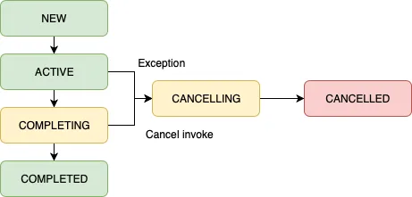

# 8장 잡과 자식 코루틴 기다리기

코루틴에서의 구조화된 동시성은 다음과 같은 특성을 가집니다.
* 자식은 부모로부터 컨텍스트를 상속받습니다.
* 부모는 모든 자식이 작업을 마칠 때까지 기다립니다
* 부모 코루틴이 취소되면 자식 코루틴도 취소됩니다.
* 자식 코루틴에서 에러가 발생하면, 부모 코루틴 또한 에러로 소멸합니다.

```Kotlin
fun main() {
    runBlocking(CoroutineName("main")) {
        val name = coroutineContext[CoroutineName]?.name
        println(name)
        launch {
            delay(1000)
            val name = coroutineContext[CoroutineName]?.name
            println(name)
        }
    }
}
/**
* main
* main
*/
```

이러한 코루틴의 구조화된 동시성에서 중요한 특성들은 Job 컨텍스트와 관련이 있습니다. 그러면 Job이 무엇일까요?

간단히 먼저 소개를하자면 코루틴을 취소하고, 상태를 파악하는데 사용됩니다.


## Job이란 무엇인가?



잡(job)은 수명을 가지며 취소가능합니다. 즉, 잡은 위 사진과 같이 상태를 가지고 있습니다.
그러면 어떤 상태들을 가지게 될까요?

* Active: Active 상태에서는 잡이 실행되며, 코루틴은 잡을 수행합니다. 대부분에 코루틴은 Active 상태로 시작됩니다.
* New: 지연 시작되는 코루틴일 경우 Job이 New 상태로 시작됩니다.
* Completing: 코루틴의 상태가 완료가 되면 Completing이 됩니다. 하지만 자식이 완료되지 않은 상태입니다.
* Completed: 자식 코루틴이 모두 실행이 완료되면 Completed가 됩니다.
* Cancelling: 코루틴 실행 중 취소되며 후처리하기 전의 상태입니다.
* Cancelled: 코루틴이 취소되며 후처리까지 완료된 상태입니다.

위 상태들을 간단하게 볼 수 있는 로직을 작성해봤습니다.

```Kotlin
suspend fun main() {
    coroutineScope {
        val job = Job()
        println(job)

        job.complete()
        println(job)

        val activeJob = launch {
            delay(1000)
        }

        println(activeJob)

        activeJob.join()
        println(activeJob)

        val lazyJob = launch(start = CoroutineStart.LAZY) {
            delay(1000)
        }

        println(lazyJob)
        lazyJob.start()
        println(lazyJob)
        lazyJob.join()
        println(lazyJob)
    }
}
/**
 * JobImpl{Active}@61e4705b
 * JobImpl{Completed}@61e4705b
 * StandaloneCoroutine{Active}@574caa3f
 * StandaloneCoroutine{Completed}@574caa3f
 * LazyStandaloneCoroutine{New}@512f9444
 * LazyStandaloneCoroutine{Active}@512f9444
 * LazyStandaloneCoroutine{Completed}@512f9444
 */
```

## 코루틴 빌더는 부모의 잡을 기초로 자신들의 잡을 생성한다.

코틀린 코루틴의 모든 코루틴 잡들은 자신만의 잡을 생성합니다. 또한 이를 반환합니다.

앞서 사용한 launch 코루틴 빌더의 경우에도 Job 타입을 반환합니다. 그러면 async의 Deferred<T>는 무엇일까요?

Deferred또한 Job의 하위 클래스입니다. 따라서 Job과 똑같이 사용할 수 있습니다.

Job도 코루틴 컨텍스트이기에 코루틴 내부에서 언제든지 조회할 수 있습니다.

그러면 잡은 코루틴의 독자적인 코루틴 컨텍스트임을 알 수 있습니다. 즉! 각 코루틴에서 생성된 잡은
자식 코루틴으로의 상속하지 않으며, 만약 자식 코루틴으로 잡을 넘겨주려면 코루틴 빌더에서 명시적으로 전달해야 합니다.

이러한 각 코루틴의 고유한 잡을 통해서 부모 코루틴에서 자식 코루틴의 상태를 추적할 수 있게 됩니다.

```Kotlin
fun main() {
    runBlocking {
        val job = launch {
            delay(1000)
        }

        val parentJob = coroutineContext.job
        println(job==parentJob) // false
        val parentChildren = parentJob.children
        println(parentChildren.first() == job)
    }
}
/**
 * false
 * true
 */
```

정리를 해보자면, 잡은 각 코루틴에서 고유하며 부모에서 자식으로의 잡을 넘겨주는 대신 부모-자식 관계를 유지합니다.
따라서 잡을 통해 부모코루틴에서 자식 코루틴의 상태를 추적할 수 있습니다. 또한, 자식 코루틴이 생성될 때, 새로운 잡을 생성한다면 
새로운 코루틴 컨텍스트가 생성되어 부모-자식 관계가 만들어지지 않습니다.

## 잡 팩토리 함수

잡은 코루틴 없이 팩토리 함수를 통해 독립적으로 만들어질 수 있습니다. 즉, 어느 코루틴과도 연관되어 있지 않기 때문에
completed, cancelled 상태로 갈 수 없어 애플리케이션이 종료되지 않습니다.

```Kotlin
public fun Job(parent: Job? = null): CompletableJob
```


