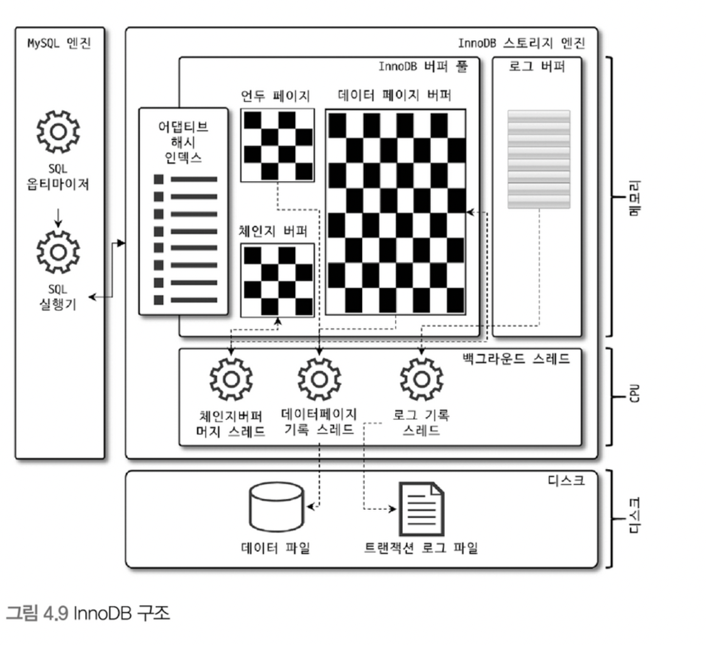
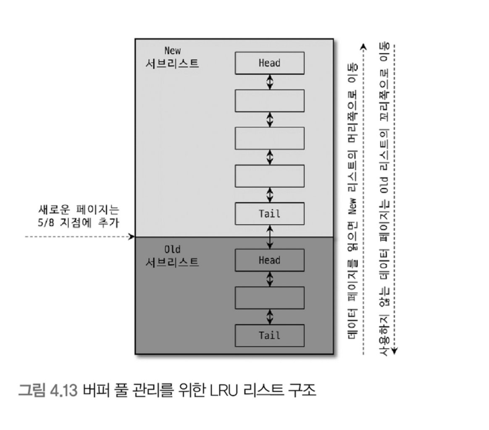
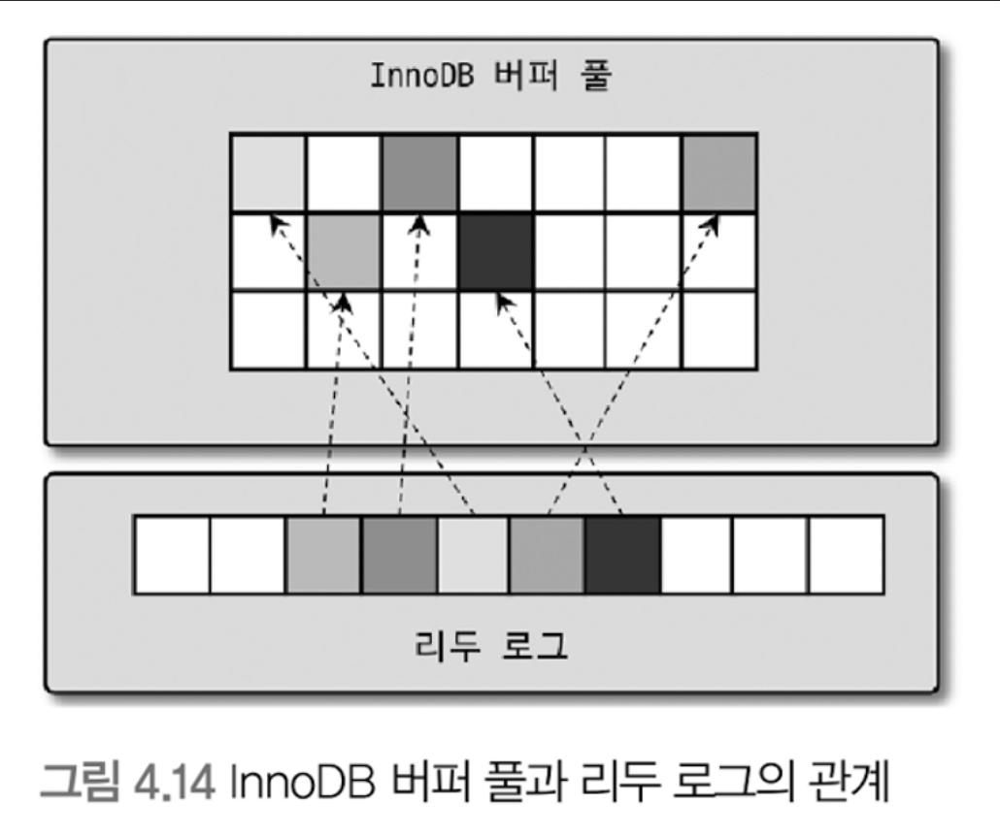
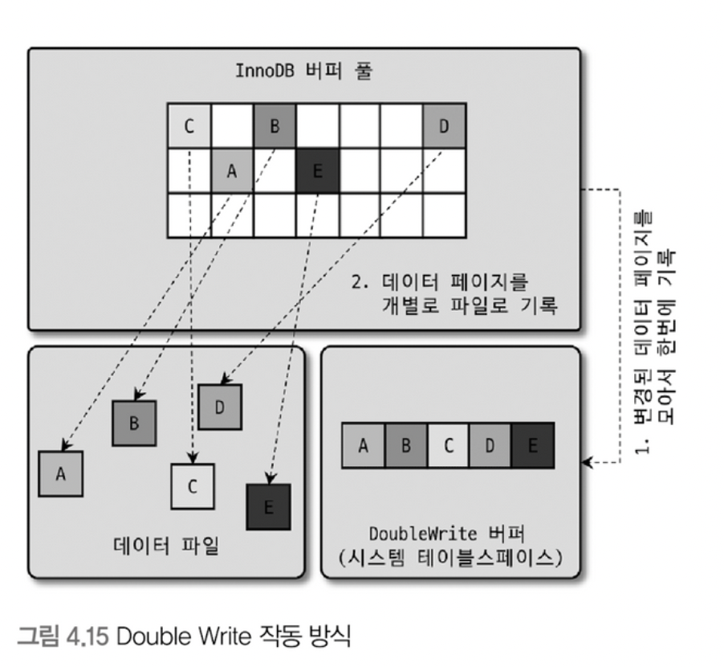

# InnoDB 스토리지 엔진 아키텍처

## 프라이머리 키에 의한 클러스터링

* InnoDB의 모든 테이블은 기본적으로 프라이머리 키를 기준으로 클러스터링되어 저장됩니다. 즉, 프라이머리 키 값의 순서대로 디스크에 저장됩니다.
* 모든 세컨더리 인덱스는 레코드의 주소 대신 프라이머리 키의 값을 논리적인 주소로 사용합니다.
* 프라이머리 키가 클러스터링 인덱스이기에 프라이머리 키를 이용한 레인지 스캔은 상당히 빨리 처리될 수 있습니다.

## 외래 키 지원

* 외래 키에 대한 지원은 InnoDB 스토리지 엔진 레벨에서 지원하는 기능으로 MyISAM이나 MEMORY 테이블에서는 사용할 수 없습니다.
* InnoDB에서 외래 키는 부모 테이블과 자식 테이블 모두 해당 칼럼에 인덱스 생성이 필요하고, 
변경 시에는 반드시 부모 테이블이나 자식 테이블에 데이터가 있는지 체크하는 작업이 필요하므로 잠금이 여러 테이블로 전파되고,
이로 인해 데드락이 발생할 때가 있으므로 개발할 때 외래 키를 주의해서 사용해야 합니다.

## MVCC(Multi Version Concurrency Control)

* MVCC는 레코드 레벨의 트랜잭션을 지원하는 DBMS가 제공하는 기능이며, MVCC의 가장 큰 목적은 잠금을 사용하지 않는 일관된 읽기를 제공하는 데 있습니다.
* InnoDB는 언두 로그(Undo log)를 이용해서 MVCC를 구현합니다.
* 멀티 버전이라 함은 하나의 레코드에 대해 여러 개의 버전이 동시에 관리됨을 의미합니다.
* MySQL의 격리 레벨인 READ COMMITTED에서는 여러 조회가 있을 때 변경하기 전, 즉 언두 로그에 존재하는 데이터를 이용하여 조회 데이터를 반환합니다.
* 언두 영역의 데이터는 커밋이 되더라도 바로 삭제가 되지 않습니다. 이를 참조하는 요청이 없을 때 삭제됩니다.

## 잠금 없는 일관된 읽기(Non-locking Consistent Read)

* InnoDB 스토리지 엔진은 MVCC 기술을 이용해 잠금을 걸지 않고 읽기 작업을 수행합니다.
* 격리 수준이 SERIALIZABLE이 아닌 READ_UNCOMMITTED나 READ_COMMITTED, REPEATABLE_READ 수준인 경우 insert와 연결되지 않은 순수한 읽기 작업은 
다른 트랜잭션의 변경 작업과 관계없이 항상 잠금을 대기하지 않고 바로 실행됩니다. 이과정에서 언두 로그를 통해 읽기를 수행합니다.

## 자동 데드락 감지

* InnoDB는 내부적으로 잠금이 교착 상태에 빠지지 않았는지 체크하기 위해 잠금 대기 목록을 그래프(Wait-for List) 형태로 관리합니다.
* InnoDB는 데드락 감지 스레드를 가지고 있어서 데드락 감지 스레드가 주기적으로 잠금 대기 그래프를 검사해 교착 상태에 빠진 트랜잭션들을 찾아 그 중 하나를 강제 종료합니다.
* 데드락 감지 스레드가 트랜잭션을 종료하는 해당 트랜잭션의 언두 로그 양이며, 더 적은 수의 언두 로그를 가지고 있는 트랜잭션이 제거됩니다.

## InnoDB 버퍼 풀

* InnoDB 버퍼 풀은 디스크의 데이터 파일이나 인덱스 정보를 메모리에 캐시해 두는 공간입니다.
* 쓰기 작업을 지연시켜 일괄 작업으로 처리할 수 있게 해주는 버퍼 역할도 수행합니다.
* 버퍼 풀을 통해 insert, update, delete 처리를 한 번에 진행할 수 있어서 랜덤 디스크 I/O 횟수를 줄일 수 있습니다.

### 버퍼 풀의 구조

* InnoDB는 버퍼 풀이라는 메모리 공간을 페이지 크기(16KB) 단위로 관리하며 InnoDB 스토리지 엔진이 데이터를 필요로 할 때 해당 데이터 페이지를 읽어서 각 조각에 저장합니다.
* InnoDB는 버퍼 풀의 페이지 조각을 관리하기 위해 LRU(Least Recently Used) 리스트, 플러시(Flush) 리스트, 프리(Free) 리스트라는 3개의 자료 구조를 관리합니다.

#### 프리 리스트 

* 프리 리스트는 InnoDB 버퍼 풀에서 실제 사용자 데이터로 채워지지 않은 비어 있는 페이지들의 목록이며, 사용자의 쿼리가 새롭게 디스크의 데이터 페이지를 읽어와야 하는 경우 사용됩니다.

#### LRU 리스트

* InnoDB의 LRU 리스트 자료 구조는 Old 서브리스트(LRU)와 New 서브리스트(MRU, Most Recently Used) 형태를 가지고 있습니다.
* LRU 리스트를 관리하는 목적은 디스크로부터 한 번 읽어온 페이지를 최대한 오랫동안 InnoDB 버퍼풀의 메모리에 유지해 디스크 I/O를 줄이는 것입니다.
* InnoDB에서 데이터를 찾는 과정은 다음과 같습니다.
  1. 필요한 레코드가 저장된 데이터 페이지가 버퍼 풀에 있는지 검사
     1. InnoDB 어댑티브 해시 인덱스를 이용해 페이지를 검색
     2. 해당 테이블의 인덱스(B-Tree)를 이용해 버퍼 풀에서 페이지를 검색
     3. 버퍼 풀에 이미 데이터 페이지가 있었다면 해당 페이지의 포인터를 MRU 방향으로 승급
  2. 디스크에서 필요한 데이터 페이지를 버퍼 풀에 적재하고, 적재된 페이지에 대한 포인터를 LRU 헤더 부분에 추가
  3. 버퍼 풀의 LRU 헤더 부분에 적재된 데이터 페이지가 실제로 읽히면 MRU 헤더 부분으로 이동
  4. 버퍼 풀에 상주하는 데이터 페이지는 사용자 쿼리가 얼마나 최근에 접근했었는지에 따라 나이(Age)가 부여되며, 
  버퍼 풀에 상주하는 동안 쿼리에서 오랫동안 사용되지 않으면 데이터 페이지에 부여된 나이가 오래되고 결국 해당 페이지는 버퍼 풀에서 제거 된다.
  버퍼 풀의 데이터 페이지가 쿼리에 의해 사용되면 나이가 초기화 되어 다시 젊어지고 MRU의 헤더 부분으로 옮겨진다.
  5. 필요한 데이터가 자주 접근됐다면 해당 페이지의 인덱스 키를 어댑티브 해시 인덱스에 추가

#### 플러시 리스트

* 플러시 리스트는 디스크로 동기화되지 않은 데이터를 가진 데이터 페이지(더티 페이지)의 변경 시점 기준의 페이지 목록을 관리합니다.
* 데이터가 변경되면 InnoDB는 변경 내용을 리두 로그에 기록하고 버퍼 풀의 데이터 페이지에도 변경 내용을 반영합니다.
* 리두 로그의 각 엔트리는 특정 데이터 페이지와 연결됩니다.
* InnoDB는 체크포인트를 발생시켜 디스크의 리두 로그와 데이터 페이지의 상태를 동기화합니다. 
체크포인트는 MySQL 서버가 시작될 때 InnoDB 스토리지 엔진이 리두 로그의 어느 부분부터 복구를 실행해야 할지 판단하는 기준점을 만드는 역할을 합니다.

### 버퍼 풀과 리두 로그

* InnoDB의 버퍼 풀과 리두 로그는 매우 밀접한 관계를 맺고 있습니다.
* InnoDB 버퍼 풀은 데이터베이스 서버의 성능 향상을 위해 데이터 캐시와 쓰기 버퍼링이라는 두 가지 용도가 있는데, 버퍼 풀의 메모리 공간만 단순히 늘리는 것은 데이터 캐시 기능만 향상시키는 것입니다.

* InnoDB의 버퍼 풀은 디스크에서 읽은 상태로 전혀 변경 되지 않은 클린 페이지와 insert, update, delete 명령으로 변경된 데이터를 가진 더티 페이지도 가지고 있습니다.
* InnoDB는 리두 로그 1개 이상의 고정 크기 파일을 연결해 순환 고리처럼 사용합니다.
* InnoDB는 리두 로그 파일에서 재사용 가능한 공간과 당장 재사용 불가능한 공간으로 구분하는데, 재사용 불가능한 공간을 활성 리두 로그(ACTIVE REDO LOG)라고 합니다. 이미지에서 화살표를 가지는 리두 로그 파일이 활성 리두 로그입니다.
* 리두 로그 파일의 공간은 계속 순환되어 재사용되지만 매번 기록될 때마다 로그 포지션은 계속 증가된 값을 가지는 데, 이를 LSN(Log Sequence Number)이라고 합니다.
* InnoDB가 발생시키는 체크포인트에 대해서 가장 최근 체크포인트의 LSN과 마지막 리두 로그 엔트리의 LSN의 차이를 체크포인트 에이지라고 합니다. 즉, 체크포인트 에이지는 활성 리두 로그 공간의 크기를 말합니다.
* InnoDB는 LSN을 통해 체크포인트 LSN보다 작은 리두 로그 엔트리와 관련된 더티 페이지는 모두 디스크로 동기화돼야 합니다.

### 버퍼 풀 상태 백업 및 복구

* 디스크의 데이터가 버퍼 풀에 적재돼 있는 상태를 워밍업(Warming Up)이라고 표현합니다. 이는 innodb_buffer_pool_dump_now를 통해 백업을 진행할 수 있습니다.

## Double Write Buffer

* InnoDB 스토리지 엔진의 리두 로그는 리두 로그 공간의 낭비를 막기 위해 페이지의 변경된 내용만 기록합니다. 
이로인해 InnoDB의 스토리지 엔진에서 더티 페이지를 디스크 파일로 플러시할 때 일부만 기록되는 문제가 발생하면 그 페이지의 내용을 복구할 수 없을 수도 있습니다.
* 페이지의 일부만 기록되는 현상을 파셜 페이지(Partial Page) 또는 톤 페이지(Torn Page)라고 합니다. 이는 하드웨어의 오작동이나 시스템의 비정상 종료등으로 발생할 수 있습니다.
* InnoDB는 이러한 문제를 방지하기 위해 더블 라이트 버퍼(Double Write Buffer)라는 메모리 영역을 사용합니다.

* InnoDB는 더블 라이트 버퍼에 먼저 페이지를 기록하고, 더블 라이트 버퍼에 기록이 완료되면 실제 데이터 파일에 기록합니다.
* 실제 데이터가 기록되는 과정에서 문제가 발생해 부분만 저장되는 현상이 발생하면 InnoDB가 재시작될 때 DoubleWrite 버퍼의 내용과 데이터 파일의 페이지들을 비교하여
일치하지 않은 부분이 있으면 DoubleWrite 버퍼에 저장된 내용을 디스크에 기록합니다.

## 언두 로그

* InnoDB 스토리지 엔진은 트랜잭션과 격리 수준을 보장하기 위해 DML(INSERT, UPDATE, DELETE)로 변경되기 이전 버전의 데이터를 별도로 백업합니다. 이를 언두 로그라고 합니다.
* 언두 로그는 다음과 같은 상황에서 사용됩니다.
  * 트랜잭션 보장
    * 트랜잭션이 롤백되면 트랜잭션 도중 변경된 데이터를 변경 전 데이터로 복구해야 하는데, 이때 언두 로그에 백업해둔 이전 버전의 데이터를 이용해 복구합니다.
  * 격리 수준 보장
    * 특정 커넥션에서 데이터를 변경하는 도중에 다른 커넥션에서 데이터를 조회하면 트랜잭션 격리 수준에 맞게 변경 중인 레코드를 읽지 않고 언두 로그에 백업해둔 데이터를 읽어서 반환합니다.

## 체인지 버퍼

* insert, update 수행 시 데이터 파일뿐만 아닌 인덱스 파일도 변경해야 합니다. 이때 인덱스 페이지가 버퍼풀에 존재한다면 즉시 데이터를 변경할 수 있지만,
인덱스 페이지가 디스크에 존재하면 해당 변경사항을 즉시 반영하지 않고 임시 공간에 저장하여 사용자에게 결과를 반환하는 형식을 사용합니다. 이를 체인지 버퍼라고 합니다.
* 체인지 버퍼를 이용해 변경 사항을 임시로 저장할 때, 해당 인덱스가 유니크 제약 조건을 가진 경우 체인지 버퍼를 사용할 수 없습니다.
* 체인지 버퍼에 저장된 인덱스 레코드 조각은 백그라운드 스레드에 의해 병합됩니다. 이러한 스레드를 버퍼 머지 스레드(Buffer Merge Thread)라고 합니다.

## 리두 로그 및 로그 버퍼

* 리두 로그(Redo log)는 트랜잭션의 4가지 요소인 ACID중 D(Durable)에 해당하는 영속성과 가장 밀접하게 연관돼 있습니다.
* 리두 로그는 H/W, S/W 등 여러 가지 문제점으로 인해 MySQL 서버가 비정상적으로 종료됐을 때 데이터 파일에 기록되지 못한 데이터를 잃지 않게 해주는 안정장치 입니다.
* 일반적인 DBMS에서는 데이터 파일 변경을 반영함에 있어 랜덤 디스크 I/O가 발생하여 큰 비용이 필요합니다. 그래서 데이터 변경 로그를 먼저 기록하고 변경된 데이터를 나중에 디스크에 기록하는 방식을 사용합니다.
* MySQL에서 다음과 같은 일관되지 않은 데이터를 가질 수 있습니다.
  * 커밋됐지만 데이터 파일에 기록되지 않은 데이터
  * 롤백됐지만 데이터 파일에 이미 기록된 데이터

### 리두 로그 아카이빙

* MySQL 8.0 버전부터 InnoDB의 리두 로그를 아카이빙할 수 있게 됐습니다.
* 아카이빙 기능을 통해서 백업 시 파일이 다시 덮어쓰여 백업이 실패하지 않게 해줄 수 있습니다.

## 어댑티브 해시 인덱스

* 어댑티브 해시 인덱스는 사용자가 수동으로 생성하는 인덱스가 아닌 InnoDB 스토리지 엔진에서 사용자가 자주 요청하는 데이터에 대해 자동으로 생성하는 인덱스입니다.
* InnoDB는 자주 읽히는 데이터 페이지의 키 값을 이용해 해시 인덱스를 만듭니다.
* 해시 인덱스는 '인덱스 키 값'과 해당 인덱스 키 값이 저장된 '데이터 페이지 주소'의 쌍으로 관리됩니다. 이때, 인덱스 키 값은
'B-Tree 인덱스의 고유번호(id)와 B-Tree 인덱스의 실제 키 값' 조합으로 생성됩니다.
* 어댑티브 해시 인덱스가 성능 향상에 크게 도움이 되지 않는 경우는 다음과 같습니다.
  * 디스크 읽기가 많은 경우
  * 특정 패턴의 쿼리가 많은 경우(조인아니 like 패턴 검색)
  * 매우 큰 데이터를 가진 테이블의 레코드를 폭넓게 읽는 경우
* 어댑티브 해시 인덱스가 성능 향상에 도움되는 경우는 다음과 같습니다.
  * 디스크의 데이터가 InnoDB버퍼 풀 크기와 비슷한 경우(디스크 읽기가 많지 않은 경우)
  * 동등 조건 검색(동등 비교와 IN 연산자)이 많은 경우
  * 쿼리가 데이터 중에서 일부 데이터에만 집중되는 경우
* 어댑티브 해시 인덱스는 삭제 작업에도 많은 영향을 미칩니다.
