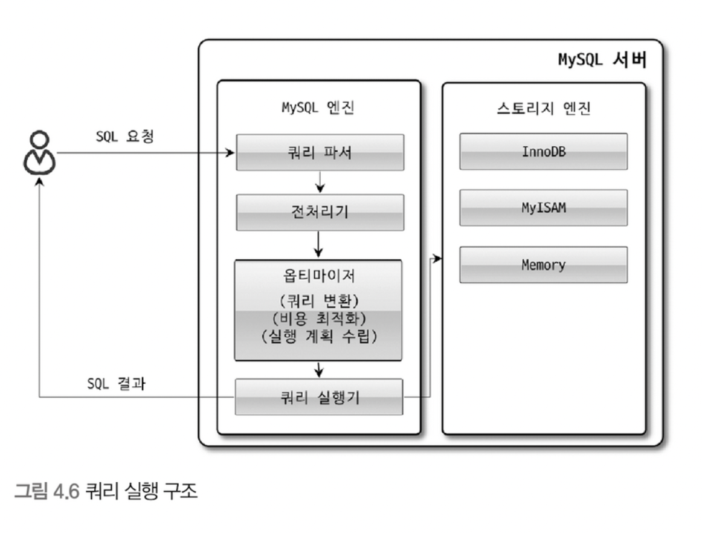

# MySQL 엔진 아키텍처

* MySQL에서는 MySQL 엔진과 스토리지 엔진으로 구분할 수 있습니다.
* MySQL 엔진은 클라이언트로부터의 점속 및 쿼리 요청을 처리하는 커넥션 핸들러와 SQL 파서 및 전처리기, 쿼리의 최적화된 실행을 위한 옵티마이저가 중심을 이룹니다.
* 스토리지 엔진은 실제 데이터를 디스크 스토리지에 저장하거나 디스크 스토리지로부터 데이터를 읽어오는 부분을 담당합니다.
* 각 스토리지 엔진은 성능 향상을 위해 키 캐시(MyISAM)나 InnoDB 버퍼 풀과 같은 기능을 내장하고 있습니다.
* MySQL 엔진의 쿼리 실행기에서 데이터를 쓰거나 읽어야 할 때는 각 스토리지 엔진 쓰기 또는 읽기를 요청하는데, 이러한 요청을 핸들러(Handler) 요청이라고 합니다.

## MySQL 스레딩 구조

* MySQL 서버는 프로세스 기반이 아닌 스레드 기반으로 작동하며, 크게 포그라운드 스레드와 백그라운드 스레드로 구분할 수 있습니다.

### 포그라운드 스레드(클라이언트 스레드)

* 포그라운드 스레드는 MySQL 서버에 접속된 클라이언트의 수만큼 존재하며, 주로 각 클라이언트 사용자가 요청하는 쿼리 문장을 처리합니다.
* 커넥션이 종료되면 해당 커넥션을 담당하던 스레드는 다시 스레드 캐시(Thread Cache)로 돌아가 대기하게 됩니다.
* 스레드 캐시에 일정 개수 이상의 스레드가 대기중이면 커넥션이 종료되어 반납되는 스레드는 제거됩니다.
* 포그라운드 스레드는 데이터를 MySQL 데이터 버퍼나 캐시로부터 가져오며, 
버퍼나 캐시에 없는 경우에는 직접 디스크의 데이터나 인덱스 파일로부터 데이터를 읽어와서 작업을 처리합니다.
* MyISAM은 디스크 쓰기 작업까지 포그라운트 스레드가 처리합니다.
* InnoDB의 경우 데이터 버퍼나 캐시까지만 포그라운드 스레드가 처리하고, 나머지 처리는 백그라운드 스레드가 처리합니다.

### 백그라운드 스레드

* InnoDB는 다음과 같은 작업을 백그라운드로 처리합니다.
  * 인서트 버퍼(Insert Buffer)를 병합하는 스레드
  * 로그를 디스크로 기록하는 스레드
  * InnoDB 버퍼 풀의 데이터를 디스크에 기록하는 스레드
  * 데이터를 버퍼를 읽어 오는 스레드
  * 잠금이나 데드락을 모니터링하는 스레드
* 이러한 스레드 중 로그 스레드(Log Thread)와 버퍼의 데이터를 디스크로 내려쓰는 작업을 처리하는 쓰기 스레드(Write Thread)입니다.
* 사용자의 요청을 처리하는 도중 데이터의 쓰기 작업은 지연(버퍼링)되어 처리될 수 있지만 데이터의 읽기 작업은 절대 지연될 수 없습니다.

## 메모리 할당 및 사용 구조

* MySQL에서 사용되는 메모리 공간은 크게 글로벌 메모리 영역과 로컬 메모리 영역으로 구분할 수 있습니다.
* 글로벌 메모리 영역의 모든 메모리 공간은 MySQL 서버가 시작되면서 운영체제로부터 할당됩니다.

### 글로벌 메모리 영역

* 글로벌 메모리 영역은 클라이언트 스레드의 수와 무관하게 하나의 메모리 공간만 할당됩니다.
* 글로벌 메모리 영역은 다음과 같습니다.
  * 테이블 캐시
  * InnoDB 버퍼 풀
  * InnoDB 어댑티브 해시 인덱스
  * InnoDB 리두 로그 버퍼

### 로컬 메모리 영역

* 로컬 메모리 영역은 세션 메모리 영역이라고 표현하며, MySQL 서버상에 존재하는 클라이언트 스레드가 쿼리를 처리하는 데 사용하는 메모리 영역입니다.
* 로컬 메모리는 각 클라이언트 스레드별로 독립적으로 할당되며 절대 공유되어 사용되지 않는다는 특징이 있습니다.
* 로컬 메모리에서 각 쿼리의 용도별로 필요할 때만 공간이 할당되고 필요하지 않는 경우에는 MySQL이 메모리 공간을 할당조차도 하지 않을 수도 있습니다. 
대표적으로 소트 버퍼나 조인 버퍼와 같은 공간이 있습니다.
* 로컬 메모리 공간은 커넥션이 열려 있는 동안 계속 할당된 상태로 남아 있는 공간도 있고(커넥션 버퍼나 결과 버퍼) 
그렇지 않고 쿼리를 실행하는 순간에만 할당했다가 다시 해제하는 공간(소트 버퍼나 조인 버퍼)도 있습니다.
* 로컬 메모리 영역은 다음과 같ㅎ습니다.
  * 정렬 버퍼
  * 조인 버퍼
  * 바이너리 로그 캐시
  * 네트워크 버퍼

## 쿼리 실행 구조

* 쿼리 파서는 사용자 요청으로 들어온 쿼리 문장을 토큰(MySQL이 인식할 수 있는 최소 단위의 어휘나 기호)으로 분리해 트리 형태의 구조로 만들어 내는 작업을 의미합니다.
* 전처리기는 파서 과정에서 만들어진 파서 트리를 기반으로 쿼리 문장에 구조적인 문제점이 있는 확인합니다. 
실제 존재하지 않거나 권한상 사용할 수 없는 개체의 토큰은 이 단계에서 걸러집니다.
* 옵티마이저는 사용자의 요청으로 들어온 쿼리 문장을 저렴한 비용으로 가장 빠르게 처리할지를 결정하는 역할을 담당하며, DBMS의 두뇌에 해당합니다.
* 실행 엔진은 옵티마이저가 수립한 계획대로 각 핸들러에게 요청된 작업을 처리하도록 지시합니다.
* 핸들러(스토리지 엔진)은 데이터를 디스크로 저장하고 디스크로부터 읽어 오는 역할을 담당합니다.
* 쿼리 캐시는 동일한 SQL문에 대해 테이블을 읽지 않고 바로 캐싱된 데이터를 반환하는 기능을 제공합니다. 하지만 이는 MySQL 8.0부터는 제거되었습니다.

## 트랜잭션 지원 메타데이터

* 데이터베이스 서버에서 테이블의 구조 정보와 스토어드 프로그램 등의 정보를 데이터 딕셔너리 또는 메타데이터라고 합니다.
* MySQL 8.0부터 테이블의 구조 정보나 스토어드 프로그램의 코드 관련 정보를 모두 InnoDB 테이블에 저장하도록 개선됐습니다.
* MySQL 8.0 이후로 사요요자의 인증, 권한 관련 정보들을 가지는 시스템 테이블이 InnoDB 테이블을 사용하도록 개선됐으며 이는 mysql 데이터베이스에 저장됩니다.
* 시스템 테이블을 InnoDB를 이용하여 관리하게 되면서 테이블 수정 중 MySQL 서버가 다운되더라도 원자성을 보장할 수 있게 됩니다.

