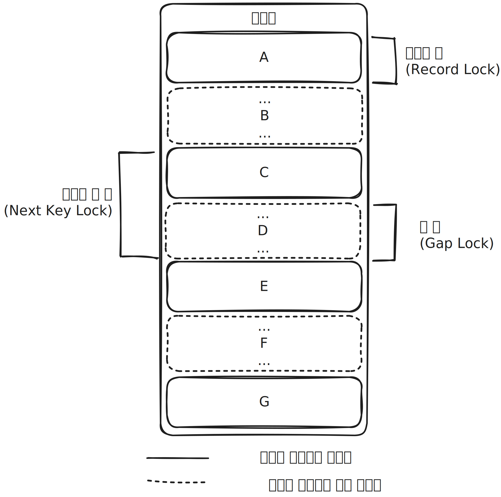

# InnoDB 스토리지 엔진 락

* InnoDB 스토리지 엔진은 레코드 기반의 잠금 기능을 제공합니다.
* 잠금 정보가 상당히 작은 공간으로 관리되기에 레코드 락이 페이지락, 또는 테이블 락으로 레벨업되는 경우(락 에스컬레이션)는 없습니다.
* 일반 상용 DBMS와는 조금 다르게 InnoDB 스토리지 엔진에서는 레코드 락뿐 아니라 레코드와 레코드 사이의 간격을 잠그는 갭(GAP) 락이 존재합니다.

## 레코드 락(Record Lock, Record Only Lock)

* 레코드 락은 레코드 자체만을 잠그는 락입니다.
* 다른 상용 DBMS의 레코드 락과 동일한 역할을 하지만 InnoDB 스토리지 엔진은 레코드 자체가 아닌 인덱스의 레코드를 잠근다는 점에서 차이가 있습니다.
* 인덱스의 레코드를 잠그는것은 인덱스를 통해 검색된 리프 노드의 인덱스 레코드, 즉 PK들을 잠그는 것입니다. 요약하면 인덱스를 통해 검색되는 모든 레코드에 잠금을 거는것입니다.
* 인덱스가 없다면 InnoDB는 내부적으로 클러스터 인덱스를 생성하여 해당 인덱스를 이용하여 레코드 락을 걸게 됩니다.
* 클러스터 인덱스까지 사용하지 않는 상황, 즉 어떠한 인덱스도 사용하지 못하는 상황에서는 테이블 전체에 대해 레코드 락이 걸리게 됩니다. 
* InnoDB에서는 대부분 보조 인덱스를 이용한 변경 작업은 넥스트 키 락(Next Key Lock) 또는 갭 락(Gap Lock)을 사용하지만 PK 또는 유니크 인덱스에 의한 변경 작업에서는 갭에 대해서는 잠그지 않고 레코드 자체에 대해서만 락을 겁니다.

## 갭 락(Gap Lcok)

* 갭 락은 레코드 자체가 아니라 레코드와 바로 인접한 레코드 사이의 간격만 잠그는 것을 의미합니다.
* 갭 락의 역할은 레코드와 레코드 사이의 간격에 새로운 레코드가 생성(INSERT)되는 것을 제어하는 것입니다.
* 갭 락은 그 자체보다는 넥스트 키 락의 일부로 자주 사용됩니다.

## 넥스트 키 락(Next Key Lock)

* 레코드 락과 갭 락을 합쳐 놓은 형태의 잠금을 넥스트 키(Next Key Lock)이라고 합니다.
* InnoDB의 갭 락이나 넥스트 키 락은 바이너리 로그에 기록되는 쿼리가 레플리카 서버에서 실행될 때 소스 서버에서 만들어 낸 결과와 동일한 결과를 만들어내도록 보장하는 것이 주목적입니다.
* 넥스트 키 락과 갭 락으로 인해 데드락이 발생하거나 다른 트랜잭션을 기다리게 만드는 일이 자주 발생합니다. 이를 방지하기 위해 로그 포맷을 ROW 형태로 바꿔 넥스트 키 락이나 갭 락을 줄일 수 있습니다.

## 자동 증가 락(Auto-Increment Lock)

* InnoDB 스토리지 엔진에서는 AUTO-INCREMENT 칼럼이 사용된 테이블에 동시에 여러 레코드가 INSERT되는 경우, 저장되는 각 레코드는 중복되지 않고 저장된 순서대로 증가하는 일련번호 값을 가져오기 위해 내부적으로 자동 증가 락(Auto-Increment Lock)이라 하는 테이블 수준의 잠금을 사용합니다.
* 자동 증가 락은 INSERT, REPLACE 쿼리 문장과 같이 새로운 레코드를 저장하는 쿼리에서만 필요하며, UPDATE나 DELETE 등의 쿼리에서는 걸리지 않습니다.
* 자동 증가 락은 트랜잭션과 관계없이 INSERT, REPLACE 문장에서 AUTO-INCREMENT 값을 가져오는 순간 락이 걸렸다 즉시 해제됩니다.
* AUTO-INCREMENT 락은 테이블에 단 하나만 존재하기에 동시에 INSERT 문장이 들어온다면 하나는 락이 해제될떄까지 기다려야합니다.
* AUTO-INCREMENT 락을 명시적으로 획득하고 해제하는 방법은 없습니다.
* 자동 증가 값이 한 번 증가하면 절대 줄어들지 않는 이유는 자동 증가 락을 최소화하기 위해서입니다.

> 참조
>
> Real MySQL 8.0 1권(https://product.kyobobook.co.kr/detail/S000001766482)
> 
> InnoDB의 레코드락에 대한 궁금점(https://leezzangmin.tistory.com/37)
> 
> [MySQL] 스토리지 엔진 수준의 락의 종류(레코드 락, 갭 락, 넥스트 키 락, 자동 증가 락)(https://mangkyu.tistory.com/298)