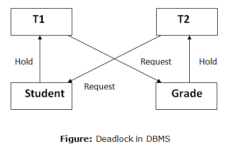

# 락(Lock)

> 목차
> 
> [1. MySQL 엔진 락](https://github.com/tlarbals824/TIL/blob/main/Database/MySQL/Lock/MySQLEngineLock.md)
> 
> [2. InnoDB 스토리지 엔진 락](https://github.com/tlarbals824/TIL/blob/main/Database/MySQL/Lock/InnoDBLock.md)

## MySQL 락

* MySQL에서 사용되는 잠금은 크게 스토리지 엔진 레벨과 MySQL 엔진 레벨로 나눌 수 있습니다.
* MySQL 엔진은 MySQL 서버에서 스토리지 엔진을 제외한 나머지 부분입니다.
* MySQL 엔진 레벨의 잠금은 모든 스토리지 엔진에 영향을 미치지만, 스토리지 엔진 레벨의 잠금은 스토리지 엔진 간 상호 영향을 미치지 않습니다.

## 쓰기 락과 읽기 락

| -        | 읽기 락  |  쓰기 락  |
|:---------|:-----:|:------:|
| **읽기 락** | 동시 가능 |   대기   |
| **쓰기 락** |  대기   |   대기   |

### 읽기 락(Read Lock)

* 읽기 락은 여러 트랜잭션이 동시에 동일한 데이터를 읽을 수 있도록 허용하는 락입니다.
* 트랜잭션이 데이터에 읽기 락을 설정하면, 다른 트랜잭션들도 해당 데이터를 읽을 수 있지만 동시에 그 데이터를 수정할 수 없습니다.
* 여러 트랜잭션이 읽기 락을 설정할 수 있으며, 읽기 락끼리는 충돌하지 않습니다.
* 읽기 락은 **"SELECT FOR SHARE"**를 사용하여 특정 데이터로부터 공유 락을 획득할 수 있습니다.
* 읽기 락은 공유 락(Shared Lock)이라고도 합니다.

### 쓰기 락(Write Lock)

* 쓰기 락은 데이터를 수정할 때 사용되며, 해당 데이터에 대한 읽기와 쓰기 모두를 제한합니다.
* 트랜잭션이 데이터에 쓰기 락을 설정하면, 다른 트랜잭션은 해당 데이터에 대한 어떤 락도 얻을 수 없으며, 해당 데이터를 읽거나 수정할 수 없습니다.
* 쓰기 락을 설정한 트랜잭션이 해당 작업을 완료하기 전까지, 다른 트랜잭션들은 해당 데이터에 대한 접근을 기다려야 합니다.
* 쓰기 락은 **"SELECT FOR UPDATE"** 를 사용하여 특정 데이터로부터 배타 락을 획득할 수 있습니다.
* 쓰기 락은 배타 락(Exclusive Lock)이라고도 합니다.

## 데드 락

* 데드락은 두 개 이상의 트랜잭션이 하나의 데이터를 두고 락을 얻기 위해 무한정 대기하고 있는 상황을 나타냅니다.
* InnoDB에는 데드락을 검출하고 처리하는 메커니즘을 가지고 있습니다.
* 대표적인 예로 2개의 트랜잭션이 동시에 읽기 락을 건 다음 쓰기 락을 건다면 각자 상대방이 가지고있는 읽기 락이 해제되기까지 무한정 대기합니다.

> 참조
> 
> Real MySQL 8.0 1권(https://product.kyobobook.co.kr/detail/S000001766482)