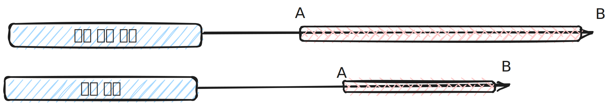
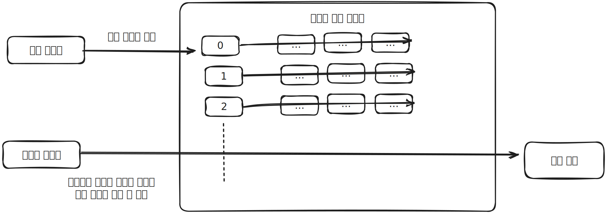
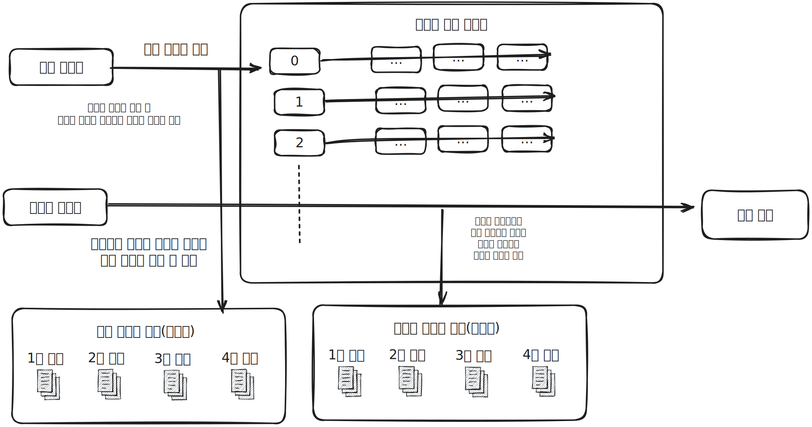

# 고급 최적화

* MySQL 서버의 옵티마이저가 실행 계획을 수립할 때 통계 정보와 옵티마이저 옵션을 결합해서 최적의 실핼 계획을 수립하게 됩니다.
* 옵티마이저 옵션은 다음으로 구분할 수 있습니다.
    * 조인 관련 옵티마이저 : 조인 관련 옵티마이저 옵션은 MYSQL 서버 초기 버전부터 제공되던 옵션입니다.
    * 옵티마이저 스위치 : 옵티마이저 스위치는 MySQL 5.5버전부터 지원하였으며 이는 MySQL 서버의 고급 최적화 기능들을 활성화할지를 제어하는 용도로 사용됩니다.

## 옵티마이저 스위치 옵션

* 옵티마이저 스위치 옵션은 optimizer_switch 시스템 변수를 이용해 제어합니다.

| 옵티마이저 스위치 이름                        | 기본값 | 설명                                                            |
|-------------------------------------|:---:|---------------------------------------------------------------|
| batched_key_access                  | off | BKA 조인 알고리즘을 사용하지 여부 설정                                       |
| block_nested_loop                   | on  | Block Nested Loop 조인 알고리즘을 사용할지 여부 설정                         |
| engine_condition_pushdown           | on  | Engine Condition Pushdown 기능을 사용할지 여부 설정                      |
| index_condition_pushdown            | on  | Index Condition Pushdown 기능을 사용할지 여부 설정                       |
| use_index_extensions                | on  | Index Extension 최적화를 사용할지 여부 설정                               |
| index_merge                         | on  | Index Merge 최적화를 사용할지 여부 설정                                   |
| index_merge_intersection            | on  | Index Merge Intersection 최적화를 사용할지 여부 설정                      |
| index_merge_sort_union              | on  | Index Merge Sort Union 최적화를 사용할지 여부 설정                        |
| index_merge_union                   | on  | Index Merge Union 최적화를 사용할지 여부 설정                             |
| mrr                                 | on  | MRR 최적화를 사용할지 여부 설정                                           |
| mrr_cost_based                      | on  | 비용 기반 MRR 최적화를 사용할지 여부 설정                                     |
| semijoin                            | on  | 세미 조인 최적화를 사용할지 여부 설정                                         |
| firstmatch                          | on  | FirstMatch 세미 조인 최적화를 사용할지 여부 설정                              |
| loosescan                           | on  | LooseScan 세미 조인 최적화를 사용할지 여부 설정                               |
| materialization                     | on  | Materialization 최적화를 사용할지 여부 설정(Materialization 세미 조인 최적화 포함) |
| subquery_materialization_cost_based | on  | 비용 기반의 Materialization 최적화를 사용할지 여부 설정                        |

## MRR과 배치 키 액세스(mrr & batched_key_access)

* MySQL 서버에서 지금까지 지원하던 조인 방식은 드라이빙 테이블의 레코드를 한 건 읽어서 드리븐 테이블의 일치하는 레코드를 찾아서 조인을 수행하는 것입니다. (네스티드 루프 조인, Nested Loop Join)
* MySQL 서버의 내부 구조상 조인 처리는 MySQL 엔진이 처리하며, 실제 레코드를 검색하고 읽는 부분은 스토리지 엔진이 담당합니다.
* 드라이빙 테이블의 레코드 건별로 드리븐 테이블의 레코드를 찾으면 레코드를 찾고 읽는 스토리지 엔진에서는 아무런 최적화를 수행할 수 없습니다. 즉, 드리븐 테이블에 대한 풀 테이블 스캔이 반복적으로 발생할 수 있습니다.
* 앞선 단점을 보완하고자 MySQL 서버는 조인 대상 테이블 중 하나로부터 레코드를 읽어서 조인 버퍼에 버퍼링합니다. 이를 통해 버퍼에 있는 레코드를 스토리지 엔진에 한번에 요청하여 테이블을 스캔하는 작업의 수를 줄일 수 있습니다.
* 이러한 방식을 MRR이라 하며, MRR은 "Multi-Range Read"를 줄여서 부르는 이름입니다.
* MRR을 응용해서 실행되는 조인 방식을 BKA(Batched Key Access) 조인이라고 합니다.

## 블록 네스티드 루프 조인(block_nested_loop)

* MySQL 서버에서 사용되는 대부분의 조인은 네스티드 루프 조인(Nested Loop Join)인데, 조인의 연결 조건이 되는 칼럼에 모두 인덱스가 있는 경우 사용되는 조인 방식입니다.
* 네스티드 루프 조인과 블록 네스티드 루프 조인(Block Nested Loop Join)의 가장 큰 차이점은 조인 버퍼가 사용되는지 여부와 조인에서 드라이빙 테이블과 드리븐 테이블이 어떤 순서로 조인되느냐 입니다.
* 조인은 드라이빙 테이블에서 일치하는 레코드의 건수만큼 드리븐 테이블을 검색하면서 처리됩니다. 즉, 드라이빙 테이블은 한번 읽지만, 드리븐 테이블은 여러 번 읽는 것을 의미합니다.
* 어떤 방식으로도 드리븐 테이블의 풀 테이블 스캔이나 인덱스 풀 스캔을 피할 수 없다면 옵티마이저는 드라이빙 테이블에서 읽은 레코드를 메모리에 캐시한 후 드리븐 테이블과 이 메모리 캐시를 조인하는 형태로 처리합니다. 이때 사용되는 메모리의 캐시를 조인 버퍼(Join Buffer)라고 합니다.
* 블록 네스티드 루프 조인에서의 드리븐 테이블과 메모리 캐시를 조인하는 순서는 기존 조인의 순서인 드라이빙 테이블에서 드리븐 테이블의 순서와는 반대로 드리븐 테이블을 읽고 조인 버퍼에 일치하는 레코드를 찾는 방식으로 수행됩니다.
* MySQL 8.0.20 버전부터 블록 네스티드 루프 조인은 더이상 사용되지 않으며 해당 조인과 관련된 옵션이나 힌트들은 해시 조인을 유도하는 모적으로 사용됩니다.

## 인덱스 컨디션 푸시다운(index_condition_pushdown)

* MySQL 5.6 버전부터는 인덱스 컨디션 푸시다운(Index Condition Pushdown)이라는 기능이 도입됐습니다.
* MySQL에서 인덱스를 비교하는 작업은 실제 InnoDB 스토리지 엔진에서 수행하지만 테이블의 레코드에서 'Like'와 같은 비교 작업은 MySQL 엔진이 수행합니다.
* MySQL 5.6 이전 버전에서는 인덱스를 범위 제한 조건(BETWEEN, LIKE, IN)으로 사용하지 못하는 조건은 MySQL 엔진이 스토리지 엔진으로 아예 전달해주지 않았습니다. 
* MySQL 5.6 버전부터는 인덱스를 범위 제한 조건으로 사용하지 못한다고 하더라도 인덱스에 포함된 칼럼의 조건이 있다면 모두 같이 모아서 스토리지 엔진으로 전달할 수 있게 핸들러 API가 개선 됐습니다.(인덱스 컨디션 푸시다운)
* 인덱스 컨디션 푸시다운이 사용되면 실행 계획의 Extra 칼럼에 "Using index condition" 메시지가 출려됩니다.

## 인덱스 확장(use_index_extensions)

* use_index_extensions 옵티마이저 옵션은 InnoDB 스토리지 엔진을 사용하는 테이블에서 세컨더리 인덱스에 자동으로 추가된 프라이머리 키를 활용할 수 있게 할지 결정하는 옵션입니다.
* InnoDB에서의 예로 클러스터링 인덱스가 있습니다. 
* InnoDB의 경우 PK를 클러스터링 인덱스로 등록하며 세컨더리 인덱스 리프 노드에 PK를 가집니다. 따라서 use_index_extensions 옵션을 통해서 InnoDB가 자동으로 추가한 PK를 MySQL 옵티마이저가 인지하고 실행 계획을 수립하도록 할 수 있습니다. 

## 인덱스 머지(index_merge)

* 인덱스를 이용해 쿼리를 실행하는 경우, 대부분 옵티마이저는 테이블별로 하나의 인덱스만 사용하도록 실행 계획을 수립합니다.
* 인덱스 머지 실행 계획을 사용하면 하나의 테이블에 대해 2개 이상의 인덱스를 이용해 쿼리를 처리합니다.
* 쿼리에 사용된 각각의 조건이 서로 다른 인덱스를 사용할 수 있고 그 조건을 만족하는 레코드 건수가 많을 것으로 예상될 때 MySQL서버는 인덱스 머지 실행 계획을 선택합니다.
* 인덱스 머지 실행 계획은 다음과 같이 3개의 세부 실행 계획으로 나눌 수 있습니다.
  * index_merge_intersection
  * index_merge_sort_union
  * index_merge_union

### 인덱스 머지 - 교집합(index_merge_intersection)

* 인덱스 머지 교집합(index_merge_intersection)은 실행 계획 Extra 칼럼에 "Using intersect" 메시지가 출력되며 이 쿼리가 여러 개의 인덱스를 각각 검색해서 그 결과를 교집합만 반환했음을 의미합니다.

### 인덱스 머지 - 합집합(index_merge_union)

* 인덱스 머지 합집합(index_merge_union)은 WHERE 절에 사용된 2개 이상의 조건이 각각의 인덱스를 사용하되 OR 연산자로 연결된 경우에 사용되는 최적화입니다.
* 실행 계획에서 Extra 칼럼에 "Using union(a, b)" 메시지가 출력되면 인덱스 머지 최적화가 a 인덱스의 결과와 b 인덱스 검색 결과를 'Union' 알고리즘으로 병합했음을 의미합니다. 이때 병합은 두 집합의 합집합을 가져왔다는 것을 의미합니다.
* 병합하는 과정에서 정렬된 두 집합의 결과의 중복을 제거할때 우선순위 큐 알고리즘을 사용하여 수행합니다.

### 인덱스 머지 - 정렬 후 합집합(index_merge_sort_union)

* 인덱스 머지 작업을 하는 도중에 결과의 정렬이 필요한 경우 MYSQL 서버는 인덱스 머지 최적화 'Sort union' 알고리즘을 사용합니다.
* 인덱스 머지 정렬 후 합집합이 수행되면 실행 계획의 Extra 칼럼에 "Using sort union" 메시지가 출력됩니다.

## 세미 조인(semijoin)

* 다른 테이블과 실제 조인을 수행하지 않고, 단지 다른 테이블에서 조건에 일치하는 레코드가 있는지 없는지만 체크하는 형태의 쿼리를 세미 조인(Semi-Join)이라고 합니다.
* 세미 조인(Semi-Join) 형태의 쿼리와 안티 세미 조인(Anti Semi-Join) 형태의 쿼리는 최적화 방법이 조금 차이가 있습니다.
* "= (subquery)" 형태와 "IN (subquery)" 형태의 세미 조인 쿼리에 대해 다음과 같이 3가지 최적화 방법을 적용할 수 있습니다.
  * 세미 조인 최적화
  * IN-to-EXSITS 최적화
  * MATERIALIZATION 최적화
* "<> (subquery)" 형태와 "NOT IN (subquery)" 형태의 안티 세미 조인 쿼리에 대해서는 다음 2가지의 최적화 방법이 있습니다.
  * IN-to-EXSITS 최적화
  * MATERIALIZATION 최적화
* MySQL 8.0 버전부터 세미 조인 쿼리의 성능을 개선하기 위한 다음과 같은 최적화 전략이 있습니다.
  * Table Pull-out
  * Duplicate Weed-out
  * First Match
  * Loose Scan
  * Materialization

### 테이블 풀-아웃(Table Pull-out)

* Table pullout 최적화는 세미 조인의 서브쿼리에 사용된 테이블을 아우터 쿼리로 끄집어낸 후에 쿼리를 조인 쿼리로 재작성하는 형태의 최적화입니다.
* 이는 서브쿼리 최적화가 도입되기 이전에 수동으로 쿼리를 튜닝하던 대표적인 방법이었습니다.
* Table pullout 최적화는 별도로 실행 계획의 Extra 칼럼에 "Using table pullout"과 같은 문구가 출려되지 않습니다.
* Table pullout 최적화의 몇 가지 제한 사항과 특성은 다음과 같습니다.
  * Table pullout 최적화는 세미 조인 서브쿼리에서만 사용 가능합니다.
  * Table pullout 최적화는 서브쿼리 부분이 UNIQUE 인덱스나 프라이머리 키 룩업으로 결과가 1건인 경우에만 사용가능합니다.
  * Table pullout이 적용된다고 하더라도 기존 쿼리에서 가능했던 최적화 방법이 사용 불가능한 것은 아니므로 MySQL에서는 가능하다면 Table pullout 최적화를 최대한 적용합니다.
  * Table pullout 최적화는 서브쿼리의 테이블을 아우터 쿼리로 가져와서 조인으로 풀어쓰는 최적화를 수행하는데, 만약 서브쿼리의 모든 테이블이 아우터 쿼리로 끄집어 낼 수 있다면 서브쿼리 자체는 없어집니다.
  * MySQL에서는 "최대한 서브쿼리를 조인으로 풀어서 사용해라"라는 튜닝 가이드가 많은데, Table pullout 최적화는 사실 이 가이드를 그대로 실행하는 것입니다. 이제부터는 서브쿼리를 조인으로 풀어서 사용할 필요가 없습니다.

### 퍼스트 매치(firstmatch)

* firstmatch 최적화 전략은 IN (subquery) 형태의 세미 조인을 EXISTS (subquery) 형태로 튜닝한 것과 비슷한 방법으로 실행됩니다.
* First Match 최적화는 MySQL 5.5에서 수행했던 최적화 방법인 IN-to-EXISTS 변환과 거의 비슷한 처리 로직을 수행합니다.
* MySQL 5.5의 IN-to-EXISTS 변환에 비해 First Match 최적화 전략은 다음과 같은 장점이 있습니다.
  * 기존 IN-to-EXISTS 최적화에서 등등 조건 전파(Equality propagation)가 서브쿼리 내에서만 가능했지만 First Match 최적화는 아우터 쿼리의 테이블까지 전파가능합니다. 최종적으로 First Match 최적화로 실행되면 더 많은 조건이 주어지는 것이므로 더 나은 실행 계획을 수립할 수 있습니다.
  * IN-to-EXISTS 변환 최적화 전략에서는 아무런 조건 없이 변환이 가능한 경우 무조건 그 최적화를 수행했습니다. 하지만 FirstMatch 최적화에서는 서브 쿼리의 모든 테이블에 대해 FirstMatch 최적화를 수행할지 아니면 일부 테이블에 대해서만 수행할지 취사선택할 수 있다는 것이 장점입니다.
* FirstMatch 최적화 또한 특정 형태의 서브쿼리에서 자주 사용되는 최적화입니다. FirstMatch 최적화의 몇가지 제한 사항과 특성은 다음과 같습니다.
  * FirstMatch는 서브쿼리에서 하나의 레코드만 검색되면 더이상의 검색을 멈추는 단축 실행 경로(Short-cut path)이기 때문에 FirstMatch 최적화에서 서브쿼리는 그 서브쿼리가 참조하는 모든 아우터 테이블이 먼저 조회된 이후 실행됩니다.
  * FirstMatch 최적화가 사용되면 실행 계획의 Extra 칼럼에는 "FirstMatch(table-N)" 문구가 표시됩니다.
  * FirstMatch 최적화는 상관 서브쿼리(Correlated subquery)에서도 사용될 수 있습니다.
  * FirstMatch 최적화는 GROUP BY나 집합 함수가 사용된 서브쿼리의 최적화에는 사용될 수 없습니다.

### 루스 스캔(loosescan)

* 세미 조인 서브쿼리 최적화의 LooseScan은 인덱스를 사용하는 GROUP BY 최적화 방법에서 살펴본 "Using Index for group-by"의 루스 인덱스 스캔과 비슷한 방식을 사용합니다.
* 루스 스캔(LooseScan) 최적화는 다음과 같은 특성을 가집니다.
  * LooseScan 최적화는 루스 인덱스 스캔으로 서브 쿼리 테이블을 읽고, 그 다음으로 아우터 테이블을 드리븐으로 사용해서 조인을 수행합니다. 그래서 서브쿼리 부분이 루스 인덱스 스캔을 사용할 수 있는 조건이 갖춰져야 사용할 수 있는 최적화입니다. 루스 인덱스 스캔 최적화는 다음과 같은 형태의 서브쿼리들에서 사용할 수 있습니다.
  * ~~~mysql
    select ... from ... where expr in (select keypart1 from tab where ...)
    select ... from ... where expr in (select keypart1 from tab where keypart1='상수'...)
    ~~~
    
### 구체화(Materialization)

* Materialization 최적화는 세미 조인에 사용된 서브쿼리를 구체화해서 쿼리를 최적화한다는 의미입니다.
* 구체화는 쉽게 표현하면 내부 임시 테이블을 생성함을 의미합니다.
* Materialization 최적화는 다른 서브쿼리 최적화와는 달리, 서브쿼리 내에 GROUP BY 절이 있어도 이 최적화 전략을 사용할 수 있습니다.
* Materialization 최적화가 사용될 수 있는 형태의 쿼리의 제한 사항과 특성은 다음과 같습니다.
  * IN (subquery)에서 서브쿼리는 상관 서브쿼리(Correlated Subquery)가 아니어야 한다.
  * 서브쿼리는 GROUP BY나 집합 함수들이 사용돼도 구체화를 사용할 수 있습니다.
  * 구체화가 사용된 경우에는 내부 임시 테이블이 사용됩니다.

### 중복 제거(Duplicated Weed-out)

 * Dpulicated Weed-out은 세미 조인 서브쿼리를 일반적인 INNER JOIN 쿼리로 바꿔서 실행하고 마지막에 중복된 레코드를 제거하는 방법으로 처리되는 최적화 알고리즘입니다.
 * Duplicated Weed-out의 실행 계획에서 "Duplicated Weedout"이라는 문구가 별도로 표시되거나 하지 않습니다. 하지만 Extra 칼럼에 "Start temporary", "End temporary" 문구가 별도로 표시되면 이 구간 사이가 Duplicated Weedout 최적화 처리 과정이라고 보면 됩니다.
 * Duplicated Weedout 최적화는 다음과 같은 장점과 제약사항이 있습니다.
   * 서브쿼리가 상관 서브쿼리라고 하더라도 사용할 수 있는 최적화입니다.
   * 서브쿼리가 GROUP BY나 집합 함수가 사용된 경우에는 사용될 수 없습니다.
   * Duplicated Weedout은 서브쿼리의 테이블을 조인으로 처리하기 때문에 최적화할 수 있는 방법이 많습니다.

### 컨디션 팬 아웃(condition_fanout_filter)

* 조인을 실행할 때 테이블의 순서는 쿼리의 성능에 매우 큰 영향을 미칩니다. 그래서 MySQL 옵티마이저는 여러 테이블이 조인되는 경우 가능하다면 일치하는 레코드 건수가 적은 순서대로 조인을 실행합니다.
* MySQL에서 condition_fanout_filter 최적화를 통해 조인시 실행 계획의 filtered 칼럼의 값을 더 정확하게 예측하여 더 빠른 실행 계획 수립하는 최적화입니다.
* condition_fanout_filter는 다음과 같은 조건을 만족하는 칼럼의 조건들에 대해 조건을 만족하는 레코드의 비율을 계산할 수 있습니다.
  * WHERE 조건절에 사용된 칼럼에 대해 인덱스가 있는 경우
  * WHERE 조건절에 사용된 칼럼에 대해 히스토그램이 존재하는 경우
* condition_fanout_filter 최적화 기능을 활성화하면 MySQL 옵티마이저는 더 정교한 계산을 거쳐서 실행 계획을 수립하므로 더 많은 시간과 컴퓨팅 자원을 사용하게 됩니다.
* 쿼리가 간단하여 쿼리 실행 계획이 잘못된 선택을 한 적이 별로 없다면, condition_fanout_filter 최적화는 성능 향상에 크게 도움이 되지 않을 수 있습니다.

### 파생 테이블 머지(derived_merge)

* 예전 버전의 MySQL 서버에서는 다음과 같이 FROM 절에 사용된 서브쿼리는 먼저 실행해서 그 결과로 임시 테이블을 만든 다음 외부 쿼리 부분을 처리했습니다.
* 다음 쿼리에서 employees 테이블을 읽는 라인의 select_type 칼럼의 값이 DERIVED 임을 알 수 있습니다. 이는 employees 테이블에서 first_name이 'Matt'인 레코드들만 읽어 임시 테이블을 생성한 다음, 이 임시 테이블을 다시 읽어 hire_date가 '1986-04-03'인 레코드만 걸러내 반환한 것입니다.
  * ~~~mysql
    mysql>  explain
            select * from(
                select * from employees where first_name = 'Matt'
            ) derived_table
            where derived_table.hire_date='1986-04-03';
    
    +---+-----------+----------+-----+------------+
    | id|select_type|table     |type |key         |
    +---+-----------+----------+-----+------------+
    | 1 |PRIMARY    |<derived2>|ref  |<auto_key0> |
    | 2 |DERIVED    |employees |ref  |ix_firstname|
    +---+-----------+----------+-----+------------+
    ~~~
* MySQL 서버에서는 이렇게 FROM 절에  사용된 서브쿼리를 파생 테이블(Derived Table)이라고 부릅니다.
* MySQL 5.7 버전부터는 derived_merge 최적화 옵션을 통해 파생 테이블로 만들어지는 서브쿼리를 외부 쿼리와 병합해서 서브쿼리 부분을 제거하는 최적화가 도입됐습니다.
* 다음 실행 계획에서 볼 수 있듯이 select_type이 DERIVED인 라인이 없어졌습니다.
  * ~~~
    +---+-----------+----------+-------------+--------------------------+
    | id|select_type|table     |type         |key                       |
    +---+-----------+----------+-------------+--------------------------+
    | 1 |PRIMARY    |employees |index_merge  |ix_hiredate, ix_firstname |
    +---+-----------+----------+-------------+--------------------------+
    ~~~
* 다음의 경우 옵티마이저가 자동으로 서브쿼리를 외부 쿼리로 병합할 수 없게 됩니다. 따라서 수동으로 병합해서 작성하는 것이 쿼리의 성능 향상에 도움이 됩니다.
  * SUM() 또는 MIN(), MAX() 같은 집계 함수와 윈도우 함수(Window Function)가 사용된 쿼리
  * DISTINCT가 사용된 서브 쿼리
  * GROUP BY나 HAVING이 사용된 쿼리
  * LIMIT이 사용된 서브쿼리
  * UNION 또는 UNION ALL을 포함하는 서브쿼리
  * SELECT 절에 사용된 서브쿼리
  * 값이 변경되는 사용자 변수가 사용된 서브쿼리

## 인비저블 인덱스(use_invisible_indexes)

* MySQL 8.0 버전부터는 인덱스의 가용 상태를 제어할 수 있는 기능이 추가됐습니다.
* use_invisible_indexes 옵타마이저 옵션을 이용하면 INVISIBLE로 설정된 인덱스라 하더라도 옵티마이저가 사용하게 제어할 수 있습니다.

## 스킵 스캔(skip_scan)

* MySQL 8.0 이전 버전에서는 조건절에서 사용되는 칼럼이 인덱스의 선행컬럼으로 사용되지 않는다면 인덱스를 사용하지 못했습니다.
* MySQL 8.0 버전부터 인덱스 스킵 스캔 최적화가 도입됐으며, 이는 인덱스의 선행 칼럼이 조건절에 사용되지 않더라도 후행 칼럼의 조건만으로 인덱스를 이용한 쿼리 성능 개선이 가능합니다.
* 인덱스의 선행 칼럼이 너무 다양한 값을 가지는 경우에는 인덱스 스킵 스캔 최적화가 비효율적일 수 있기에 MySQL 8.0 옵티마이저는 인덱스의 선행 칼럼이 소수의 유니크한 값을 가질때만 인덱스 스킵 스캔을 최적화를 사용합니다.

## 해시 조인(hash_join)

* 해시 조인 쿼리는 첫 번쨰 레코드를 찾는 데 시간이 많이 걸리지만 최종 레코드를 찾는 데까지는 시간이 많이 걸리지 않아 최고 스루풋(Best Throughput) 전략에 적합 합니다.
* 네스티드 루프 조인은 마지막 레코드를 찾는 데까지는 시간이 많이 걸리지만 첫 번째 레코드를 찾는 것은 상대적으로 훨씬 빠르기에 최고 응답 속도(Best Response-time) 전략에 적합 합니다.
* MySQL은 범용 RDBMS이며, 이는 온라인 트랜잭션 처리를 위한 데이터베이스 서버를 지칭함을 의미합니다. 따라서 응답 속도가 중요하기에 조인 조건의 칼럼이 인덱스가 없다거나 조인 대상 테이블 중 일부의 레코드 건수가 매우 적은 경우 등에 대해서만 해시 조인 알고리즘을 사용하도록 설계돼 있습니다.
* 일반적으로 해시 조인은 빌드 단계(Build-phase)와 프로브 단계(Probe-phase)로 나누어 처리됩니다.
* 빌드 단계에서는 조인 대상 테이블 중에서 레코드 건수가 적어서 해시 테이블로 만들기에 용이한 테이블을 골라서 메모리에 해시 테이블을 생성하는 작업을 수행합니다. 이때 만든 테이블을 빌드 테이블이라고 합니다.
* 프로브 단계는 나머지 테이블의 레코드를 읽어서 해시 테이블의 일치 레코드를 찾는 과정을 의미합니다. 이때 읽는 나머지 테이블을 프로브 테이블이라고도 합니다.

해시 조인 처리 단계는 다음과 같습니다.

* 해시 테이블을 메모리에 저장할 때 MYSQL 서버는 join_buffer_size 시스템 변수로 크기를 제어할 수 있는 조인 버퍼를 사용합니다. 기본 크기는 256KB입니다.
* 조인 버퍼의 크기가 부족한 경우 MySQL 서버는 빌드 테이블과 프로브 테이블을 적당한 크기의 정크로 분리한 다음 앞서 나온 해시 조인 처리 단계와 동일한 방식으로 처리합니다.
* MySQL 서버는 해시 테이블을 생성하는 과정에서 메모리 사용량의 초과를 인지할 수 있기에 디스크 청크에 기록하는 과정 해시테이블 생성하는 중간에 발생하는 것입니다.
* 빌드 테이블 청크의 수와 프로브 테이블 청크의 수는 같습니다.

> 참조
>
> Real MySQL 8.0 1권(https://product.kyobobook.co.kr/detail/S000001766482)