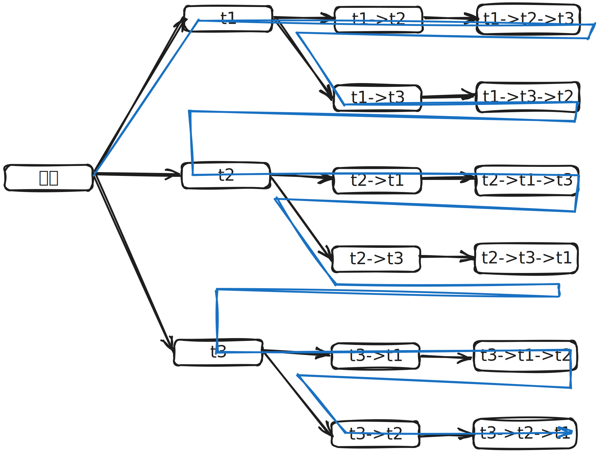
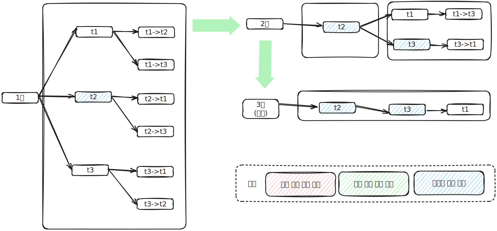

# 조인 최적화 알고리즘

* MySQL에는 조인 쿼리의 실행 계획 최적화를 위한 알고리즘 2개가 있습니다.
  * Exhaustive 검색 알고리즘
  * Greedy 검색 알고리즘

## Exhuastive 검색 알고리즘

* Exhuastive 검색 알고리즘은 MySQL 5.0과 그 이전 버전에서 사용되던 조인 최적화 기법입니다.
* FROM 절에 명시된 모든 테이블의 조합에 대해 실행 계획의 비용을 계산해서 최적의 조합 1개를 찾는 방법입니다.

## Greedy 검색 알고리즘

* Greedy 검색 알고리즘은 Exhaustive 검색 알고리즘의 시간 소모적인 문제점을 해결하기 위해 MySQL 5.0부터 도입된 조인 최적화 기법입니다.
* Greedy 검색 알고리즘은 다음과 같은 처리과정을 가집니다. 
  1. 전체 N개의 테이블 중에서 optimizer_search_depth 시스템 설정 변수에 정의된 개수의 테이블로 가능한 조인 조합을 생성합니다.
  2. 1번에서 생성된 조인 조합 중에서 최소 비용의 실행 계획 하나를 선정합니다.
  3. 2번에서 선정된 실행 계획의 첫 번째 테이블을 "부분 실행 계획"의 첫 번째 테이블로 선정합니다.
  4. 전체 N-1개의 테이블 중에서 optimizer_search_depth 시스템 설정 변수에 정의된 개수의 테이블로 가능한 조인 조합을 생성합니다.
  5. 4번에서 생성된 조인 조합들을 하나씩 3번에서 생성된 "부분 실행 계획"에 대입해 실행 비용을 계산합니다.
  6. 5번의 비용 계산 결과, 최적의 실행 계획에서 두 번쨰 테이블을 3번에서 생성된 "부분 실행 계획"의 두 번째 테이블로 선정합니다.
  7. 남은 테이블이 모두 없어질 때까지 4~6번 과정을 반복 실행하면서 "부분 실행 계획"에 테이블의 조인 순서를 기록합니다.
  8. 최종적으로 "부분 실행 계획"이 테이블의 조인순서로 결정됩니다.
* Greedy 검색 알고리즘은 optimizer_search_depth 시스템 변수에 설정된 값에 따라 조인 최적화 비용이 상당히 줄어들 수 있습니다.

## MySQL 조인 최적화 시스템 변수

* MySQL에서는 조인 최적화를 위한 시스템 변수로 optimizer_prune_level, optimizer_search_depth가 제공됩니다.

### optimizer_prune_level

* optimizer_prune_level 시스템 변수는 MySQL 5.0부터 추가된 Heuristic 검색이 작동하는 방식을 제어합니다.
* Heuristic 검색의 가장 핵심적인 내용은 다양한 조인 순서의 비용을 계산하는 도중 이미 계산했던 조인 순서의 비용보다 큰 경우에는 언제든지 중간에 포기할 수 있는 것입니다.
* optimizer_prune_level이 "1"로 설정되면 옵티마이저는 조인 순서 최적화에 경험 기반의 Heuristic 알고리즘을 설정합니다.

### optimizer_search_depth

* optimizer_search_depth 시스템 변수는 Greedy 검색 알고리즘과 Exhaustive 검색 알고리즘 중에서 어떤 알고리즘을 사용할지 결정하는 시스템 변수입니다.
* optimizer_search_depth는 0~62까지의 정숫값을 설정할 수 있는데, 1~62까지 정숫값이 설정되면 Greedy 검색 대상을 지정된 개수로 한정해서 최적의 실행 계획을 산출합니다.
* optimizer_search_depth가 0으로 설정되면 Greedy 검색을 위한 최적의 조인 검색 테이블의 개수를 MySQL 옵티마이저가 자동으로 결정합니다.
* 조인에 사용된 테이블의 개수가 optimizer_search_depth 설정 값보다 크다면 optimizer_search_depth 만큼의 테이블은 Exhaustive 검색이 사용되고 나머지 테이블은 Greedy 검색이 사용됩니다.
* 조인에 사용된 테이블의 개수가 optimizer_search_depth 설정 값보다 작다면 Exhaustive 검색만 사용됩니다.
* optimizer_search_depth는 4~5 정도로 설정하는것이 좋습니다.