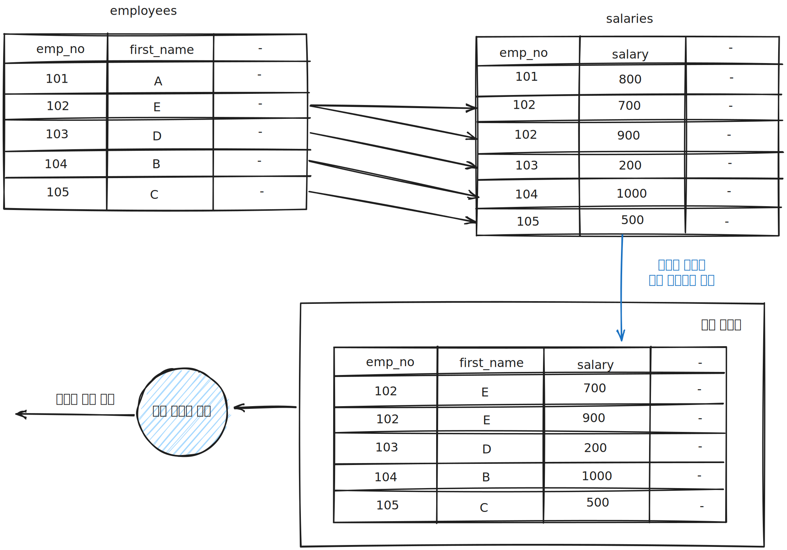

# ORDER BY 처리(filesort)

* 정렬을 처리하는 방법은 인덱스를 이용하는 방법과 쿼리가 실행될 때 **Filesort"** 라는 별도의 처리를 이용하는 방법으로 나눌 수 있습니다.
* 인덱스를 이용하여 모든 정렬을 처리하는 것은 다음과 같은 이유로 불가능합니다.
    * 정렬 기준이 너무 많아서 요건별로 모두 인덱스를 생성하는 것이 불가능한경우
    * GROUP BY의 결과 또는 DISTINCT 같은 처리의 결과를 정렬해야 하는 경우
    * UNION 결과와 임시 테이블의 결과를 다시 정렬해야 하는 경우
    * 랜덤하게 결과 레코드를 가져와야 하는 경우

### 인덱스 이용 장점과 단점

* 장점
    * 인덱스를 자체가 정렬되어 있기에 순서대로 읽으면 되므로 매우 빠릅니다.
* 단점
    * 인덱스의 정렬 과정으로 인해 추가/삭제 작업이 느립니다.
    * 인덱스 디스크 공간이 더 많이 필요합니다.
    * 인덱스 개수가 늘어날수록 InnoDB의 버퍼 풀을 위한 메모리가 많이 필요합니다.

### Filesort 이용의 장점과 단점

* 장점
    * 인덱스를 생성하지 않기에 인덱스의 단점이 장점으로 바뀝니다.
    * 정렬해야할 데이터가 많지 않으면 메모리에서 Filesort가 처리되므로 충분히 빠릅니다.
* 단점
    * 정렬 작업이 쿼리 실행 시 처리되므로 레코드가 많다면 쿼리의 응답속도가 느려집니다.

### 소트 버퍼

* MySQL은 정렬을 수행하기 위해 별도의 메모리 공간인 소트 버퍼를 할당받아서 사용합니다.
* 소트 버퍼는 정렬이 필요한 경우에만 할당되며, 버퍼의 크기는 정렬해야 할 레코드의 크기에 따라 가변적으로 증가합니다.
* 소트 버퍼를 위한 메모리 공간은 쿼리의 실행이 완료되면 즉시 시스템으로 반납됩니다.
* 소트 버퍼의 최대 크기는 sort_buffer_size 시스템 변수를 통해 설정할 수 있습니다.
* 정렬해야 할 레코드의 건수가 소트 버퍼보다 크다면 레코드를 여러 조각으로 나누어서 정렬을 진행합니다.
    * 각 조각들은 소트버퍼에서 정렬이 진행되고 디스크에 임시로 기록해둡니다.
    * 이러한 병합 작업을 멀티 머지(Multi-merge)라고 표현합니다.
* 소트 버퍼의 크기에 따른 정렬 작업의 성능은 큰 차이가 없습니다.

## 정렬 알고리즘

* 레코드를 정렬할 때 레코드 전체를 소트 버퍼에 담을지(싱글 패스) 또는 정렬 기준 칼럼만 소트 버퍼에 담을지(투 패스)로 나눌 수 있습니다.

### 싱글 패스 정렬 방식

* 싱글 패스 정렬 방식은 소트 버퍼에 정렬 기준 칼럼을 포함해 SELECT 대상이 되는 칼럼 전부를 담아서 정렬을 수행하는 정렬 방식입니다.
* 투 패스 정렬 방식에 비해 테이블 읽는 횟수가 적습니다.
* 정렬 레코드의 크기나 건수가 작은 경우 빠른 성능을 보입니다.

~~~mysql
mysql>
select emp_no, first_name, last_name
from employees
order by first_name;
~~~

### 투 패스 정렬 방식

* 투 패스 정렬 방식은 정렬 대상 칼럼과 프라이머리 키 값만 소트 버퍼에 담아서 정렬을 수행하고, 정렬된 순서대로 다시 프라이머리 키로 테이블을 읽어서 SELECT할 칼럼을 가져오는 정렬방식입니다.
* 싱글 패스 정렬 방식이 도입되기 전부터 사용하던 방식입니다.
* 싱글 패스 정렬 방식에 비해 소트 버퍼에 더 많은 데이터를 담을 수 있습니다.
* 정렬 대상 레코드의 크기나 건수가 상당히 많은 경우 효율적입니다.

~~~mysql
mysql>
select emp_no, first_name, last_name
from employees
order by first_name;
~~~

## 정렬 처리 방법

* 쿼리에 ORDER BY가 사용되면 반드시 다음 3가지 처리 방법 중 하나로 정렬이 처리됩니다.
* 일반적으로 아래로 갈수록 처리 속도는 떨어집니다.

| 정렬 처리 방법                    | 실행 계획의 Extra 칼럼 내용                         |
|-----------------------------|--------------------------------------------|
| 인덱스를 사용한 정렬                 | 별도 표기 없음                                   |
| 조인에서 드라이빙 테이블만 정렬           | "Using filesort" 메시지가 표시됨                  |
| 조인에서 조인 결과를 임시 테이블로 저장 후 정렬 | "Using temporary; Using filesort" 메시지가 표시됨 |

### 인덱스를 사용한 정렬

* 인덱스를 이요한 정렬을 위해서는 다음 조건을 만족해야합니다.
  * ORDER BY에 명시된 칼럼이 제일 먼저 읽는 테이블(드라이빙 테이블)에 속해야합니다.
  * ORDER BY의 순서대로 생성된 인덱스가 있어야 합니다.
  * WHERE 절에 첫 번쨰로 읽는 테이블의 칼럼에 대한 조건이 있다면 그 조건과 ORDER BY는 같은 인덱스를 사용할 수 있어야 합니다.
* B-Tree 계열의 인덱스가 아닌 해시 인덱스나 전문 검색 인덱스 등에서는 인덱스를 이용할 수 없습니다.
* 여러 테이블이 조인되는 경우에는 네스티드-루프(Nested-loop) 방식의 조인에서만 이 방식을 사용할 수 있습니다.
* 조인이 사용된 쿼리의 실행 계획에 조인 버퍼(Join buffer)가 사용되면 순서가 흐트러질 수 있기에 주의해야 합니다.

~~~mysql
mysql>  select *
        from employees e, salaries s
        where e.emp_no = s.emp_no
            and e.emp_no between 102 and 120
        order by e.emp_no;
~~~

### 조인에서 드라이빙 테이블만 정렬

* 일반적으로 조인이 수행되면 결과 레코드의 건수가 몇 배로 불어나고, 레코드 하나하나의 크기도 늘어납니다.
* 조인을 실행하기 전에 첫 번째 테이블의 레코드를 먼저 정렬한 다음 조인을 실행하는 것이 **조인에서 드라이빙 테이블만 정렬** 하는 방식입니다.
* 이 방법으로 벙렬이 처리되려면 조인에서 첫 번쨰로 읽히는 테이블(드라이빙 테이블)의 칼럼만으로 ORDER BY 절을 작성해야 합니다.
* 이 방법에서 정렬 방식은 다음과 같습니다.
  * 인덱스를 이용하여 드라이빙 테이블을 검색합니다.
  * 검색 결과를 소트 버퍼를 이용하여 정렬을 진행합니다.
  * 정렬 결과를 이용하여 드리븐 테이블과 조인을 수행하여 최종 결과를 가져옵니다.

~~~mysql
mysql>  select *
        from employees e, salaries s
        where e.emp_no = s.emp_no
            and e.emp_no between 102 and 120
        order by e.last_name;
~~~

### 조인에서 조인 결과를 임시 테이블로 저장 후 정렬

* 2개 이상의 테이블을 조인해서 그 결과를 정렬해야 한다면 임시 테이블이 필요할 수 있습니다.
* 앞선 "조인의 드라이빙 테이블만 정렬"의 경우에는 임시 테이블을 사용하지 않지만 그 외 패턴의 쿼리에서는 항상 조인의 결과를 임시 테이블에 저장하고, 그 결과를 다시 정렬하는 과정을 거칩니다.
* 이 방법은 정렬해야할 레코드 건수가 가장 많기 때문에 가장 느린 정렬 방법입니다.

~~~mysql
mysql>  select *
        from employees e, salaries s
        where e.emp_no = s.emp_no
            and e.emp_no between 102 and 120
        order by s.salary;
~~~

> 참조
>
> Real MySQL 8.0 1권(https://product.kyobobook.co.kr/detail/S000001766482)