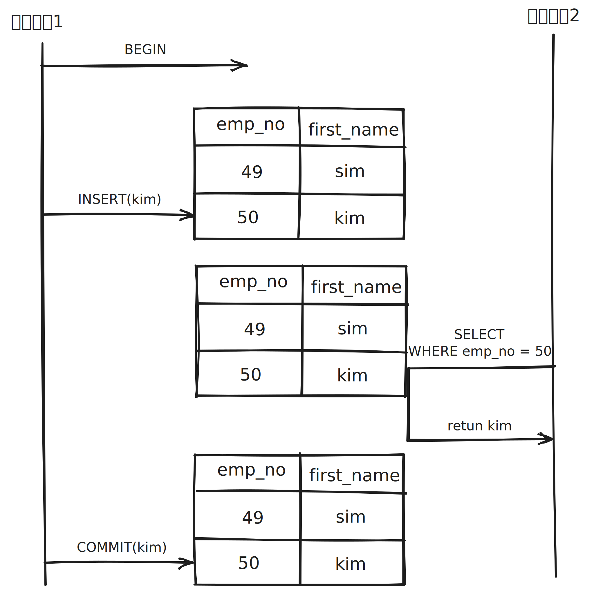
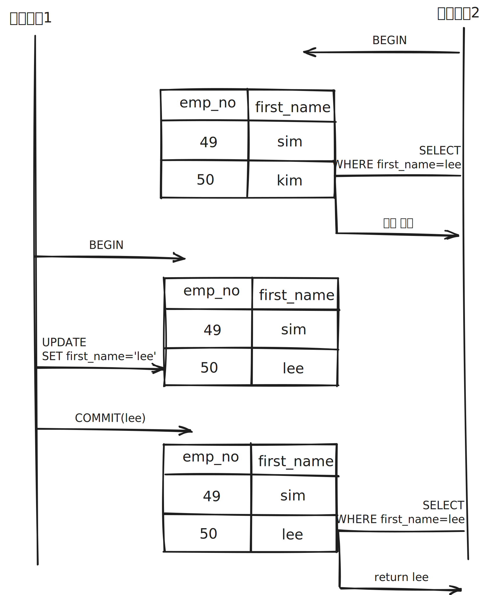
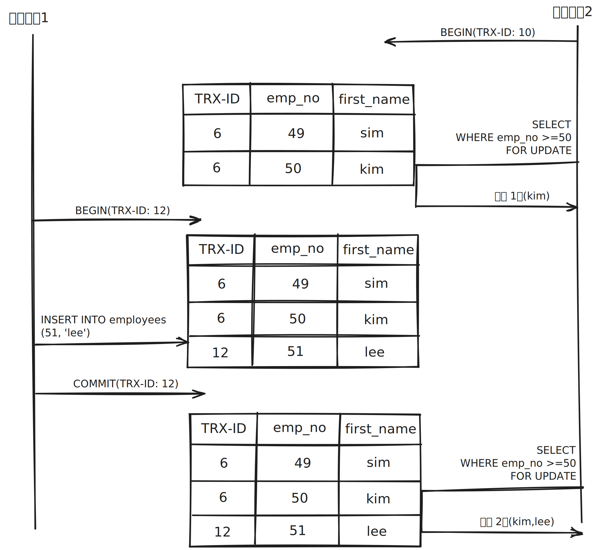
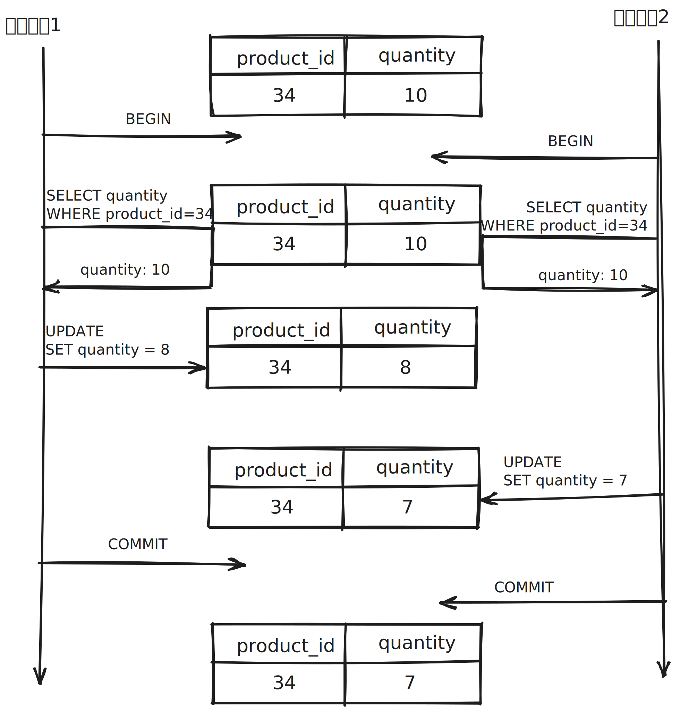
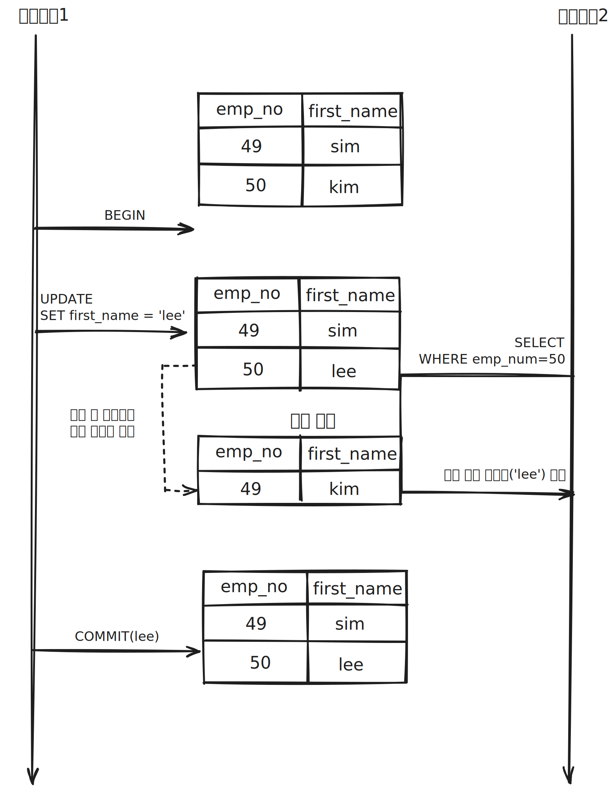
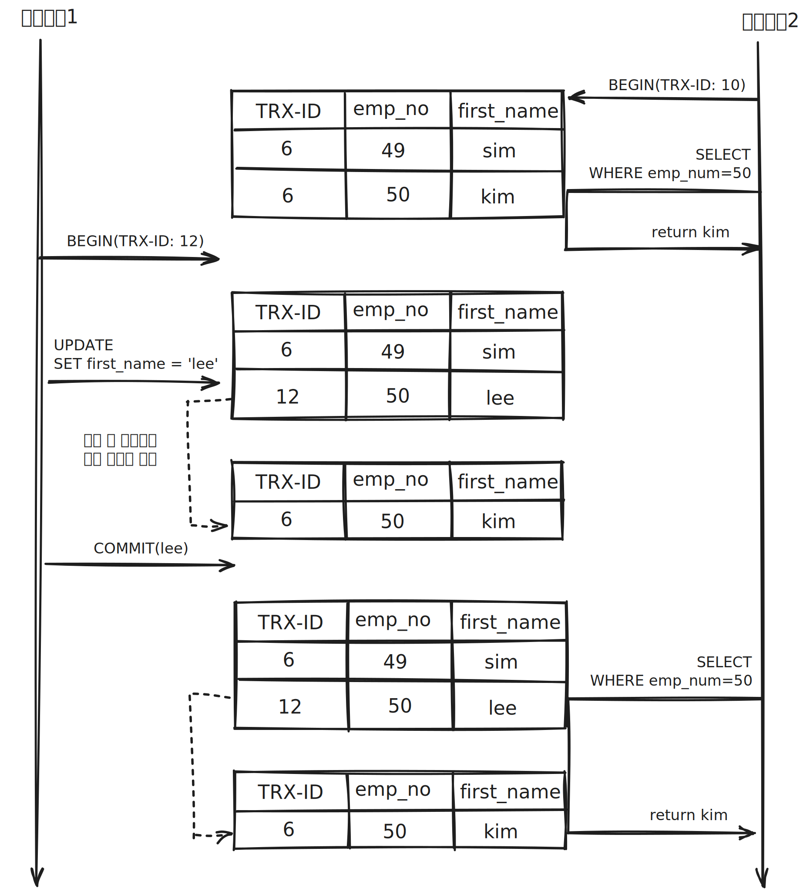

# 트랜잭션

## 트랜잭션이란?

* 트랜잭션은 하나의 논리적인 작업 단위를 구성하는 일련의 연산들의 집합이라고 합니다.
* 트랜잭션은 논리적인 작업 단위가 100% 적용되거나 아무것도 적용되지 않아야 함을 보장해줍니다.

## 트랜잭션의 ACID 성질

* Atomicity(원자성) : DBMS는 완료되지 않은 트랜잭션의 중간 상태를 데이터베이스에 반영해서는 안됩니다. 즉, 트랜잭션의 모든 연산들이 정상적으로 수행 완료 되거나 아니면 전혀 어떠한 연산도 수행되지
  않은 상태를 보장해야 합니다. Atomicity는 쉽게 "All Or Nothing" 특성으로 설명됩니다.
* Consistency(일관성) : 고립된 트랜잭션의 수행이 데이터베이스의 일관성을 보존해야 합니다. 즉, 성공적으로 수행된 트랜잭션은 일관성 규칙을 위반하지 않는 데이터만 데이터베이스에 반영해야 합니다.
  트랜잭션의 수행은 데이터베이스 상태 간의 전이로 봤을 때, 트랜잭션 수행 전후의 데이터베이스 상태는 각각 일관성이 보장되는 서로 다른 상태가 됩니다.
* Isolation(독립성) : 여러 트랜잭션이 동시에 수행되더라도 각각의 트랜잭션은 다른 트랜잭션의 수행에 영향을 받지 않고 독립적으로 수행되어야 합니다. 즉, 한 트랜잭션의 중간 결과가 다른 트랜잭션에게는 숨겨져야 함을 의미합니다. 이러한 Isolation 성질이 보장되지 않으면 트랜잭션이 원래 상태로 되돌아갈 수 없게 됩니다. 성능 관련 이유(동시 처리량)로 인해 이 특성은 가장 유연성 있는 제약 조건입니다.
* Durability(지속성) : 트랜잭션이 성공적으로 완료되어 커밋되고 나면, 해당 트랜잭션에 의한 모든 변경은 향후에 어떤 소프트웨어나 하드웨어 장개 발생되더라도 보존되어야 합니다.

## 트랜잭션 부정합 문제

### DIRTY READ

* DIRTY READ는 하나의 트랜잭션이 다른 트랜잭션에서 아직 커밋되지 않은 변경된 데이터를 읽을 때 발생합니다.

### NON-REPEATABLE READ

* NON-REPEATABLE READ는 하나의 트랜잭션이 동일한 데이터를 다시 읽을 때, 그 데이터의 값이 변경된 경우 발생합니다.

### PHANTOM READ(PHANTOM ROWS)

* PHANTOM READ(PHANTOM ROWS)는 트랜잭션 안에서 동일한 쿼리를 실행했을 때, 결과 집합이 다른 행을 반환하는 현상을 의미합니다.

### Lost Update

* Lost Update는 두 개 이상의 트랜잭션이 동시에 동일한 데이터를 수정하고, 마지막으로 커밋한 트랜잭션이 이전 트랜잭션의 변경을 덮어쓸 때 발생합니다. 이로 인해 이전 변경 사항이 손실됩니다

## 트랜잭션 격리 수준(Transaction Isolation Level)

| -                | DIRTY READ | NON-REPEATABLE READ |  PHANTOM READ  |
|:-----------------|:----------:|:-------------------:|:--------------:|
| READ UNCOMMITTED |     발생     |         발생          |       발생       |
| READ COMMITTED   |     없음     |         발생          |       발생       |
| REPEATABLE READ  |     없음     |         없음          | 발생(InnoDB는 없음) |
| SERIALIZABLE     |     없음     |         없음          |       없음       |

### READ UNCOMMITTED

* READ UNCOMMITTED는 하나의 트랜잭션에서 수정 중인 데이터를 다른 트랜잭션에서 읽을 수 있는 격리 수준입니다.
* READ UNCOMMITTED는 가장 낮은 고립성 수준입니다.
* DIRTY READ가 허용되는 격리 수준입니다.
* READ UNCOMMITTED는 데이터 무결성을 보장하지 않고, 일관성이 깨질 수 있으므로 실무에서는 거의 사용되지 않습니다.

### READ COMMITTED

* READ COMMITTED는 어떤 트랜잭션에서 데이터를 변경하더라도 COMMIT이 완료된 데이터만 다른 트랜잭션에서 조회할 수 있게하는 격리 수준입니다.
* MySQL에서는 언두 로그를 통해 변경 전 데이터를 접근할 수 있습니다. 또한 조회하는 언두 로그는 커밋되기 직전의 언두 로그를 조회합니다.
* READ COMMITTED는 오라클 DBMS에서 기본으로 사용되는 격리 수준입니다.
* DIRTY READ 문제는 발생하지 않지만 NON-REPEATABLE READ 문제가 발생할 수 있습니다.

### REPEATABLE READ

* REPEATABLE READ는 어떤 트랜잭션이 데이터를 읽을 때, 해당 데이터가 다른 트랜잭션에 의해 수정되지 않음을 보장합니다.
* REPEATABLE READ는 MVCC(Multi Version Concurrency Control)을 위해 언두 영역에 백업된 이전 데이터를 이용해 동일 트랜잭션 내에서 동일한 결과를 보여줄 수 있습니다.
* REPEATABLE READ는 현재 트랜잭션이 시작한 지점에서 언두 영역에 백업된 데이터를 조회하기에 트랜잭션이 오래 살아있을수록 오래된 언두 로그를 조회합니다.
* REPEATABLE READ는 MySQL InnoDB에서 기본으로 사용되는 격리 수준입니다.
* InnoDB에서 갭 락과 넥스트 키 락 덕분에 PHANTOM READ(PHANTOM ROWS)가 발생하지 않습니다.
* 바이너리 로그를 가진 MySQL 서버에서는 최소 REPEATABLE READ 격리 수준 이상을 사용해야합니다.
* NON-REPEATABLE READ 문제는 발생하지 않지만 PHANTOM READ(PHANTOM ROWS)가 발생할 수 있습니다.

### SERIALIZABLE

* SERIALIZABLE은 모든 트랜잭션을 순차적으로 실행하는 것과 동일한 격리 수준입니다.
* SERIALIZABLE은 읽기 작업도 공유 잠금(읽기 잠금)을 획득해야만 하며, 동시에 다른 트랜잭션은 해당 데이터를 변경하지 못합니다.
* 가장 단순한 격리 수준이면서 동시에 가장 엄격한 격리 수준입니다.
* 가장 동시 처리량이 낮습니다.
* DIRTY READ, NON-REPEATABLE READ, PHANTOM READ(PHANTOM ROWS) 모두 발생하지 않습니다.

> 참조
>
> DBMS는 어떻게 트랜잭션을 관리할까?(https://d2.naver.com/helloworld/407507)
>
> Real MySQL 8.0 1권(https://product.kyobobook.co.kr/detail/S000001766482)
