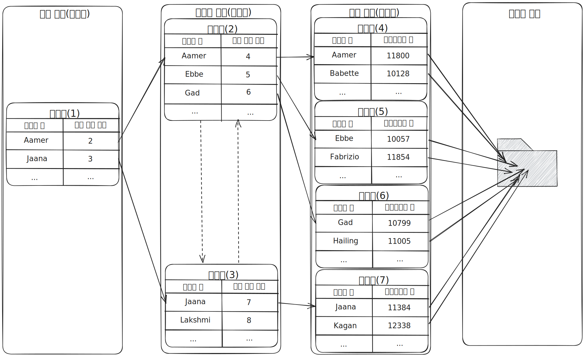
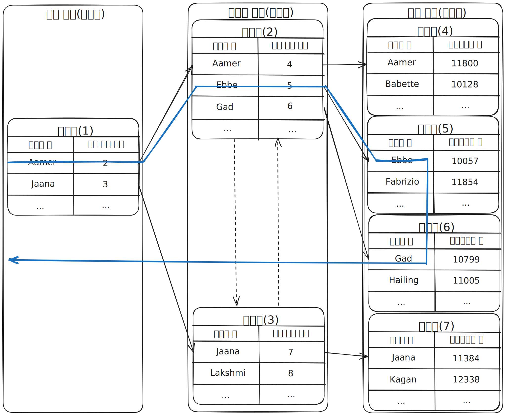
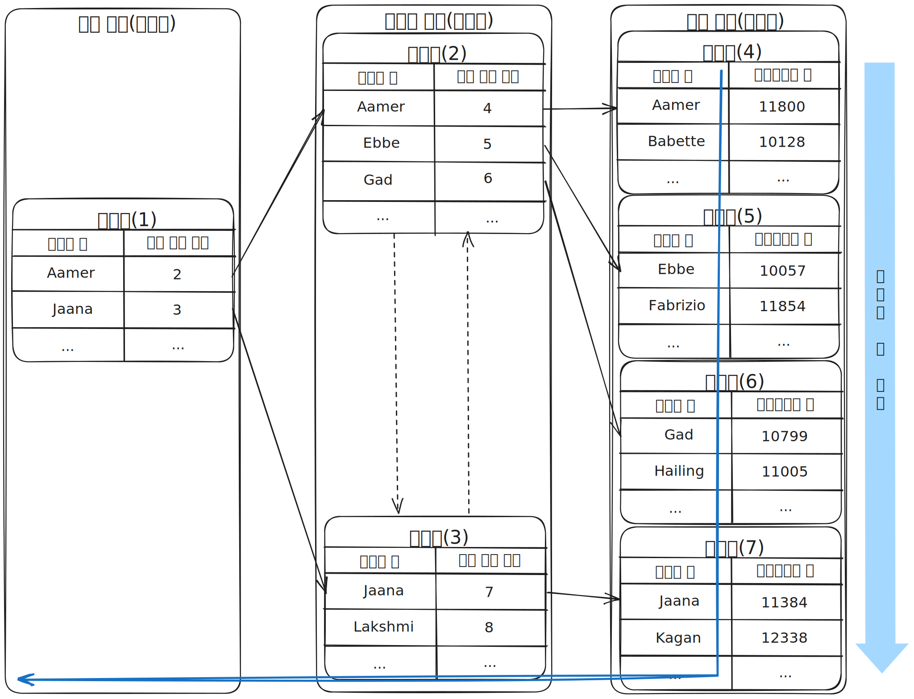
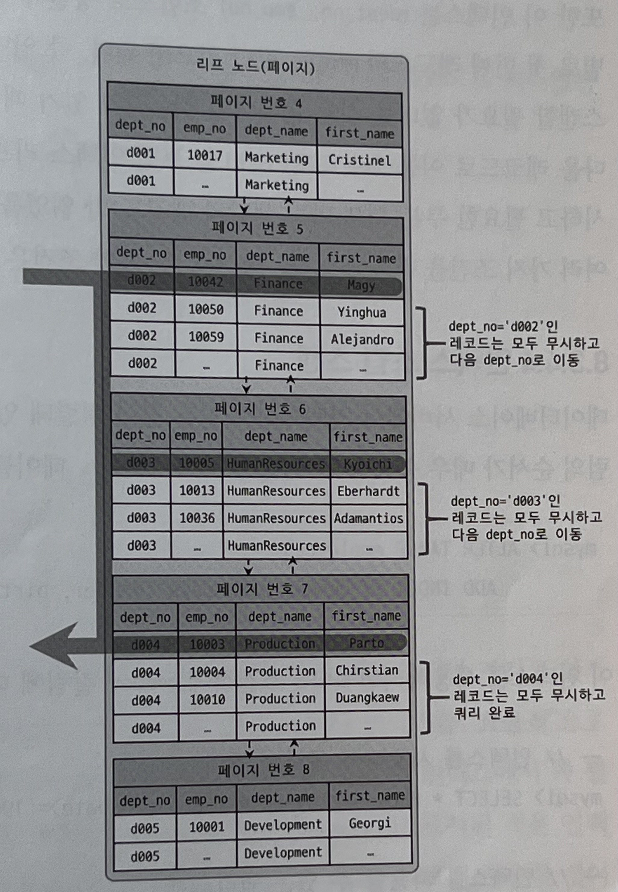
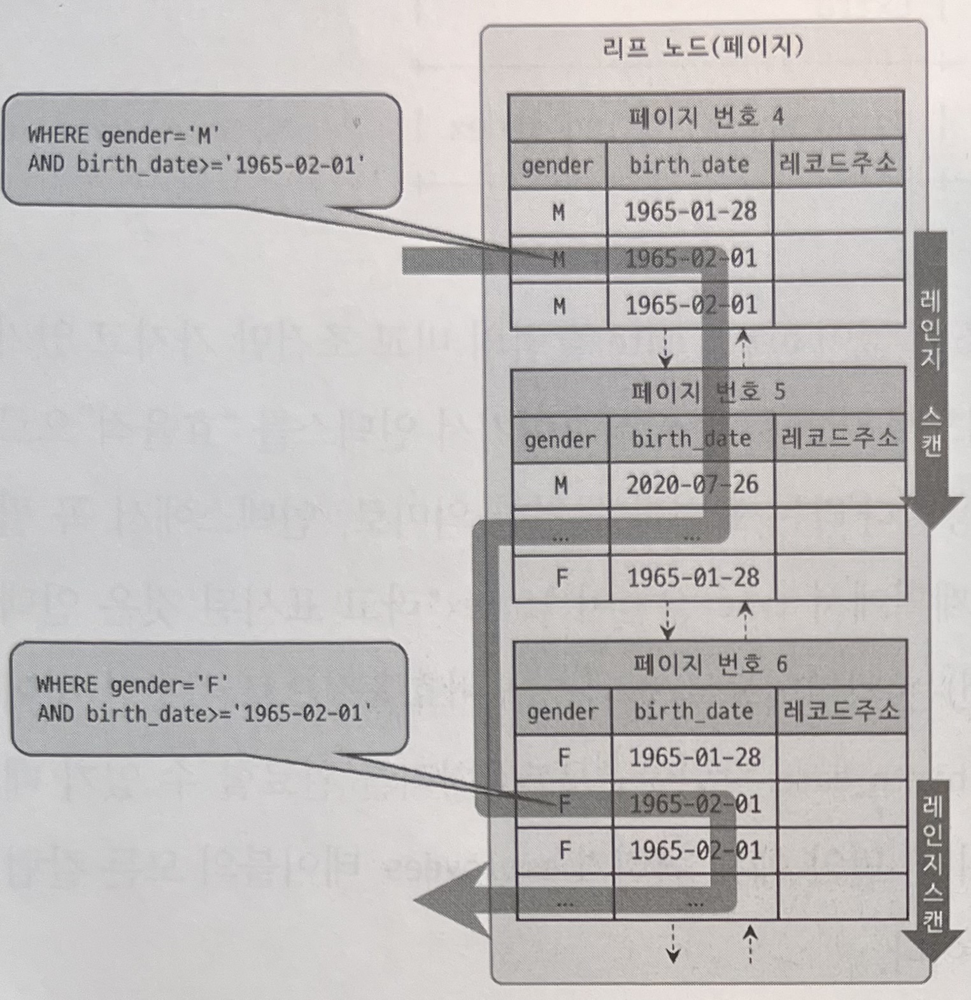

# B-Tree 인덱스

## B-Tree 란?

* B-Tree는 가장 범용적인 목적으로 사용되는 인덱스 알고리즘입니다.
* B-Tree의 변형된 형태의 알고리즘인 B+-Tree, B*-Tree가 있습니다.
* B-Tree의 B는 Balanced를 의미합니다.
* B-Tree는 칼럼의 원래 값을 변형시키지 않고 인덱스 구조체 내에서 항상 정렬된 상태로 유지합니다.

## B-Tree 구조 및 특성

* B-Tree는 트리 구조의 최상위에 하나의 **루트 노드(Root node)** 가 존재하고 그 하위에 자식 노드가 붙어 있는 형태입니다.
* 트리 구조의 가장 하위에 있는 노드를 **리프 노드(Leaf node)** 라고 합니다.
* 트리 구조에서 루트 노드도 아니고 리프 노드도 아닌 중간의 노드를 **브랜치 노드(Branch node)** 라고 합니다.
* 데이터 베이스에서 인덱스와 실제 데이터가 저장된 데이터는 따로 관리되는데, 인덱스의 리프 노드는 항상 실제 데이터 레코드를 찾아가기 위한 주솟값을 가지고 있습니다.
    * 인덱스의 키 값은 모두 정렬되어 있지만, 데이터 파일의 레코드는 정렬돼 있지 않고 임의의 순서로 저장돼 있습니다.
    * 데이터 베이스가 레코드가 삭제되어 생긴 빈 공간을 재활용하도록 설계되기 때문입니다.

## 인덱스 키 추가

* B-Tree에 새로운 키 값이 저장될 때는 저장될 키 값을 이용해 B-Tree 상의 적절한 위치를 검색합니다.
* 저장될 위치가 결정되면 레코드의 키 값과 대상 레코드의 주소 정보를 B-Tree의 리프 노드에 저장합니다.
* 리프 노드가 가득 차서 더는 저장할 수 없다면 리프 노드가 분리되어야 하는데, 이는 상위 브랜치 노드까지 처리의 범위가 넓어집니다.
* MyISAM의 경우 INSERT 쿼리가 실행되면 즉시 B-Tree의 인덱스에 추가하는 반면, InnoDB는 필요하면 인덱스 키 추가 작업을 지연시켜 나중에 처리할 수 있습니다.

## 인덱스 키 삭제

* B-Tree에서 인덱스 키 삭제 요청이 들어오면 해당 키 값이 저장된 B-Tree의 리프 노드를 찾아서 삭제 마크만 하면 작업이 완료됩니다.
* 삭제 마크된 공간은 계속 방치되거나 재활용할 수 있습니다.
* InnoDB의 경우 MySQL 5.5 이전에는 버퍼링되어 나중에 처리할 수 있었습니다.
* MyISAM나 Memory 스토리지 엔진의 경우 체인지 버퍼링이 없어 즉시 처리가 됩니다.

## 인덱스 키 변경

* B-Tree의 키 값 변경 작업은 먼저 키 값을 삭제한 후, 다시 새로운 키 값을 추가하는 형태로 처리됩니다.
* InnoDB의 경우 이 작업을 모두 체인지 버퍼를 활용해 지연 처리 될 수 있습니다.

## 인덱스 키 검색

* INSERT, UPDATE, DELETE 작업을 할 때 인덱스 관리에 따르는 추가 비용을 감당하는 이유는 빠른 검색을 위해서 입니다.
* B-Tree의 루트 노드부터 시작해 브랜치 노드를 거쳐 최종 리프 노드까지 이동하면서 비교 작업을 수행하는데, 이 과정을 **트리 탐색** 이라고 합니다.
* SELECT 뿐만아니라 INSERT, UPDATE, DELETE를 처리하기 위해 해당 레코드를 찾기 위해 검색해야하는 경우에도 사용됩니다.
* InnoDB에서 레코드 잠금이나 넥스트 키락(갭락)이 검색을 수행한 인덱스를 잠근 후 테이블의 레코드를 잠그기에 적절하게 인덱스를 설정하지 않으면 이를 불필요하게 많은 레코드를 잠글 수 있습니다.

## 선택도(기수성)

* 인덱스에서 선택도(Selectivity) 또는 기수성(Cardinality)은 모든 인덱스 키 값 가운데 유니크한 값의 수를 의미합니다.
* 인덱스 키 값 가운데 중복된 값이 많아지면 많아질수록 기수성은 낮아지고 동시에 선택도 또한 떨어집니다.
* 인덱스는 선택도가 높을수록 검색 대상이 줄어들기 때문에 그만큼 빠르게 처리됩니다.

## 인덱스 스캔

### 레인지 스캔

* 인덱스 접근 방법 가운데 가장 대표적인 방법입니다.
* 인덱스 레인지 스캔은 검색해야 할 인덱스의 범위가 결정됐을 때 사용하는 방식입니다.
* 검색하려는 값의 수나 검색 결과 레코드 건수와 관계없이 레인지 스캔이라고 합니다.
* 인덱스의 리프 노드에서 일치하는 건들은 데이터 파일에서 레코드를 읽어오는 과정이 필요합니다. 이때 각 건마다 랜덤 I/O가 발생합니다.

~~~
mysql> select * from employees where first_name between 'Ebbe' and 'Gad';
~~~

### 인덱스 풀 스캔

* 인덱스 풀 스캔은 인덱스를 사용하지만 인덱스의 처음부터 끝까지 모두 읽는 방식입니다.
* 대표적으로 쿼리의 조건절에 사용된 칼럼이 인덱스의 첫 번째 칼럼이 아닌 경우 인덱스 풀 스캔이 사용됩니다.
* 일반적으로 인덱스의 크기는 테이블의 크기보다 작으므로 테이블을 모두 읽는 것보다 인덱스를 읽는 것이 효율적입니다.
* 쿼리가 인덱스에 명시된 칼럼만으로 조건을 처리할 수 있는 경우 주로 이 방식이 사용됩니다.

### 루스 인덱스 스캔

* 루스 인덱스 스캔은 느슨하게 또는 듬성듬성하게 인덱스를 읽는 것을 의미합니다.
* 오라클과 같은 DBMS의 "인덱스 스킵 스캔"과 유사합니다.
* 루스 인덱스 스캔은 레인지 스캔과 비슷하게 동작하지만 중간에 필요치 않은 인덱스 키 값은 무시(Skip)하고 다음으로 넘어가는 형태로 처리합니다.
* 일반적으로 GROUP BY 나 집합 함수 가운데 MAX(), MIN() 함수에 대해 최적화를 하는 경우에 사용됩니다.

~~~mysql
mysql>  select dept_no, MIN(emp_no)
        from dept_emp
        where dept_no between 'd002' and 'd004'
        group by dept_no;
~~~

### 인덱스 스킵 스캔

* MySQL 8.0 이전에는 인덱스의 순서를 뛰어넘어 검색할 경우 인덱스를 사용할 수 없었습니다.

~~~mysql
mysql> alter table employees
    add index ix_gender_birthdate (gender, birth_date);

# 인덱스를 사용하지 못하는 쿼리
mysql> select * from employees where birth_date>='1965-02-01';
# 인덱스를 사용할 수 있는 쿼리
mysql> select * from employees where gender='M' and birth_date>='1965-02-01';
~~~

* MySQL 8.0 버전부터 옵티마이저가 인덱스의 순서를 뛰어넘어 검색가능하게 해주는 인덱스 스킵 스캔(Index Skip Scan) 최적화 기능이 도입됐습니다.
* 인덱스 스킵 스캔은 WHERE 조건절의 검색을 최적화할때 사용됩니다.
* 다음과 같은 단점이 있습니다.
  * WHERE 조건절에 조건이 없는 인덱스의 선행 칼럼의 유니크한 값의 개수가 적어야 합니다.
  * 쿼리가 인덱스에 존재하는 칼럼만으로 처리 가능해야 합니다.(커버링 인덱스)

~~~mysql
mysql> select * from employees where birth_date>='1965-02-01';
# 옵티마이저가 위 쿼리를 아래 쿼리를 실행하는 것과 비슷한 형태로 최적화합니다.
mysql> select * from employees where gender='M' and birth_date>='1965-02-01';
mysql> select * from employees where gender='F' and birth_date>='1965-02-01';
~~~

> 참조
> 
> Real MySQL 8.0 1권(https://product.kyobobook.co.kr/detail/S000001766482)