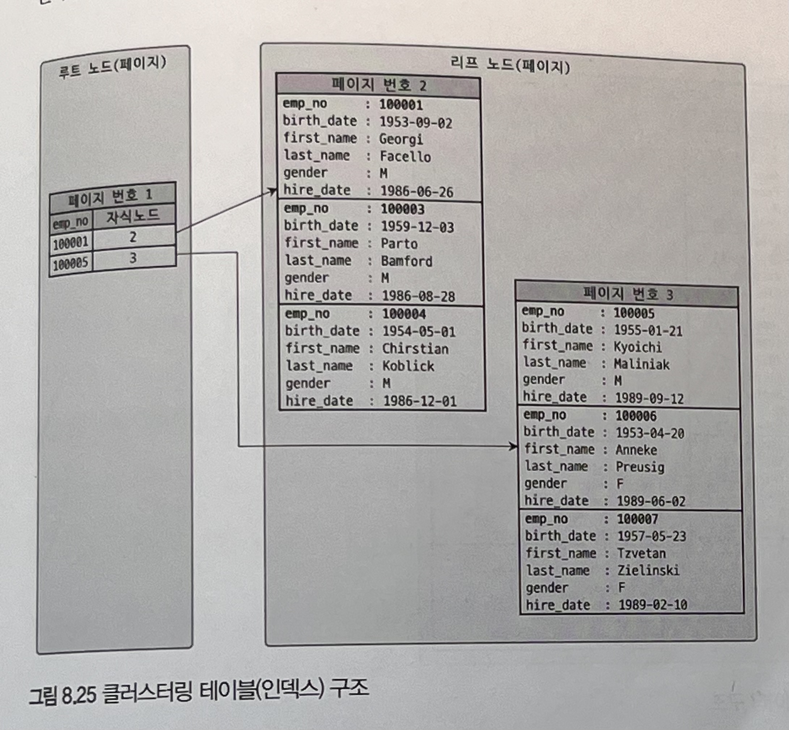

# 클러스터링 인덱스

* MySQL에서 클러스터링은 테이블의 레코드를 비슷한 것들끼리 묶어서 저장하는 형태로 구현됩니다.
* MySQL에서 클러스터링 인덱스는 InnoDB 스토리지 엔진에서만 지원하며, 나머지 스토리지 엔진에서는 지원되지 않습니다.

## 클러스터링 인덱스

* 프라이머리 키 값이 비슷한 레코드끼리 묶어서 저장하는 것을 클러스터링 인덱스라고 합니다.
* 클러스터링 인덱스에서 레코드의 저장위치는 프라이머리 키 값에 의해 결정됩니다.
* 레코드의 프라이머리 키 값이 변경된다면 물리적 저장 위치가 변경 됩니다.
* InnoDB와 같이 항상 클러스터링 인덱스로 저장되는 테이블은 프라이머리 키 기반의 검색이 매우 빠른대신, 레코드의 저장이나 프라이머리 키의 변경이 상대적으로 느립니다.
* 프라이머리 키가 없는 InnoDB 테이블의 경우 다음 우선순위대로 프라이머리 키를 대체할 칼럼을 선택합니다.
  * 프라이머리 키가 있으면 기본적으로 프라이머리 키를 클러스터링 키로 선택
  * NOT NULL 옵션의 유니크 인덱스(Unique Index) 중에서 첫 번째 인덱스를 클러스터링 키로 선택
  * 자동으로 유니크한 값을 가지도록 증가되는 칼럼을 내부적으로 추가한 후, 클러스터링 키로 선택
* InnoDB의 모든 세컨더리 인덱스는 해당 레코드가 저장된 주소가 아닌 프라이머리 키 값을 저장하도록 되어있습니다. 

## 클러스터링 인덱스 구조

* 클러스터링 인덱스에서 리프 노드에는 레코드의 모든 칼럼이 저장돼 있습니다. 즉, 클러스터링 테이블은 하나의 거대한 인덱스 구조로 관리되는 것입니다.

## 클러스터링 인덱스의 장점

* 프라이머리 키(클러스터링 키)로 검색할 때 처리 성능이 매우 빠릅니다. 특히, 프라이머리 키를 범위 검색하는 경우 매우 빠릅니다.
* 테이블의 모든 세컨더리 인덱스가 프라이머리 키를 가지고 있기 때문에 인덱스만으로 처리될 수 있는 경우가 많습니다.

## 클러스터링 인덱스의 단점

* 테이블의 모든 세컨더리 인덱스가 프라이머리 키(클러스터링 키)를 갖기 때문에 프라이머리 키(클러스터링 키) 값이 클 경우 전체적인 인덱스의 크기가 커집니다.
* 세컨더리 인덱스를 통해 검색할 때 프라이머리 키로 다시 한번 검색해야 하므로 처리 성능이 느립니다.
* INSERT 할 때 프라이머리 키에 의해 레코드의 저장 위치가 결정되기 때문에 처리 성능이 느립니다.
* 프라이머리 키를 변경할 때 레코드를 DELETE하고 INSERT하는 작업이 필요하기 때문에 처리 성능이 느립니다.
