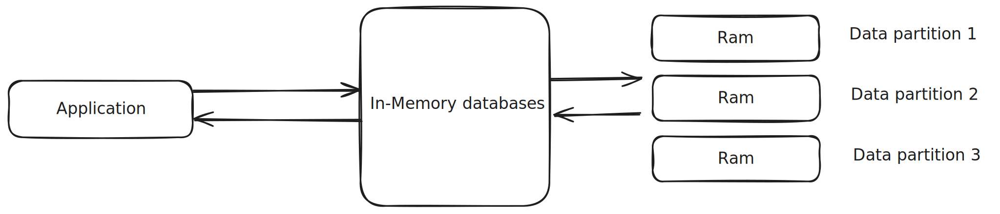
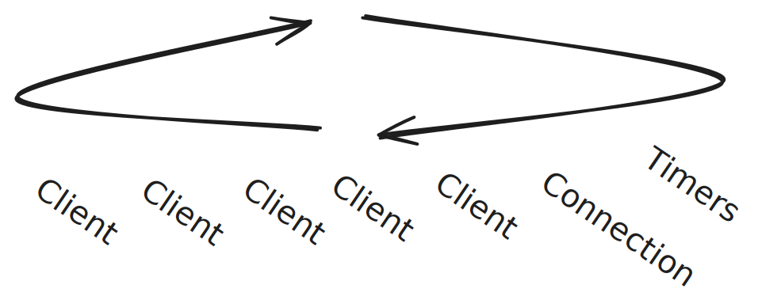
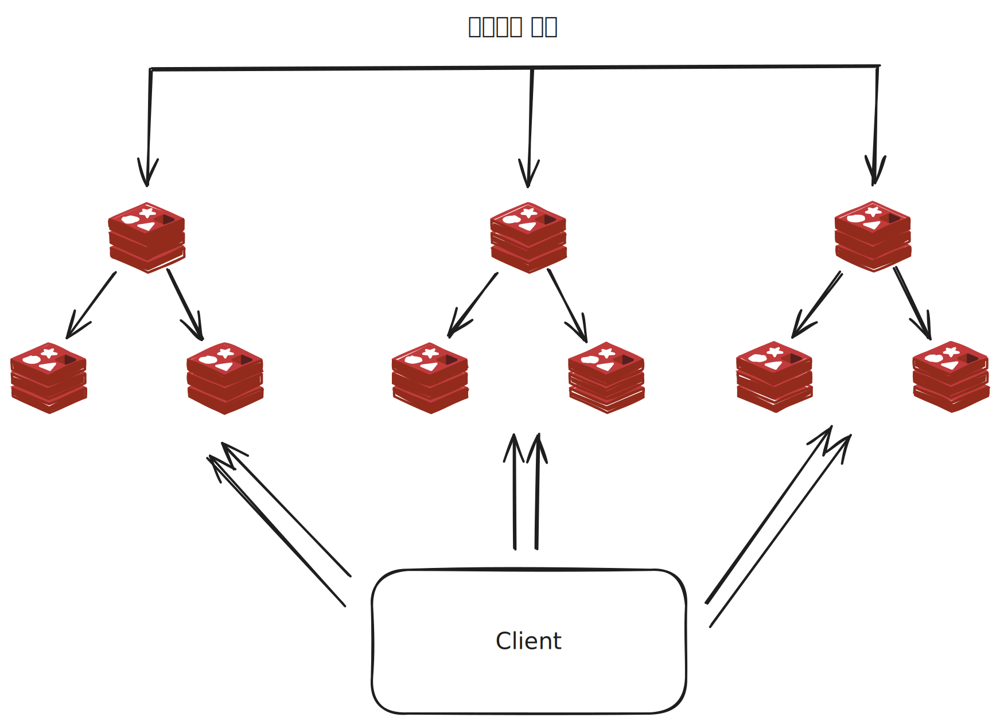

# Redis

> * [Redis Sentinel](https://github.com/tlarbals824/TIL/tree/main/Database/Redis/RedisSentinel.md)
> * [Redis Lettuce](https://github.com/tlarbals824/TIL/tree/main/Database/Redis/RedisLettuce.md)
> * [Redis Redisson](https://github.com/tlarbals824/TIL/tree/main/Database/Redis/RedisRedisson.md)
> * [Redis Backup](https://github.com/tlarbals824/TIL/tree/main/Database/Redis/RedisBackup.md)
> * [Redis Replication](https://github.com/tlarbals824/TIL/tree/main/Database/Redis/RedisReplica.md)
> * [Redis Message Broker](https://github.com/tlarbals824/TIL/tree/main/Database/Redis/RedisMessageBroker.md)
> * [Redis Cache](https://github.com/tlarbals824/TIL/tree/main/Database/Redis/RedisCache.md)

## Redis 특징

### 실시간 응답(빠른 성능)

* 인메모리 데이터베이스(In-Memory Database)에서는 모든 데이터가 컴퓨터의 메모리에서 관리됩니다.
* 디스크에 접근하는 과정이 없기에 데이터의 처리 성능이 굉장히 빠른 장점을 가지고 있습니다.

### 단순성

* Redis는 key-value 형태로 데이터를 관리할 수 있는 데이터 저장소입니다.
* 임피던스 불일치(Impedance mismatches)는 기존 관계형 데이터베이스의 테이블과 프로그래밍 언어 간 데이터 구조, 기능의 차이로 발생하는 충돌을 의미합니다.
* Redis는 내장된 다양한 자료 구조를 통해 임피던스 불일치를 해소하고 개발을 편리하게 할 수 있게 지원합니다.
* Redis는 싱글 스레드로 동작합니다. 더 정확히는 메인 스레드 1개와 별도의 스레드 3개, 총 4개의 스레드로 동작합니다.

* Redis에서 클라이언트의 커맨드 처리를 이벤트 루프를 이용한 싱글 스레드로 동작합니다.
* 앞선 Redis가 싱글 스레드로 동작하기에 오래 걸리는 커맨드를 수행한다면, 다른 클라이언트의 요청이 대기하는 문제가 발생할 수 있습니다.

### 고가용성

* Redis는 자체적으로 HA(High Availability) 기능을 제공합니다.
* 복제를 통한 데이터를 여러 서버에 분산시킬 수 있으며, 센티넬(sentinel)은 장애 상황을 탐지해 자동으로 페일오버(fail-over)를 시켜줍니다.
* 애플리케이션에서는 센티넬을 이용해 Redis에 연결하는 구조라면 마스터에 장애가 발생하더라도 Redis 엔드포인트를 변경할 필요없이 페일오버가 완료돼 정상화된 마스터 노드를 사용할 수 있습니다.

### 확장성

* Redis에서 클러스터 모드를 사용한다면 쉽게 수평적 확장이 가능합니다.
* 데이터는 Redis 클러스터 내에서 자동으로 샤딩된 후 저장되며, 여러 개의 복제본이 생성될 수 있습니다.
* 데이터의 분리는 데이터베이스 레이어에서 처리되기에 애플리케이션에서는 대상 데이터가 어떤 샤드에 있는지 신경 쓰지 않아도 되므로, Redis를 사용할 때와 동일하게 데이터를 가져오고 저장할 수 있습니다.
* 클러스터 구조에서 모든 Redis 인스턴스는 클러스터 버스라는 프로토콜을 이용해 서로 감지하고 있으며,
이를 이용해 클러스터의 마스터 노드에 문제가 발생하면 자동으로 페일오버를 시켜 고가용성을 유지할 수 있습니다.