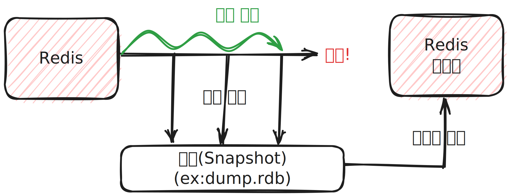
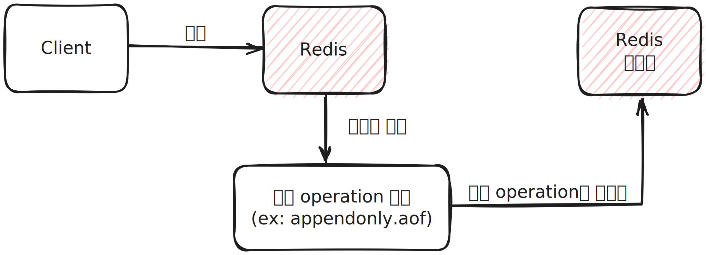

# Redis 백업

## RDB(Redis Database)

* RDB는 Redis의 스냅샷을 디스크에 저장하고 복구하는 기술입니다.
* RDB는 주기적으로 Redis의 현재 데이터 상태를 저장하거나 명령을 수행할 때 수동으로 생성할 수 있습니다.
* 데이터 무결성이나 정합성에 대한 요구가 크지 않은 경우 사용 가능합니다.
* Redis 서버의 기본 백업 방법입니다.

### RDB(Redis Database) 작동 방식

* 주기적인 스냅샷 : Redis는 사용자가 지정한 주기에 따라 스냅샷을 생성할 수 있습니다. 이는 백업 및 데이터의 지속성을 확보하는 데 도움이 됩니다.
* 스냅샷 생성 시점 : RDB 스냅샷은 주로 백그라운드에서 실행되며 Redis는 스냅샷을 생성하는 동안도 데이터 요청을 처리할 수 있습니다. 스냅샷이 완료되면 현재 메모리 상태가 디스크에 저장됩니다.
* 데이터 복구 : Redis가 다시 시작될 때, RDB 스냅샷은 메모리에 데이터를 복원하므로 이전 상태로 데이터를 복구할 수 있습니다.

### RDB(Redis Database) 장점

* 빠른 복구 : RDB 스냅샷은 데이터를 빠르게 복구할 수 있으므로 Redis 서버가 빠르게 다시 시작될 수 있습니다.
* 디스크 공관 효율적 활용 : RDB 파일은 디스크에 저장되므로 메모리와 디스크 사이의 데이터 일괄성을 유지하면서 디스크 공간을 효과적으로 활용합니다.
* 백업 및 데이터 이관 : RDB 파일은 백업을 만들거나 다른 Redis 인스턴스로 데이터를 이관할 때 유용합니다.
* 프로세스 성능 : fork를 이용해 스냅샷을 생성하므로 서비스 중인 프로세스에 성능에 영향이 적습니다.

### RDB(Redis Database) 단점

* 데이터 손실 : 주기적인 스냅샷을 만들기 때문에 스냅샷 간의 데이터 손실이 발생할 수 있습니다. 스냅샷 주기가 짧으면 데이터 손실이 적지만, 길면 데이터 손실이 더 많을 수 있습니다.
* 메모리 사용량 : 스냅샷을 생성하는 동안 Redis 메모리를 사용하므로 큰 데이터베이스에서는 메모리 부족 문제가 발생할 수 있습니다.
* 주기적인 작업 필요 : RDB 스냅샷을 유지하려면 주기적으로 백업을 실행하고 디스크 공간을 관리해야 합니다.
* 프로세스 성능 : RDB는 자식 프로세스를 이용해서 스냅샷을 디스크에 저장하기 위해 fork를 사용하는 데, 이는 큰 데이터베이스라면 시간이 오래걸릴 수 있습니다.

## AOF(Append Only File)

* AOF(Append Only File)는 Redis 데이터베이스의 다른 백업 및 데이터 지속성 메커니즘으로, Redis 서버에 수행된 모든 쓰기 작업을 로그 형태로 기록합니다.
* AOF 파일은 명령을 순차적으로 저장하므로 Redis 서버가 이전 상태로 데이터를 복구할 때 스냅샷 파일(RDB)에 비해 더 정확한 로그를 제공합니다.

### AOF(Append Only File) 작동 방식

* 데이터 기록 : Redis 서버에서 수행된 모든 쓰기 작업(SET, INCR, DEL 등)은 AOF 파일에 기록됩니다. 기본적으로는 명령의 결과를 기록하며, 필요에 따라 명령 자체를 기록할 수도 있습니다.
* 로그 형식 : AOF 파일은 일련의 Redis 명령과 그 결과를 저장하는 로그 파일입니다. 명령은 순차적으로 추가되며 이 파일은 계속해서 증가합니다.
* 데이터 복구 : Redis 서버가 시작될 때, AOF 파일에 저장된 명령을 다시 실행하여 이전 상태로 데이터를 복구합니다.

### AOF(Append Only File) 장점

* Append Only : AOF 파일은 append-only 방식이므로 백업 파일이 손상될 위험이 적습니다.
* 유연성 : AOF 방식은 실제 수행된 명령어를 기록하므로 사람이 보고 이해할 수 있고 수정도 가능합니다.
* 정확한 데이터 복구 : AOF는 Redis 명령을 순차적으로 로깅하므로 데이터 손실이 거의 없습니다. Redis 서버가 비정상적으로 종료되어도 마지막으로 로그된 명령 이후의 변경 내용만 손실됩니다.
* 지속적인 데이터 백업 : AOF 파일은 Redis 서버가 실행 중일 때도 지속적으로 업데이트되므로 데이터 손실 위험이 거의 없습니다.

### AOF(Append Only File) 단점

* 파일 크기 : AOF 파일은 명령을 순차적으로 기록하므로 큰 데이터베이스의 경우 파일 크기가 크게 증가할 수 있습니다. 이로 인해 디스크 공간을 많이 차지할 수 있습니다.
* 재부팅 시 복구 시간 : Redis 서버가 재부팅될 때 AOF 파일의 모든 명령을 다시 실행해야 하므로 큰 AOF 파일의 경우 복구 시간이 길어질 수 있습니다.
* 디스크 I/O 부하 : AOF 파일은 디스크에 지속적으로 쓰기 작업을 수행하므로 디스크 I/O 부하가 발생할 수 있습니다.

> 백업 성능은 fsync 정책에 따라 조절 가능합니다.

> 참조
> 
> 백엔드 개발자를 위한 한 번에 끝내는 대용량 데이터 & 트래픽 처리(https://fastcampus.co.kr/dev_online_bedata)
> 
> Redis 레퍼런스 문서(https://redis.io/docs/management/persistence/)