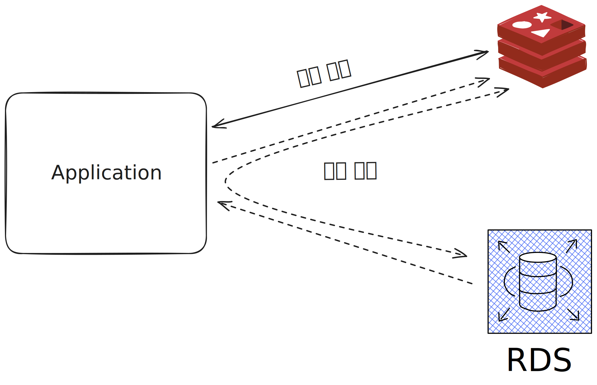

# Redis와 캐시

## 캐시란?

* 캐시는 데이터의 원본보다 더 빠르고 효율적으로 액세스 할 수 있는 임시 데이터 저장소를 의미합니다.
* 캐시를 통해 반복적으로 조회되는 데이터에 대해 사용하는 리소스를 줄일 수 있습니다.
* 애플리케이션이 다음 조건을 만족한다면 캐시를 도입했을 때 성능을 개선시킬 수 있습니다.
  * 원본 데이터 저장소에서 원하는 데이터를 찾기 위해 검색하는 시간이 오래 걸리거나, 매번 계산을 통해 데이터를 가져와야 하는 경우
  * 캐시에서 데이터를 가져오는 것이 원본 데이터 저장소 데이터를 요청하는 것보다 빨라야 하는 경우
  * 캐시에 저장된 데이터는 잘 변하지 않는 데이터인 경우
  * 캐시에 저장된 데이터는 자주 검색되는 데이터인 경우
* 캐시는 데이터의 복제본을 저장하는 저장소이기 떄문에 원본 데이터 저장소에서 데이터를 읽는 커넥션을 줄일 수 있습니다.

## 캐시로서 Redis

* Redis는 키-값 저장소이고 다양한 자료 구조를 지원하기 때문에 캐시로 사용하기에 적합합니다.
* Redis는 인메모리 저장소이기 때문에 데이터를 검색하고 반환하는 것이 상당히 빠릅니다. 평균 읽기 및 쓰기 작업 속도가 1ms 미만이며, 초당 수백만 건의 작업이 가능합니다.
* Redis는 자체적으로 고가용성 기능을 가지는 솔루션입니다. 즉, 단일 장애 지점이 없으며, 데이터를 여러 서버에 복제할 수 있습니다.
* Redis의 클러스터를 통해 캐시의 스케일 아웃을 쉽게 처리할 수 있습니다.

## 캐시 전략

### 일기 전략 - look aside

* Redis를 캐시로 사용하는 경우 look aside 전략을 주로 사용합니다.
* look aside 전략의 경우 캐시 히트와 캐시 미스 상황으로 나눌 수 있습니다.
  * 캐시 히트 : 애플리케이션이 찾는 데이터가 캐시의 존재하는 경우, 해당 데이터를 캐시에서 조회합니다.
  * 캐시 미스 : 애플리케이션이 찾는 데이터가 캐시의 존재하지 않는 경우, 해당 데이터를 원본 데이터 저장소에서 조회합니다. 이후 조회된 데이터를 캐시에 저장합니다.
* look aside의 장점은 Redis에 문제가 생겨 접근할 수 없는 상황이 발생하더라도 서비스 장애로 이어지지 않고 원본 데이터 저장소에서 데이터를 조회할 수 있다는 점입니다.
하지만 원본 데이터 저장소에 많은 부하가 발생해 애플리케이션 성능에 영향을 미칠 수 있습니다.
* 찾고자 하는 데이터가 Redis에 없을 때에만 Redis에 데이터가 저장되기 때문에 이와 같은 구조를 Lazy Loading이라고 합니다.
* 미리 데이터를 캐시에 저장해 두는 방식을 캐시 워밍(Cache Warming)이라고 합니다.

### 쓰기 전략과 캐시의 일관성

* 캐시를 사용함에 있어 데이터베이스의 변경에 대해 캐시 데이터를 반영해주지 않는다면 데이터의 일관성이 깨질 수 있습니다. 이를 캐시 불일치(cache inconsistency)라고 합니다.
* 캐시를 이용한 쓰기 전략은 세 가지가 있습니다.
  1. write through : 데이터베이스에 업데이트할 때마다 매번 캐시에도 데이터를 함께 업데이트 시키는 방식입니다. 데이터를 저장소 2개에 저장되기에 데이터 쓰기 성능이 떨어집니다.
  이 방법을 사용한다면 만료 시간을 사용하는 것이 권장됩니다.
  2. cache invalidation : 데이터베이스에 값을 업데이트할 때마다 캐시에서는 데이터를 삭제하는 방식입니다. write through에 비해 리소스를 적게 사용합니다.
  3. write behind(write back) : 대량의 쓰기 작업이 발생하는 경우 디스크 I/O에 의해 성능 저하가 발생할 수 있습니다. 이를 방지하기 위해 데이터를 캐시에 먼저 반영하고,
  일정 시간 간격마다 데이터를 데이터베이스에 반영하는 방식입니다.

## 캐시에서의 데이터 흐름
 
* 캐시는 데이터 스토어가 가지는 데이터 중 일부를 저장하여 사용자에게 빠르게 제공하는 역할을 합니다. 즉, 데이터베이스의 서브셋이라고 볼 수 있습니다.
* Redis는 메모리 기반 데이터 스토어이기에 저장할 수 있는 데이터의 크기가 한정적입니다. 따라서 적절한 TTL 설정을 통해 데이터를 적절하게 관리해야 합니다.

### 만료 시간

* Redis에서는 만료 시간(TTL, Time To Live)를 설정할 수 있습니다.
* 만료 시간은 데이터가 얼마나 오래 저장될 것인지를 나타내는 시간 설정입니다.
* Redis는 특정 키에 대해 만료 시간을 설정하여 해당 만료 시간이 지난 다면 자동으로 삭제됩니다. 이를 통해 데이터의 수명을 관리하고 메모리 공간을 효율적으로 사용할 수 있습니다.
* Redis에서는 EXPIRE 커맨드를 통해 만료 시간을 설정할 수 있습니다.

## 메모리 관리와 maxmemory-policy 설정

* Redis의 만료 시간을 통해서 데이터 관리를 할 수 있지만 메모리의 용량을 초과하는 양의 데이터가 저장되면 Redis는 내부 정책을 통해 데이터를 삭제합니다.
* Redis에서는 maxmemory 설정과 해당 용량을 초과할 시 데이터 처리 방식을 결정하는 maxmemory-policy 설정을 통해 메모리 관리를 합니다.

### Noeviction

* Noeviction은 Redis의 기본 정책으로 허용 메모리 용량을 초과하더라도 데이터를 삭제하지 않고 더 이상 데이터를 저장하지 않는 방식입니다.
* 캐시에 데이터를 저장하지 못해 에러가 발생할 경우 애플리케이션에서의 추가적인 에러 처리가 필요합니다. 따라서 Redis를 캐시로 사용할 때 권장하지 않는 설정값입니다.
* 데이터가 가득 차더라도 캐시 내부적 판단으로 데이터를 삭제하는 것이 위험하다면 해당 정책을 사용할 수 있습니다.

### LRU eviction

* LRU(Least Recently Used) eviction은 가장 최근에 사용되지 않은 데이터부터 삭제하는 정책입니다.
* 최근에 액세스 되지 않은 데이터는 나중에도 접근될 가능성이 낮을 것이라는 가정을 전제하고 있습니다.
* Redis의 LRU는 두 가지 설정값을 가집니다.
  1. volatile-lru : 만료 시간이 설정돼 있는 키에 한해서 LRU 방식으로 키를 삭제합니다.
  2. allkeys-lru : 모든 키에 대해 LRU 방식으로 키를 삭제합니다.

### LFU eviction

* LFU(Least Frequently Used) eviction은 가장 적게 사용된 데이터부터 삭제하는 정책입니다.
* 자주 사용되지 않은 데이터는 나중에도 접근할 가능성이 낮을 것이라는 가정을 전제하고 있습니다.
* LFU는 LRU와 마찬가지로 volatile-lfu와 allkeys-lfu 두 가지 설정값을 가집니다.
  1. volatile-lfu : 만료 시간이 설정돼 있는 키에 한해서 LFU 방식으로 키를 삭제합니다.
  2. allkeys-lfu : 모든 키에 대해 LFU 방식으로 키를 삭제합니다.

### Random eviction

* Random eviction은 랜덤하게 키를 삭제하는 정책입니다. 이 방법은 알고리즘을 사용하지 않기에 삭제될 키 값을 계산하지 않아 부하가 적습니다.
* 데이터의 삭제를 예측할 수 없기에 나중에 사용될 수 있는 데이터를 삭제할 수도 있습니다.
* random eviction또한 volatile-random과 allkeys-random 두 가지 설정값을 가집니다.
  1. volatile-random : 만료 시간이 설정돼 있는 키에 한해서 랜덤하게 키를 삭제합니다.
  2. allkeys-random : 모든 키에 대해 랜덤하게 키를 삭제합니다.

### volatile-ttl

* volatile-ttl은 만료 시간이 가장 가까운 키를 삭제하는 정책입니다. 즉, 삭제 예정 시간이 얼마 남지 않은 키를 미리 삭제하는 방식입니다.
* 해당 방법은 LRU, LFU와 마찬가지로 근사 알고리즘을 사용합니다. 따라서 모든 키를 스캔하지 않고도 키를 삭제할 수 있습니다.

## 캐시 스탬피드

* 스탬피드는 캐시의 데이터가 만료되었을 때, 동시에 여러 애플리케이션이 데이터를 조회할 때 발생하는 문제를 해결하기 위한 방법입니다.
* 만약 여러 애플리케이션이 동시에 데이터를 조회하고, 캐시의 데이터가 만료되었다면 여러 애플리케이션이 동시에 데이터를 조회하기 위해 원본 데이터 저장소에 접근하게 됩니다.
* Redis에서는 스탬프드 방식을 통해 이러한 문제를 해결합니다. 스탬프드 방식은 캐시의 데이터가 만료되었을 때,
Redis 서버가 확률분포에 기반한 알고리즘을 통해 TTL 값을 미리 갱신 시켜주는 방식입니다.