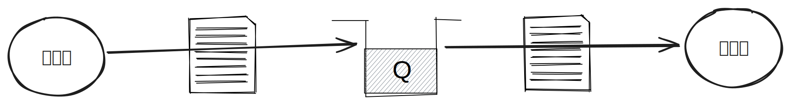
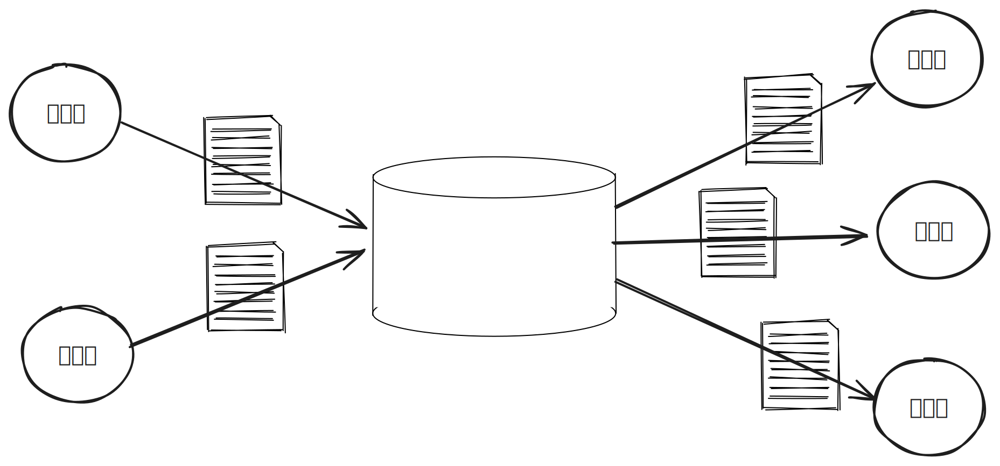

# Redis 메시지 브로커

> * [Redis pub/sub](https://github.com/tlarbals824/TIL/tree/main/Database/Redis/RedisPubSub.md)

* Redis의 pub/sub 기능은 가장 간단한 메시징 기능으로, 굉장히 빠르게 동작하며 간단하게 사용할 수 있습니다.
* 1개의 채널에 데이터를 전달하면 이 채널을 구독하고 있는 모든 소비자는 데이터를 빠르게 가져갈 수 있습니다.
* pub/sub에서 모든 데이터는 전달된 뒤 삭제되는 일회성으로, 모든 메시징 상황에 적합하진 않지만 fire-and-forget 패턴이 필요한 간단한 알림 서비스에서는 유용하게 사용할 수 있습니다.
* Redis의 list를 이용해 메시징 큐로 사용할 수 있습니다.
* Redis의 stream 자료구조를 통해 완벽한 스트림 플랫폼으로 사용할 수 있습니다.

## 메시징 큐와 이벤트 스트림

* 메시징 큐에서는 주로 데이터를 생성하는 생산자(Producer)와 데이터를 소비하는 소비자(Consumer)로 구성됩니다.

* 이벤트 스트림에서는 데이터를 생성하는 발행자(Publisher)와 데이터를 소비하는 구독자(Subscriber)로 구성됩니다.

### 메시징 큐와 이벤트 스트림 차이점

* 방향성
  * 메시징 큐의 생산자는 소비자의 큐로 데이터를 직접 푸시합니다. 즉, 2개의 서비스에 같은 메시지를 보내야 한다면 각각의 큐에 메시지를 전송해야 합니다.
  * 스트림을 이용한다면 생산자는 특정 저장소에 하나의 메시지를 보내고, 메시지를 읽어가는 소비자들은 스트림에서 같은 메시지를 읽어갈 수 있기에 메시지를 복제해서 저장하지 않아도 됩니다.
* 데이터 영속성
  * 메시징 큐에서는 소비자가 데이터를 읽어갈 때 큐에서 데이터를 삭제합니다.
  * 이벤트 스트림에서 구독자가 읽어간 데이터는 바로 삭제되지 않고, 저장소의 설정에 따라 특정 기간 동안 저장될 수 있습니다.
* 메시징 큐의 방향성과 데이터 영속성의 특징으로 인해 메시지를 보내는 도중에 새로운 소비자기 추가된다면 이전에 전송된 메시지를 읽어갈 수 없습니다.
* 메시징 큐는 일대일(1:1) 상황에서 한 서비스가 다른 서비스에게 동작을 지시할 때 유용하게 사용할 수 있습니다.
* 이벤트 스트림 방식은 메시지를 생산할 때 구독자를 지정하지 않기에 새로운 구독자가 추가되더라도 이전 데이터들을 읽어갈 수 있습니다.
* 스트림은 다대다(n:n) 상황에서 유리합니다.