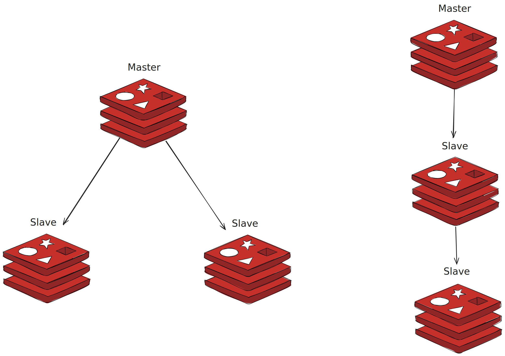
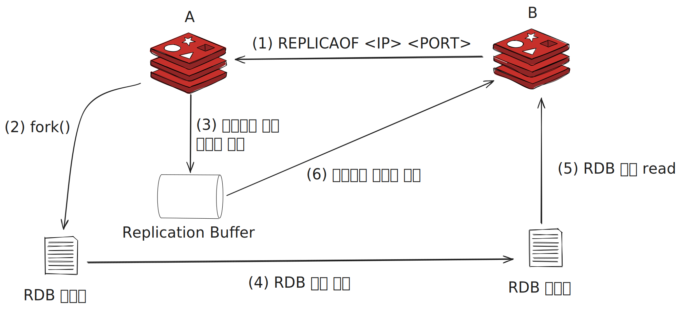
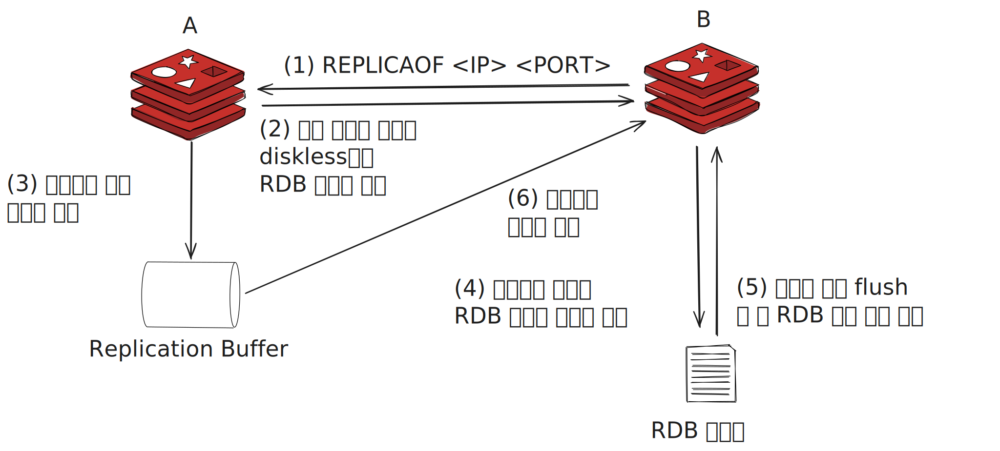

# Redis 복제

* 가용성은 일반적으로 서비스의 안정성을 측정하는 데 사용되는 지표입니다.
> 가용성 = 가동 시간 / 전체 시간
* 가용성은 일정 기간 동안 서비스를 정상적으로 사용할 수 있는 시간의 비율을 뜻합니다. 이 값이 클수록 가용성이 높다고 합니다.
* Redis의 고가용성을 확보하기 위해서 두 가지 기능이 필요합니다.
  * 복제 : 마스터 노드의 데이터를 복제본 노드로 실시간 복사하는 기능입니다. 마스터 노드의 서버에 장애가 생겨 데이터가 유실되도 복제본 노드에서 데이터를 복구할 수 있습니다.
  * 자동 페일오버 : 마스터 노드에서 발생한 장애를 감지해 Redis로 들어오는 클라이언트 연결을 자동으로 복제본 노드로 리다이렉션하는 기능입니다. 이를 통해 마스터 노드의 장애를 빠르게 복구할 수 있습니다.

## Redis에서의 복제 구조

* 운영 중인 서비스에서 복제본 노드를 추가하는 이유는 다음과 같습니다.
  * 마스터 데이터베이스가 다운됐을 때 대신 사용할 여분의 복제본이 필요하기 떄문
  * 대규모 서비스에서 복제본을 통해 트래픽을 감소시킬 수 있음
  * 데이터 백업을 진행할 때 마스터 노드보다 복제본 노드에서 수행하여 마스터 노드의 부하를 줄일 수 있음
* Redis에서의 복제는 일반적으로 마스터노드에서 쓰기, 복제본 노드에서는 읽기를 수행합니다.

## 복제 구조 구성하기

* Redis에서 복제를 REPLICAOF 명령어를 통해 구성할 수 있습니다.
> REPLICAOF <master-ip> <master-port>

* Redis 복제를 구성하는 방법으로 크게 두 가지가 있습니다.
  * 마스터에 여러 복제본이 연결되는 방식
  * 복제본 노드에 새로운 복제본을 추가하는 방식
* 한 개의 복제 그룹에서는 항상 한 개의 마스터 노드만 존재합니다.
  * 마스터 노드에서는 업데이터 커맨드를 수행할 수 있으며, 하위 복제본은 모두 읽기 전용으로 동작합니다.

## 패스워드 설정

* Redis 6.0 이상부터 도입된 ACL 기능이 아닌 기본적인 패스워드를 사용해서 데이터를 복제할 떄에는 masterauth 옵션에 패스워드를 입력해야 합니다.
* Redis에서는 requirepass 옵션을 통해 패스워드를 설정할 수 있습니다.
* 복제본 노드는 masterpass 옵션에 마스터의 requirepass 옵션에 설정된 패스워드를 설정해야 합니다.
* 복제본 노드에서 requirepass를 다른 값으로 설정해 각 Redis 노드에 접근할 때 다른 패스워드를 사용하게 설정할 수도 있지만, 일반적으로 하나의 복제 그룹에서는 같은 패스워드로 설정합니다.

## 복제 메커니즘

* Redis에서 복제는 다음과 같은 과정으로 동작합니다.

* Redis 7.0 이전 버전에서는 repl-diskless-sync 옵션이 기본으로 no 입니다.
1. REPLICAOF 커맨드를 통해 복제 연결을 시도합니다.
2. 마스터 노드에서는 fork로 자식 프로세스를 새로 만든 뒤 RDB 스냅숏을 생성합니다.
3. 2번 과정 동안 마스터 노드에서 수행된 모든 데이터셋 변경 작업은 Redis 프로토콜(RESP) 형태로 마스터의 복제 버퍼에 저장됩니다.
4. RDB 파일이 생성 완료되면 파일은 복제본 노드로 복사됩니다.
5. 복제본에 저장됐던 모든 내용을 모두 삭제한 뒤 RDB 파일을 이용해 데이터를 로딩합니다.
6. 복제 과정 동안 버퍼링됐던 복제 버퍼의 데이터를 복제본으로 전달해 수행시킵니다.
* Disk를 이용한 복제는 디스크 I/O 처리량에 영향을 받습니다. 마스터에서 RDB 파일을 저장하는 시간, 복제본에서 RDB 파일을 읽어오는 과정 모두 디스크 I/O 속도에 영향을 받기 때문입니다.
* 해당 방법을 통해 복제를 사용하는 경우 RDB 파일이 생성되는 도중 다른 노드에서 복제 연결 요청이 들어오면 이 연결은 큐에 저장되며 기존 RDB 파일의 저장이 완료되면 여러 복제본이 한 번에 복제 연결을 시작할 수 있습니다.

* Redis 7.0 이후 버전에서는 repl-diskless-sync 옵션이 기본으로 yes 입니다.
1. REPLICAOF 커맨드를 통해 복제 연결을 시도합니다.
2. 마스터 노드는 소켓 통신을 이용해 복제본 노드에 바로 연결하며, RDB 파일은 생성됨과 동시에 점진적으로 복제본의 소켓에 전송됩니다.
3. 2의 과정 동안 마스터 노드에서 수행된 모든 데이터셋 변경 작업은 Redis 프로토콜(RESP) 형태로 마스터의 복제 버퍼에 저장됩니다.
4. 소켓에서 읽어온 RDB 파일을 복제본의 디스크에 저장합니다.
5. 복제본에 저장된 모든 데이터를 모두 삭제한 뒤 RDB 파일 내용을 메모리에 로딩합니다.
6. 복제 버퍼의 데이터를 복제본으로 전달해 수행시킵니다.
* 복제 과정에서 복제본의 repl-diskless-load 옵션은 기본으로 disabled이기 때문에 소켓에서 읽어온 RDB 스냅숏 데이터를 바로 메모리에 로드하지 않고, 
일단 복제본 노드의 디스크에 저장하는 과정을 거칩니다.
* 복제본 노드는 마스터에서 가져온 데이터를 불러오기 전 자신의 데이터를 모두 삭제하는 데, 
이는 소켓 통신으로 받아온 RDB 데이터가 정상적인지를 미리 확인할 수 없기에 모두 삭제하기 전 자신의 디스크에 데이터를 저장하는 과정을 선행함으로 데이터의 안정성을 확보할 수 있습니다.
* 이 방식은 디스크 I/O가 느리고 네트워크가 빠른 경우 유용합니다.
* 해당 방법을 사용ㅇ하면 하나의 복제본으로 복제 연결이 시작된 경우 복제 과정이 끝나기 전까지 다른 복제본과의 연결은 수행될 수 없으며,
다른 복제본들은 하나의 복제 연결이 끝날때까지 큐에서 대기해야 합니다. 이를 repl-diskless-sync-delay 옵션을 통해 조절할 수 있습니다.
* repl-diskless-sync-delay 옵션은 복제 연결이 시작된 후 다른 복제 연결이 시작되기까지의 대기 시간을 설정합니다. 기본값은 5초입니다.
* repl-diskless-sync-delay 옵션을 설정갑 기간 내에 다른 복제 연결이 들어오면 마스터는 여러 복제본으로 소켓 통신을 연결해 한 번에 여러 개의 복제본에 RDB 파일을 전송할 수 있습니다.

### 비동기 방식으로 동작하는 복제 연결

