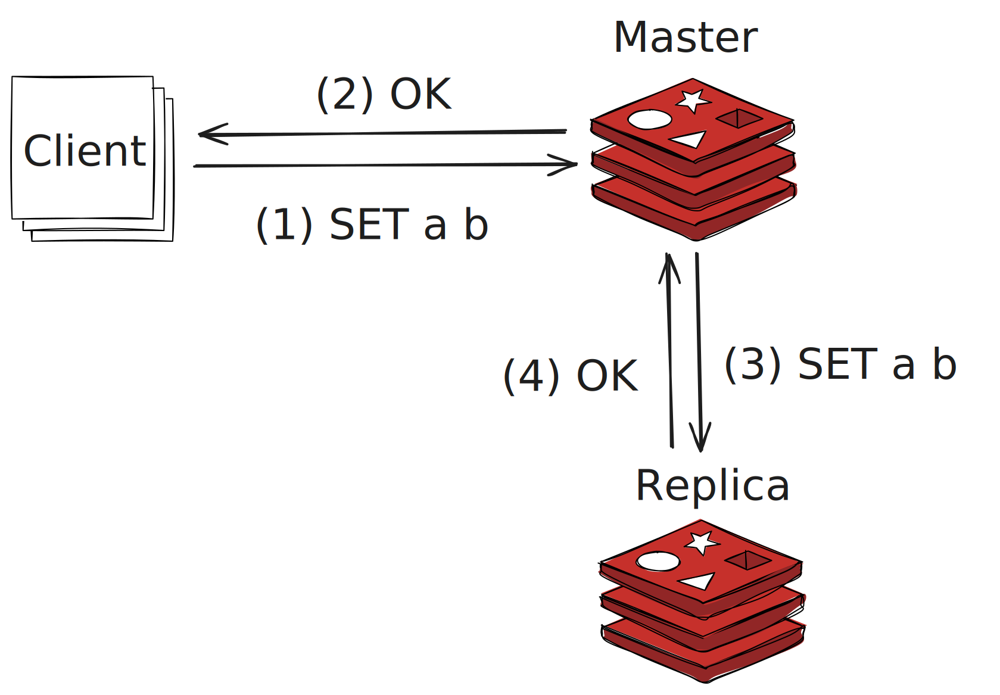
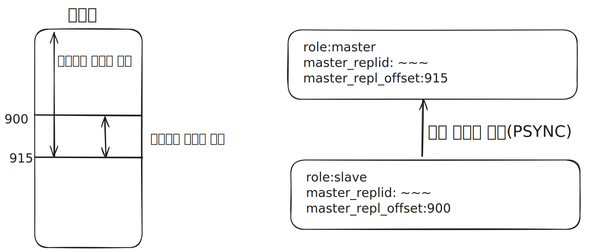
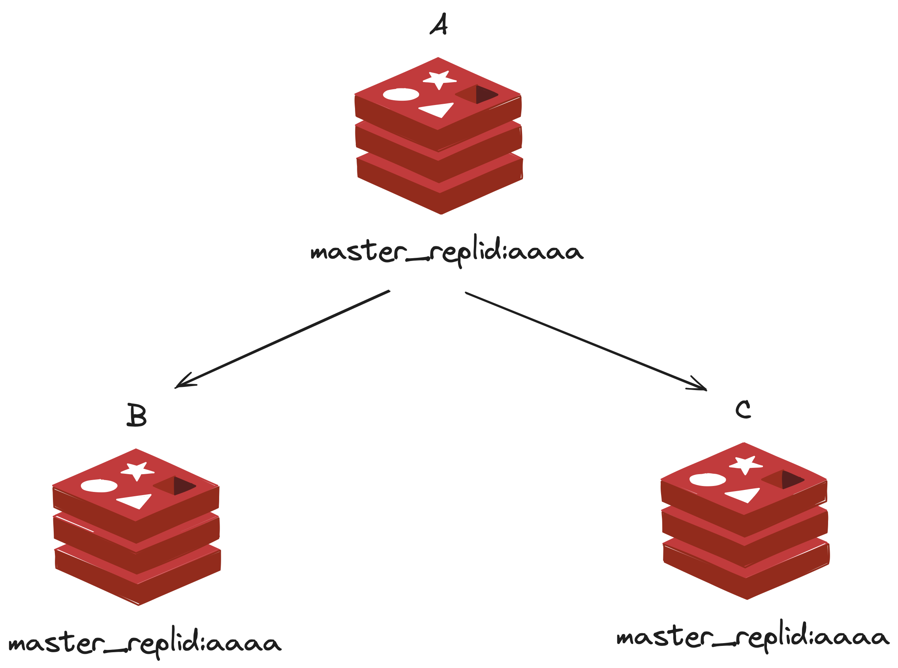
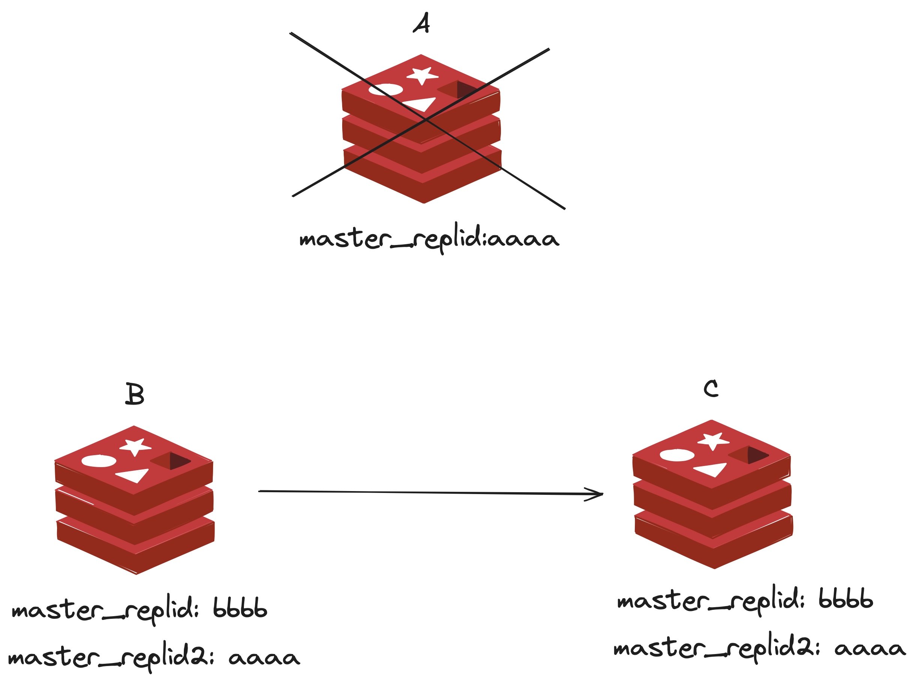
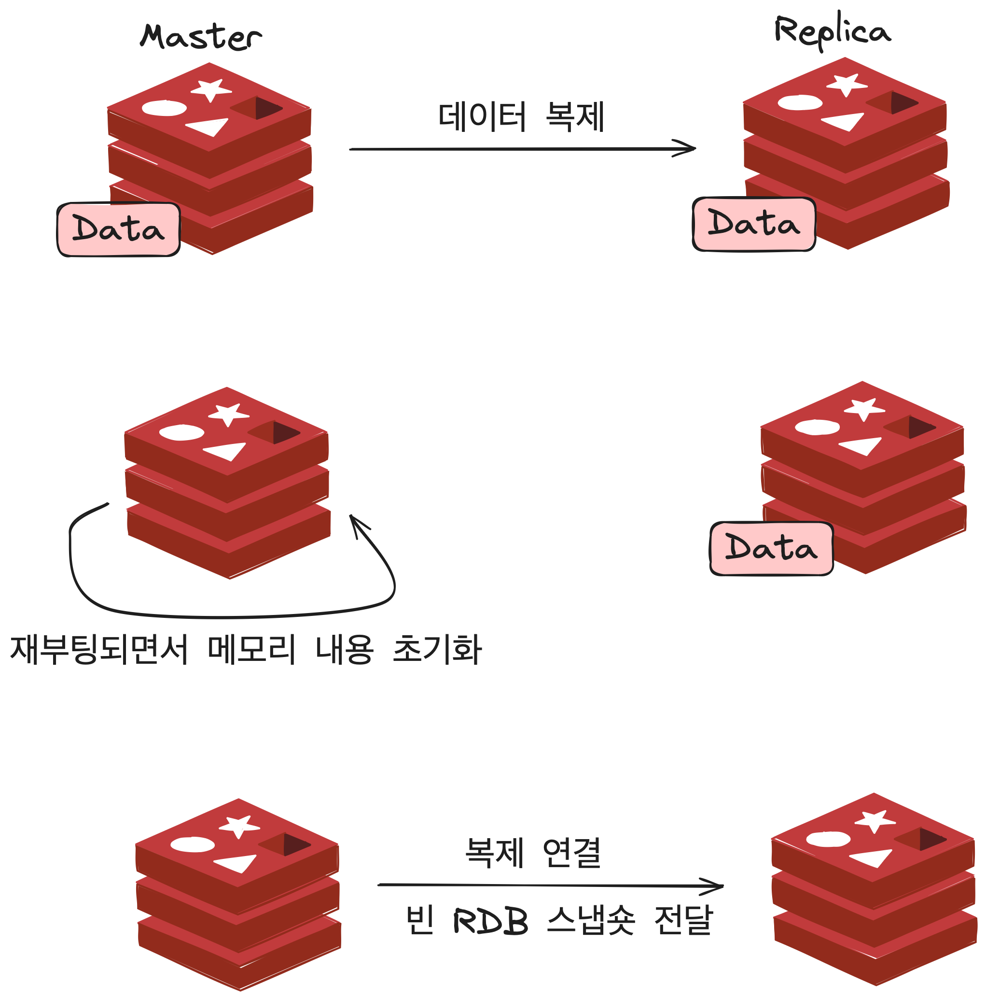

# Redis 복제

* 가용성은 일반적으로 서비스의 안정성을 측정하는 데 사용되는 지표입니다.
> 가용성 = 가동 시간 / 전체 시간
* 가용성은 일정 기간 동안 서비스를 정상적으로 사용할 수 있는 시간의 비율을 뜻합니다. 이 값이 클수록 가용성이 높다고 합니다.
* Redis의 고가용성을 확보하기 위해서 두 가지 기능이 필요합니다.
  * 복제 : 마스터 노드의 데이터를 복제본 노드로 실시간 복사하는 기능입니다. 마스터 노드의 서버에 장애가 생겨 데이터가 유실되도 복제본 노드에서 데이터를 복구할 수 있습니다.
  * 자동 페일오버 : 마스터 노드에서 발생한 장애를 감지해 Redis로 들어오는 클라이언트 연결을 자동으로 복제본 노드로 리다이렉션하는 기능입니다. 이를 통해 마스터 노드의 장애를 빠르게 복구할 수 있습니다.

## Redis에서의 복제 구조

* 운영 중인 서비스에서 복제본 노드를 추가하는 이유는 다음과 같습니다.
  * 마스터 데이터베이스가 다운됐을 때 대신 사용할 여분의 복제본이 필요하기 떄문
  * 대규모 서비스에서 복제본을 통해 트래픽을 감소시킬 수 있음
  * 데이터 백업을 진행할 때 마스터 노드보다 복제본 노드에서 수행하여 마스터 노드의 부하를 줄일 수 있음
* Redis에서의 복제는 일반적으로 마스터노드에서 쓰기, 복제본 노드에서는 읽기를 수행합니다.

## 복제 구조 구성하기

* Redis에서 복제를 REPLICAOF 명령어를 통해 구성할 수 있습니다.
> REPLICAOF <master-ip> <master-port>

* Redis 복제를 구성하는 방법으로 크게 두 가지가 있습니다.
  * 마스터에 여러 복제본이 연결되는 방식
  * 복제본 노드에 새로운 복제본을 추가하는 방식
* 한 개의 복제 그룹에서는 항상 한 개의 마스터 노드만 존재합니다.
  * 마스터 노드에서는 업데이터 커맨드를 수행할 수 있으며, 하위 복제본은 모두 읽기 전용으로 동작합니다.

## 패스워드 설정

* Redis 6.0 이상부터 도입된 ACL 기능이 아닌 기본적인 패스워드를 사용해서 데이터를 복제할 떄에는 masterauth 옵션에 패스워드를 입력해야 합니다.
* Redis에서는 requirepass 옵션을 통해 패스워드를 설정할 수 있습니다.
* 복제본 노드는 masterpass 옵션에 마스터의 requirepass 옵션에 설정된 패스워드를 설정해야 합니다.
* 복제본 노드에서 requirepass를 다른 값으로 설정해 각 Redis 노드에 접근할 때 다른 패스워드를 사용하게 설정할 수도 있지만, 일반적으로 하나의 복제 그룹에서는 같은 패스워드로 설정합니다.

## 복제 메커니즘

* Redis에서 복제는 다음과 같은 과정으로 동작합니다.

* Redis 7.0 이전 버전에서는 repl-diskless-sync 옵션이 기본으로 no 입니다.
1. REPLICAOF 커맨드를 통해 복제 연결을 시도합니다.
2. 마스터 노드에서는 fork로 자식 프로세스를 새로 만든 뒤 RDB 스냅숏을 생성합니다.
3. 2번 과정 동안 마스터 노드에서 수행된 모든 데이터셋 변경 작업은 Redis 프로토콜(RESP) 형태로 마스터의 복제 버퍼에 저장됩니다.
4. RDB 파일이 생성 완료되면 파일은 복제본 노드로 복사됩니다.
5. 복제본에 저장됐던 모든 내용을 모두 삭제한 뒤 RDB 파일을 이용해 데이터를 로딩합니다.
6. 복제 과정 동안 버퍼링됐던 복제 버퍼의 데이터를 복제본으로 전달해 수행시킵니다.
* Disk를 이용한 복제는 디스크 I/O 처리량에 영향을 받습니다. 마스터에서 RDB 파일을 저장하는 시간, 복제본에서 RDB 파일을 읽어오는 과정 모두 디스크 I/O 속도에 영향을 받기 때문입니다.
* 해당 방법을 통해 복제를 사용하는 경우 RDB 파일이 생성되는 도중 다른 노드에서 복제 연결 요청이 들어오면 이 연결은 큐에 저장되며 기존 RDB 파일의 저장이 완료되면 여러 복제본이 한 번에 복제 연결을 시작할 수 있습니다.

* Redis 7.0 이후 버전에서는 repl-diskless-sync 옵션이 기본으로 yes 입니다.
1. REPLICAOF 커맨드를 통해 복제 연결을 시도합니다.
2. 마스터 노드는 소켓 통신을 이용해 복제본 노드에 바로 연결하며, RDB 파일은 생성됨과 동시에 점진적으로 복제본의 소켓에 전송됩니다.
3. 2의 과정 동안 마스터 노드에서 수행된 모든 데이터셋 변경 작업은 Redis 프로토콜(RESP) 형태로 마스터의 복제 버퍼에 저장됩니다.
4. 소켓에서 읽어온 RDB 파일을 복제본의 디스크에 저장합니다.
5. 복제본에 저장된 모든 데이터를 모두 삭제한 뒤 RDB 파일 내용을 메모리에 로딩합니다.
6. 복제 버퍼의 데이터를 복제본으로 전달해 수행시킵니다.
* 복제 과정에서 복제본의 repl-diskless-load 옵션은 기본으로 disabled이기 때문에 소켓에서 읽어온 RDB 스냅숏 데이터를 바로 메모리에 로드하지 않고, 
일단 복제본 노드의 디스크에 저장하는 과정을 거칩니다.
* 복제본 노드는 마스터에서 가져온 데이터를 불러오기 전 자신의 데이터를 모두 삭제하는 데, 
이는 소켓 통신으로 받아온 RDB 데이터가 정상적인지를 미리 확인할 수 없기에 모두 삭제하기 전 자신의 디스크에 데이터를 저장하는 과정을 선행함으로 데이터의 안정성을 확보할 수 있습니다.
* 이 방식은 디스크 I/O가 느리고 네트워크가 빠른 경우 유용합니다.
* 해당 방법을 사용ㅇ하면 하나의 복제본으로 복제 연결이 시작된 경우 복제 과정이 끝나기 전까지 다른 복제본과의 연결은 수행될 수 없으며,
다른 복제본들은 하나의 복제 연결이 끝날때까지 큐에서 대기해야 합니다. 이를 repl-diskless-sync-delay 옵션을 통해 조절할 수 있습니다.
* repl-diskless-sync-delay 옵션은 복제 연결이 시작된 후 다른 복제 연결이 시작되기까지의 대기 시간을 설정합니다. 기본값은 5초입니다.
* repl-diskless-sync-delay 옵션을 설정갑 기간 내에 다른 복제 연결이 들어오면 마스터는 여러 복제본으로 소켓 통신을 연결해 한 번에 여러 개의 복제본에 RDB 파일을 전송할 수 있습니다.

### 비동기 방식으로 동작하는 복제 연결

* Redis에서 복제 연결이 된 상태에서 마스터에서 복제본으로의 데이터 전달은 비동기 방식으로 동작합니다.

* 마스터에서 데이터를 입력하는 커맨드가 수행되면 Redis는 마스터 노드에서 커맨드를 처리한 이후 클라이언트에 OK 응답을 보냅니다.
* 클라이언트는 데이터를 입력할 때마다 복제본에 데이터가 정확하게 전달됐는지 확인하는 과정을 거치지 않기 때문에 복제 구조를 사용하더라도 짧은 지연과 높은 성능을 가제 됩니다.
* Redis 마스터 노드가 비정상 종료되 경우 데이터는 복제본 노드에 전달되지 않은 상태이기 때문에 유실될 가능성이 존재합니다.

### 복제 ID

* 모든 Redis 인스턴스는 복제 ID를 가지고 있습니다.
* 복제 기능을 사용하지 않는 인스턴스라도 모두 랜덤 스트링 값의 복제 ID를 가지며, 복제 ID는 오프셋과 쌍으로 존재합니다.
* Redis 내부의 데이터가 수정되는 모든 커맨드를 수행할 때마다 오프셋이 증가합니다.
* INFO REPLICATION 커맨드를 통해 복제 연결 상태를 확인할 수 있습니다.

### 부분 재동기화

* 복제 연결이 끊길 때마다 마스터에서 RDB 파일을 새로 내려 복제본에 전달하는 과정을 거친다면 네트워크가 불안정한 상황에서 복제 기능을 사용하는 Redis의 성능은 급격하게 나빠집니다.
* Redis에서는 부분 재동기화(partial resynchronization) 기능을 통해 이 문제를 해결합니다.

* 마스터는 커넥션 유실을 대비해 백로드 버퍼라는 메모리 공간에 복제본에 전달한 커맨드 데이터들을 저장해둡니다.
* 하나의 복제 그룹에서 replication id와 오프셋을 이용하면 복제본이 마스터의 어느 시점까지의 데이터를 가지고 있는지 파악할 수 있습니다.
* 복제 연결이 잠시 끊긴 뒤 재연결되면 복제본은 PSYNC 커맨드를 호출해 자신의 replication id와 오프셋을 마스터에 전달합니다.
* 백로그 버퍼에 원하는 데이터가 남아 있지 않거나, 복제본이 보낸 replication id가 현재의 마스터와 일치하지 않다면 전체 재동기화(full resynchronization)를 수행합니다.
* 복제 백로그 크기는 repl-backlog-size 옵션을 통해 설정할 수 있습니다. 기본값은 1MB입니다.
* 백로그는 1개 이상의 복제본이 연결된 경우에만 할당되며, repl-backlog-ttl만큼의 시간이 경과하면 메모리에서 백로그 공간을 삭제합니다.
* 복제본은 언제든지 마스터로 승격될 가능성을 갖고 있기 때문에 복제본에 직접 연결된 복제 연결이 따로 없더라도 백로그 버퍼를 해제하지 않습니다. 
이는 다른 복제본과 부분 재동기화를 시도할 때 사용됩니다.

### Secondary 복제ID

* 한 개의 복제본 그룹 내의 모든 Redis 노드는 동일한 복제 ID를 가집니다.

위 그림에서 복제 노드 B,C는 마스터 노드인 A의 복제 ID와 동일한 복제 ID를 가짐을 알 수 있습니다. 
이때 A 노드에 장애가 발생해 복제가 끊기면, 복제본 B가 새로운 노드로 승격되는 상황을 생각해볼 수 있습니다.

마스터 노드와의 연결이 끊김과 동시에 복제본은 새로운 복제 ID를 가지게 됩니다. 이는 만약 노드 A가 복구될 때, B 노드가 기존 복제 ID를 유지하고 있었다면,
동일한 오프셋이 동일한 데이터셋을 가지지 않는 상황이 발생할 수 있기 때문입니다.

또한 기존 복제 노드들의 복제 ID가 동일하기에 이 복제 노드들은 부분 재동기화(partial resynchronization)를 시도합니다.

### 읽기 전용 모드로 동작하는 복제본 노드

* 버전 2.6 이후 Redis에서는 복제를 구성하면 복제본은 기본으로 읽기 전용 모드로 동작합니다.
* replica-read-only 설정을 통해 읽기 전용 모드를 해제할 수 있습니다. 하지만 이 옵션을 해제하여 복제본 노드에 쓰기 작업을 수행하더라도 다른 노드에 전파되지 않습니다.

### 유효하지 않은 복제본 데이터

* 복제 구조에서 유효하지 않는 데이터란 복제본의 데이터와 마스터의 데이터가 정확하게 일치하지 않는 경우의 데이터를 의미합니다.
* Redis에서 복제본이 마스터와 연결이 끊어진 상태, 또는 복제 연결이 시작된 뒤 아직 완료되지 않은 경우 복제본의 데이터가 유효하지 않다고 판단할 수 있습니다.
* 복제본의 데이터가 유효하지 않다고 판단되면 복제본의 동작 방식은 replica-serve-stale-data 파라미터를 이용해 제어할 수 있습니다. 기본값은 yes입니다.
* replica-serve-stale-data 옵션을 통해 복제본의 데이터가 유효하지 않다고 판단될 떄에도 클라이언트로부터 들어오는 모든 읽기 요청에 데이터를 반환합니다.
* replica-serve-stale-data 옵션을 no로 설정하면 INFO,CONFIG,PING 등 일부 기본 커맨드를 제외한 모든 커맨드에 대해 SYNC with master in progress 오류를 반환합니다.

### 백업을 사용하지 않는 경우에서의 데이터 복제

* Redis에서 복제를 사용하지 않는 경우 마스터와 복제본에서 백업 기능을 사용하는 것이 좋습니다.

백업을 사용하지 않은 상황에서 장애가 발생하면 다음과 같은 문제가 발생할 수 있습니다.
1. 백업 기능을 사용하지 않은 마스터와 복제본 노드가 존재합니다.
2. 마스터 노드가 장애로 인해 종료됐지만, Redis 프로세스를 자동 재시작하는 시스템에 의해 노드가 재부팅됩니다. 이때 메모리 내용은 초기화됩니다.
3. 복제본 노드에는 데이터가 존재하지만, 마스터 노드로의 복제 연결을 시도합니다.
4. 마스터에서 복제본으로 빈 데이터셋을 전달합니다.

* 데이터의 안정성을 위해 복제 기능을 사용할 경우 백업 기능을 사용하는 것이 좋습니다. 그렇지 않을 경우 마스터에서는 인스턴스의 자동 재시작을 활성화하지 않는 것을 권장합니다.

