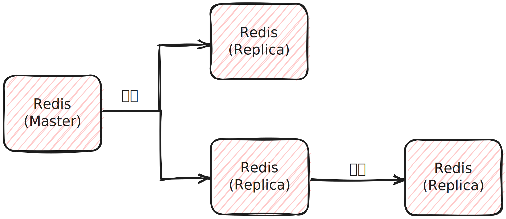

# Redis 복제(Replication)

* Redis의 복제(Replication)은 Redis 서버의 데이터를 여러 대의 서버 간에 동기화하고 복사하는 과정을 의미합니다.
* 이는 고가용성, 부하 분산, 데이터 백업 및 장애 복구 등의 다양한 목적으로 사용됩니다.
* 기본적은 복제된 Redis 서버는 읽기 전용입니다.

### Redis 복제 작동 방식

* 마스터(Master)와 슬레이브(Slave) : Redis 복제는 마스터 서버와 슬레이브 서버 간의 관계로 구성됩니다. 마스터 서버는 데이터를 제공하고, 슬레이브 서버는 마스터 데이터를 복제합니다.
* 초기 복제 : 슬레이브 서버는 초기에 마스터 서버로부터 데이터의 복제본을 받습니다. 이후에는 변경된 데이터만을 주기적으로 복제받습니다.
* 연결 및 통신 : 마스터와 슬레이브 간의 통신은 비동기식입니다. 슬레이브는 주기적으로 마스터에 연결하여 변경된 데이터를 요청하고, 마스터는 변경된 데이터를 슬레이브에 전송합니다.

### Redis 복제 장점

* 고가용성 : 복제를 사용하면 마스터 서버가 장애 발생 시 슬레이브 서버 중 하나로 즉시 전환되어 서비스 중단 시간을 최소화할 수 있습니다.
* 부하 분산 : 슬레이브 서버는 기본 read-only이기에 여러 슬레이브 서버가 마스터 서버의 부하를 분산하여 높은 처리량을 처리할 수 있습니다.
* 데이터 백업 : 슬레이브 서버는 마스터 서버의 복사본을 가지므로 데이터 손실 없이 데이터를 백업할 수 있습니다.

### Redis 복제 단점

* 네트워크 대역폭 : 데이터를 전송하는데 대역폭이 필요하므로 네트워크 부하가 발생할 수 있습니다.
* 디스크 공간 : 슬레이브 서버는 마스터 서버의 데이터를 복사하므로 디스크 공간을 많이 차지할 수 있습니다.
* 지연 : 네트워크 지연 또는 슬레이브 서버의 처리 속도에 따라 데이터 복제에 지연이 발생할 수 있습니다.

### Redis 복제 주의 사항

* 마스터 서버가 복제 설정이 되어있지 않은 상태에서 중단된다면 다시 실행시 슬레이브 서버들이 비어있는 마스터 서버를 복제하여 모든 서버들이 데이터 유실이 발생할 수 있습니다.
* Redis 복제를 구성할 때 마스터 서버와 슬레이브 서버 간의 네트워크 연결 및 구성을 신중하게 관리해야 합니다.
* 복제는 데이터를 비동기식으로 전송하므로, 복제된 데이터가 항상 완벽하게 일치하지는 않을 수 있습니다. 이를 고려해서 애플리케이션을 설계해야 합니다.

### Redis 복제 설정 - docker-compose.yml

~~~yaml
version: '3.8'

services:
  redis-master:
    hostname: "redis-master"
    container_name: "redis-master"
    image: bitnami/redis:latest
    environment:
      - REDIS_REPLIACATION_MODE=master
      - ALLOW_EMPTY_PASSWORD=yes
    ports:
      - "6379:6379"
  redis-slave-1:
    hostname: "redis-slave-1"
    container_name: "redis-slave-1"
    image: bitnami/redis:latest
    environment:
      - REDIS_REPLICATION_MODE=slave
      - REDIS_MASTER_HOST=redis-master
      - ALLOW_EMPTY_PASSWORD=yes
    ports:
      - "6380:6379"
    depends_on:
      - redis-master
~~~

> 참조
>
> 백엔드 개발자를 위한 한 번에 끝내는 대용량 데이터 & 트래픽 처리(https://fastcampus.co.kr/dev_online_bedata)
>
> Redis 레퍼런스 문서(https://redis.io/docs/management/persistence/)