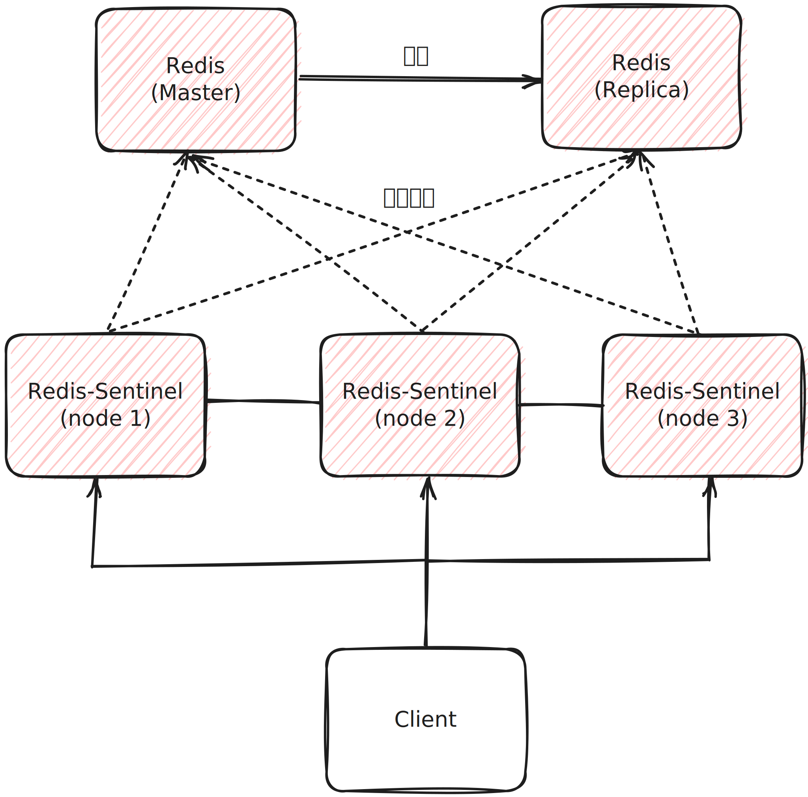

# Redis Sentinel

* Redis Sentinel은 Redis Cluster를 사용하지 않는 상황에서 고가용성을 제공하며 모니터링하기 위한 분산 시스템입니다.
* Redis Sentinel은 Redis 서버의 장애를 감지하고 자동으로 장애를 복구를 수행합니다.
* Redis Sentinel은 모니터링, 알림, 자동 장애 복구, 환경 설정 제공자 기능을 가지고 있습니다.
* Redis Sentinel은 SDOWN(Subjective down)과 ODOWN(Objective down)의 2가지 판단이 있습니다.
  * SDOWN : Sentinel 1대가 down으로 판단(주관적)
  * ODOWN : 정족수가 충족되어 down으로 판단(객관적)
* 마스터 노드가 down 됨을 판단하기 위해서는 Sentinel 노드들이 정족수(Quorum)을 충족해야 합니다.
* 클라이언트는 Sentinel을 통해 마스터 노드의 주소를 얻을 수 있습니다.

### Redis Sentinel 작동 방식

* 장애 감지 : Redis Sentinel은 Redis 마스터 및 슬레이브 서버의 상태를 주기적으로 모니터링하고, 서버 장애를 감지할 때 신속하게 조치를 취합니다.
* 장애 복구 : Redis Sentinel은 마스터 서버의 장애가 발생하면 슬레이브 중 하나를 새로운 마스터를 승격시키고(auto-failover), 나머지 슬레이브를 새 마스터에 대한 슬레이브로 재구성하여 고가용성을 유지합니다.
* 모니터링 및 관리 : Redis Sentinel은 Redis 노드들을 모니터링하고 관리하는 역할을 수행하며, 노드 구성의 변경을 감지하고 필요한 조치를 취합니다.

### Redis Sentinel 장점

* 고가용성 : Redis Sentinel은 Redis 노드들을 지속적으로 모니터링하고 장애 복구를 자동으로 수행하여 서비스 가용성을 향상시킵니다.
* 실시간 감지 : Redis Sentinel은 실시간으로 Redis 서버 상태를 모니터링하므로 장애가 발생하는 즉시 조치를 취할 수 있습니다.
* 분산 구조 : 여러 Redis Sentinel 인스턴스가 부산되어 있으므로 단일 장애 지점을 방지하고 클러스터의 안정성을 높입니다.

### Redis Sentinel 단점

* 추가 오버헤드 : Redis Sentinel을 실행하려면 추가적인 인프라 및 관리 오버헤드가 필요하므로 전체적인 시스템 복잡성을 증가시킬 수 있습니다.
* 한계 : Redis Sentinel은 기본적인 고가용성을 제공하지만, 복잡한 클러스터 구성이나 더 높은 수준의 고가용성이 필요한 경우에는 다른 솔루션을 고려해야할 수 있습니다.

### Redis Sentinel - docker-compose.yml

~~~yaml
version: '3.8'

services:
  redis-master:
    hostname: "redis-master"
    container_name: "redis-master"
    image: bitnami/redis:latest
    environment:
      - REDIS_REPLIACATION_MODE=master
      - ALLOW_EMPTY_PASSWORD=yes
    ports:
      - "6379:6379"
  redis-slave-1:
    hostname: "redis-slave-1"
    container_name: "redis-slave-1"
    image: bitnami/redis:latest
    environment:
      - REDIS_REPLICATION_MODE=slave
      - REDIS_MASTER_HOST=redis-master
      - ALLOW_EMPTY_PASSWORD=yes
    ports:
      - "6380:6379"
    depends_on:
      - redis-master

  redis-sentinel-1:
    hostname: "redis-sentinel-1"
    container_name: "redis-sentinel-1"
    image: bitnami/redis-sentinel:latest
    environment:
      - REDIS_SENTINEL_DOWN_AFTER_MILLISECONDS=3000
      - REDIS_MASTER_HOST=redis-master
      - REDIS_MASTER_PORT_NUMBER=6379
      - REDIS_MASTER_SET=mymaster
      - REDIS_SENTINEL_QUORUM=2
    depends_on:
      - redis-master
      - redis-slave-1
    ports:
      - "26379:26379"

  redis-sentinel-2:
    hostname: "redis-sentinel-2"
    container_name: "redis-sentinel-2"
    image: bitnami/redis-sentinel:latest
    environment:
      - REDIS_SENTINEL_DOWN_AFTER_MILLISECONDS=3000
      - REDIS_MASTER_HOST=redis-master
      - REDIS_MASTER_PORT_NUMBER=6379
      - REDIS_MASTER_SET=mymaster
      - REDIS_SENTINEL_QUORUM=2
    depends_on:
      - redis-master
      - redis-slave-1
    ports:
      - "26380:26379"

  redis-sentinel-3:
    hostname: "redis-sentinel-3"
    container_name: "redis-sentinel-3"
    image: bitnami/redis-sentinel:latest
    environment:
      - REDIS_SENTINEL_DOWN_AFTER_MILLISECONDS=3000
      - REDIS_MASTER_HOST=redis-master
      - REDIS_MASTER_PORT_NUMBER=6379
      - REDIS_MASTER_SET=mymaster
      - REDIS_SENTINEL_QUORUM=2
    depends_on:
      - redis-master
      - redis-slave-1
    ports:
      - "26381:26379"
~~~

> 참고
> 
> Redis 레퍼런스 문서(https://redis.io/docs/management/sentinel)